# 🤖 Progetto Assistenza Tecnica AI - Documento di Sintesi

## 📋 Executive Summary

**Obiettivo**: Automatizzare l'assistenza tecnica per sistemi Inverter/EV Charger/HVAC attraverso AI/ML, con analisi ticket, classificazione intelligente, ricerca knowledge base, generazione risposte verificabili e apprendimento continuo.

**Stack Tecnologico**: AWS (Bedrock, SageMaker, Step Functions, OpenSearch) con architettura LLM-agnostica e approccio API-first.

---

## 🏗️ Architettura di Sistema

### Principi Architetturali
1. **Separazione dei concern**: Data plane / Orchestration / Model plane
2. **LLM-agnostico**: Astrazione dai modelli specifici con routing intelligente
3. **RAG-first**: Knowledge base esterna per precisione e tracciabilità
4. **MLOps integrato**: Pipeline automatizzate per training/deployment
5. **Async by default**: Operazioni lunghe gestite asincronamente

### Componenti Principali

```
┌─────────────────────────────────────────────────────────────┐
│                        CLIENT LAYER                          │
│  Web UI │ Mobile │ ITSM Integration │ API Clients           │
└────────────────┬────────────────────────────────────────────┘
                 │
┌────────────────▼────────────────────────────────────────────┐
│                      API GATEWAY (v1)                        │
│  • Auth (Cognito/OAuth2)                                     │
│  • Rate Limiting                                             │
│  • Request Validation                                        │
└────────────────┬────────────────────────────────────────────┘
                 │
┌────────────────▼────────────────────────────────────────────┐
│              ORCHESTRATION (Step Functions)                  │
│  ┌──────────┐ ┌──────────┐ ┌──────────┐ ┌──────────┐      │
│  │Classify  │→│Retrieve  │→│Generate  │→│Validate  │      │
│  └──────────┘ └──────────┘ └──────────┘ └──────────┘      │
└────────────────┬────────────────────────────────────────────┘
                 │
┌────────────────▼────────────────────────────────────────────┐
│                    SERVICE LAYER                             │
│  ┌─────────────────┐  ┌─────────────────┐                  │
│  │  Classification  │  │   Generation    │                  │
│  │  • SageMaker    │  │   • Bedrock     │                  │
│  │  • BlazingText  │  │   • Claude/Llama│                  │
│  └─────────────────┘  └─────────────────┘                  │
│  ┌─────────────────┐  ┌─────────────────┐                  │
│  │   Knowledge     │  │   Document      │                  │
│  │   • OpenSearch  │  │   • Textract    │                  │
│  │   • Bedrock KB  │  │   • S3 Storage  │                  │
│  └─────────────────┘  └─────────────────┘                  │
└──────────────────────────────────────────────────────────────┘
```

---

## 🔌 API Specification v1

### Endpoint Principali

| Metodo | Endpoint | Descrizione | Response |
|--------|----------|-------------|----------|
| **POST** | `/tickets` | Crea ticket e avvia pipeline | `202 Accepted` |
| **GET** | `/tickets/{id}` | Stato ticket e riassunto | `200 OK` |
| **GET** | `/tickets/{id}/solution` | Soluzione generata | `200 OK` |
| **GET** | `/tickets/{id}/solution/stream` | SSE streaming | `Event Stream` |
| **POST** | `/tickets/{id}/feedback` | Feedback operatore | `204 No Content` |
| **POST** | `/kb/search` | Ricerca diretta KB | `200 OK` |

### Payload Example - Creazione Ticket

```json
{
  "customer": {
    "id": "C123",
    "name": "ACME Corp"
  },
  "asset": {
    "product_type": "EV_CHARGER",
    "model": "XC-200",
    "serial": "SN123456"
  },
  "symptom_text": "Errore E029 durante ricarica trifase",
  "error_code": "E029",
  "attachments": [
    {
      "id": "att-001",
      "type": "PDF",
      "uri": "s3://bucket/docs/report.pdf"
    }
  ],
  "priority": "P2",
  "lang": "it-IT",
  "policies": {
    "safe_instructions": true,
    "grounded_only": true
  }
}
```

### Response Example - Soluzione

```json
{
  "status": "READY",
  "answer": {
    "steps": [
      {
        "title": "Causa Probabile",
        "text": "Sbilanciamento corrente sulle fasi L1-L2-L3..."
      },
      {
        "title": "Verifiche Richieste",
        "text": "1. Controllare serraggio morsetti\n2. Misurare tensione fasi..."
      },
      {
        "title": "Soluzione",
        "text": "Aggiornare firmware a v1.2.3 e riserrare morsetti..."
      }
    ],
    "citations": [
      {
        "source_uri": "s3://kb/manuals/XC-200.pdf#page12",
        "snippet": "...verifica del bilanciamento fasi...",
        "score": 0.89
      }
    ],
    "safety_flags": []
  },
  "routing": {
    "capability": "tech_troubleshoot",
    "provider": "bedrock",
    "model_version": "claude-3"
  },
  "latency_ms": 2140
}
```

---

## 🔄 Flussi Operativi

### 1. Pipeline Ticket Processing

```mermaid
graph LR
    A[Nuovo Ticket] --> B[Classificazione]
    B --> C{Categoria?}
    C -->|EV Charger| D1[Workflow EV]
    C -->|Inverter| D2[Workflow Inverter]
    C -->|HVAC| D3[Workflow HVAC]
    D1 --> E[RAG Retrieval]
    D2 --> E
    D3 --> E
    E --> F[LLM Generation]
    F --> G[Guardrails Check]
    G --> H{Sicuro?}
    H -->|Sì| I[Pubblica Soluzione]
    H -->|No| J[Flag per Revisione]
    I --> K[Update ITSM]
    J --> K
```



### 2. Knowledge Base Pipeline

```
HTML/PDF/Wiki → Textract → Chunking → Embedding → Index (OpenSearch/Bedrock KB)
                    ↓           ↓          ↓            ↓
                  OCR      512-1500     Vectorize    Store+Search
                           tokens
```

### 3. Continuous Learning Loop

```
Feedback → Label Dataset → Retrain Model → Evaluate → Deploy
    ↑                                                      ↓
    └──────────────── Production Usage ←──────────────────┘
```

---

## 📊 Data Model

### Ticket Metadata (DynamoDB)
```typescript
interface Ticket {
  ticket_id: string;          // PK
  created_at: ISO8601;
  customer_id: string;
  product: {
    type: 'INVERTER' | 'EV_CHARGER' | 'HVAC';
    model: string;
    serial: string;
  };
  symptom_text: string;
  error_code?: string;
  category_predicted: string;
  confidence: number;
  status: 'NEW' | 'PROCESSING' | 'RESOLVED';
  solution?: Solution;
  operator_feedback?: Feedback;
}
```

### KB Chunks (OpenSearch)
```typescript
interface KBChunk {
  chunk_id: string;
  source_uri: string;
  doc_type: 'SOP' | 'MANUAL' | 'FAQ';
  product_model?: string;
  error_codes?: string[];
  text: string;
  vector: number[];
  metadata: {
    version: string;
    updated_at: ISO8601;
  };
}
```

---

## 🛠️ Servizi AWS - Mapping

| Funzione | Servizio AWS | Alternative | Note |
|----------|--------------|-------------|------|
| **Storage** | S3 | - | Lifecycle, versioning attivi |
| **OCR** | Amazon Textract | Tesseract | Per PDF e immagini |
| **Vector DB** | OpenSearch/Bedrock KB | - | OpenSearch per controllo fine |
| **Classification** | SageMaker | - | BlazingText/BERT |
| **LLM** | Amazon Bedrock | - | Claude/Llama/Mistral |
| **Orchestration** | Step Functions | EventBridge | Workflow complessi |
| **API** | API Gateway | ALB | Auth, rate limiting |
| **Auth** | Cognito | Custom JWT | OAuth2/OIDC |
| **Monitoring** | CloudWatch | - | Logs, metrics, traces |

---

## 📈 Metriche e KPI

### Metriche Tecniche
- **Classificazione**: F1-Score per categoria, Top-K accuracy
- **Generazione**: Groundedness score, Citation accuracy
- **Sistema**: p95 latency, p99 error rate
- **Drift**: Embedding distribution monitoring

### Business KPI
- **Resolution Rate**: % ticket risolti senza escalation
- **Time to Resolution**: Tempo medio risoluzione
- **Deflection Rate**: % ticket che non passano a L2
- **Customer Satisfaction**: Score basato su feedback

---

## 🚀 Roadmap Implementativa

### Sprint 1-2: MVP (2 settimane)
- [x] Setup infrastruttura base AWS
- [x] Pipeline Textract → OpenSearch
- [x] Classificatore baseline (20-30 categorie)
- [x] RAG + LLM via Bedrock
- [x] Step Functions orchestration
- [x] API v1 core endpoints

### Sprint 3-4: Hardening (2 settimane)
- [ ] Guardrails e PII redaction
- [ ] Canary deployment classificatore
- [ ] UI feedback per NOC
- [ ] Job retraining schedulati
- [ ] Webhook management
- [ ] SSE streaming

### Sprint 5-6: Automation (2 settimane)
- [ ] Playbook automation per top 5 categorie
- [ ] Tool-use capabilities
- [ ] Advanced RAG (re-ranking, fusion)
- [ ] Query routing multi-model
- [ ] Caching semantico

### Sprint 7+: Scale & Optimize
- [ ] A/B testing framework
- [ ] Cost optimization
- [ ] Multi-language support
- [ ] Voice/chat integration
- [ ] Predictive maintenance

---

## 💰 Stima Costi AWS (mensili)

| Servizio | Volume | Costo Stimato |
|----------|--------|---------------|
| S3 Storage | 100 GB | $25 |
| Textract | 10K pagine | $150 |
| OpenSearch | t3.medium | $120 |
| SageMaker | Inference | $200 |
| Bedrock | 500K token/day | $300 |
| Step Functions | 50K workflow | $50 |
| API Gateway | 1M requests | $35 |
| **TOTALE** | | **~$880/mese** |

---

## 🔒 Security & Compliance

### Sicurezza
- **IAM**: Least privilege, role-based
- **Encryption**: At rest (KMS) e in transit (TLS)
- **PII**: Redaction automatica via Textract + Guardrails
- **Audit**: CloudTrail per tutte le API calls

### Compliance
- **GDPR**: Right to erasure, data portability
- **Logging**: Conservazione prompt/response per audit
- **Versioning**: Tracciabilità modelli e configurazioni

---

## 📝 Prompt Engineering Templates

### Template Classificazione
```
System: Sei un assistente tecnico specializzato in sistemi HVAC, inverter e stazioni di ricarica EV.

Task: Classifica il seguente ticket in una delle categorie predefinite.

Ticket:
- Prodotto: {product_type} {model}
- Codice errore: {error_code}
- Descrizione: {symptom_text}

Categorie disponibili: {categories_list}

Output richiesto: categoria singola con confidence score.
```

### Template RAG Generation
```
System: Genera una soluzione tecnica basata ESCLUSIVAMENTE sui documenti forniti.

Contesto KB:
{retrieved_chunks}

Problema:
{ticket_description}

Istruzioni:
1. Identifica la causa probabile
2. Elenca i passi di verifica
3. Proponi la soluzione
4. CITA SEMPRE le fonti per ogni affermazione

Vincoli:
- Lingua: {lang}
- Solo informazioni verificabili
- Nessuna speculazione
- Formato strutturato
```

---

## 🔗 Link e Risorse

### Documentazione AWS
- [Bedrock Knowledge Bases](https://docs.aws.amazon.com/bedrock/latest/userguide/knowledge-base.html)
- [Step Functions + Bedrock](https://docs.aws.amazon.com/step-functions/latest/dg/connect-bedrock.html)
- [SageMaker Pipelines](https://docs.aws.amazon.com/sagemaker/latest/dg/pipelines.html)
- [OpenSearch Vector Search](https://docs.aws.amazon.com/opensearch-service/latest/developerguide/knn.html)

### Repository di Riferimento
- AWS Samples RAG: `aws-samples/amazon-bedrock-rag`
- MLOps Template: `aws-samples/sagemaker-mlops-template`

---

## ✅ Checklist Pre-Produzione

- [ ] Load testing (>1000 ticket/ora)
- [ ] Disaster recovery plan
- [ ] Monitoring dashboard completo
- [ ] Runbook operativi
- [ ] Training team NOC
- [ ] Documentazione API pubblica
- [ ] SLA definiti (99.9% uptime)
- [ ] Budget alerts configurati
- [ ] Security assessment completato
- [ ] GDPR compliance verificata

---

## 📞 Contatti Progetto

- **Tech Lead**: [Da definire]
- **Product Owner**: [Da definire]
- **AWS TAM**: [Da definire]
- **Slack Channel**: #ai-tech-support
- **Confluence**: [Link progetto]

---

*Documento generato il: 2025-11-06*
*Versione: 1.0*
*Status: DRAFT - In Progettazione*