# Diagrammi Architettura

Questa sezione contiene i diagrammi Mermaid che rappresentano visualmente l'architettura del sistema.

## Vista d'Insieme - Tutti i Servizi

## Flusso Dati Dettagliato

## Pipeline Machine Learning

## Security & Network Architecture

## Pipeline Ticket Processing

```mermaid
graph LR
    A[Nuovo Ticket] --> B[Classificazione]
    B --> C{Categoria?}
    C -->|EV Charger| D1[Workflow EV]
    C -->|Inverter| D2[Workflow Inverter]
    C -->|HVAC| D3[Workflow HVAC]
    D1 --> E[RAG Retrieval]
    D2 --> E
    D3 --> E
    E --> F[LLM Generation]
    F --> G[Guardrails Check]
    G --> H{Sicuro?}
    H -->|Sì| I[Pubblica Soluzione]
    H -->|No| J[Flag per Revisione]
    I --> K[Update ITSM]
    J --> K
```

## Pipeline Knowledge Base

## Continuous Learning Loop

## Riferimenti

- [Overview Architettura](./overview.md)
- [Deployment Topology](./deployment.md)
- [Security Architecture](./security.md)
