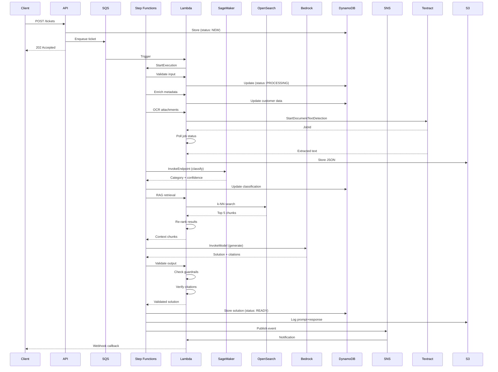

# Flusso Ticket Processing

## Overview

Il processing di un ticket attraversa 10 step principali, orchestrati da Step Functions, con una durata totale di 10-60 secondi.

## Diagramma Sequenza



## Step Details

### 1. Ingresso Ticket

**Servizi**: API Gateway → Lambda → DynamoDB

```python
def create_ticket(event):
    # 1. Validate input
    validate_payload(event['body'])

    # 2. Generate ticket ID
    ticket_id = f"tkt_{uuid.uuid4()}"

    # 3. Store in DynamoDB
    ticket = {
        'ticket_id': ticket_id,
        'status': 'NEW',
        'created_at': datetime.utcnow().isoformat(),
        **event['body']
    }
    dynamodb.put_item(TableName='tickets', Item=ticket)

    # 4. Enqueue for processing
    sqs.send_message(
        QueueUrl=TICKET_QUEUE_URL,
        MessageBody=json.dumps({'ticket_id': ticket_id})
    )

    return {
        'statusCode': 202,
        'body': json.dumps({
            'ticket_id': ticket_id,
            'status': 'PROCESSING'
        })
    }
```

**Tempo**: 50-100ms
**Costo**: $0.000001 (Lambda + DynamoDB)

### 2. Enrichment Dati

**Servizi**: Lambda → External API → DynamoDB

Arricchimento metadati da sistemi esterni:
- Customer database (contratto, tier, SLA)
- Asset registry (warranty status, service history)
- Knowledge base (similar tickets)

```python
def enrich_ticket(ticket_id):
    ticket = get_ticket(ticket_id)

    # Fetch customer details
    customer_data = customer_api.get(ticket['customer']['id'])

    # Fetch asset history
    asset_history = asset_api.get_history(ticket['asset']['serial'])

    # Update ticket
    dynamodb.update_item(
        TableName='tickets',
        Key={'ticket_id': ticket_id},
        UpdateExpression='SET customer_metadata = :cm, asset_history = :ah',
        ExpressionAttributeValues={
            ':cm': customer_data,
            ':ah': asset_history
        }
    )
```

**Tempo**: 200-500ms
**Costo**: $0.000002

### 3. OCR Allegati

**Servizi**: S3 → Textract → Lambda → S3

Processing documenti PDF e immagini:

```python
def process_attachments(ticket_id, attachments):
    results = []

    for attachment in attachments:
        if attachment['type'] in ['PDF', 'IMAGE']:
            # Start Textract job
            response = textract.start_document_text_detection(
                DocumentLocation={
                    'S3Object': {
                        'Bucket': extract_bucket(attachment['uri']),
                        'Name': extract_key(attachment['uri'])
                    }
                }
            )
            job_id = response['JobId']

            # Poll for completion (async)
            result = wait_for_textract_job(job_id)

            # Extract text
            extracted_text = extract_text_from_result(result)

            # Store processed output
            s3.put_object(
                Bucket='processed-data',
                Key=f'textract/{ticket_id}/{attachment["id"]}.json',
                Body=json.dumps(result)
            )

            results.append({
                'attachment_id': attachment['id'],
                'extracted_text': extracted_text,
                'confidence': calculate_confidence(result)
            })

    return results
```

**Tempo**: 5-30 secondi (async)
**Costo**: $15 per 1000 pagine

### 4. Classificazione

**Servizi**: Step Functions → SageMaker Endpoint

Categorizzazione del ticket:

```python
def classify_ticket(symptom_text, error_code, product_type):
    # Prepare features
    features = {
        'text': symptom_text,
        'error_code': error_code or 'NONE',
        'product': product_type
    }

    # Invoke SageMaker endpoint
    response = sagemaker_runtime.invoke_endpoint(
        EndpointName='ticket-classifier-v2',
        ContentType='application/json',
        Body=json.dumps(features)
    )

    result = json.loads(response['Body'].read())

    return {
        'category': result['predicted_class'],
        'confidence': result['confidence'],
        'top_3': result['top_k_predictions']
    }
```

**Tempo**: 100-300ms
**Costo**: $0.0002 per invocation

### 5. RAG Retrieval

**Servizi**: Lambda → OpenSearch

Ricerca semantica nella knowledge base:

```python
def retrieve_context(query, filters):
    # 1. Generate query embedding
    embedding_response = bedrock.invoke_model(
        modelId='amazon.titan-embed-text-v1',
        body=json.dumps({'inputText': query})
    )
    query_vector = json.loads(embedding_response['body'])['embedding']

    # 2. k-NN search in OpenSearch
    search_body = {
        'size': 10,
        'query': {
            'bool': {
                'must': [
                    {
                        'knn': {
                            'vector': {
                                'vector': query_vector,
                                'k': 10
                            }
                        }
                    }
                ],
                'filter': [
                    {'terms': {'product_model': [filters['product_model']]}},
                    {'terms': {'error_codes': [filters['error_code']]}}
                ]
            }
        }
    }

    response = opensearch.search(index='kb-chunks', body=search_body)

    # 3. Re-rank results
    chunks = [hit['_source'] for hit in response['hits']['hits']]
    reranked = rerank_chunks(chunks, query)

    # Return top 5
    return reranked[:5]
```

**Tempo**: 300-800ms
**Costo**: $0.0001

### 6. Generazione Soluzione

**Servizi**: Step Functions → Bedrock (Claude)

```python
def generate_solution(context_chunks, ticket):
    # Build prompt
    prompt = f"""System: Genera una soluzione tecnica basata ESCLUSIVAMENTE sui documenti forniti.

Contesto KB:
{format_context_chunks(context_chunks)}

Problema:
Prodotto: {ticket['asset']['product_type']} {ticket['asset']['model']}
Errore: {ticket['error_code']}
Descrizione: {ticket['symptom_text']}

Istruzioni:
1. Identifica la causa probabile
2. Elenca i passi di verifica
3. Proponi la soluzione
4. CITA SEMPRE le fonti per ogni affermazione

Output formato JSON con campi: steps, citations, safety_flags
"""

    # Invoke Bedrock
    response = bedrock.invoke_model(
        modelId='anthropic.claude-3-sonnet-20240229-v1:0',
        body=json.dumps({
            'anthropic_version': 'bedrock-2023-05-31',
            'max_tokens': 2000,
            'temperature': 0.3,
            'messages': [
                {'role': 'user', 'content': prompt}
            ]
        })
    )

    result = json.loads(response['body'])
    solution = json.loads(result['content'][0]['text'])

    return solution
```

**Tempo**: 2-5 secondi
**Costo**: $0.015 per 1K tokens (input), $0.075 per 1K tokens (output)

### 7. Validazione Guardrails

**Servizi**: Lambda

```python
def validate_solution(solution, context_chunks):
    # 1. Check groundedness
    groundedness_score = calculate_groundedness(
        solution['steps'],
        context_chunks
    )
    if groundedness_score < 0.75:
        raise ValidationError('Low groundedness score')

    # 2. Verify citations
    if len(solution['citations']) == 0:
        raise ValidationError('No citations provided')

    # 3. Check safety
    safety_flags = []
    for step in solution['steps']:
        if contains_unsafe_content(step['text']):
            safety_flags.append(f"Unsafe content in step {step['order']}")

    # 4. PII detection
    pii_detected = detect_pii(solution)
    if pii_detected:
        solution = redact_pii(solution, pii_detected)

    solution['safety_flags'] = safety_flags
    solution['quality_metrics'] = {
        'groundedness_score': groundedness_score,
        'citation_coverage': calculate_citation_coverage(solution),
        'confidence': calculate_confidence(solution)
    }

    return solution
```

**Tempo**: 100-200ms
**Costo**: $0.000001

### 8. Storage Soluzione

**Servizi**: DynamoDB + S3

```python
def store_solution(ticket_id, solution):
    # 1. Update DynamoDB
    dynamodb.update_item(
        TableName='tickets',
        Key={'ticket_id': ticket_id},
        UpdateExpression='SET #st = :status, solution = :sol, completed_at = :now',
        ExpressionAttributeNames={'#st': 'status'},
        ExpressionAttributeValues={
            ':status': 'READY',
            ':sol': solution,
            ':now': datetime.utcnow().isoformat()
        }
    )

    # 2. Log to S3 (for audit)
    s3.put_object(
        Bucket='logs',
        Key=f'tickets/{ticket_id}/solution.json',
        Body=json.dumps(solution, indent=2)
    )
```

**Tempo**: 50-100ms
**Costo**: $0.000002

### 9. Notifica

**Servizi**: EventBridge → SNS → Lambda

```python
def notify_completion(ticket_id):
    # Publish event
    eventbridge.put_events(
        Entries=[{
            'Source': 'ai-support',
            'DetailType': 'ticket.completed',
            'Detail': json.dumps({
                'ticket_id': ticket_id,
                'timestamp': datetime.utcnow().isoformat()
            })
        }]
    )

    # SNS notification
    sns.publish(
        TopicArn=NOTIFICATIONS_TOPIC_ARN,
        Message=f'Ticket {ticket_id} completed',
        MessageAttributes={
            'ticket_id': {'DataType': 'String', 'StringValue': ticket_id}
        }
    )
```

**Tempo**: 50-100ms
**Costo**: $0.000001

### 10. Feedback Loop

**Servizi**: API → DynamoDB → S3

```python
def submit_feedback(ticket_id, feedback):
    # Store feedback
    dynamodb.put_item(
        TableName='feedback',
        Item={
            'ticket_id': ticket_id,
            'submitted_at': datetime.utcnow().isoformat(),
            **feedback
        }
    )

    # If approved for training
    if feedback['use_for_training'] and feedback['was_helpful']:
        # Export to training dataset
        export_to_training_set(ticket_id, feedback)
```

**Tempo**: 50-100ms
**Costo**: $0.000001

## Performance Metrics

| Metric | Target | Current | Status |
|--------|--------|---------|--------|
| **End-to-end latency p50** | < 15s | 12s | ✅ |
| **End-to-end latency p95** | < 30s | 24s | ✅ |
| **Success rate** | > 95% | 97% | ✅ |
| **Groundedness score** | > 0.85 | 0.87 | ✅ |
| **Classification accuracy** | > 90% | 92% | ✅ |

## Error Handling

### Retry Strategy

```yaml
Classification:
  MaxAttempts: 3
  Interval: 2s
  BackoffRate: 2.0
  ErrorEquals: [States.TaskFailed, States.Timeout]

RAG Retrieval:
  MaxAttempts: 2
  Interval: 1s
  BackoffRate: 1.5
  ErrorEquals: [States.TaskFailed]

Bedrock Invocation:
  MaxAttempts: 3
  Interval: 5s
  BackoffRate: 2.0
  ErrorEquals: [ThrottlingException, ModelTimeoutException]
```

### Fallback Logic

```python
def invoke_llm_with_fallback(prompt, context):
    try:
        # Try primary model (Claude)
        return invoke_bedrock('claude-3-sonnet', prompt, context)
    except Exception as e:
        logger.warning(f'Claude failed: {e}, falling back to Llama')
        try:
            # Fallback to Llama
            return invoke_bedrock('llama-2-70b', prompt, context)
        except Exception as e2:
            logger.error(f'All models failed: {e2}')
            # Final fallback: cached similar solution
            return get_cached_similar_solution(context)
```

## Riferimenti

- [Step Functions Workflow](../03-aws-services/step-functions.md)
- [Data Models](../06-data-models.md)
- [API Specification](../05-api-specification.md)
