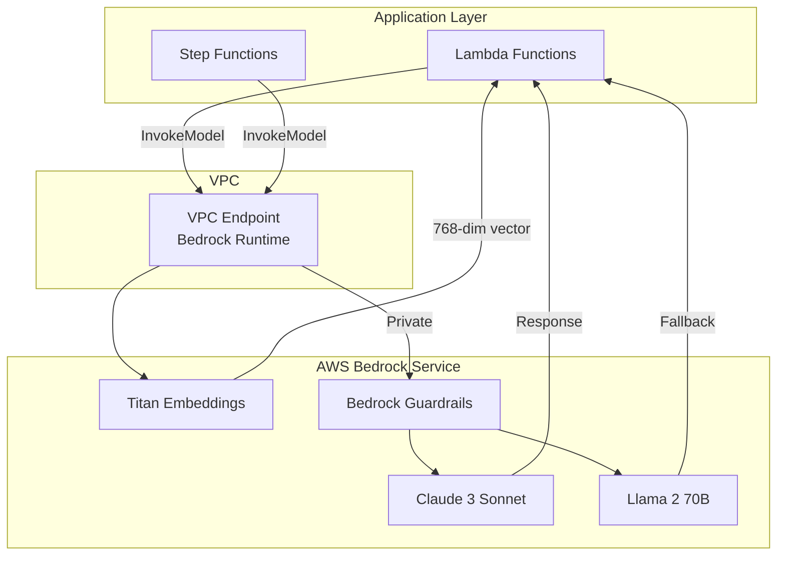

# Bedrock LLM Integration Patterns

## Overview

Amazon Bedrock è un servizio fully-managed che fornisce accesso a foundation models (LLMs) tramite API, senza necessità di gestire infrastruttura. Questo documento presenta pattern production-ready per integrare Bedrock nel nostro sistema di supporto tecnico AI.

### Perché Bedrock nel nostro contesto

**Vantaggi chiave**:
- **Data Residency EU**: Dati rimangono in eu-south-1 (Milano) per compliance GDPR
- **Modelli multipli**: Claude, Llama, Mistral disponibili tramite singola API
- **Guardrails integrati**: PII detection, content filtering, groundedness scoring
- **Serverless**: Pay-per-token, zero gestione infrastruttura
- **PrivateLink**: Accesso via VPC endpoint senza traffico internet

**Quando usarlo**:
- Generazione risposte tecniche verificabili (RAG generation)
- Classificazione testi complessi (backup a SageMaker)
- Embedding generation per ricerca semantica
- Summarization di documentazione tecnica

### Architettura High-Level



---

## Concetti Fondamentali

### 1. Bedrock API Anatomy

**Due modalità di invocazione**:

```python
# Synchronous Invocation (risposta completa)
response = bedrock_runtime.invoke_model(
    modelId='anthropic.claude-3-sonnet-20240229-v1:0',
    body=json.dumps({
        'anthropic_version': 'bedrock-2023-05-31',
        'max_tokens': 2000,
        'messages': [{'role': 'user', 'content': 'Hello'}]
    })
)

# Streaming Invocation (token-by-token)
response = bedrock_runtime.invoke_model_with_response_stream(
    modelId='anthropic.claude-3-sonnet-20240229-v1:0',
    body=json.dumps({...})
)
```

### 2. Model Selection Strategy

| Model | Use Case | Latency | Cost (Input/Output per 1K tokens) | Context Window |
|-------|----------|---------|-----------------------------------|----------------|
| **Claude 3 Sonnet** | Primary - RAG generation | 2-5s | $0.003 / $0.015 | 200K tokens |
| **Claude 3 Haiku** | Fast classification | 0.5-1s | $0.00025 / $0.00125 | 200K tokens |
| **Llama 2 70B** | Fallback generation | 3-6s | $0.00195 / $0.00256 | 4K tokens |
| **Titan Embeddings** | Semantic search | 0.1-0.3s | $0.0001 / N/A | 8K tokens |

**Strategia di selezione**:
```
1. RAG Generation → Claude 3 Sonnet (accuratezza, citations)
2. Classification → Claude 3 Haiku (velocità, costo)
3. Fallback → Llama 2 70B (se Claude throttled)
4. Embeddings → Titan (costo efficienza)
```

### 3. Model Parameters Deep Dive

**Temperature** (0.0 - 1.0):
- `0.0-0.3`: Deterministico, per classification e RAG
- `0.4-0.7`: Bilanciato, per conversazioni
- `0.8-1.0`: Creativo, per brainstorming (non usato nel nostro caso)

**Top P** (0.0 - 1.0):
- Nucleus sampling threshold
- `0.9-0.95`: Default consigliato (usare invece di temperature quando possibile)
- `0.99`: Più diversità nelle risposte

**Top K** (intero):
- Limita scelte a K token più probabili
- `40-50`: Default Bedrock
- Evitare combinazione con Top P (usare uno o l'altro)

**Max Tokens**:
- Limita lunghezza output
- Claude Sonnet: consigliato 1000-4000 per RAG
- Considerare: ~750 parole = 1000 tokens

### 4. Context Window Management

**Claude 3 Sonnet**: 200K tokens (~150K parole, ~500 pagine)

```python
import tiktoken

def estimate_tokens(text: str, model: str = "cl100k_base") -> int:
    """
    Stima token count per Claude (usa encoding GPT-4 come approssimazione).

    Note: Claude usa encoding diverso ma cl100k_base è buona approssimazione.
    """
    encoder = tiktoken.get_encoding(model)
    return len(encoder.encode(text))

def fit_context_in_window(
    system_prompt: str,
    context_chunks: List[str],
    user_query: str,
    max_total_tokens: int = 150000,  # Safety margin da 200K
    reserved_for_output: int = 4000
) -> List[str]:
    """
    Assicura che il context totale stia nella finestra del modello.
    """
    available_tokens = max_total_tokens - reserved_for_output

    # Token budget
    system_tokens = estimate_tokens(system_prompt)
    query_tokens = estimate_tokens(user_query)
    available_for_context = available_tokens - system_tokens - query_tokens

    # Aggiungi chunks fino a budget
    selected_chunks = []
    current_tokens = 0

    for chunk in context_chunks:
        chunk_tokens = estimate_tokens(chunk)
        if current_tokens + chunk_tokens <= available_for_context:
            selected_chunks.append(chunk)
            current_tokens += chunk_tokens
        else:
            break

    return selected_chunks
```

### 5. Guardrails Architecture

Bedrock Guardrails = layer di validazione pre/post invocazione

**Componenti**:
1. **Content Filters**: Harmful content detection (hate, violence, sexual)
2. **PII Detection**: Email, phone, credit card, SSN
3. **Topic Denial**: Blocco argomenti specifici
4. **Contextual Grounding**: Verifica aderenza al context fornito

**Flow**:
```
Request → Guardrail (input validation) → Model → Guardrail (output validation) → Response
```

---

## Implementazione Pratica

### Setup Base

#### 1. IAM Policy per Lambda

```json
{
  "Version": "2012-10-17",
  "Statement": [
    {
      "Effect": "Allow",
      "Action": [
        "bedrock:InvokeModel",
        "bedrock:InvokeModelWithResponseStream"
      ],
      "Resource": [
        "arn:aws:bedrock:eu-south-1::foundation-model/anthropic.claude-3-sonnet-20240229-v1:0",
        "arn:aws:bedrock:eu-south-1::foundation-model/anthropic.claude-3-haiku-20240307-v1:0",
        "arn:aws:bedrock:eu-south-1::foundation-model/meta.llama2-70b-chat-v1",
        "arn:aws:bedrock:eu-south-1::foundation-model/amazon.titan-embed-text-v1"
      ]
    },
    {
      "Effect": "Allow",
      "Action": [
        "bedrock:ApplyGuardrail"
      ],
      "Resource": "arn:aws:bedrock:eu-south-1:ACCOUNT_ID:guardrail/*"
    }
  ]
}
```

#### 2. VPC Endpoint Setup (CloudFormation)

```yaml
BedrockVPCEndpoint:
  Type: AWS::EC2::VPCEndpoint
  Properties:
    VpcId: !Ref VPC
    ServiceName: !Sub com.amazonaws.${AWS::Region}.bedrock-runtime
    VpcEndpointType: Interface
    PrivateDnsEnabled: true
    SubnetIds:
      - !Ref PrivateSubnet1
      - !Ref PrivateSubnet2
    SecurityGroupIds:
      - !Ref BedrockEndpointSecurityGroup

BedrockEndpointSecurityGroup:
  Type: AWS::EC2::SecurityGroup
  Properties:
    GroupDescription: Allow HTTPS to Bedrock
    VpcId: !Ref VPC
    SecurityGroupIngress:
      - IpProtocol: tcp
        FromPort: 443
        ToPort: 443
        SourceSecurityGroupId: !Ref LambdaSecurityGroup
```

### BedrockClient Production Class

```python
import json
import logging
import time
from typing import Dict, List, Optional, Iterator, Any
from dataclasses import dataclass
import boto3
from botocore.exceptions import ClientError

logger = logging.getLogger(__name__)

@dataclass
class ModelConfig:
    """Configurazione modello Bedrock."""
    model_id: str
    max_tokens: int
    temperature: float
    top_p: float

    @classmethod
    def claude_sonnet(cls) -> 'ModelConfig':
        return cls(
            model_id='anthropic.claude-3-sonnet-20240229-v1:0',
            max_tokens=2000,
            temperature=0.3,
            top_p=0.95
        )

    @classmethod
    def claude_haiku(cls) -> 'ModelConfig':
        return cls(
            model_id='anthropic.claude-3-haiku-20240307-v1:0',
            max_tokens=1000,
            temperature=0.1,
            top_p=0.9
        )

class BedrockClient:
    """
    Production-ready Bedrock client con retry, fallback, e guardrails.

    Features:
    - Exponential backoff retry
    - Multi-model fallback strategy
    - Streaming support
    - Guardrails integration
    - Token counting e cost estimation
    - Connection pooling
    """

    def __init__(
        self,
        region: str = 'eu-south-1',
        guardrail_id: Optional[str] = None,
        guardrail_version: str = 'DRAFT'
    ):
        self.region = region
        self.guardrail_id = guardrail_id
        self.guardrail_version = guardrail_version

        # Bedrock client con connection pooling
        self.client = boto3.client(
            'bedrock-runtime',
            region_name=region,
            config=boto3.session.Config(
                max_pool_connections=50,  # Connection pooling
                retries={'max_attempts': 0}  # Gestione retry custom
            )
        )

    def invoke_with_retry(
        self,
        prompt: str,
        config: ModelConfig,
        max_retries: int = 3,
        system_prompt: Optional[str] = None
    ) -> Dict[str, Any]:
        """
        Invoca modello con exponential backoff retry.

        Args:
            prompt: User prompt
            config: Model configuration
            max_retries: Max retry attempts
            system_prompt: Optional system prompt

        Returns:
            Response con text, tokens, latency

        Raises:
            BedrockError: Se tutti i retry falliscono
        """
        for attempt in range(max_retries + 1):
            try:
                start_time = time.time()

                # Build request body
                body = self._build_request_body(
                    prompt=prompt,
                    config=config,
                    system_prompt=system_prompt
                )

                # Invoke with optional guardrails
                invoke_params = {
                    'modelId': config.model_id,
                    'body': json.dumps(body)
                }

                if self.guardrail_id:
                    invoke_params['guardrailIdentifier'] = self.guardrail_id
                    invoke_params['guardrailVersion'] = self.guardrail_version

                response = self.client.invoke_model(**invoke_params)

                # Parse response
                response_body = json.loads(response['body'].read())
                latency_ms = int((time.time() - start_time) * 1000)

                # Extract content (format varies by model)
                if 'anthropic' in config.model_id:
                    text = response_body['content'][0]['text']
                    input_tokens = response_body['usage']['input_tokens']
                    output_tokens = response_body['usage']['output_tokens']
                elif 'meta.llama' in config.model_id:
                    text = response_body['generation']
                    input_tokens = response_body.get('prompt_token_count', 0)
                    output_tokens = response_body.get('generation_token_count', 0)
                else:
                    raise ValueError(f"Unsupported model: {config.model_id}")

                logger.info(
                    f"Bedrock invocation successful",
                    extra={
                        'model': config.model_id,
                        'input_tokens': input_tokens,
                        'output_tokens': output_tokens,
                        'latency_ms': latency_ms
                    }
                )

                return {
                    'text': text,
                    'input_tokens': input_tokens,
                    'output_tokens': output_tokens,
                    'latency_ms': latency_ms,
                    'model_id': config.model_id
                }

            except ClientError as e:
                error_code = e.response['Error']['Code']

                # Retry on throttling and transient errors
                if error_code in ['ThrottlingException', 'ServiceUnavailableException', 'TooManyRequestsException']:
                    if attempt < max_retries:
                        wait_time = (2 ** attempt) + (time.time() % 1)  # Exponential + jitter
                        logger.warning(
                            f"Bedrock throttled, retrying in {wait_time:.2f}s",
                            extra={'attempt': attempt + 1, 'error': error_code}
                        )
                        time.sleep(wait_time)
                        continue

                # Non-retriable errors
                logger.error(f"Bedrock error: {error_code}", exc_info=True)
                raise

            except Exception as e:
                logger.error(f"Unexpected error invoking Bedrock", exc_info=True)
                raise

        raise Exception(f"Max retries ({max_retries}) exceeded")

    def stream_response(
        self,
        prompt: str,
        config: ModelConfig,
        system_prompt: Optional[str] = None
    ) -> Iterator[str]:
        """
        Genera response in streaming (token-by-token).

        Yields:
            Token chunks come disponibili
        """
        body = self._build_request_body(
            prompt=prompt,
            config=config,
            system_prompt=system_prompt
        )

        response = self.client.invoke_model_with_response_stream(
            modelId=config.model_id,
            body=json.dumps(body)
        )

        # Parse event stream
        for event in response['body']:
            chunk = json.loads(event['chunk']['bytes'])

            if 'anthropic' in config.model_id:
                # Claude streaming format
                if chunk['type'] == 'content_block_delta':
                    text_delta = chunk['delta'].get('text', '')
                    if text_delta:
                        yield text_delta
            elif 'meta.llama' in config.model_id:
                # Llama streaming format
                if 'generation' in chunk:
                    yield chunk['generation']

    def multi_model_fallback(
        self,
        prompt: str,
        primary_config: ModelConfig,
        fallback_configs: List[ModelConfig],
        system_prompt: Optional[str] = None
    ) -> Dict[str, Any]:
        """
        Tenta primary model, fallback se fallisce.

        Args:
            prompt: User prompt
            primary_config: Primary model config
            fallback_configs: List of fallback configs (in order)
            system_prompt: Optional system prompt

        Returns:
            Response dal primo modello che risponde
        """
        # Try primary
        try:
            return self.invoke_with_retry(
                prompt=prompt,
                config=primary_config,
                system_prompt=system_prompt,
                max_retries=2  # Fewer retries per model in fallback scenario
            )
        except Exception as e:
            logger.warning(
                f"Primary model failed: {primary_config.model_id}",
                exc_info=True
            )

        # Try fallbacks
        for fallback_config in fallback_configs:
            try:
                logger.info(f"Trying fallback model: {fallback_config.model_id}")
                return self.invoke_with_retry(
                    prompt=prompt,
                    config=fallback_config,
                    system_prompt=system_prompt,
                    max_retries=1
                )
            except Exception as e:
                logger.warning(
                    f"Fallback model failed: {fallback_config.model_id}",
                    exc_info=True
                )
                continue

        raise Exception("All models (primary + fallbacks) failed")

    def batch_inference(
        self,
        prompts: List[str],
        config: ModelConfig,
        system_prompt: Optional[str] = None,
        max_concurrent: int = 10
    ) -> List[Dict[str, Any]]:
        """
        Process batch di prompts in parallelo con rate limiting.

        Args:
            prompts: Lista di prompt
            config: Model config
            system_prompt: Optional system prompt
            max_concurrent: Max richieste concorrenti

        Returns:
            Lista di response (stesso ordine dei prompt)
        """
        from concurrent.futures import ThreadPoolExecutor, as_completed

        results = [None] * len(prompts)

        def process_prompt(idx: int, prompt: str):
            try:
                result = self.invoke_with_retry(
                    prompt=prompt,
                    config=config,
                    system_prompt=system_prompt
                )
                return idx, result, None
            except Exception as e:
                return idx, None, str(e)

        with ThreadPoolExecutor(max_workers=max_concurrent) as executor:
            futures = {
                executor.submit(process_prompt, i, p): i
                for i, p in enumerate(prompts)
            }

            for future in as_completed(futures):
                idx, result, error = future.result()
                if error:
                    logger.error(f"Batch item {idx} failed: {error}")
                    results[idx] = {'error': error}
                else:
                    results[idx] = result

        return results

    def estimate_cost(
        self,
        input_tokens: int,
        output_tokens: int,
        model_id: str
    ) -> float:
        """
        Stima costo invocazione in USD.

        Pricing (per 1K tokens):
        - Claude Sonnet: $0.003 input, $0.015 output
        - Claude Haiku: $0.00025 input, $0.00125 output
        - Llama 2 70B: $0.00195 input, $0.00256 output
        - Titan Embeddings: $0.0001 input
        """
        pricing = {
            'anthropic.claude-3-sonnet-20240229-v1:0': (0.003, 0.015),
            'anthropic.claude-3-haiku-20240307-v1:0': (0.00025, 0.00125),
            'meta.llama2-70b-chat-v1': (0.00195, 0.00256),
            'amazon.titan-embed-text-v1': (0.0001, 0.0)
        }

        if model_id not in pricing:
            logger.warning(f"Unknown model for pricing: {model_id}")
            return 0.0

        input_price, output_price = pricing[model_id]

        cost = (input_tokens / 1000 * input_price) + (output_tokens / 1000 * output_price)
        return round(cost, 6)

    def _build_request_body(
        self,
        prompt: str,
        config: ModelConfig,
        system_prompt: Optional[str] = None
    ) -> Dict:
        """Costruisce request body (format varia per modello)."""
        if 'anthropic' in config.model_id:
            body = {
                'anthropic_version': 'bedrock-2023-05-31',
                'max_tokens': config.max_tokens,
                'temperature': config.temperature,
                'top_p': config.top_p,
                'messages': [
                    {'role': 'user', 'content': prompt}
                ]
            }
            if system_prompt:
                body['system'] = system_prompt
            return body

        elif 'meta.llama' in config.model_id:
            return {
                'prompt': prompt,
                'max_gen_len': config.max_tokens,
                'temperature': config.temperature,
                'top_p': config.top_p
            }

        else:
            raise ValueError(f"Unsupported model: {config.model_id}")
```

### Esempio 1: Synchronous Invocation con JSON Mode

```python
def generate_structured_solution(ticket: Dict) -> Dict:
    """
    Genera soluzione tecnica in formato JSON strutturato.
    """
    client = BedrockClient(
        guardrail_id='tech-support-guardrail',
        guardrail_version='1'
    )

    # System prompt che forza output JSON
    system_prompt = """Sei un tecnico esperto. Rispondi SEMPRE in formato JSON valido.
Non aggiungere testo fuori dal JSON. Usa questa struttura:
{
  "steps": [...],
  "citations": [...],
  "confidence": 0.XX
}"""

    # User prompt con context
    user_prompt = f"""Problema: {ticket['symptom_text']}
Errore: {ticket['error_code']}
Prodotto: {ticket['product']}

Genera soluzione step-by-step citando le fonti."""

    response = client.invoke_with_retry(
        prompt=user_prompt,
        config=ModelConfig.claude_sonnet(),
        system_prompt=system_prompt
    )

    # Parse JSON response
    try:
        solution = json.loads(response['text'])
    except json.JSONDecodeError:
        # Fallback: estrai JSON da markdown code block
        import re
        json_match = re.search(r'```json\n(.*?)\n```', response['text'], re.DOTALL)
        if json_match:
            solution = json.loads(json_match.group(1))
        else:
            raise ValueError("Invalid JSON response from model")

    # Add metadata
    solution['_metadata'] = {
        'model': response['model_id'],
        'tokens': {
            'input': response['input_tokens'],
            'output': response['output_tokens']
        },
        'cost_usd': client.estimate_cost(
            response['input_tokens'],
            response['output_tokens'],
            response['model_id']
        ),
        'latency_ms': response['latency_ms']
    }

    return solution
```

### Esempio 2: Streaming Response con Server-Sent Events

```python
from flask import Flask, Response, stream_with_context

app = Flask(__name__)

@app.route('/api/tickets/<ticket_id>/solution/stream', methods=['GET'])
def stream_solution(ticket_id: str):
    """
    Stream soluzione in real-time (Server-Sent Events).
    """
    def generate():
        # Fetch ticket
        ticket = get_ticket(ticket_id)

        # Build prompt
        prompt = build_solution_prompt(ticket)

        # Stream response
        client = BedrockClient()

        try:
            for chunk in client.stream_response(
                prompt=prompt,
                config=ModelConfig.claude_sonnet()
            ):
                # Format as SSE
                yield f"data: {json.dumps({'chunk': chunk})}\n\n"

            # End of stream
            yield f"data: {json.dumps({'done': True})}\n\n"

        except Exception as e:
            yield f"data: {json.dumps({'error': str(e)})}\n\n"

    return Response(
        stream_with_context(generate()),
        mimetype='text/event-stream',
        headers={
            'Cache-Control': 'no-cache',
            'X-Accel-Buffering': 'no'
        }
    )

# Client-side JavaScript per consumare stream
"""
const eventSource = new EventSource('/api/tickets/tkt_123/solution/stream');

eventSource.onmessage = function(event) {
    const data = JSON.parse(event.data);

    if (data.chunk) {
        document.getElementById('solution').innerText += data.chunk;
    } else if (data.done) {
        eventSource.close();
    } else if (data.error) {
        console.error('Stream error:', data.error);
        eventSource.close();
    }
};
"""
```

### Esempio 3: Guardrails Configuration

```yaml
# bedrock-guardrail.yaml
# Deploy con AWS CLI: aws bedrock create-guardrail --cli-input-yaml file://bedrock-guardrail.yaml

name: TechSupportGuardrail
description: Guardrails per sistema supporto tecnico
blockedInputMessaging: "La tua richiesta contiene contenuto non permesso. Riprova."
blockedOutputsMessaging: "Impossibile generare risposta sicura. Contatta supporto umano."

contentPolicyConfig:
  filtersConfig:
    - type: SEXUAL
      inputStrength: HIGH
      outputStrength: HIGH
    - type: VIOLENCE
      inputStrength: HIGH
      outputStrength: HIGH
    - type: HATE
      inputStrength: MEDIUM
      outputStrength: MEDIUM
    - type: INSULTS
      inputStrength: MEDIUM
      outputStrength: MEDIUM
    - type: MISCONDUCT
      inputStrength: MEDIUM
      outputStrength: MEDIUM
    - type: PROMPT_ATTACK
      inputStrength: HIGH
      outputStrength: NONE

sensitiveInformationPolicyConfig:
  piiEntitiesConfig:
    - type: EMAIL
      action: ANONYMIZE
    - type: PHONE
      action: ANONYMIZE
    - type: CREDIT_DEBIT_CARD_NUMBER
      action: BLOCK
    - type: US_SOCIAL_SECURITY_NUMBER
      action: BLOCK
    - type: IP_ADDRESS
      action: ANONYMIZE
  regexesConfig:
    - name: ItalianFiscalCode
      description: Codice Fiscale Italiano
      pattern: ^[A-Z]{6}\d{2}[A-Z]\d{2}[A-Z]\d{3}[A-Z]$
      action: ANONYMIZE

topicPolicyConfig:
  topicsConfig:
    - name: CompetitorMentions
      definition: Menzioni di prodotti o aziende concorrenti
      examples:
        - "Il nostro concorrente Acme Corp"
        - "Prodotto simile di XYZ Inc"
      type: DENY
    - name: UnverifiedMedicalAdvice
      definition: Consigli medici non verificati o pericolosi
      examples:
        - "Questo problema può causare rischi per la salute"
      type: DENY

contextualGroundingPolicyConfig:
  filtersConfig:
    - type: GROUNDING
      threshold: 0.75  # 75% delle affermazioni devono essere grounded
    - type: RELEVANCE
      threshold: 0.70  # 70% del contenuto deve essere rilevante
```

**Uso programmatico**:

```python
def invoke_with_custom_guardrails(
    prompt: str,
    context_chunks: List[str]
) -> Dict:
    """
    Invoca Bedrock con guardrails configurati.
    """
    client = BedrockClient(
        guardrail_id='gdrxxxxxxxxxxxxx',  # Da AWS Console
        guardrail_version='1'
    )

    # Costruisci prompt con context
    full_prompt = f"""Context:
{format_chunks(context_chunks)}

Query: {prompt}
"""

    try:
        response = client.invoke_with_retry(
            prompt=full_prompt,
            config=ModelConfig.claude_sonnet()
        )
        return response

    except ClientError as e:
        if e.response['Error']['Code'] == 'ValidationException':
            # Guardrail blocked request/response
            guardrail_action = e.response['Error']['Message']

            if 'PII' in guardrail_action:
                logger.warning("Guardrail blocked PII in request")
                raise ValueError("Request contains sensitive information")

            elif 'GROUNDING' in guardrail_action:
                logger.warning("Response not grounded enough in context")
                raise ValueError("Unable to generate grounded response")

            else:
                logger.error(f"Guardrail blocked: {guardrail_action}")
                raise
        else:
            raise
```

### Esempio 4: Multi-Model Fallback Strategy

```python
def generate_with_fallback(ticket: Dict, context: List[str]) -> Dict:
    """
    Genera soluzione con automatic fallback se primary model fallisce.
    """
    client = BedrockClient()

    prompt = build_rag_prompt(ticket, context)

    # Define model cascade
    primary = ModelConfig.claude_sonnet()
    fallbacks = [
        ModelConfig.claude_haiku(),  # Faster but less capable
        ModelConfig(  # Llama 2 fallback
            model_id='meta.llama2-70b-chat-v1',
            max_tokens=2000,
            temperature=0.3,
            top_p=0.9
        )
    ]

    response = client.multi_model_fallback(
        prompt=prompt,
        primary_config=primary,
        fallback_configs=fallbacks
    )

    # Log quale modello ha risposto
    logger.info(
        f"Solution generated by {response['model_id']}",
        extra={
            'ticket_id': ticket['ticket_id'],
            'was_fallback': response['model_id'] != primary.model_id
        }
    )

    return parse_solution(response['text'])
```

### Esempio 5: Batch Inference per 100+ Richieste

```python
def process_batch_tickets(ticket_ids: List[str]) -> Dict[str, Dict]:
    """
    Processa batch di ticket in parallelo con rate limiting.

    Use case: Nightly batch per rigenerate solutions con nuovo KB
    """
    client = BedrockClient()

    # Fetch all tickets
    tickets = [get_ticket(tid) for tid in ticket_ids]

    # Build prompts
    prompts = [
        build_solution_prompt(ticket)
        for ticket in tickets
    ]

    logger.info(f"Processing batch of {len(prompts)} tickets")

    # Process in parallel (max 10 concurrent per rispettare rate limits)
    results = client.batch_inference(
        prompts=prompts,
        config=ModelConfig.claude_haiku(),  # Haiku per costo
        max_concurrent=10
    )

    # Map results to ticket IDs
    solutions = {}
    total_cost = 0.0

    for ticket, result in zip(tickets, results):
        if 'error' in result:
            logger.error(f"Failed to process {ticket['ticket_id']}: {result['error']}")
            solutions[ticket['ticket_id']] = None
        else:
            solutions[ticket['ticket_id']] = {
                'solution': parse_solution(result['text']),
                'tokens': result['input_tokens'] + result['output_tokens'],
                'latency_ms': result['latency_ms']
            }

            cost = client.estimate_cost(
                result['input_tokens'],
                result['output_tokens'],
                result['model_id']
            )
            total_cost += cost

    logger.info(
        f"Batch processing complete",
        extra={
            'total_tickets': len(tickets),
            'successful': sum(1 for s in solutions.values() if s is not None),
            'total_cost_usd': round(total_cost, 2)
        }
    )

    return solutions
```

### Esempio 6: Token Counting e Cost Estimation

```python
import tiktoken
from typing import Dict, List

class TokenCounter:
    """
    Accurate token counting per cost estimation PRIMA dell'invocazione.
    """

    def __init__(self, encoding_name: str = "cl100k_base"):
        """
        cl100k_base: encoding usato da GPT-4, buona approssimazione per Claude.
        """
        self.encoder = tiktoken.get_encoding(encoding_name)

    def count_tokens(self, text: str) -> int:
        """Conta tokens in stringa."""
        return len(self.encoder.encode(text))

    def estimate_prompt_cost(
        self,
        system_prompt: str,
        user_prompt: str,
        context_chunks: List[str],
        model_id: str,
        expected_output_tokens: int = 2000
    ) -> Dict[str, float]:
        """
        Stima costo PRIMA di invocare il modello.

        Returns:
            Dict con input_tokens, output_tokens, total_cost_usd
        """
        # Count input tokens
        system_tokens = self.count_tokens(system_prompt)
        user_tokens = self.count_tokens(user_prompt)
        context_tokens = sum(self.count_tokens(chunk) for chunk in context_chunks)

        total_input_tokens = system_tokens + user_tokens + context_tokens

        # Estimate cost
        pricing = {
            'anthropic.claude-3-sonnet-20240229-v1:0': (0.003, 0.015),
            'anthropic.claude-3-haiku-20240307-v1:0': (0.00025, 0.00125),
        }

        input_price, output_price = pricing.get(model_id, (0, 0))

        input_cost = (total_input_tokens / 1000) * input_price
        output_cost = (expected_output_tokens / 1000) * output_price
        total_cost = input_cost + output_cost

        return {
            'input_tokens': total_input_tokens,
            'expected_output_tokens': expected_output_tokens,
            'input_cost_usd': round(input_cost, 6),
            'output_cost_usd': round(output_cost, 6),
            'total_cost_usd': round(total_cost, 6),
            'breakdown': {
                'system': system_tokens,
                'user': user_tokens,
                'context': context_tokens
            }
        }

# Esempio uso
def generate_solution_with_cost_check(ticket: Dict, context: List[str]) -> Dict:
    """
    Genera soluzione con cost check preventivo.
    """
    counter = TokenCounter()

    system_prompt = load_system_prompt()
    user_prompt = build_user_prompt(ticket)

    # Estimate cost BEFORE calling API
    cost_estimate = counter.estimate_prompt_cost(
        system_prompt=system_prompt,
        user_prompt=user_prompt,
        context_chunks=context,
        model_id='anthropic.claude-3-sonnet-20240229-v1:0',
        expected_output_tokens=2000
    )

    logger.info(f"Estimated cost: ${cost_estimate['total_cost_usd']}")

    # Check budget
    if cost_estimate['total_cost_usd'] > 0.10:  # $0.10 threshold
        logger.warning(
            f"High cost request: ${cost_estimate['total_cost_usd']}",
            extra={'ticket_id': ticket['ticket_id']}
        )

        # Trim context to reduce cost
        max_context_tokens = 10000  # Budget limit
        context = trim_context_to_tokens(context, max_context_tokens, counter)

        # Re-estimate
        cost_estimate = counter.estimate_prompt_cost(
            system_prompt, user_prompt, context,
            'anthropic.claude-3-sonnet-20240229-v1:0', 2000
        )
        logger.info(f"Cost after trimming: ${cost_estimate['total_cost_usd']}")

    # Invoke
    client = BedrockClient()
    response = client.invoke_with_retry(
        prompt=user_prompt,
        config=ModelConfig.claude_sonnet(),
        system_prompt=system_prompt
    )

    # Compare estimated vs actual
    actual_cost = client.estimate_cost(
        response['input_tokens'],
        response['output_tokens'],
        response['model_id']
    )

    logger.info(
        f"Cost comparison - Estimated: ${cost_estimate['total_cost_usd']}, "
        f"Actual: ${actual_cost}"
    )

    return response

def trim_context_to_tokens(
    chunks: List[str],
    max_tokens: int,
    counter: TokenCounter
) -> List[str]:
    """Trim context chunks per rimanere sotto budget tokens."""
    selected = []
    total_tokens = 0

    for chunk in chunks:
        chunk_tokens = counter.count_tokens(chunk)
        if total_tokens + chunk_tokens <= max_tokens:
            selected.append(chunk)
            total_tokens += chunk_tokens
        else:
            break

    return selected
```

---

## Best Practices

### Do's ✅

#### 1. Connection Pooling e Reuse

```python
# ✅ GOOD: Riusa client tra invocazioni Lambda
bedrock_client = None

def lambda_handler(event, context):
    global bedrock_client

    if bedrock_client is None:
        bedrock_client = BedrockClient()

    # Use cached client
    response = bedrock_client.invoke_with_retry(...)
```

```python
# ❌ BAD: Crea nuovo client ad ogni invocazione
def lambda_handler(event, context):
    client = BedrockClient()  # Cold start overhead
    response = client.invoke_with_retry(...)
```

#### 2. Structured Output con JSON Mode

```python
# ✅ GOOD: Forza JSON valido nel system prompt
system_prompt = """Rispondi SEMPRE in JSON valido.
Struttura richiesta:
{
  "answer": "...",
  "confidence": 0.XX,
  "sources": [...]
}"""

# ❌ BAD: Sperare che il modello restituisca JSON
system_prompt = "Per favore rispondi in JSON"  # Troppo vago
```

#### 3. Timeout Gestione

```python
# ✅ GOOD: Timeout configurabili
import signal

def timeout_handler(signum, frame):
    raise TimeoutError("Bedrock invocation timeout")

signal.signal(signal.SIGALRM, timeout_handler)
signal.alarm(10)  # 10 second timeout

try:
    response = client.invoke_with_retry(...)
finally:
    signal.alarm(0)  # Cancel alarm
```

#### 4. Prompt Caching (Future Feature)

```python
# Quando disponibile, cache system prompts statici
# Per ora: minimize token count riutilizzando prompt templates
SYSTEM_PROMPT_CACHE = {
    'rag_generation': load_once('prompts/rag_generation.txt'),
    'classification': load_once('prompts/classification.txt')
}
```

#### 5. Monitoring e Metrics

```python
import time
from aws_lambda_powertools import Metrics

metrics = Metrics(namespace="BedrockInvocations")

@metrics.log_metrics
def invoke_tracked(prompt: str, config: ModelConfig):
    start = time.time()

    try:
        response = client.invoke_with_retry(prompt, config)

        metrics.add_metric(name="InvocationSuccess", unit="Count", value=1)
        metrics.add_metric(name="Latency", unit="Milliseconds", value=response['latency_ms'])
        metrics.add_metric(name="InputTokens", unit="Count", value=response['input_tokens'])
        metrics.add_metric(name="OutputTokens", unit="Count", value=response['output_tokens'])
        metrics.add_dimension(name="ModelId", value=config.model_id)

        return response

    except Exception as e:
        metrics.add_metric(name="InvocationFailure", unit="Count", value=1)
        raise
```

### Don'ts ❌

#### 1. Non Ignorare Rate Limits

```python
# ❌ BAD: Loop senza rate limiting
for ticket in tickets:
    generate_solution(ticket)  # Throttling guaranteed

# ✅ GOOD: Batch con concurrency control
client.batch_inference(prompts, max_concurrent=10)
```

#### 2. Non Loggare Prompt/Response Completi (PII Risk)

```python
# ❌ BAD: Log completo può contenere PII
logger.info(f"Response: {response['text']}")

# ✅ GOOD: Log solo metadata
logger.info(f"Response received", extra={
    'tokens': response['output_tokens'],
    'latency_ms': response['latency_ms'],
    'model': response['model_id']
})
```

#### 3. Non Hardcodare Model IDs

```python
# ❌ BAD: Model ID hardcoded
model_id = 'anthropic.claude-3-sonnet-20240229-v1:0'

# ✅ GOOD: Centralizza in config
from config import BEDROCK_MODELS

model_id = BEDROCK_MODELS['primary']
```

#### 4. Non Assumere Output Deterministico

```python
# ❌ BAD: Assume sempre stesso output
response1 = invoke("What is 2+2?", temp=0.0)
response2 = invoke("What is 2+2?", temp=0.0)
assert response1 == response2  # Può fallire!

# ✅ GOOD: Parse structured output con validation
try:
    result = json.loads(response['text'])
    validate_schema(result)
except:
    # Handle invalid output
    pass
```

### Performance Optimization

#### 1. Model Selection per Use Case

```python
def select_optimal_model(use_case: str, priority: str) -> ModelConfig:
    """
    Seleziona modello ottimale basato su use case e priority.
    """
    if use_case == 'classification':
        return ModelConfig.claude_haiku()  # Fast + cheap

    elif use_case == 'rag_generation':
        if priority == 'accuracy':
            return ModelConfig.claude_sonnet()
        elif priority == 'speed':
            return ModelConfig.claude_haiku()
        elif priority == 'cost':
            return ModelConfig.claude_haiku()

    elif use_case == 'embeddings':
        return ModelConfig(
            model_id='amazon.titan-embed-text-v1',
            max_tokens=0,  # N/A for embeddings
            temperature=0,
            top_p=1.0
        )

    return ModelConfig.claude_sonnet()  # Default
```

#### 2. Provisioned Throughput (Per Workload Predicibili)

```python
# Per workload con traffic predicibile (es. 9am-5pm spike)
# Acquista provisioned throughput invece di on-demand

# CloudFormation
"""
BedrockProvisionedThroughput:
  Type: AWS::Bedrock::ProvisionedModelThroughput
  Properties:
    ModelId: anthropic.claude-3-sonnet-20240229-v1:0
    ModelUnits: 2  # Unità di throughput
    ProvisionedModelName: ticket-processor-sonnet

Pricing:
  On-Demand: $0.003 / 1K input tokens
  Provisioned: $X/hour (fisso) + $Y per 1K tokens (ridotto)

Breakeven: >100K requests/day
"""
```

#### 3. Response Caching

```python
from functools import lru_cache
import hashlib

class CachedBedrockClient(BedrockClient):
    """Bedrock client con caching per query ripetute."""

    def __init__(self, cache_size: int = 1000, **kwargs):
        super().__init__(**kwargs)
        self.cache_size = cache_size

    @lru_cache(maxsize=1000)
    def invoke_cached(
        self,
        prompt_hash: str,  # Hash invece di prompt completo per cache key
        prompt: str,
        config_str: str
    ) -> Dict:
        """Cached invocation per query identiche."""
        config = ModelConfig(**json.loads(config_str))
        return self.invoke_with_retry(prompt, config)

    def invoke_with_cache(self, prompt: str, config: ModelConfig) -> Dict:
        prompt_hash = hashlib.sha256(prompt.encode()).hexdigest()
        config_str = json.dumps({
            'model_id': config.model_id,
            'temperature': config.temperature,
            'max_tokens': config.max_tokens,
            'top_p': config.top_p
        })

        return self.invoke_cached(prompt_hash, prompt, config_str)
```

### Security Considerations

#### 1. PII Detection Pre-Invocazione

```python
import re
from typing import List, Tuple

def detect_pii(text: str) -> List[Tuple[str, str]]:
    """
    Detect PII patterns prima di inviare a Bedrock.

    Returns:
        Lista di (pii_type, matched_value)
    """
    patterns = {
        'email': r'\b[A-Za-z0-9._%+-]+@[A-Za-z0-9.-]+\.[A-Z|a-z]{2,}\b',
        'phone': r'\b(?:\+39)?[ ]?[0-9]{2,4}[ ]?[0-9]{6,8}\b',
        'credit_card': r'\b[0-9]{4}[ -]?[0-9]{4}[ -]?[0-9]{4}[ -]?[0-9]{4}\b',
        'italian_fiscal_code': r'\b[A-Z]{6}\d{2}[A-Z]\d{2}[A-Z]\d{3}[A-Z]\b'
    }

    detected = []
    for pii_type, pattern in patterns.items():
        matches = re.findall(pattern, text)
        for match in matches:
            detected.append((pii_type, match))

    return detected

def sanitize_before_bedrock(prompt: str) -> str:
    """Redact PII prima dell'invocazione."""
    pii_items = detect_pii(prompt)

    if pii_items:
        logger.warning(f"PII detected in prompt: {[p[0] for p in pii_items]}")

        for pii_type, value in pii_items:
            prompt = prompt.replace(value, f"[REDACTED_{pii_type.upper()}]")

    return prompt
```

#### 2. Input Validation

```python
def validate_bedrock_input(prompt: str, max_length: int = 100000):
    """Valida input prima di invocare Bedrock."""

    # Length check
    if len(prompt) > max_length:
        raise ValueError(f"Prompt too long: {len(prompt)} chars")

    # Injection attack patterns
    injection_patterns = [
        r'ignore previous instructions',
        r'disregard all prior',
        r'you are now',
        r'system:',
        r'<script>',
        r'</script>'
    ]

    for pattern in injection_patterns:
        if re.search(pattern, prompt, re.IGNORECASE):
            logger.warning(f"Potential injection detected: {pattern}")
            raise ValueError("Invalid input detected")

    return True
```

### Cost Optimization

#### Strategy 1: Tier-Based Model Selection

```python
def select_model_by_customer_tier(customer_tier: str) -> ModelConfig:
    """
    Enterprise customers → Claude Sonnet (accuracy)
    Standard customers → Claude Haiku (cost)
    """
    if customer_tier == 'enterprise':
        return ModelConfig.claude_sonnet()
    else:
        return ModelConfig.claude_haiku()
```

#### Strategy 2: Adaptive Context Window

```python
def adaptive_context_retrieval(
    query: str,
    classification_confidence: float
) -> List[str]:
    """
    Fetch più context se confidence bassa (hard problem),
    meno context se confidence alta (easy problem).
    """
    if classification_confidence > 0.9:
        top_k = 3  # Easy problem, pochi chunks
    elif classification_confidence > 0.7:
        top_k = 5  # Medium
    else:
        top_k = 10  # Hard problem, più context

    return retrieve_chunks(query, top_k=top_k)
```

#### Strategy 3: Monthly Budget Monitoring

```python
import boto3
from datetime import datetime, timedelta

def check_monthly_budget(account_id: str, max_budget_usd: float = 500.0):
    """
    Verifica spend Bedrock mensile, blocca se sopra budget.
    """
    ce = boto3.client('ce')  # Cost Explorer

    # Get current month spend
    start = datetime.now().replace(day=1).strftime('%Y-%m-%d')
    end = datetime.now().strftime('%Y-%m-%d')

    response = ce.get_cost_and_usage(
        TimePeriod={'Start': start, 'End': end},
        Granularity='MONTHLY',
        Filter={
            'Dimensions': {
                'Key': 'SERVICE',
                'Values': ['Amazon Bedrock']
            }
        },
        Metrics=['UnblendedCost']
    )

    current_spend = float(
        response['ResultsByTime'][0]['Total']['UnblendedCost']['Amount']
    )

    if current_spend >= max_budget_usd:
        logger.error(f"Bedrock budget exceeded: ${current_spend} / ${max_budget_usd}")
        raise Exception("Monthly Bedrock budget exceeded")

    logger.info(f"Bedrock spend: ${current_spend} / ${max_budget_usd}")
    return current_spend
```

---

## Troubleshooting

### Problema 1: ThrottlingException

**Sintomo**: `ThrottlingException: Rate exceeded for model X`

**Cause**:
- Superato rate limit del modello (es. Claude: 100 RPM default)
- Burst di richieste concorrenti
- Nessun provisioned throughput acquistato

**Soluzioni**:

```python
# 1. Exponential backoff (già implementato in BedrockClient)
# 2. Request quota increase
"""
AWS Support → Service Quotas → Bedrock
  - Model: Claude 3 Sonnet
  - Quota: Requests per minute
  - Request: 100 → 500 RPM
"""

# 3. Implementa rate limiter client-side
from ratelimit import limits, sleep_and_retry

@sleep_and_retry
@limits(calls=80, period=60)  # 80 calls per minute (safety margin)
def rate_limited_invoke(prompt: str, config: ModelConfig):
    return client.invoke_with_retry(prompt, config)

# 4. Batch processing con delay
import time

def process_with_rate_limit(prompts: List[str], rpm: int = 80):
    delay_seconds = 60.0 / rpm

    results = []
    for prompt in prompts:
        result = client.invoke_with_retry(prompt, ModelConfig.claude_sonnet())
        results.append(result)
        time.sleep(delay_seconds)

    return results
```

### Problema 2: ModelTimeoutException

**Sintomo**: `ModelTimeoutException: Model invocation timed out`

**Cause**:
- Prompt troppo lungo (>100K tokens)
- Modello sovraccarico
- max_tokens troppo alto

**Soluzioni**:

```python
# 1. Riduci context size
def trim_long_context(chunks: List[str], max_chunks: int = 5):
    return chunks[:max_chunks]

# 2. Timeout gestione con fallback
def invoke_with_timeout_fallback(prompt: str) -> Dict:
    try:
        return client.invoke_with_retry(
            prompt,
            ModelConfig.claude_sonnet(),
            max_retries=1  # Fewer retries
        )
    except Exception as e:
        if 'timeout' in str(e).lower():
            logger.warning("Timeout, trying Haiku (faster model)")
            return client.invoke_with_retry(
                prompt,
                ModelConfig.claude_haiku()
            )
        raise

# 3. Riduci max_tokens
config = ModelConfig.claude_sonnet()
config.max_tokens = 1500  # Instead of 4000
```

### Problema 3: ValidationException da Guardrails

**Sintomo**: `ValidationException: Guardrail blocked the request`

**Cause**:
- PII nel prompt/response
- Contenuto bloccato (violence, hate, ecc.)
- Grounding score < threshold

**Debugging**:

```python
def invoke_with_guardrail_debug(prompt: str) -> Dict:
    try:
        return client.invoke_with_retry(prompt, ModelConfig.claude_sonnet())
    except ClientError as e:
        if 'Guardrail' in str(e):
            # Parse guardrail details
            error_msg = e.response['Error']['Message']

            if 'PII' in error_msg:
                logger.error("Guardrail blocked PII")
                # Sanitize and retry
                sanitized = sanitize_before_bedrock(prompt)
                return client.invoke_with_retry(sanitized, ModelConfig.claude_sonnet())

            elif 'GROUNDING' in error_msg:
                logger.error("Response not grounded")
                # Retry con più context
                raise ValueError("Insufficient context for grounded response")

            else:
                logger.error(f"Guardrail blocked: {error_msg}")
                raise
        else:
            raise
```

### Problema 4: InvalidRequestException - Malformed Response

**Sintomo**: Response non è JSON valido come richiesto

**Cause**:
- Model ignorato JSON instruction
- Temperature troppo alta
- Prompt ambiguo

**Soluzioni**:

```python
def parse_json_response_robust(response_text: str) -> Dict:
    """
    Parse JSON response con fallback strategies.
    """
    # Try 1: Direct parse
    try:
        return json.loads(response_text)
    except json.JSONDecodeError:
        pass

    # Try 2: Extract from markdown code block
    import re
    json_match = re.search(r'```json\n(.*?)\n```', response_text, re.DOTALL)
    if json_match:
        try:
            return json.loads(json_match.group(1))
        except json.JSONDecodeError:
            pass

    # Try 3: Extract from any code block
    code_match = re.search(r'```\n(.*?)\n```', response_text, re.DOTALL)
    if code_match:
        try:
            return json.loads(code_match.group(1))
        except json.JSONDecodeError:
            pass

    # Try 4: Find JSON-like structure
    json_match = re.search(r'\{.*\}', response_text, re.DOTALL)
    if json_match:
        try:
            return json.loads(json_match.group(0))
        except json.JSONDecodeError:
            pass

    # Fallback: Return error
    raise ValueError(f"Unable to parse JSON from response: {response_text[:200]}")

# Prevenzione: Stronger JSON prompt
system_prompt = """CRITICAL: Rispondi ESCLUSIVAMENTE con JSON valido.
NON aggiungere testo prima o dopo il JSON.
NON usare markdown code blocks.
Output DEVE iniziare con { e finire con }

Esempio:
{"answer": "...", "confidence": 0.95}
"""
```

### Problema 5: High Latency (>10s)

**Sintomo**: Response latency >10 secondi

**Debugging**:

```python
import time

def profile_bedrock_invocation(prompt: str, config: ModelConfig):
    """
    Profile invocation per identificare bottleneck.
    """
    timings = {}

    # 1. Prompt preparation
    start = time.time()
    prepared_prompt = prepare_prompt(prompt)
    timings['prompt_prep'] = time.time() - start

    # 2. Network request
    start = time.time()
    response = client.invoke_with_retry(prepared_prompt, config)
    timings['bedrock_call'] = time.time() - start

    # 3. Response parsing
    start = time.time()
    parsed = parse_json_response_robust(response['text'])
    timings['parse'] = time.time() - start

    logger.info(f"Timing breakdown: {timings}")

    return parsed, timings

# Ottimizzazioni basate su bottleneck:
# - Se prompt_prep lento → Cache templates
# - Se bedrock_call lento → Usa Haiku o riduci context
# - Se parse lento → Semplifica parsing logic
```

### Problema 6: Cost Spike Imprevisto

**Sintomo**: Costo mensile Bedrock 3x superiore al previsto

**Investigazione**:

```python
# 1. CloudWatch Logs Insights query per analizzare usage
"""
fields @timestamp, @message
| filter @message like /InvocationSuccess/
| stats sum(input_tokens) as total_input,
        sum(output_tokens) as total_output,
        count() as invocation_count by model_id
| sort total_output desc
"""

# 2. Identifica outlier
"""
fields @timestamp, ticket_id, input_tokens, output_tokens
| filter output_tokens > 5000  # Outlier threshold
| sort output_tokens desc
| limit 20
"""

# 3. Implementa cost alerts
cloudwatch_alarm = {
    'AlarmName': 'BedrockMonthlyCostHigh',
    'MetricName': 'EstimatedCharges',
    'Namespace': 'AWS/Billing',
    'Statistic': 'Maximum',
    'Period': 86400,  # 1 day
    'EvaluationPeriods': 1,
    'Threshold': 500.0,  # $500
    'ComparisonOperator': 'GreaterThanThreshold',
    'Dimensions': [
        {'Name': 'ServiceName', 'Value': 'AmazonBedrock'}
    ]
}
```

---

## Esempi Reali dal Progetto

### Esempio 1: RAG Solution Generation

**File**: `docs/04-data-flows/ticket-processing.md:280-320`

```python
def generate_solution(context_chunks: List[Dict], ticket: Dict) -> Dict:
    """
    Genera soluzione tecnica usando RAG pattern del nostro progetto.

    Context: Step 6 del ticket processing workflow
    """
    client = BedrockClient(
        guardrail_id=os.environ['GUARDRAIL_ID'],
        guardrail_version='1'
    )

    # Load prompt template
    system_prompt = load_prompt_template('rag_generation')  # docs/13-prompt-templates.md:90-175

    # Format context
    context_text = "\n\n".join([
        f"[{i+1}] {chunk['text']}\nSource: {chunk['source_uri']}"
        for i, chunk in enumerate(context_chunks)
    ])

    # Build user prompt
    user_prompt = f"""Problema:
Prodotto: {ticket['asset']['product_type']} {ticket['asset']['model']}
Errore: {ticket.get('error_code', 'N/A')}
Descrizione: {ticket['symptom_text']}

Context KB:
{context_text}

Genera soluzione in formato JSON con campi: steps, citations, confidence"""

    # Invoke with retry
    response = client.invoke_with_retry(
        prompt=user_prompt,
        config=ModelConfig.claude_sonnet(),
        system_prompt=system_prompt
    )

    # Parse and validate
    solution = parse_json_response_robust(response['text'])

    # Validate citations
    if not solution.get('citations'):
        raise ValueError("Solution missing required citations")

    # Add quality metrics (docs/04-data-flows/ticket-processing.md:353-360)
    solution['quality_metrics'] = {
        'groundedness_score': calculate_groundedness(solution, context_chunks),
        'citation_coverage': len(solution['citations']) / len(context_chunks),
        'confidence': solution.get('confidence', 0.0)
    }

    return solution
```

### Esempio 2: Embedding Generation per Vector Search

**File**: `docs/13-prompt-templates.md:245-297`

```python
def generate_embeddings_batch(texts: List[str]) -> List[List[float]]:
    """
    Genera embeddings in batch per indicizzazione OpenSearch.

    Context: KB document ingestion pipeline
    """
    client = BedrockClient()

    # Titan Embeddings: max 25 texts per batch
    batch_size = 25
    all_embeddings = []

    for i in range(0, len(texts), batch_size):
        batch = texts[i:i+batch_size]

        # Invoke Titan
        response = client.client.invoke_model(
            modelId='amazon.titan-embed-text-v1',
            body=json.dumps({
                'inputText': batch
            })
        )

        result = json.loads(response['body'].read())
        embeddings = result['embeddings']  # List of 768-dim vectors

        all_embeddings.extend(embeddings)

        # Rate limiting
        if i + batch_size < len(texts):
            time.sleep(0.1)  # 10 RPS limit

    return all_embeddings

# Usage in KB ingestion
def index_document_to_opensearch(document: Dict):
    """Index documento con embedding nel nostro OpenSearch."""
    # Chunk document
    chunks = chunk_document(document['text'], chunk_size=1000, overlap=200)

    # Generate embeddings
    chunk_texts = [chunk['text'] for chunk in chunks]
    embeddings = generate_embeddings_batch(chunk_texts)

    # Index to OpenSearch
    for chunk, embedding in zip(chunks, embeddings):
        opensearch.index(
            index='kb-chunks',
            body={
                'text': chunk['text'],
                'vector': embedding,
                'source_uri': document['uri'],
                'product_model': document['metadata']['product_model']
            }
        )
```

### Esempio 3: Classification con Fallback

**File**: `docs/04-data-flows/ticket-processing.md:196-225`

```python
def classify_ticket(ticket: Dict) -> Dict:
    """
    Classifica ticket usando primary SageMaker, fallback Bedrock.

    Context: Step 4 del ticket processing workflow
    """
    # Try SageMaker first (custom trained model)
    try:
        response = sagemaker_runtime.invoke_endpoint(
            EndpointName='ticket-classifier-v2',
            ContentType='application/json',
            Body=json.dumps({
                'text': ticket['symptom_text'],
                'error_code': ticket.get('error_code', '')
            })
        )

        result = json.loads(response['Body'].read())

        # If high confidence, use SageMaker result
        if result['confidence'] > 0.85:
            return result

    except Exception as e:
        logger.warning(f"SageMaker classification failed: {e}")

    # Fallback to Bedrock
    logger.info("Using Bedrock for classification")

    client = BedrockClient()

    # Load classification prompt (docs/13-prompt-templates.md:8-52)
    system_prompt = "Classifica il ticket tecnico in una delle categorie predefinite."

    user_prompt = f"""Ticket:
Prodotto: {ticket['asset']['product_type']}
Errore: {ticket.get('error_code', 'N/A')}
Sintomi: {ticket['symptom_text']}

Categorie: {get_categories()}

Rispondi in JSON: {{"category": "...", "confidence": 0.XX}}"""

    response = client.invoke_with_retry(
        prompt=user_prompt,
        config=ModelConfig.claude_haiku(),  # Fast classification
        system_prompt=system_prompt
    )

    return json.loads(response['text'])
```

---

## Riferimenti

### Documentazione AWS
- [Bedrock Developer Guide](https://docs.aws.amazon.com/bedrock/)
- [Claude on Bedrock](https://docs.aws.amazon.com/bedrock/latest/userguide/model-parameters-anthropic-claude.html)
- [Bedrock Guardrails](https://docs.aws.amazon.com/bedrock/latest/userguide/guardrails.html)
- [Bedrock Pricing](https://aws.amazon.com/bedrock/pricing/)

### File del Progetto
- [Prompt Templates](../13-prompt-templates.md) - Template prompt RAG e classification
- [Ticket Processing Flow](../04-data-flows/ticket-processing.md#generazione-soluzione) - Dove Bedrock si inserisce nel workflow
- [Security Guardrails](../02-architecture/security.md#guardrails) - Configurazione guardrails progetto
- [AWS Services Overview](../03-aws-services/README.md) - Mappa servizi AWS

### Blog Posts e Best Practices
- [Anthropic Prompt Engineering](https://docs.anthropic.com/claude/docs/prompt-engineering)
- [AWS Bedrock Best Practices](https://aws.amazon.com/blogs/machine-learning/tag/amazon-bedrock/)
- [Production RAG with Bedrock](https://aws.amazon.com/blogs/machine-learning/building-production-ready-rag-applications/)

### Tools
- [tiktoken](https://github.com/openai/tiktoken) - Token counting
- [AWS Lambda Powertools](https://awslabs.github.io/aws-lambda-powertools-python/) - Structured logging, metrics
- [boto3 Bedrock Runtime](https://boto3.amazonaws.com/v1/documentation/api/latest/reference/services/bedrock-runtime.html) - SDK reference

---

**Versione**: 1.0
**Ultimo aggiornamento**: 2025-11-18
**Maintainer**: AI Tech Team
**Review Status**: ✅ Production Ready
