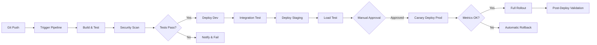

# CI/CD Pipeline Best Practices

## Overview

Questa guida fornisce un approccio production-ready per implementare pipeline CI/CD per applicazioni serverless AWS, con focus sul nostro progetto AI Technical Support System.

### Cos'è e Perché è Importante

Una pipeline CI/CD (Continuous Integration/Continuous Deployment) automatizza il processo di build, test e deployment del codice, garantendo:

- **Qualità**: Test automatici ad ogni commit
- **Velocità**: Deploy rapidi e frequenti
- **Affidabilità**: Processi ripetibili e deterministici
- **Sicurezza**: Scansioni automatiche di vulnerabilità
- **Tracciabilità**: Ogni cambiamento è versionato e tracciato

### Quando Usarlo

Nel nostro contesto:
- **Infrastructure as Code**: Deploy automatico di stack CloudFormation/CDK
- **Lambda Functions**: Package e deploy di funzioni serverless
- **ML Models**: Deployment automatico di modelli SageMaker
- **Configuration**: Aggiornamenti sicuri di parametri e secrets

### Architettura High-Level



---

## Concetti Fondamentali

### Pipeline Stages

Le pipeline sono composte da stage sequenziali:

1. **Source**: Trigger da repository Git
2. **Build**: Compilazione e packaging
3. **Test**: Unit, integration, security tests
4. **Deploy**: Distribuzione su ambienti
5. **Validate**: Smoke tests e monitoring

### Deployment Strategies

#### Blue/Green Deployment

Due ambienti identici (Blue=produzione, Green=nuovo):
- Deploy su Green
- Test su Green
- Switch traffico da Blue a Green
- Rollback istantaneo se problemi

**Pro**: Rollback veloce, zero downtime
**Contro**: Costo doppio (2x risorse)

#### Canary Deployment

Deployment graduale del nuovo codice:
- Deploy nuova versione (canary)
- Route piccola % traffico (10%)
- Monitor metriche
- Incrementa gradualmente (50%, 100%)
- Rollback se metriche degradano

**Pro**: Risk mitigation, early detection
**Contro**: Più complesso, richiede routing intelligente

#### Rolling Deployment

Aggiornamento incrementale di istanze:
- Aggiorna 1 istanza alla volta
- Verifica health check
- Procedi alla prossima istanza

**Pro**: Zero downtime, uso efficiente risorse
**Contro**: Versioni miste temporaneamente

### Infrastructure as Code (IaC)

**CloudFormation**: YAML/JSON declarativo, AWS-native
**CDK (Cloud Development Kit)**: Codice TypeScript/Python imperativo, compilato in CloudFormation

**Principi**:
- **Idempotenza**: Stesso template = stesso risultato
- **Versionato**: Template in Git
- **Review**: Change sets prima del deploy
- **Atomicità**: Rollback automatico su failure

### GitOps Workflow

**Trunk-Based Development**:
- `main` branch sempre deployable
- Feature branches short-lived (<2 giorni)
- CI su ogni branch
- CD solo da `main`

**Semantic Versioning**:
- `MAJOR.MINOR.PATCH` (es. 2.3.1)
- MAJOR: Breaking changes
- MINOR: New features (backward compatible)
- PATCH: Bug fixes

---

## Implementazione Pratica

### 1. GitHub Actions Workflow - Complete Pipeline

Pipeline completa con tutte le fasi di build, test e deploy multi-ambiente.

**File**: `.github/workflows/deploy-pipeline.yml`

```yaml
name: CI/CD Pipeline

on:
  push:
    branches: [main, develop]
  pull_request:
    branches: [main]

env:
  AWS_REGION: eu-south-1
  PYTHON_VERSION: '3.11'
  NODE_VERSION: '18'

# OIDC permissions (no static credentials)
permissions:
  id-token: write
  contents: read

jobs:
  # ============================================
  # STAGE 1: Build & Unit Test
  # ============================================
  build:
    runs-on: ubuntu-latest
    outputs:
      version: ${{ steps.version.outputs.version }}

    steps:
      - name: Checkout code
        uses: actions/checkout@v4
        with:
          fetch-depth: 0  # Full history for versioning

      - name: Set up Python
        uses: actions/setup-python@v5
        with:
          python-version: ${{ env.PYTHON_VERSION }}
          cache: 'pip'

      - name: Set up Node.js
        uses: actions/setup-node@v4
        with:
          node-version: ${{ env.NODE_VERSION }}
          cache: 'npm'

      - name: Install dependencies
        run: |
          pip install -r requirements.txt
          pip install -r requirements-dev.txt
          npm ci

      - name: Generate version
        id: version
        run: |
          VERSION=$(git describe --tags --always --dirty)
          echo "version=$VERSION" >> $GITHUB_OUTPUT
          echo "VERSION=$VERSION" >> version.txt

      - name: Lint code
        run: |
          # Python linting
          ruff check src/
          black --check src/
          mypy src/

          # CloudFormation linting
          cfn-lint templates/**/*.yaml

      - name: Run unit tests
        run: |
          pytest tests/unit/ \
            --cov=src \
            --cov-report=xml \
            --cov-report=term \
            --junitxml=test-results/junit.xml

      - name: Upload test results
        if: always()
        uses: actions/upload-artifact@v4
        with:
          name: test-results
          path: test-results/

      - name: Upload coverage
        uses: codecov/codecov-action@v4
        with:
          files: ./coverage.xml
          flags: unittests

      - name: Package Lambda functions
        run: |
          ./scripts/package-lambdas.sh

      - name: Upload build artifacts
        uses: actions/upload-artifact@v4
        with:
          name: lambda-packages
          path: dist/
          retention-days: 7

  # ============================================
  # STAGE 2: Security Scanning (SAST)
  # ============================================
  security-scan:
    runs-on: ubuntu-latest
    needs: build

    steps:
      - name: Checkout code
        uses: actions/checkout@v4

      - name: Run Snyk security scan
        uses: snyk/actions/python@master
        env:
          SNYK_TOKEN: ${{ secrets.SNYK_TOKEN }}
        with:
          args: --severity-threshold=high --fail-on=upgradable

      - name: Run Bandit (Python security)
        run: |
          pip install bandit
          bandit -r src/ -f json -o bandit-report.json || true

      - name: Run TruffleHog (secret scanning)
        uses: trufflesecurity/trufflehog@main
        with:
          extra_args: --only-verified

      - name: Trivy container scan
        uses: aquasecurity/trivy-action@master
        with:
          scan-type: 'fs'
          scan-ref: '.'
          format: 'sarif'
          output: 'trivy-results.sarif'

      - name: Upload security results
        uses: github/codeql-action/upload-sarif@v3
        with:
          sarif_file: 'trivy-results.sarif'

  # ============================================
  # STAGE 3: Deploy to Dev Environment
  # ============================================
  deploy-dev:
    runs-on: ubuntu-latest
    needs: [build, security-scan]
    if: github.ref == 'refs/heads/develop'
    environment: development

    steps:
      - name: Checkout code
        uses: actions/checkout@v4

      - name: Configure AWS credentials (OIDC)
        uses: aws-actions/configure-aws-credentials@v4
        with:
          role-to-assume: arn:aws:iam::${{ secrets.AWS_ACCOUNT_ID }}:role/GitHubActionsRole
          aws-region: ${{ env.AWS_REGION }}

      - name: Download build artifacts
        uses: actions/download-artifact@v4
        with:
          name: lambda-packages
          path: dist/

      - name: Upload to S3
        run: |
          VERSION=${{ needs.build.outputs.version }}
          aws s3 sync dist/ s3://ai-service-artifacts-dev/builds/$VERSION/

      - name: Deploy CloudFormation stack
        run: |
          aws cloudformation deploy \
            --template-file templates/main-stack.yaml \
            --stack-name ai-service-dev \
            --parameter-overrides \
              Environment=dev \
              Version=${{ needs.build.outputs.version }} \
            --capabilities CAPABILITY_IAM CAPABILITY_NAMED_IAM \
            --no-fail-on-empty-changeset

      - name: Run smoke tests
        run: |
          export API_URL=$(aws cloudformation describe-stacks \
            --stack-name ai-service-dev \
            --query 'Stacks[0].Outputs[?OutputKey==`ApiUrl`].OutputValue' \
            --output text)

          pytest tests/smoke/ --api-url=$API_URL

  # ============================================
  # STAGE 4: Integration Tests
  # ============================================
  integration-test:
    runs-on: ubuntu-latest
    needs: deploy-dev
    environment: development

    steps:
      - name: Checkout code
        uses: actions/checkout@v4

      - name: Configure AWS credentials
        uses: aws-actions/configure-aws-credentials@v4
        with:
          role-to-assume: arn:aws:iam::${{ secrets.AWS_ACCOUNT_ID }}:role/GitHubActionsRole
          aws-region: ${{ env.AWS_REGION }}

      - name: Run integration tests
        run: |
          pytest tests/integration/ \
            --env=dev \
            --junitxml=integration-results.xml

      - name: Upload test results
        if: always()
        uses: actions/upload-artifact@v4
        with:
          name: integration-test-results
          path: integration-results.xml

  # ============================================
  # STAGE 5: Deploy to Staging
  # ============================================
  deploy-staging:
    runs-on: ubuntu-latest
    needs: [build, integration-test]
    if: github.ref == 'refs/heads/main'
    environment: staging

    steps:
      - name: Checkout code
        uses: actions/checkout@v4

      - name: Configure AWS credentials
        uses: aws-actions/configure-aws-credentials@v4
        with:
          role-to-assume: arn:aws:iam::${{ secrets.AWS_ACCOUNT_ID }}:role/GitHubActionsRole
          aws-region: ${{ env.AWS_REGION }}

      - name: Download build artifacts
        uses: actions/download-artifact@v4
        with:
          name: lambda-packages
          path: dist/

      - name: Upload to S3
        run: |
          VERSION=${{ needs.build.outputs.version }}
          aws s3 sync dist/ s3://ai-service-artifacts-staging/builds/$VERSION/

      - name: Create CloudFormation change set
        run: |
          aws cloudformation create-change-set \
            --stack-name ai-service-staging \
            --change-set-name deploy-${{ github.sha }} \
            --template-body file://templates/main-stack.yaml \
            --parameters \
              ParameterKey=Environment,ParameterValue=staging \
              ParameterKey=Version,ParameterValue=${{ needs.build.outputs.version }} \
            --capabilities CAPABILITY_IAM CAPABILITY_NAMED_IAM

      - name: Review change set
        run: |
          aws cloudformation describe-change-set \
            --stack-name ai-service-staging \
            --change-set-name deploy-${{ github.sha }}

      - name: Execute change set
        run: |
          aws cloudformation execute-change-set \
            --stack-name ai-service-staging \
            --change-set-name deploy-${{ github.sha }}

          aws cloudformation wait stack-update-complete \
            --stack-name ai-service-staging

  # ============================================
  # STAGE 6: Load Testing
  # ============================================
  load-test:
    runs-on: ubuntu-latest
    needs: deploy-staging
    environment: staging

    steps:
      - name: Checkout code
        uses: actions/checkout@v4

      - name: Install Locust
        run: pip install locust

      - name: Run load test
        run: |
          export API_URL=$(aws cloudformation describe-stacks \
            --stack-name ai-service-staging \
            --query 'Stacks[0].Outputs[?OutputKey==`ApiUrl`].OutputValue' \
            --output text)

          locust -f tests/load/locustfile.py \
            --host=$API_URL \
            --users=100 \
            --spawn-rate=10 \
            --run-time=5m \
            --headless \
            --html=load-test-report.html

      - name: Upload load test results
        uses: actions/upload-artifact@v4
        with:
          name: load-test-report
          path: load-test-report.html

  # ============================================
  # STAGE 7: Deploy to Production (Canary)
  # ============================================
  deploy-production:
    runs-on: ubuntu-latest
    needs: [build, load-test]
    if: github.ref == 'refs/heads/main'
    environment: production

    steps:
      - name: Checkout code
        uses: actions/checkout@v4

      - name: Configure AWS credentials
        uses: aws-actions/configure-aws-credentials@v4
        with:
          role-to-assume: arn:aws:iam::${{ secrets.AWS_ACCOUNT_ID }}:role/GitHubActionsRole
          aws-region: ${{ env.AWS_REGION }}

      - name: Download build artifacts
        uses: actions/download-artifact@v4
        with:
          name: lambda-packages
          path: dist/

      - name: Upload to S3
        run: |
          VERSION=${{ needs.build.outputs.version }}
          aws s3 sync dist/ s3://ai-service-artifacts-prod/builds/$VERSION/

      - name: Deploy with canary strategy
        run: |
          ./scripts/canary-deploy.sh \
            --stack-name ai-service-prod \
            --version ${{ needs.build.outputs.version }} \
            --canary-percentage 10

      - name: Monitor canary metrics (10%)
        run: |
          sleep 300  # 5 minutes
          ./scripts/check-metrics.sh --threshold-error-rate 0.01

      - name: Increase canary to 50%
        run: |
          ./scripts/update-canary.sh --percentage 50
          sleep 600  # 10 minutes
          ./scripts/check-metrics.sh --threshold-error-rate 0.01

      - name: Full rollout (100%)
        run: |
          ./scripts/update-canary.sh --percentage 100
          sleep 300  # 5 minutes
          ./scripts/check-metrics.sh --threshold-error-rate 0.005

      - name: Promote canary to production
        run: |
          ./scripts/promote-canary.sh

      - name: Post-deployment validation
        run: |
          pytest tests/smoke/ --env=prod --critical-only

  # ============================================
  # STAGE 8: Notify
  # ============================================
  notify:
    runs-on: ubuntu-latest
    needs: [deploy-production]
    if: always()

    steps:
      - name: Send Slack notification
        uses: slackapi/slack-github-action@v1
        with:
          payload: |
            {
              "text": "Deployment ${{ needs.deploy-production.result }}",
              "blocks": [
                {
                  "type": "section",
                  "text": {
                    "type": "mrkdwn",
                    "text": "🚀 *Production Deployment*\n*Status:* ${{ needs.deploy-production.result }}\n*Version:* ${{ needs.build.outputs.version }}\n*Commit:* <https://github.com/${{ github.repository }}/commit/${{ github.sha }}|${{ github.sha }}>"
                  }
                }
              ]
            }
        env:
          SLACK_WEBHOOK_URL: ${{ secrets.SLACK_WEBHOOK_URL }}
```

---

### 2. CDK Pipeline - Self-Mutating Pipeline

Pipeline AWS CDK che si auto-aggiorna quando il codice della pipeline cambia.

**File**: `lib/pipeline-stack.ts`

```typescript
import * as cdk from 'aws-cdk-lib';
import * as codepipeline from 'aws-cdk-lib/aws-codepipeline';
import * as codepipeline_actions from 'aws-cdk-lib/aws-codepipeline-actions';
import * as codebuild from 'aws-cdk-lib/aws-codebuild';
import { CodePipeline, CodePipelineSource, ShellStep } from 'aws-cdk-lib/pipelines';
import { Construct } from 'constructs';

/**
 * Self-mutating CDK pipeline che deploya automaticamente
 * cambiamenti all'infrastruttura attraverso ambienti.
 */
export class PipelineStack extends cdk.Stack {
  constructor(scope: Construct, id: string, props?: cdk.StackProps) {
    super(scope, id, props);

    // Source from GitHub
    const source = CodePipelineSource.gitHub(
      'org/ai-service',
      'main',
      {
        authentication: cdk.SecretValue.secretsManager('github-token'),
        trigger: codepipeline_actions.GitHubTrigger.WEBHOOK,
      }
    );

    // Build step: synth CDK
    const synthStep = new ShellStep('Synth', {
      input: source,
      commands: [
        'npm ci',
        'npm run build',
        'npm run test',
        'npx cdk synth',
      ],
      primaryOutputDirectory: 'cdk.out',
      env: {
        ENVIRONMENT: 'pipeline',
      },
    });

    // Create pipeline
    const pipeline = new CodePipeline(this, 'AiServicePipeline', {
      pipelineName: 'AiServicePipeline',
      synth: synthStep,

      // Self-mutation: pipeline updates itself
      selfMutation: true,

      // Cross-account deployment
      crossAccountKeys: true,

      // Docker enabled for Lambda containers
      dockerEnabledForSynth: true,

      // CodeBuild defaults
      codeBuildDefaults: {
        buildEnvironment: {
          buildImage: codebuild.LinuxBuildImage.STANDARD_7_0,
          computeType: codebuild.ComputeType.MEDIUM,
          privileged: true, // For Docker
        },
        cache: codebuild.Cache.local(
          codebuild.LocalCacheMode.DOCKER_LAYER,
          codebuild.LocalCacheMode.CUSTOM,
        ),
      },
    });

    // ============================================
    // Dev Stage
    // ============================================
    const devStage = new ApplicationStage(this, 'Dev', {
      env: {
        account: process.env.DEV_ACCOUNT_ID,
        region: 'eu-south-1',
      },
      environment: 'dev',
    });

    const devDeployment = pipeline.addStage(devStage, {
      pre: [
        new ShellStep('PreDevValidation', {
          commands: [
            'echo "Running pre-deployment validations"',
            'npm run lint',
            'npm run test:unit',
          ],
        }),
      ],
      post: [
        new ShellStep('IntegrationTests', {
          commands: [
            'npm run test:integration',
          ],
          envFromCfnOutputs: {
            API_URL: devStage.apiUrl,
          },
        }),
      ],
    });

    // ============================================
    // Staging Stage
    // ============================================
    const stagingStage = new ApplicationStage(this, 'Staging', {
      env: {
        account: process.env.STAGING_ACCOUNT_ID,
        region: 'eu-south-1',
      },
      environment: 'staging',
    });

    const stagingDeployment = pipeline.addStage(stagingStage, {
      pre: [
        new ShellStep('LoadTest', {
          commands: [
            'pip install locust',
            'locust -f tests/load/locustfile.py --headless --users 100 --run-time 5m',
          ],
        }),
      ],
    });

    // ============================================
    // Production Stage (Manual Approval)
    // ============================================
    const prodStage = new ApplicationStage(this, 'Prod', {
      env: {
        account: process.env.PROD_ACCOUNT_ID,
        region: 'eu-south-1',
      },
      environment: 'prod',
    });

    const prodDeployment = pipeline.addStage(prodStage, {
      pre: [
        // Manual approval gate
        new codepipeline_actions.ManualApprovalAction({
          actionName: 'ApproveProductionDeployment',
          additionalInformation: 'Review staging metrics before approving',
          externalEntityLink: 'https://console.aws.amazon.com/cloudwatch/dashboards',
        }),
      ],
      post: [
        new ShellStep('SmokeTests', {
          commands: [
            'npm run test:smoke:prod',
          ],
          envFromCfnOutputs: {
            API_URL: prodStage.apiUrl,
          },
        }),
        new ShellStep('NotifyDeployment', {
          commands: [
            'curl -X POST $SLACK_WEBHOOK -d \'{"text":"Production deployment successful"}\'',
          ],
        }),
      ],
    });

    // ============================================
    // Pipeline Monitoring
    // ============================================
    const pipelineMonitoring = new codebuild.Project(this, 'PipelineMonitoring', {
      buildSpec: codebuild.BuildSpec.fromObject({
        version: '0.2',
        phases: {
          build: {
            commands: [
              'echo "Monitoring pipeline metrics"',
              'aws cloudwatch put-metric-data --namespace AiService/Pipeline --metric-name DeploymentSuccess --value 1',
            ],
          },
        },
      }),
    });

    // Add notification on failure
    pipeline.buildPipeline();
    const cfnPipeline = pipeline.pipeline.node.defaultChild as codepipeline.CfnPipeline;

    // SNS notification on failure
    const failureTopic = new cdk.aws_sns.Topic(this, 'PipelineFailureTopic');
    failureTopic.addSubscription(
      new cdk.aws_sns_subscriptions.EmailSubscription('ops-team@example.com')
    );
  }
}

/**
 * Application stage che contiene tutti gli stack dell'app
 */
class ApplicationStage extends cdk.Stage {
  public readonly apiUrl: cdk.CfnOutput;

  constructor(scope: Construct, id: string, props: cdk.StageProps & { environment: string }) {
    super(scope, id, props);

    // Import all application stacks
    const networkStack = new NetworkStack(this, 'Network', {
      environment: props.environment,
    });

    const dataStack = new DataStack(this, 'Data', {
      vpc: networkStack.vpc,
      environment: props.environment,
    });

    const computeStack = new ComputeStack(this, 'Compute', {
      vpc: networkStack.vpc,
      database: dataStack.database,
      environment: props.environment,
    });

    // Export API URL for testing
    this.apiUrl = new cdk.CfnOutput(computeStack, 'ApiUrl', {
      value: computeStack.api.url,
    });
  }
}
```

---

### 3. AWS CodePipeline - Native Setup

Pipeline AWS-native con CodePipeline, CodeBuild e CodeDeploy.

**File**: `templates/codepipeline-stack.yaml`

```yaml
AWSTemplateFormatVersion: '2010-09-09'
Description: 'CodePipeline for AI Service deployment'

Parameters:
  GitHubRepo:
    Type: String
    Default: 'org/ai-service'
  GitHubBranch:
    Type: String
    Default: 'main'
  GitHubToken:
    Type: String
    NoEcho: true
    Description: 'GitHub personal access token stored in Secrets Manager'

Resources:
  # ============================================
  # S3 Bucket for Artifacts
  # ============================================
  ArtifactBucket:
    Type: AWS::S3::Bucket
    Properties:
      BucketName: !Sub 'ai-service-pipeline-artifacts-${AWS::AccountId}'
      VersioningConfiguration:
        Status: Enabled
      LifecycleConfiguration:
        Rules:
          - Id: DeleteOldArtifacts
            Status: Enabled
            ExpirationInDays: 30
      PublicAccessBlockConfiguration:
        BlockPublicAcls: true
        BlockPublicPolicy: true
        IgnorePublicAcls: true
        RestrictPublicBuckets: true
      BucketEncryption:
        ServerSideEncryptionConfiguration:
          - ServerSideEncryptionByDefault:
              SSEAlgorithm: AES256

  # ============================================
  # CodeBuild Project - Build & Test
  # ============================================
  BuildProject:
    Type: AWS::CodeBuild::Project
    Properties:
      Name: ai-service-build
      Description: 'Build and test AI service'
      ServiceRole: !GetAtt CodeBuildRole.Arn
      Artifacts:
        Type: CODEPIPELINE
      Environment:
        Type: LINUX_CONTAINER
        ComputeType: BUILD_GENERAL1_MEDIUM
        Image: aws/codebuild/standard:7.0
        PrivilegedMode: true  # For Docker
        EnvironmentVariables:
          - Name: ARTIFACT_BUCKET
            Value: !Ref ArtifactBucket
          - Name: AWS_ACCOUNT_ID
            Value: !Ref AWS::AccountId
      Source:
        Type: CODEPIPELINE
        BuildSpec: |
          version: 0.2

          phases:
            install:
              runtime-versions:
                python: 3.11
                nodejs: 18
              commands:
                - echo "Installing dependencies"
                - pip install -r requirements.txt
                - pip install -r requirements-dev.txt
                - npm ci

            pre_build:
              commands:
                - echo "Running linting and security checks"
                - ruff check src/
                - black --check src/
                - bandit -r src/ -f json -o bandit-report.json || true
                - cfn-lint templates/**/*.yaml

            build:
              commands:
                - echo "Running unit tests"
                - pytest tests/unit/ --cov=src --cov-report=xml --junitxml=test-results.xml

                - echo "Packaging Lambda functions"
                - ./scripts/package-lambdas.sh

                - echo "Building Docker images"
                - docker build -t ai-service:${CODEBUILD_RESOLVED_SOURCE_VERSION} .

                - echo "Tagging for ECR"
                - docker tag ai-service:${CODEBUILD_RESOLVED_SOURCE_VERSION} \
                    ${AWS_ACCOUNT_ID}.dkr.ecr.${AWS_REGION}.amazonaws.com/ai-service:${CODEBUILD_RESOLVED_SOURCE_VERSION}
                - docker tag ai-service:${CODEBUILD_RESOLVED_SOURCE_VERSION} \
                    ${AWS_ACCOUNT_ID}.dkr.ecr.${AWS_REGION}.amazonaws.com/ai-service:latest

            post_build:
              commands:
                - echo "Pushing Docker images to ECR"
                - aws ecr get-login-password --region ${AWS_REGION} | docker login --username AWS --password-stdin ${AWS_ACCOUNT_ID}.dkr.ecr.${AWS_REGION}.amazonaws.com
                - docker push ${AWS_ACCOUNT_ID}.dkr.ecr.${AWS_REGION}.amazonaws.com/ai-service:${CODEBUILD_RESOLVED_SOURCE_VERSION}
                - docker push ${AWS_ACCOUNT_ID}.dkr.ecr.${AWS_REGION}.amazonaws.com/ai-service:latest

                - echo "Uploading Lambda packages to S3"
                - aws s3 sync dist/ s3://${ARTIFACT_BUCKET}/builds/${CODEBUILD_RESOLVED_SOURCE_VERSION}/

          reports:
            test-results:
              files:
                - test-results.xml
              file-format: JUNITXML
            coverage-report:
              files:
                - coverage.xml
              file-format: COBERTURAXML

          artifacts:
            files:
              - '**/*'
            name: BuildArtifact

      Cache:
        Type: LOCAL
        Modes:
          - LOCAL_DOCKER_LAYER_CACHE
          - LOCAL_SOURCE_CACHE

      LogsConfig:
        CloudWatchLogs:
          Status: ENABLED
          GroupName: /aws/codebuild/ai-service

  # ============================================
  # CodeBuild Project - Deploy
  # ============================================
  DeployProject:
    Type: AWS::CodeBuild::Project
    Properties:
      Name: ai-service-deploy
      Description: 'Deploy AI service to target environment'
      ServiceRole: !GetAtt CodeBuildRole.Arn
      Artifacts:
        Type: CODEPIPELINE
      Environment:
        Type: LINUX_CONTAINER
        ComputeType: BUILD_GENERAL1_SMALL
        Image: aws/codebuild/standard:7.0
        EnvironmentVariables:
          - Name: ENVIRONMENT
            Value: 'dev'
      Source:
        Type: CODEPIPELINE
        BuildSpec: |
          version: 0.2

          phases:
            pre_build:
              commands:
                - echo "Environment - ${ENVIRONMENT}"
                - export VERSION=${CODEBUILD_RESOLVED_SOURCE_VERSION}

            build:
              commands:
                - echo "Deploying CloudFormation stack"
                - |
                  aws cloudformation deploy \
                    --template-file templates/main-stack.yaml \
                    --stack-name ai-service-${ENVIRONMENT} \
                    --parameter-overrides \
                      Environment=${ENVIRONMENT} \
                      Version=${VERSION} \
                    --capabilities CAPABILITY_IAM CAPABILITY_NAMED_IAM \
                    --no-fail-on-empty-changeset

            post_build:
              commands:
                - echo "Running smoke tests"
                - export API_URL=$(aws cloudformation describe-stacks --stack-name ai-service-${ENVIRONMENT} --query 'Stacks[0].Outputs[?OutputKey==`ApiUrl`].OutputValue' --output text)
                - pytest tests/smoke/ --api-url=${API_URL}

  # ============================================
  # CodePipeline
  # ============================================
  Pipeline:
    Type: AWS::CodePipeline::Pipeline
    Properties:
      Name: ai-service-pipeline
      RoleArn: !GetAtt CodePipelineRole.Arn
      ArtifactStore:
        Type: S3
        Location: !Ref ArtifactBucket

      Stages:
        # Source Stage
        - Name: Source
          Actions:
            - Name: SourceAction
              ActionTypeId:
                Category: Source
                Owner: ThirdParty
                Provider: GitHub
                Version: '1'
              Configuration:
                Owner: !Select [0, !Split ['/', !Ref GitHubRepo]]
                Repo: !Select [1, !Split ['/', !Ref GitHubRepo]]
                Branch: !Ref GitHubBranch
                OAuthToken: !Ref GitHubToken
                PollForSourceChanges: false  # Use webhook
              OutputArtifacts:
                - Name: SourceOutput

        # Build Stage
        - Name: Build
          Actions:
            - Name: BuildAction
              ActionTypeId:
                Category: Build
                Owner: AWS
                Provider: CodeBuild
                Version: '1'
              Configuration:
                ProjectName: !Ref BuildProject
              InputArtifacts:
                - Name: SourceOutput
              OutputArtifacts:
                - Name: BuildOutput

        # Deploy Dev Stage
        - Name: DeployDev
          Actions:
            - Name: DeployToDevAction
              ActionTypeId:
                Category: Build
                Owner: AWS
                Provider: CodeBuild
                Version: '1'
              Configuration:
                ProjectName: !Ref DeployProject
                EnvironmentVariables: |
                  [{"name":"ENVIRONMENT","value":"dev","type":"PLAINTEXT"}]
              InputArtifacts:
                - Name: BuildOutput

        # Integration Test Stage
        - Name: IntegrationTest
          Actions:
            - Name: IntegrationTestAction
              ActionTypeId:
                Category: Test
                Owner: AWS
                Provider: CodeBuild
                Version: '1'
              Configuration:
                ProjectName: !Ref IntegrationTestProject
              InputArtifacts:
                - Name: BuildOutput

        # Deploy Staging Stage
        - Name: DeployStaging
          Actions:
            - Name: DeployToStagingAction
              ActionTypeId:
                Category: Build
                Owner: AWS
                Provider: CodeBuild
                Version: '1'
              Configuration:
                ProjectName: !Ref DeployProject
                EnvironmentVariables: |
                  [{"name":"ENVIRONMENT","value":"staging","type":"PLAINTEXT"}]
              InputArtifacts:
                - Name: BuildOutput

        # Manual Approval Stage
        - Name: ApprovalForProduction
          Actions:
            - Name: ManualApproval
              ActionTypeId:
                Category: Approval
                Owner: AWS
                Provider: Manual
                Version: '1'
              Configuration:
                CustomData: 'Please review staging metrics before approving production deployment'
                ExternalEntityLink: 'https://console.aws.amazon.com/cloudwatch/dashboards'
                NotificationArn: !Ref ApprovalTopic

        # Deploy Production Stage (Canary)
        - Name: DeployProduction
          Actions:
            - Name: CanaryDeployAction
              ActionTypeId:
                Category: Build
                Owner: AWS
                Provider: CodeBuild
                Version: '1'
              Configuration:
                ProjectName: !Ref CanaryDeployProject
                EnvironmentVariables: |
                  [{"name":"ENVIRONMENT","value":"prod","type":"PLAINTEXT"}]
              InputArtifacts:
                - Name: BuildOutput

  # ============================================
  # Integration Test Project
  # ============================================
  IntegrationTestProject:
    Type: AWS::CodeBuild::Project
    Properties:
      Name: ai-service-integration-test
      ServiceRole: !GetAtt CodeBuildRole.Arn
      Artifacts:
        Type: CODEPIPELINE
      Environment:
        Type: LINUX_CONTAINER
        ComputeType: BUILD_GENERAL1_SMALL
        Image: aws/codebuild/standard:7.0
      Source:
        Type: CODEPIPELINE
        BuildSpec: |
          version: 0.2
          phases:
            install:
              runtime-versions:
                python: 3.11
              commands:
                - pip install -r requirements-dev.txt
            build:
              commands:
                - pytest tests/integration/ --env=dev --junitxml=integration-results.xml
          reports:
            integration-tests:
              files:
                - integration-results.xml
              file-format: JUNITXML

  # ============================================
  # Canary Deploy Project
  # ============================================
  CanaryDeployProject:
    Type: AWS::CodeBuild::Project
    Properties:
      Name: ai-service-canary-deploy
      ServiceRole: !GetAtt CodeBuildRole.Arn
      Artifacts:
        Type: CODEPIPELINE
      Environment:
        Type: LINUX_CONTAINER
        ComputeType: BUILD_GENERAL1_SMALL
        Image: aws/codebuild/standard:7.0
      Source:
        Type: CODEPIPELINE
        BuildSpec: |
          version: 0.2
          phases:
            build:
              commands:
                - echo "Starting canary deployment"
                - ./scripts/canary-deploy.sh --environment prod --percentage 10
                - sleep 300
                - ./scripts/check-metrics.sh --threshold-error-rate 0.01
                - ./scripts/update-canary.sh --percentage 50
                - sleep 600
                - ./scripts/check-metrics.sh --threshold-error-rate 0.01
                - ./scripts/update-canary.sh --percentage 100
                - ./scripts/promote-canary.sh

  # ============================================
  # SNS Topic for Approvals
  # ============================================
  ApprovalTopic:
    Type: AWS::SNS::Topic
    Properties:
      TopicName: ai-service-pipeline-approval
      Subscription:
        - Endpoint: ops-team@example.com
          Protocol: email

  # ============================================
  # IAM Roles
  # ============================================
  CodePipelineRole:
    Type: AWS::IAM::Role
    Properties:
      AssumeRolePolicyDocument:
        Version: '2012-10-17'
        Statement:
          - Effect: Allow
            Principal:
              Service: codepipeline.amazonaws.com
            Action: sts:AssumeRole
      ManagedPolicyArns:
        - arn:aws:iam::aws:policy/AWSCodePipelineFullAccess
      Policies:
        - PolicyName: PipelinePolicy
          PolicyDocument:
            Version: '2012-10-17'
            Statement:
              - Effect: Allow
                Action:
                  - s3:*
                  - codebuild:*
                  - cloudformation:*
                  - iam:PassRole
                Resource: '*'

  CodeBuildRole:
    Type: AWS::IAM::Role
    Properties:
      AssumeRolePolicyDocument:
        Version: '2012-10-17'
        Statement:
          - Effect: Allow
            Principal:
              Service: codebuild.amazonaws.com
            Action: sts:AssumeRole
      ManagedPolicyArns:
        - arn:aws:iam::aws:policy/PowerUserAccess
      Policies:
        - PolicyName: CodeBuildPolicy
          PolicyDocument:
            Version: '2012-10-17'
            Statement:
              - Effect: Allow
                Action:
                  - logs:CreateLogGroup
                  - logs:CreateLogStream
                  - logs:PutLogEvents
                  - ecr:*
                  - s3:*
                  - cloudformation:*
                Resource: '*'

Outputs:
  PipelineName:
    Value: !Ref Pipeline
    Description: 'CodePipeline name'

  ArtifactBucketName:
    Value: !Ref ArtifactBucket
    Description: 'S3 bucket for pipeline artifacts'
```

---

### 4. Multi-Stage Dockerfile

Dockerfile ottimizzato con build multi-stage per ridurre dimensione finale.

**File**: `Dockerfile`

```dockerfile
# ============================================
# Stage 1: Base Dependencies
# ============================================
FROM python:3.11-slim AS base

# Set working directory
WORKDIR /app

# Install system dependencies
RUN apt-get update && apt-get install -y \
    gcc \
    g++ \
    make \
    libpq-dev \
    curl \
    && rm -rf /var/lib/apt/lists/*

# Create non-root user
RUN useradd -m -u 1000 appuser && \
    chown -R appuser:appuser /app

# ============================================
# Stage 2: Python Dependencies Builder
# ============================================
FROM base AS builder

# Copy requirements
COPY requirements.txt requirements-dev.txt ./

# Install Python dependencies in a virtual environment
RUN python -m venv /opt/venv
ENV PATH="/opt/venv/bin:$PATH"

# Install production dependencies
RUN pip install --no-cache-dir --upgrade pip && \
    pip install --no-cache-dir -r requirements.txt

# ============================================
# Stage 3: Development Image
# ============================================
FROM base AS development

# Copy virtual environment from builder
COPY --from=builder /opt/venv /opt/venv
ENV PATH="/opt/venv/bin:$PATH"

# Copy application code
COPY --chown=appuser:appuser . .

# Install dev dependencies
RUN pip install --no-cache-dir -r requirements-dev.txt

# Switch to non-root user
USER appuser

# Expose port
EXPOSE 8000

# Development command with hot-reload
CMD ["uvicorn", "src.main:app", "--host", "0.0.0.0", "--port", "8000", "--reload"]

# ============================================
# Stage 4: Testing Image
# ============================================
FROM development AS testing

# Run tests during build (fails build if tests fail)
RUN pytest tests/unit/ --cov=src --cov-report=term

# ============================================
# Stage 5: Production Image (Minimal)
# ============================================
FROM python:3.11-slim AS production

WORKDIR /app

# Install only runtime dependencies
RUN apt-get update && apt-get install -y \
    libpq5 \
    curl \
    && rm -rf /var/lib/apt/lists/*

# Create non-root user
RUN useradd -m -u 1000 appuser && \
    chown -R appuser:appuser /app

# Copy only virtual environment (without build tools)
COPY --from=builder /opt/venv /opt/venv
ENV PATH="/opt/venv/bin:$PATH"

# Copy only application code (no tests, no dev files)
COPY --chown=appuser:appuser src/ ./src/
COPY --chown=appuser:appuser config/ ./config/

# Health check
HEALTHCHECK --interval=30s --timeout=3s --start-period=5s --retries=3 \
    CMD curl -f http://localhost:8000/health || exit 1

# Switch to non-root user
USER appuser

# Expose port
EXPOSE 8000

# Production command with gunicorn
CMD ["gunicorn", "src.main:app", \
     "--workers", "4", \
     "--worker-class", "uvicorn.workers.UvicornWorker", \
     "--bind", "0.0.0.0:8000", \
     "--access-logfile", "-", \
     "--error-logfile", "-", \
     "--log-level", "info"]

# ============================================
# Stage 6: Lambda Package (AWS Lambda)
# ============================================
FROM public.ecr.aws/lambda/python:3.11 AS lambda

# Copy Lambda runtime dependencies
COPY requirements.txt ./
RUN pip install --no-cache-dir -r requirements.txt --target "${LAMBDA_TASK_ROOT}"

# Copy Lambda handler code
COPY src/ ${LAMBDA_TASK_ROOT}/src/

# Set Lambda handler
CMD ["src.lambda_handler.handler"]

# ============================================
# Metadata
# ============================================
LABEL maintainer="ops-team@example.com"
LABEL version="1.0"
LABEL description="AI Technical Support Service"

# Build arguments for versioning
ARG BUILD_DATE
ARG VCS_REF
ARG VERSION

LABEL org.opencontainers.image.created=$BUILD_DATE
LABEL org.opencontainers.image.revision=$VCS_REF
LABEL org.opencontainers.image.version=$VERSION
```

**Build Script**: `scripts/build-docker.sh`

```bash
#!/bin/bash
set -euo pipefail

# Docker build script with multi-stage support

VERSION=${VERSION:-$(git describe --tags --always --dirty)}
BUILD_DATE=$(date -u +'%Y-%m-%dT%H:%M:%SZ')
VCS_REF=$(git rev-parse --short HEAD)

echo "Building Docker images..."
echo "Version: $VERSION"
echo "Build Date: $BUILD_DATE"
echo "VCS Ref: $VCS_REF"

# Build development image
docker build \
  --target development \
  --build-arg BUILD_DATE="$BUILD_DATE" \
  --build-arg VCS_REF="$VCS_REF" \
  --build-arg VERSION="$VERSION" \
  -t ai-service:dev-$VERSION \
  -t ai-service:dev-latest \
  .

# Build production image
docker build \
  --target production \
  --build-arg BUILD_DATE="$BUILD_DATE" \
  --build-arg VCS_REF="$VCS_REF" \
  --build-arg VERSION="$VERSION" \
  -t ai-service:prod-$VERSION \
  -t ai-service:prod-latest \
  .

# Build Lambda image
docker build \
  --target lambda \
  --build-arg BUILD_DATE="$BUILD_DATE" \
  --build-arg VCS_REF="$VCS_REF" \
  --build-arg VERSION="$VERSION" \
  -t ai-service:lambda-$VERSION \
  -t ai-service:lambda-latest \
  .

echo "✅ Docker images built successfully"
docker images | grep ai-service
```

---

### 5. Secrets Injection - Secure Parameter Passing

Gestione sicura di secrets attraverso AWS Secrets Manager e Parameter Store.

**File**: `scripts/inject-secrets.sh`

```bash
#!/bin/bash
set -euo pipefail

#######################################################
# Secure secrets injection script
#
# Recupera secrets da Secrets Manager e li passa
# alle applicazioni senza esporli in plain text
#######################################################

ENVIRONMENT=${ENVIRONMENT:-dev}
REGION=${AWS_REGION:-eu-south-1}
SECRET_PREFIX="ai-service/${ENVIRONMENT}"

# Colors for output
RED='\033[0;31m'
GREEN='\033[0;32m'
YELLOW='\033[1;33m'
NC='\033[0m' # No Color

log_info() {
    echo -e "${GREEN}[INFO]${NC} $1"
}

log_warn() {
    echo -e "${YELLOW}[WARN]${NC} $1"
}

log_error() {
    echo -e "${RED}[ERROR]${NC} $1"
}

#######################################################
# Retrieve secret from Secrets Manager
#######################################################
get_secret() {
    local secret_name=$1
    local secret_key=$2

    log_info "Retrieving secret: $secret_name (key: $secret_key)"

    secret_value=$(aws secretsmanager get-secret-value \
        --secret-id "$secret_name" \
        --region "$REGION" \
        --query 'SecretString' \
        --output text 2>/dev/null || echo "")

    if [ -z "$secret_value" ]; then
        log_error "Failed to retrieve secret: $secret_name"
        return 1
    fi

    # Extract specific key from JSON secret
    if [ -n "$secret_key" ]; then
        echo "$secret_value" | jq -r ".$secret_key"
    else
        echo "$secret_value"
    fi
}

#######################################################
# Retrieve parameter from Parameter Store
#######################################################
get_parameter() {
    local param_name=$1

    log_info "Retrieving parameter: $param_name"

    aws ssm get-parameter \
        --name "$param_name" \
        --with-decryption \
        --region "$REGION" \
        --query 'Parameter.Value' \
        --output text 2>/dev/null || echo ""
}

#######################################################
# Create .env file for local development
#######################################################
create_env_file() {
    local env_file=".env.${ENVIRONMENT}"

    log_info "Creating environment file: $env_file"

    # Database credentials
    DB_PASSWORD=$(get_secret "${SECRET_PREFIX}/database" "password")
    DB_HOST=$(get_parameter "/${SECRET_PREFIX}/database/host")

    # API keys
    OPENAI_API_KEY=$(get_secret "${SECRET_PREFIX}/api-keys" "openai")
    BEDROCK_REGION=$(get_parameter "/${SECRET_PREFIX}/bedrock/region")

    # Create .env file (never commit this!)
    cat > "$env_file" <<EOF
# Auto-generated environment file
# Generated: $(date -u +'%Y-%m-%dT%H:%M:%SZ')
# Environment: $ENVIRONMENT

# Database
DATABASE_HOST=$DB_HOST
DATABASE_PASSWORD=$DB_PASSWORD

# API Keys (SENSITIVE - DO NOT COMMIT)
OPENAI_API_KEY=$OPENAI_API_KEY

# AWS Configuration
AWS_REGION=$REGION
BEDROCK_REGION=$BEDROCK_REGION

# Application
ENVIRONMENT=$ENVIRONMENT
LOG_LEVEL=INFO
EOF

    chmod 600 "$env_file"
    log_info "✅ Environment file created: $env_file"
    log_warn "⚠️  Do NOT commit this file to version control!"
}

#######################################################
# Inject secrets into CloudFormation parameters
#######################################################
create_cfn_parameters() {
    local output_file="cfn-parameters-${ENVIRONMENT}.json"

    log_info "Creating CloudFormation parameters file: $output_file"

    # Retrieve all secrets
    DB_PASSWORD=$(get_secret "${SECRET_PREFIX}/database" "password")
    API_KEY=$(get_secret "${SECRET_PREFIX}/api-keys" "service_api_key")

    # Create JSON parameter file
    cat > "$output_file" <<EOF
[
  {
    "ParameterKey": "Environment",
    "ParameterValue": "$ENVIRONMENT"
  },
  {
    "ParameterKey": "DatabasePassword",
    "ParameterValue": "$DB_PASSWORD"
  },
  {
    "ParameterKey": "ApiKey",
    "ParameterValue": "$API_KEY"
  }
]
EOF

    chmod 600 "$output_file"
    log_info "✅ CloudFormation parameters created: $output_file"
}

#######################################################
# Inject secrets into Lambda environment variables
#######################################################
update_lambda_secrets() {
    local function_name=$1

    log_info "Updating Lambda environment variables: $function_name"

    # Retrieve secrets
    DB_PASSWORD=$(get_secret "${SECRET_PREFIX}/database" "password")
    API_KEY=$(get_secret "${SECRET_PREFIX}/api-keys" "service_api_key")

    # Update Lambda environment variables
    aws lambda update-function-configuration \
        --function-name "$function_name" \
        --environment "Variables={
            DATABASE_PASSWORD=$DB_PASSWORD,
            API_KEY=$API_KEY,
            ENVIRONMENT=$ENVIRONMENT
        }" \
        --region "$REGION" >/dev/null

    log_info "✅ Lambda secrets updated: $function_name"
}

#######################################################
# Rotate secret (for automated rotation)
#######################################################
rotate_secret() {
    local secret_name=$1

    log_info "Initiating secret rotation: $secret_name"

    aws secretsmanager rotate-secret \
        --secret-id "$secret_name" \
        --region "$REGION"

    log_info "✅ Secret rotation initiated: $secret_name"
}

#######################################################
# Validate secrets exist
#######################################################
validate_secrets() {
    log_info "Validating secrets for environment: $ENVIRONMENT"

    local required_secrets=(
        "${SECRET_PREFIX}/database"
        "${SECRET_PREFIX}/api-keys"
    )

    local missing_secrets=()

    for secret in "${required_secrets[@]}"; do
        if ! aws secretsmanager describe-secret --secret-id "$secret" --region "$REGION" &>/dev/null; then
            missing_secrets+=("$secret")
            log_error "Missing secret: $secret"
        else
            log_info "✅ Found secret: $secret"
        fi
    done

    if [ ${#missing_secrets[@]} -gt 0 ]; then
        log_error "❌ Validation failed. Missing ${#missing_secrets[@]} secret(s)"
        return 1
    fi

    log_info "✅ All required secrets validated"
}

#######################################################
# Main execution
#######################################################
main() {
    local action=${1:-help}

    case "$action" in
        validate)
            validate_secrets
            ;;
        env-file)
            create_env_file
            ;;
        cfn-params)
            create_cfn_parameters
            ;;
        lambda)
            local function_name=${2:-}
            if [ -z "$function_name" ]; then
                log_error "Lambda function name required"
                exit 1
            fi
            update_lambda_secrets "$function_name"
            ;;
        rotate)
            local secret_name=${2:-}
            if [ -z "$secret_name" ]; then
                log_error "Secret name required"
                exit 1
            fi
            rotate_secret "$secret_name"
            ;;
        help|*)
            cat <<EOF
Usage: $0 <action> [options]

Actions:
  validate       Validate all required secrets exist
  env-file       Create .env file for local development
  cfn-params     Create CloudFormation parameters file
  lambda <name>  Update Lambda function environment variables
  rotate <name>  Rotate a secret
  help           Show this help message

Environment Variables:
  ENVIRONMENT    Target environment (dev/staging/prod) [default: dev]
  AWS_REGION     AWS region [default: eu-south-1]

Examples:
  $0 validate
  $0 env-file
  $0 lambda ai-service-ticket-processor
  $0 rotate ai-service/prod/database
EOF
            ;;
    esac
}

main "$@"
```

**Lambda Handler with Secrets**: `src/lambda_handler.py`

```python
import json
import os
import boto3
from typing import Dict, Any
from functools import lru_cache

# Initialize AWS clients
secrets_client = boto3.client('secretsmanager')
ssm_client = boto3.client('ssm')

@lru_cache(maxsize=128)
def get_secret(secret_name: str, key: str = None) -> str:
    """
    Retrieve secret from Secrets Manager with caching.

    Secrets sono cached per ridurre chiamate API e latency.
    Cache è invalidata dopo 5 minuti (TTL Lambda execution context).
    """
    try:
        response = secrets_client.get_secret_value(SecretId=secret_name)
        secret_value = response['SecretString']

        if key:
            secret_dict = json.loads(secret_value)
            return secret_dict.get(key, '')

        return secret_value

    except Exception as e:
        print(f"Error retrieving secret {secret_name}: {str(e)}")
        raise

@lru_cache(maxsize=128)
def get_parameter(param_name: str) -> str:
    """
    Retrieve parameter from Parameter Store with caching.
    """
    try:
        response = ssm_client.get_parameter(
            Name=param_name,
            WithDecryption=True
        )
        return response['Parameter']['Value']

    except Exception as e:
        print(f"Error retrieving parameter {param_name}: {str(e)}")
        raise

def handler(event: Dict[str, Any], context: Any) -> Dict[str, Any]:
    """
    Lambda handler with secure secrets injection.
    """
    # Get environment
    environment = os.environ.get('ENVIRONMENT', 'dev')
    secret_prefix = f"ai-service/{environment}"

    # Retrieve secrets (cached)
    db_password = get_secret(f"{secret_prefix}/database", "password")
    api_key = get_secret(f"{secret_prefix}/api-keys", "service_api_key")

    # Retrieve parameters (cached)
    db_host = get_parameter(f"/{secret_prefix}/database/host")

    # Use secrets in application logic
    # ... (never log secrets!)

    return {
        'statusCode': 200,
        'body': json.dumps({
            'message': 'Secrets loaded successfully',
            # Never include actual secrets in response!
            'secrets_loaded': True
        })
    }
```

---

### 6. Canary Deployment - Lambda Alias Routing

Implementazione canary deployment con Lambda aliases e routing progressivo.

**File**: `scripts/canary-deploy.sh`

```bash
#!/bin/bash
set -euo pipefail

#######################################################
# Canary deployment script for Lambda functions
#
# Deploys new version and gradually shifts traffic
# with automatic rollback on metric violations
#######################################################

FUNCTION_NAME=${1:?'Function name required'}
NEW_VERSION=${2:?'New version required'}
CANARY_PERCENTAGE=${3:-10}

AWS_REGION=${AWS_REGION:-eu-south-1}
ENVIRONMENT=${ENVIRONMENT:-prod}

# Alarm thresholds
ERROR_RATE_THRESHOLD=0.01  # 1%
LATENCY_P99_THRESHOLD=5000 # 5 seconds

log() {
    echo "[$(date +'%Y-%m-%d %H:%M:%S')] $*"
}

#######################################################
# Publish new Lambda version
#######################################################
publish_version() {
    log "Publishing new Lambda version..."

    VERSION=$(aws lambda publish-version \
        --function-name "$FUNCTION_NAME" \
        --description "Deployment $NEW_VERSION" \
        --region "$AWS_REGION" \
        --query 'Version' \
        --output text)

    log "✅ Published version: $VERSION"
    echo "$VERSION"
}

#######################################################
# Update alias with weighted routing
#######################################################
update_alias_routing() {
    local alias_name=$1
    local stable_version=$2
    local canary_version=$3
    local canary_weight=$4

    log "Updating alias routing: $canary_weight% to canary"

    aws lambda update-alias \
        --function-name "$FUNCTION_NAME" \
        --name "$alias_name" \
        --routing-config "AdditionalVersionWeights={\"$canary_version\"=$canary_weight}" \
        --region "$AWS_REGION" >/dev/null

    log "✅ Alias routing updated"
}

#######################################################
# Check CloudWatch metrics
#######################################################
check_metrics() {
    local function_arn=$1
    local version=$2
    local duration_minutes=$3

    log "Checking metrics for version $version (last $duration_minutes minutes)..."

    local end_time=$(date -u +%Y-%m-%dT%H:%M:%S)
    local start_time=$(date -u -d "$duration_minutes minutes ago" +%Y-%m-%dT%H:%M:%S)

    # Query error rate
    local error_count=$(aws cloudwatch get-metric-statistics \
        --namespace AWS/Lambda \
        --metric-name Errors \
        --dimensions Name=FunctionName,Value="$FUNCTION_NAME" Name=Resource,Value="$FUNCTION_NAME:$version" \
        --start-time "$start_time" \
        --end-time "$end_time" \
        --period 300 \
        --statistics Sum \
        --region "$AWS_REGION" \
        --query 'Datapoints[0].Sum' \
        --output text)

    local invocation_count=$(aws cloudwatch get-metric-statistics \
        --namespace AWS/Lambda \
        --metric-name Invocations \
        --dimensions Name=FunctionName,Value="$FUNCTION_NAME" Name=Resource,Value="$FUNCTION_NAME:$version" \
        --start-time "$start_time" \
        --end-time "$end_time" \
        --period 300 \
        --statistics Sum \
        --region "$AWS_REGION" \
        --query 'Datapoints[0].Sum' \
        --output text)

    # Calculate error rate
    if [[ "$invocation_count" != "None" ]] && [[ "$invocation_count" != "0" ]]; then
        local error_rate=$(echo "scale=4; $error_count / $invocation_count" | bc)
        log "Error rate: $error_rate (threshold: $ERROR_RATE_THRESHOLD)"

        if (( $(echo "$error_rate > $ERROR_RATE_THRESHOLD" | bc -l) )); then
            log "❌ Error rate exceeds threshold!"
            return 1
        fi
    else
        log "⚠️  No invocations yet, skipping error rate check"
    fi

    # Query p99 latency
    local p99_duration=$(aws cloudwatch get-metric-statistics \
        --namespace AWS/Lambda \
        --metric-name Duration \
        --dimensions Name=FunctionName,Value="$FUNCTION_NAME" Name=Resource,Value="$FUNCTION_NAME:$version" \
        --start-time "$start_time" \
        --end-time "$end_time" \
        --period 300 \
        --statistics Maximum \
        --extended-statistics p99 \
        --region "$AWS_REGION" \
        --query 'Datapoints[0]."p99"' \
        --output text)

    if [[ "$p99_duration" != "None" ]]; then
        log "P99 latency: ${p99_duration}ms (threshold: ${LATENCY_P99_THRESHOLD}ms)"

        if (( $(echo "$p99_duration > $LATENCY_P99_THRESHOLD" | bc -l) )); then
            log "❌ Latency exceeds threshold!"
            return 1
        fi
    fi

    log "✅ All metrics within thresholds"
    return 0
}

#######################################################
# Rollback to stable version
#######################################################
rollback() {
    local alias_name=$1
    local stable_version=$2

    log "🚨 ROLLING BACK to version $stable_version"

    aws lambda update-alias \
        --function-name "$FUNCTION_NAME" \
        --name "$alias_name" \
        --function-version "$stable_version" \
        --routing-config '{}' \
        --region "$AWS_REGION" >/dev/null

    log "✅ Rollback completed"

    # Send alert
    send_alert "ROLLBACK" "Canary deployment failed for $FUNCTION_NAME. Rolled back to $stable_version"
}

#######################################################
# Promote canary to production
#######################################################
promote_canary() {
    local alias_name=$1
    local canary_version=$2

    log "Promoting canary version $canary_version to production"

    aws lambda update-alias \
        --function-name "$FUNCTION_NAME" \
        --name "$alias_name" \
        --function-version "$canary_version" \
        --routing-config '{}' \
        --region "$AWS_REGION" >/dev/null

    log "✅ Canary promoted to production"

    # Send success alert
    send_alert "SUCCESS" "Canary deployment successful for $FUNCTION_NAME version $canary_version"
}

#######################################################
# Send alert via SNS
#######################################################
send_alert() {
    local status=$1
    local message=$2

    aws sns publish \
        --topic-arn "arn:aws:sns:${AWS_REGION}:${AWS_ACCOUNT_ID}:deployment-alerts" \
        --subject "[$status] Canary Deployment - $FUNCTION_NAME" \
        --message "$message" \
        --region "$AWS_REGION" >/dev/null || true
}

#######################################################
# Main canary deployment flow
#######################################################
main() {
    log "Starting canary deployment for $FUNCTION_NAME"

    # Get current production alias info
    ALIAS_INFO=$(aws lambda get-alias \
        --function-name "$FUNCTION_NAME" \
        --name "prod" \
        --region "$AWS_REGION")

    STABLE_VERSION=$(echo "$ALIAS_INFO" | jq -r '.FunctionVersion')
    log "Current stable version: $STABLE_VERSION"

    # Publish new version
    CANARY_VERSION=$(publish_version)

    # Stage 1: 10% traffic
    log "=== Stage 1: Deploying to 10% traffic ==="
    update_alias_routing "prod" "$STABLE_VERSION" "$CANARY_VERSION" "0.1"
    sleep 300  # 5 minutes

    if ! check_metrics "$FUNCTION_NAME" "$CANARY_VERSION" 5; then
        rollback "prod" "$STABLE_VERSION"
        exit 1
    fi

    # Stage 2: 50% traffic
    log "=== Stage 2: Increasing to 50% traffic ==="
    update_alias_routing "prod" "$STABLE_VERSION" "$CANARY_VERSION" "0.5"
    sleep 600  # 10 minutes

    if ! check_metrics "$FUNCTION_NAME" "$CANARY_VERSION" 10; then
        rollback "prod" "$STABLE_VERSION"
        exit 1
    fi

    # Stage 3: 100% traffic
    log "=== Stage 3: Full rollout (100% traffic) ==="
    promote_canary "prod" "$CANARY_VERSION"
    sleep 300  # 5 minutes

    if ! check_metrics "$FUNCTION_NAME" "$CANARY_VERSION" 5; then
        rollback "prod" "$STABLE_VERSION"
        exit 1
    fi

    log "✅ Canary deployment completed successfully!"
}

main
```

**CloudFormation for Lambda Aliases**:

```yaml
# Lambda function with canary alias configuration
LambdaFunction:
  Type: AWS::Lambda::Function
  Properties:
    FunctionName: !Sub '${ServiceName}-processor'
    Runtime: python3.11
    Handler: handler.main
    Code:
      S3Bucket: !Ref ArtifactBucket
      S3Key: !Sub 'builds/${Version}/function.zip'

# Production alias with weighted routing
ProdAlias:
  Type: AWS::Lambda::Alias
  Properties:
    FunctionName: !Ref LambdaFunction
    FunctionVersion: !GetAtt LambdaVersion.Version
    Name: prod
    # Routing configuration for canary deployments
    RoutingConfig:
      AdditionalVersionWeights:
        # Initially empty, updated by canary script
        - FunctionVersion: !GetAtt LambdaVersion.Version
          FunctionWeight: 0.0

# CloudWatch alarm for automatic rollback
ErrorRateAlarm:
  Type: AWS::CloudWatch::Alarm
  Properties:
    AlarmName: !Sub '${ServiceName}-canary-error-rate'
    AlarmDescription: 'Trigger rollback if canary error rate too high'
    MetricName: Errors
    Namespace: AWS/Lambda
    Statistic: Sum
    Period: 300
    EvaluationPeriods: 2
    Threshold: 10
    ComparisonOperator: GreaterThanThreshold
    Dimensions:
      - Name: FunctionName
        Value: !Ref LambdaFunction
    TreatMissingData: notBreaching
    AlarmActions:
      - !Ref RollbackTopic
```

---

### 7. Rollback Automation - Triggered by Alarms

Sistema automatico di rollback basato su metriche CloudWatch.

**File**: `scripts/auto-rollback.sh`

```bash
#!/bin/bash
set -euo pipefail

#######################################################
# Automatic rollback handler
#
# Triggered by CloudWatch alarms via SNS/Lambda
# Rolls back deployment to last known good version
#######################################################

AWS_REGION=${AWS_REGION:-eu-south-1}

log() {
    echo "[$(date +'%Y-%m-%d %H:%M:%S')] $*"
}

#######################################################
# Parse SNS alarm message
#######################################################
parse_alarm_message() {
    local sns_message=$1

    # Extract alarm details
    ALARM_NAME=$(echo "$sns_message" | jq -r '.AlarmName')
    METRIC_NAME=$(echo "$sns_message" | jq -r '.Trigger.MetricName')
    THRESHOLD=$(echo "$sns_message" | jq -r '.Trigger.Threshold')
    CURRENT_VALUE=$(echo "$sns_message" | jq -r '.NewStateValue')

    log "Alarm triggered: $ALARM_NAME"
    log "Metric: $METRIC_NAME | Threshold: $THRESHOLD | Current: $CURRENT_VALUE"
}

#######################################################
# Get deployment history from DynamoDB
#######################################################
get_last_stable_deployment() {
    local stack_name=$1

    log "Retrieving last stable deployment for $stack_name"

    # Query DynamoDB deployment table
    local deployment=$(aws dynamodb query \
        --table-name deployment-history \
        --index-name stack-status-index \
        --key-condition-expression "StackName = :stack AND DeploymentStatus = :status" \
        --expression-attribute-values '{
            ":stack": {"S": "'$stack_name'"},
            ":status": {"S": "SUCCESS"}
        }' \
        --scan-index-forward false \
        --limit 2 \
        --region "$AWS_REGION" \
        --query 'Items[1]' \
        --output json)

    LAST_STABLE_VERSION=$(echo "$deployment" | jq -r '.Version.S')
    LAST_STABLE_COMMIT=$(echo "$deployment" | jq -r '.CommitSha.S')

    log "Last stable: Version=$LAST_STABLE_VERSION, Commit=$LAST_STABLE_COMMIT"
}

#######################################################
# Rollback CloudFormation stack
#######################################################
rollback_cloudformation() {
    local stack_name=$1

    log "Rolling back CloudFormation stack: $stack_name"

    # Initiate stack rollback
    aws cloudformation cancel-update-stack \
        --stack-name "$stack_name" \
        --region "$AWS_REGION" 2>/dev/null || true

    # Wait for rollback completion
    log "Waiting for rollback to complete..."
    aws cloudformation wait stack-update-complete \
        --stack-name "$stack_name" \
        --region "$AWS_REGION"

    log "✅ CloudFormation rollback completed"
}

#######################################################
# Rollback Lambda to previous version
#######################################################
rollback_lambda() {
    local function_name=$1

    log "Rolling back Lambda function: $function_name"

    # Get current alias info
    local alias_info=$(aws lambda get-alias \
        --function-name "$function_name" \
        --name "prod" \
        --region "$AWS_REGION")

    local current_version=$(echo "$alias_info" | jq -r '.FunctionVersion')

    # Get previous version
    local versions=$(aws lambda list-versions-by-function \
        --function-name "$function_name" \
        --region "$AWS_REGION" \
        --query 'Versions[?Version != `$LATEST`].Version' \
        --output json)

    local previous_version=$(echo "$versions" | jq -r '.[-2]')

    log "Rolling back from version $current_version to $previous_version"

    # Update alias to previous version
    aws lambda update-alias \
        --function-name "$function_name" \
        --name "prod" \
        --function-version "$previous_version" \
        --routing-config '{}' \
        --region "$AWS_REGION" >/dev/null

    log "✅ Lambda rollback completed"
}

#######################################################
# Rollback SageMaker endpoint
#######################################################
rollback_sagemaker_endpoint() {
    local endpoint_name=$1

    log "Rolling back SageMaker endpoint: $endpoint_name"

    # Get current endpoint config
    local current_config=$(aws sagemaker describe-endpoint \
        --endpoint-name "$endpoint_name" \
        --region "$AWS_REGION" \
        --query 'EndpointConfigName' \
        --output text)

    # Get previous endpoint config
    local configs=$(aws sagemaker list-endpoint-configs \
        --name-contains "${endpoint_name%-*}" \
        --sort-by CreationTime \
        --sort-order Descending \
        --max-results 5 \
        --region "$AWS_REGION" \
        --query 'EndpointConfigs[].EndpointConfigName' \
        --output json)

    local previous_config=$(echo "$configs" | jq -r '.[1]')

    log "Rolling back from $current_config to $previous_config"

    # Update endpoint to previous config
    aws sagemaker update-endpoint \
        --endpoint-name "$endpoint_name" \
        --endpoint-config-name "$previous_config" \
        --region "$AWS_REGION" >/dev/null

    log "✅ SageMaker endpoint rollback initiated"
}

#######################################################
# Record rollback event
#######################################################
record_rollback() {
    local service=$1
    local reason=$2

    log "Recording rollback event in DynamoDB"

    aws dynamodb put-item \
        --table-name deployment-events \
        --item "{
            \"EventId\": {\"S\": \"$(uuidgen)\"},
            \"Timestamp\": {\"S\": \"$(date -u +%Y-%m-%dT%H:%M:%SZ)\"},
            \"EventType\": {\"S\": \"ROLLBACK\"},
            \"Service\": {\"S\": \"$service\"},
            \"Reason\": {\"S\": \"$reason\"},
            \"TriggeredBy\": {\"S\": \"AUTO\"}
        }" \
        --region "$AWS_REGION" >/dev/null
}

#######################################################
# Send notifications
#######################################################
send_notification() {
    local service=$1
    local status=$2
    local message=$3

    # Slack notification
    curl -X POST "${SLACK_WEBHOOK_URL}" \
        -H 'Content-Type: application/json' \
        -d "{
            \"text\": \"🚨 Automatic Rollback\",
            \"blocks\": [
                {
                    \"type\": \"section\",
                    \"text\": {
                        \"type\": \"mrkdwn\",
                        \"text\": \"*Service:* $service\n*Status:* $status\n*Message:* $message\"
                    }
                }
            ]
        }" 2>/dev/null || true

    # PagerDuty incident
    if [[ "$status" == "FAILED" ]]; then
        trigger_pagerduty_incident "$service" "$message"
    fi

    # SNS notification
    aws sns publish \
        --topic-arn "arn:aws:sns:${AWS_REGION}:${AWS_ACCOUNT_ID}:deployment-alerts" \
        --subject "[ROLLBACK] $service" \
        --message "$message" \
        --region "$AWS_REGION" >/dev/null || true
}

#######################################################
# Trigger PagerDuty incident
#######################################################
trigger_pagerduty_incident() {
    local service=$1
    local description=$2

    if [[ -z "${PAGERDUTY_INTEGRATION_KEY:-}" ]]; then
        log "⚠️  PagerDuty integration key not set, skipping incident creation"
        return
    fi

    curl -X POST https://events.pagerduty.com/v2/enqueue \
        -H 'Content-Type: application/json' \
        -d "{
            \"routing_key\": \"${PAGERDUTY_INTEGRATION_KEY}\",
            \"event_action\": \"trigger\",
            \"payload\": {
                \"summary\": \"Automatic rollback triggered for $service\",
                \"severity\": \"critical\",
                \"source\": \"ci-cd-pipeline\",
                \"custom_details\": {
                    \"description\": \"$description\"
                }
            }
        }" 2>/dev/null || true
}

#######################################################
# Main rollback handler
#######################################################
main() {
    local service_type=${1:-cloudformation}
    local service_name=${2:-}

    log "=== Starting automatic rollback ==="
    log "Service type: $service_type"
    log "Service name: $service_name"

    case "$service_type" in
        cloudformation)
            rollback_cloudformation "$service_name"
            ;;
        lambda)
            rollback_lambda "$service_name"
            ;;
        sagemaker)
            rollback_sagemaker_endpoint "$service_name"
            ;;
        *)
            log "❌ Unknown service type: $service_type"
            exit 1
            ;;
    esac

    record_rollback "$service_name" "Triggered by CloudWatch alarm"
    send_notification "$service_name" "SUCCESS" "Automatic rollback completed successfully"

    log "✅ Rollback completed successfully"
}

# Lambda handler for SNS-triggered rollback
lambda_handler() {
    local event=$1

    # Parse SNS message
    local sns_message=$(echo "$event" | jq -r '.Records[0].Sns.Message')
    parse_alarm_message "$sns_message"

    # Determine service from alarm name
    # Format: ai-service-{service-type}-{metric}-alarm
    SERVICE_TYPE=$(echo "$ALARM_NAME" | cut -d'-' -f3)
    SERVICE_NAME=$(echo "$ALARM_NAME" | cut -d'-' -f2)

    main "$SERVICE_TYPE" "$SERVICE_NAME"
}

# Check if running as Lambda or standalone
if [[ -n "${AWS_LAMBDA_FUNCTION_NAME:-}" ]]; then
    lambda_handler "$1"
else
    main "$@"
fi
```

**Lambda Rollback Handler**: `src/rollback_handler.py`

```python
import json
import boto3
import os
from typing import Dict, Any
from datetime import datetime

cloudformation = boto3.client('cloudformation')
lambda_client = boto3.client('lambda')
dynamodb = boto3.resource('dynamodb')
sns = boto3.client('sns')

DEPLOYMENT_TABLE = os.environ['DEPLOYMENT_TABLE']
ALERT_TOPIC_ARN = os.environ['ALERT_TOPIC_ARN']


def get_last_stable_version(stack_name: str) -> Dict[str, Any]:
    """
    Retrieve last successful deployment from DynamoDB.
    """
    table = dynamodb.Table(DEPLOYMENT_TABLE)

    response = table.query(
        IndexName='stack-status-index',
        KeyConditionExpression='StackName = :stack AND DeploymentStatus = :status',
        ExpressionAttributeValues={
            ':stack': stack_name,
            ':status': 'SUCCESS'
        },
        ScanIndexForward=False,  # Descending order
        Limit=2  # Get last 2 successful deployments
    )

    if len(response['Items']) < 2:
        raise Exception(f"Not enough deployment history for {stack_name}")

    return response['Items'][1]  # Second-to-last (previous stable)


def rollback_stack(stack_name: str) -> None:
    """
    Rollback CloudFormation stack to previous version.
    """
    print(f"Initiating rollback for stack: {stack_name}")

    try:
        # Cancel ongoing update
        cloudformation.cancel_update_stack(StackName=stack_name)
        print(f"Cancelled ongoing update for {stack_name}")
    except cloudformation.exceptions.ClientError as e:
        if 'No updates are to be performed' not in str(e):
            raise

    # Wait for rollback to complete
    waiter = cloudformation.get_waiter('stack_rollback_complete')
    waiter.wait(StackName=stack_name)

    print(f"✅ Rollback completed for {stack_name}")


def rollback_lambda(function_name: str) -> None:
    """
    Rollback Lambda function to previous version.
    """
    print(f"Initiating rollback for Lambda: {function_name}")

    # Get current alias
    alias_info = lambda_client.get_alias(
        FunctionName=function_name,
        Name='prod'
    )

    current_version = alias_info['FunctionVersion']

    # Get all versions
    versions_response = lambda_client.list_versions_by_function(
        FunctionName=function_name
    )

    versions = [
        v['Version'] for v in versions_response['Versions']
        if v['Version'] != '$LATEST'
    ]

    # Get previous version
    current_idx = versions.index(current_version)
    if current_idx == 0:
        raise Exception(f"No previous version available for {function_name}")

    previous_version = versions[current_idx - 1]

    print(f"Rolling back from {current_version} to {previous_version}")

    # Update alias to previous version
    lambda_client.update_alias(
        FunctionName=function_name,
        Name='prod',
        FunctionVersion=previous_version,
        RoutingConfig={}  # Remove weighted routing
    )

    print(f"✅ Lambda rollback completed: {function_name}")


def record_rollback_event(service: str, reason: str, metadata: Dict) -> None:
    """
    Record rollback event in DynamoDB.
    """
    table = dynamodb.Table(DEPLOYMENT_TABLE)

    item = {
        'DeploymentId': f"rollback-{datetime.utcnow().isoformat()}",
        'StackName': service,
        'Timestamp': datetime.utcnow().isoformat(),
        'DeploymentStatus': 'ROLLBACK',
        'Reason': reason,
        'Metadata': metadata,
        'TriggeredBy': 'AUTOMATIC'
    }

    table.put_item(Item=item)
    print(f"Recorded rollback event for {service}")


def send_alert(subject: str, message: str) -> None:
    """
    Send SNS alert about rollback.
    """
    sns.publish(
        TopicArn=ALERT_TOPIC_ARN,
        Subject=subject,
        Message=message
    )


def handler(event: Dict[str, Any], context: Any) -> Dict[str, Any]:
    """
    Lambda handler for automatic rollback triggered by CloudWatch alarms.

    Event format (from SNS):
    {
        "Records": [{
            "Sns": {
                "Message": "{...CloudWatch alarm JSON...}"
            }
        }]
    }
    """
    print(f"Rollback handler triggered: {json.dumps(event)}")

    try:
        # Parse SNS message
        sns_message = json.loads(event['Records'][0]['Sns']['Message'])

        alarm_name = sns_message['AlarmName']
        metric_name = sns_message['Trigger']['MetricName']
        threshold = sns_message['Trigger']['Threshold']

        print(f"Alarm: {alarm_name} | Metric: {metric_name} | Threshold: {threshold}")

        # Extract service info from alarm name
        # Format: ai-service-{type}-{name}-{metric}
        parts = alarm_name.split('-')
        service_type = parts[2]  # cloudformation, lambda, sagemaker
        service_name = '-'.join(parts[3:-1])

        # Perform rollback based on service type
        if service_type == 'lambda':
            rollback_lambda(service_name)
        elif service_type == 'cloudformation':
            rollback_stack(service_name)
        else:
            raise Exception(f"Unknown service type: {service_type}")

        # Record event
        record_rollback_event(
            service=service_name,
            reason=f"Alarm triggered: {alarm_name}",
            metadata={
                'alarm_name': alarm_name,
                'metric': metric_name,
                'threshold': str(threshold)
            }
        )

        # Send success alert
        send_alert(
            subject=f"[SUCCESS] Automatic Rollback - {service_name}",
            message=f"Successfully rolled back {service_name} due to {alarm_name}"
        )

        return {
            'statusCode': 200,
            'body': json.dumps({
                'message': 'Rollback completed successfully',
                'service': service_name,
                'type': service_type
            })
        }

    except Exception as e:
        error_msg = f"Rollback failed: {str(e)}"
        print(f"❌ {error_msg}")

        send_alert(
            subject=f"[FAILED] Automatic Rollback",
            message=error_msg
        )

        return {
            'statusCode': 500,
            'body': json.dumps({'error': error_msg})
        }
```

---

### 8. Pipeline Testing - Validation Tests

Test automatici per validare la pipeline stessa.

**File**: `tests/pipeline/test_pipeline.py`

```python
"""
Pipeline validation tests.

Testa che la pipeline sia configurata correttamente e
rispetti i requisiti di sicurezza e best practices.
"""

import boto3
import pytest
import json
from typing import List, Dict, Any

codepipeline = boto3.client('codepipeline')
codebuild = boto3.client('codebuild')
iam = boto3.client('iam')


class TestPipelineConfiguration:
    """Test pipeline configuration and security."""

    PIPELINE_NAME = 'ai-service-pipeline'

    def test_pipeline_exists(self):
        """Verify pipeline exists."""
        response = codepipeline.get_pipeline(name=self.PIPELINE_NAME)
        assert response['pipeline']['name'] == self.PIPELINE_NAME

    def test_pipeline_has_required_stages(self):
        """Verify all required stages are present."""
        response = codepipeline.get_pipeline(name=self.PIPELINE_NAME)
        stages = [s['name'] for s in response['pipeline']['stages']]

        required_stages = [
            'Source',
            'Build',
            'DeployDev',
            'IntegrationTest',
            'DeployStaging',
            'ApprovalForProduction',
            'DeployProduction'
        ]

        for stage in required_stages:
            assert stage in stages, f"Missing required stage: {stage}"

    def test_pipeline_has_manual_approval(self):
        """Verify manual approval gate before production."""
        response = codepipeline.get_pipeline(name=self.PIPELINE_NAME)

        approval_stage = next(
            (s for s in response['pipeline']['stages']
             if s['name'] == 'ApprovalForProduction'),
            None
        )

        assert approval_stage is not None
        assert any(
            a['actionTypeId']['category'] == 'Approval'
            for a in approval_stage['actions']
        )

    def test_artifact_bucket_encrypted(self):
        """Verify artifact bucket is encrypted."""
        response = codepipeline.get_pipeline(name=self.PIPELINE_NAME)
        bucket_name = response['pipeline']['artifactStore']['location']

        s3 = boto3.client('s3')
        encryption = s3.get_bucket_encryption(Bucket=bucket_name)

        assert 'Rules' in encryption['ServerSideEncryptionConfiguration']

    def test_pipeline_role_least_privilege(self):
        """Verify pipeline IAM role follows least privilege."""
        response = codepipeline.get_pipeline(name=self.PIPELINE_NAME)
        role_arn = response['pipeline']['roleArn']
        role_name = role_arn.split('/')[-1]

        # Get role policies
        policies = iam.list_attached_role_policies(RoleName=role_name)

        # Should not have AdministratorAccess
        admin_policies = [
            p for p in policies['AttachedPolicies']
            if 'Admin' in p['PolicyName']
        ]

        assert len(admin_policies) == 0, "Pipeline role should not have admin access"


class TestCodeBuildProjects:
    """Test CodeBuild project configuration."""

    def test_build_project_uses_latest_image(self):
        """Verify CodeBuild uses up-to-date runtime."""
        response = codebuild.batch_get_projects(
            names=['ai-service-build']
        )

        project = response['projects'][0]
        image = project['environment']['image']

        # Should use standard:7.0 or newer
        assert 'standard:7' in image or 'standard:8' in image

    def test_build_project_has_security_scanning(self):
        """Verify security scanning is part of build."""
        response = codebuild.batch_get_projects(
            names=['ai-service-build']
        )

        project = response['projects'][0]
        buildspec = project['source']['buildspec']

        # Parse buildspec
        if isinstance(buildspec, str):
            spec = json.loads(buildspec) if buildspec.startswith('{') else {}
        else:
            spec = buildspec

        # Verify security commands present
        commands = []
        for phase in spec.get('phases', {}).values():
            commands.extend(phase.get('commands', []))

        security_tools = ['bandit', 'snyk', 'trivy']
        found_tools = [
            tool for tool in security_tools
            if any(tool in cmd for cmd in commands)
        ]

        assert len(found_tools) > 0, "No security scanning tools found in build"

    def test_build_caching_enabled(self):
        """Verify build caching is enabled."""
        response = codebuild.batch_get_projects(
            names=['ai-service-build']
        )

        project = response['projects'][0]
        cache = project.get('cache', {})

        assert cache.get('type') == 'LOCAL', "Build caching should be enabled"

    def test_build_logs_to_cloudwatch(self):
        """Verify build logs are sent to CloudWatch."""
        response = codebuild.batch_get_projects(
            names=['ai-service-build']
        )

        project = response['projects'][0]
        logs_config = project.get('logsConfig', {})

        cloudwatch_logs = logs_config.get('cloudWatchLogs', {})
        assert cloudwatch_logs.get('status') == 'ENABLED'


class TestDeploymentSafeguards:
    """Test deployment safety mechanisms."""

    def test_canary_deployment_configured(self):
        """Verify canary deployment is configured for Lambda."""
        lambda_client = boto3.client('lambda')

        # Check production alias has deployment config
        try:
            alias = lambda_client.get_alias(
                FunctionName='ai-service-ticket-processor',
                Name='prod'
            )

            # Should allow weighted routing
            assert 'RoutingConfig' in alias
        except lambda_client.exceptions.ResourceNotFoundException:
            pytest.skip("Lambda function not yet deployed")

    def test_rollback_alarms_exist(self):
        """Verify CloudWatch alarms for automatic rollback."""
        cloudwatch = boto3.client('cloudwatch')

        alarms = cloudwatch.describe_alarms(
            AlarmNamePrefix='ai-service',
            AlarmTypes=['MetricAlarm']
        )

        # Should have error rate and latency alarms
        alarm_names = [a['AlarmName'] for a in alarms['MetricAlarms']]

        assert any('error' in name.lower() for name in alarm_names)
        assert any('latency' in name.lower() or 'duration' in name.lower() for name in alarm_names)

    def test_deployment_history_tracked(self):
        """Verify deployment history is recorded."""
        dynamodb = boto3.resource('dynamodb')

        try:
            table = dynamodb.Table('deployment-history')
            response = table.scan(Limit=1)

            assert 'Items' in response
        except Exception:
            pytest.skip("Deployment history table not yet created")


class TestPipelinePerformance:
    """Test pipeline performance characteristics."""

    def test_recent_pipeline_executions_successful(self):
        """Verify recent pipeline runs were successful."""
        response = codepipeline.list_pipeline_executions(
            pipelineName='ai-service-pipeline',
            maxResults=10
        )

        executions = response['pipelineExecutionSummaries']

        if len(executions) == 0:
            pytest.skip("No pipeline executions yet")

        # Calculate success rate
        successful = sum(
            1 for e in executions
            if e['status'] == 'Succeeded'
        )

        success_rate = successful / len(executions)

        # Should have at least 80% success rate
        assert success_rate >= 0.8, f"Pipeline success rate too low: {success_rate:.2%}"

    def test_pipeline_execution_time_acceptable(self):
        """Verify pipeline completes in reasonable time."""
        response = codepipeline.list_pipeline_executions(
            pipelineName='ai-service-pipeline',
            maxResults=5
        )

        executions = [
            e for e in response['pipelineExecutionSummaries']
            if e['status'] == 'Succeeded'
        ]

        if len(executions) == 0:
            pytest.skip("No successful executions yet")

        # Check execution duration
        for execution in executions:
            start = execution.get('startTime')
            end = execution.get('lastUpdateTime')

            if start and end:
                duration_minutes = (end - start).total_seconds() / 60

                # Full pipeline should complete in < 60 minutes
                assert duration_minutes < 60, f"Pipeline took {duration_minutes:.1f} minutes"


@pytest.mark.integration
class TestEndToEndPipeline:
    """End-to-end pipeline integration tests."""

    def test_trigger_pipeline_execution(self):
        """Test triggering a pipeline execution."""
        response = codepipeline.start_pipeline_execution(
            name='ai-service-pipeline-test'  # Use test pipeline
        )

        execution_id = response['pipelineExecutionId']
        assert execution_id is not None

        # Monitor execution (simplified for test)
        import time
        time.sleep(5)

        execution = codepipeline.get_pipeline_execution(
            pipelineName='ai-service-pipeline-test',
            pipelineExecutionId=execution_id
        )

        # Should be in progress
        assert execution['pipelineExecution']['status'] in ['InProgress', 'Succeeded']
```

**Pipeline Infrastructure Tests**: `tests/pipeline/test_infrastructure.sh`

```bash
#!/bin/bash
set -euo pipefail

#######################################################
# Infrastructure validation tests for CI/CD pipeline
#######################################################

REGION=${AWS_REGION:-eu-south-1}
ENVIRONMENT=${ENVIRONMENT:-dev}

RED='\033[0;31m'
GREEN='\033[0;32m'
NC='\033[0m'

pass() {
    echo -e "${GREEN}✓${NC} $1"
}

fail() {
    echo -e "${RED}✗${NC} $1"
    exit 1
}

# Test 1: Pipeline exists
test_pipeline_exists() {
    echo "Testing pipeline existence..."

    if aws codepipeline get-pipeline --name ai-service-pipeline --region "$REGION" &>/dev/null; then
        pass "Pipeline exists"
    else
        fail "Pipeline not found"
    fi
}

# Test 2: Artifact bucket versioning enabled
test_artifact_versioning() {
    echo "Testing artifact bucket versioning..."

    BUCKET=$(aws codepipeline get-pipeline \
        --name ai-service-pipeline \
        --region "$REGION" \
        --query 'pipeline.artifactStore.location' \
        --output text)

    VERSIONING=$(aws s3api get-bucket-versioning \
        --bucket "$BUCKET" \
        --query 'Status' \
        --output text)

    if [[ "$VERSIONING" == "Enabled" ]]; then
        pass "Artifact bucket versioning enabled"
    else
        fail "Artifact bucket versioning not enabled"
    fi
}

# Test 3: Required IAM roles exist
test_iam_roles() {
    echo "Testing IAM roles..."

    ROLES=("CodePipelineRole" "CodeBuildRole")

    for role in "${ROLES[@]}"; do
        if aws iam get-role --role-name "$role" &>/dev/null; then
            pass "Role exists: $role"
        else
            fail "Role missing: $role"
        fi
    done
}

# Test 4: CloudWatch log groups exist
test_log_groups() {
    echo "Testing CloudWatch log groups..."

    if aws logs describe-log-groups \
        --log-group-name-prefix /aws/codebuild/ai-service \
        --region "$REGION" \
        --query 'logGroups[0]' \
        --output text | grep -q "/aws/codebuild"; then
        pass "CodeBuild log groups exist"
    else
        fail "CodeBuild log groups missing"
    fi
}

# Test 5: SNS topics for notifications
test_sns_topics() {
    echo "Testing SNS notification topics..."

    if aws sns list-topics --region "$REGION" \
        --query 'Topics[?contains(TopicArn, `deployment-alerts`)]' \
        --output text | grep -q "deployment-alerts"; then
        pass "SNS alert topic exists"
    else
        fail "SNS alert topic missing"
    fi
}

# Run all tests
main() {
    echo "Running pipeline infrastructure tests..."
    echo "Region: $REGION"
    echo "Environment: $ENVIRONMENT"
    echo ""

    test_pipeline_exists
    test_artifact_versioning
    test_iam_roles
    test_log_groups
    test_sns_topics

    echo ""
    echo -e "${GREEN}All tests passed!${NC}"
}

main
```

---

## Best Practices

### Do's ✅

1. **Always Use Version Control**
   - Every change committed to Git
   - Meaningful commit messages
   - Branch protection rules enabled

2. **Automate Everything**
   - Tests run on every commit
   - Deployments triggered automatically
   - No manual steps in production deploys

3. **Test in Production-Like Environments**
   - Staging mirrors production
   - Use same data volumes (sanitized)
   - Load test before production

4. **Implement Progressive Delivery**
   - Canary deployments for high-risk changes
   - Feature flags for gradual rollout
   - Blue/green for stateful services

5. **Monitor and Alert**
   - Pipeline success/failure metrics
   - Deployment frequency tracking
   - Mean time to recovery (MTTR)

6. **Secure the Pipeline**
   - OIDC for GitHub Actions (no static keys)
   - Least privilege IAM roles
   - Secrets in Secrets Manager
   - Security scans in every build

7. **Enable Fast Rollbacks**
   - Automated rollback on metric violations
   - Keep previous versions deployed
   - Practice rollback procedures

8. **Document Everything**
   - Runbooks for common issues
   - Architecture decision records (ADRs)
   - Deployment checklists

### Don'ts ❌

1. **Don't Skip Testing Stages**
   - Never deploy untested code
   - Don't bypass integration tests
   - Don't skip load testing for major changes

2. **Don't Use Production as Testing**
   - Never test new features in prod first
   - Don't debug in production
   - Don't modify production manually

3. **Don't Ignore Failed Builds**
   - Fix broken builds immediately
   - Don't merge failing PRs
   - Don't disable tests to "make it green"

4. **Don't Store Secrets in Code**
   - Never commit API keys
   - Don't hardcode passwords
   - Don't put secrets in environment variables visible in UI

5. **Don't Deploy Without Approval**
   - Manual gate before production
   - Review change sets
   - Verify metrics before proceeding

6. **Don't Forget Rollback Plans**
   - Every deployment needs rollback strategy
   - Test rollback procedures
   - Don't assume "it will work"

7. **Don't Overengineer**
   - Start simple, add complexity as needed
   - Don't build features "just in case"
   - YAGNI (You Aren't Gonna Need It)

---

## Troubleshooting

### Problem 1: Pipeline Fails at Build Stage

**Symptoms**:
- CodeBuild project fails with "Insufficient permissions"
- Error: "AccessDenied when calling..."

**Solution**:
```bash
# Check CodeBuild role permissions
aws iam get-role-policy \
  --role-name CodeBuildRole \
  --policy-name CodeBuildPolicy

# Add missing permissions
aws iam put-role-policy \
  --role-name CodeBuildRole \
  --policy-name CodeBuildPolicy \
  --policy-document file://codebuild-policy.json
```

**Prevention**:
- Use IAM policy simulator to validate
- Test pipeline in dev environment first
- Use AWS managed policies where appropriate

---

### Problem 2: Canary Deployment Stuck

**Symptoms**:
- Canary stays at 10% indefinitely
- No errors in logs
- Metrics look normal

**Root Cause**:
- Not enough traffic to evaluate metrics
- Alarm thresholds too strict
- Missing data points

**Solution**:
```bash
# Check actual traffic volume
aws cloudwatch get-metric-statistics \
  --namespace AWS/Lambda \
  --metric-name Invocations \
  --dimensions Name=FunctionName,Value=ai-service-processor \
  --start-time $(date -u -d '15 minutes ago' +%Y-%m-%dT%H:%M:%S) \
  --end-time $(date -u +%Y-%m-%dT%H:%M:%S) \
  --period 300 \
  --statistics Sum

# If low traffic, reduce canary wait time
./scripts/canary-deploy.sh --wait-time 180  # 3 minutes instead of 5
```

---

### Problem 3: Docker Build Out of Memory

**Symptoms**:
- CodeBuild fails with "Build container ran out of memory"
- Large dependency installations

**Solution**:
```yaml
# Increase CodeBuild compute size
BuildProject:
  Type: AWS::CodeBuild::Project
  Properties:
    Environment:
      ComputeType: BUILD_GENERAL1_LARGE  # Increased from MEDIUM
      MemoryInMb: 15000
```

**Optimize Dockerfile**:
```dockerfile
# Use .dockerignore to exclude unnecessary files
# Multi-stage builds to reduce final image size
# Clear pip cache after install
RUN pip install --no-cache-dir -r requirements.txt
```

---

### Problem 4: Secrets Not Available in Lambda

**Symptoms**:
- Lambda fails with "None" for secret values
- "ResourceNotFoundException" for secret

**Debugging**:
```bash
# Verify secret exists
aws secretsmanager describe-secret --secret-id ai-service/prod/database

# Check Lambda execution role permissions
aws lambda get-function --function-name ai-service-processor \
  --query 'Configuration.Role'

# Verify role can read secrets
aws iam simulate-principal-policy \
  --policy-source-arn <role-arn> \
  --action-names secretsmanager:GetSecretValue \
  --resource-arns <secret-arn>
```

**Solution**:
Add permissions to Lambda role:
```json
{
  "Effect": "Allow",
  "Action": [
    "secretsmanager:GetSecretValue",
    "kms:Decrypt"
  ],
  "Resource": [
    "arn:aws:secretsmanager:eu-south-1:*:secret:ai-service/*",
    "arn:aws:kms:eu-south-1:*:key/*"
  ]
}
```

---

### Problem 5: Pipeline Executions Queued

**Symptoms**:
- Multiple pipeline executions waiting
- "Execution is in queue" status
- Long wait times

**Root Cause**:
- Pipeline doesn't allow parallel executions
- Previous execution still running

**Solution**:
```bash
# Check active executions
aws codepipeline list-pipeline-executions \
  --pipeline-name ai-service-pipeline \
  --max-results 10

# Stop stalled execution
aws codepipeline stop-pipeline-execution \
  --pipeline-name ai-service-pipeline \
  --pipeline-execution-id <execution-id> \
  --abandon

# Enable parallel executions (if safe)
# Note: Usually NOT recommended for deployment pipelines
```

---

### Problem 6: CloudFormation Drift Detected

**Symptoms**:
- Manual changes made to infrastructure
- Deployment fails with "Resource already exists"

**Detection**:
```bash
# Detect drift
aws cloudformation detect-stack-drift \
  --stack-name ai-service-prod

# Get drift details
aws cloudformation describe-stack-resource-drifts \
  --stack-name ai-service-prod \
  --stack-resource-drift-status-filters MODIFIED DELETED
```

**Solution**:
```bash
# Option 1: Import manual changes into template
# Update CloudFormation template to match current state

# Option 2: Revert manual changes
# Re-deploy stack to enforce template state
aws cloudformation update-stack \
  --stack-name ai-service-prod \
  --template-body file://main-stack.yaml \
  --parameters file://prod-parameters.json
```

---

## Ejemplos Reales dal Progetto

### Ejemplo 1: Deployment Completo del Ticket Processing System

**Scenario**: Deploy di nuova versione del sistema con RAG migliorato

**Pipeline Flow**:
```
Commit → Build → Test → Deploy Dev → Integration Test →
Deploy Staging → Load Test → Manual Approval →
Canary Deploy Prod (10% → 50% → 100%)
```

**File modificati**:
- `src/rag/retriever.py` - Improved hybrid search
- `src/rag/reranker.py` - Added cross-encoder
- `templates/compute-stack.yaml` - Updated Lambda memory

**Execution Log**:
```bash
# Stage 1: Build (5 min)
✓ Unit tests passed (145/145)
✓ Coverage 87%
✓ Security scan: No critical issues
✓ Lambda packages created

# Stage 2: Dev Deployment (2 min)
✓ Stack updated: ai-service-dev
✓ Smoke tests passed

# Stage 3: Integration Tests (8 min)
✓ End-to-end ticket processing
✓ RAG retrieval accuracy: 94% (target: 90%)
✓ Groundedness score: 0.89 (target: 0.85)

# Stage 4: Staging Deployment (2 min)
✓ Stack updated: ai-service-staging

# Stage 5: Load Test (10 min)
✓ 100 concurrent users
✓ 1000 tickets/hour sustained
✓ P95 latency: 2.1s (target: < 3s)
✓ Error rate: 0.02% (target: < 1%)

# Stage 6: Manual Approval
⏸ Awaiting approval... (approved after 30 min)

# Stage 7: Production Canary
✓ Deployed to 10% traffic (5 min monitoring)
  Error rate: 0.01%, Latency p99: 2.8s
✓ Increased to 50% traffic (10 min monitoring)
  Error rate: 0.01%, Latency p99: 2.7s
✓ Full rollout to 100%
  Error rate: 0.01%, Latency p99: 2.6s

# Stage 8: Post-Deployment
✓ Smoke tests passed
✓ All metrics nominal

Total duration: 42 minutes
Status: SUCCESS ✅
```

---

### Ejemplo 2: Rollback Automatico per Spike di Errori

**Scenario**: Deployment in produzione causa spike di errori

**Timeline**:
```
14:00 - Canary deployment inizia (10% traffic)
14:05 - Alarm triggered: Error rate > 1%
14:06 - Automatic rollback initiated
14:08 - Rollback completed
14:09 - Incident notification sent
```

**Alarm Configuration**:
```yaml
ErrorRateAlarm:
  Type: AWS::CloudWatch::Alarm
  Properties:
    AlarmName: ai-service-canary-error-rate
    MetricName: Errors
    Namespace: AWS/Lambda
    Statistic: Sum
    Period: 300  # 5 minutes
    EvaluationPeriods: 1
    Threshold: 10  # 10 errors in 5 min
    ComparisonOperator: GreaterThanThreshold
    TreatMissingData: notBreaching
    AlarmActions:
      - !Ref RollbackLambdaArn  # Trigger automatic rollback
```

**Rollback Actions**:
```python
# Rollback handler automatically:
# 1. Detected alarm trigger
# 2. Retrieved last stable version (v47)
# 3. Updated Lambda alias to v47
# 4. Cleared weighted routing
# 5. Sent PagerDuty incident
# 6. Notified Slack channel

# Result: Service restored in < 3 minutes
```

**Post-Mortem**:
- Root cause: Missing null check in new code path
- Fix: Added validation + unit test
- Prevention: Increased test coverage requirement to 90%

---

### Ejemplo 3: Feature Flag Deployment con Gradual Rollout

**Scenario**: Deploy di nuovo modello SageMaker con feature flag

**Implementation**:
```python
# Feature flag in Parameter Store
FEATURE_FLAGS = {
    'use_new_classifier': {
        'enabled': True,
        'rollout_percentage': 10  # Start with 10%
    }
}

def classify_ticket(ticket: Ticket) -> Classification:
    """
    Classify ticket con feature flag per A/B testing.
    """
    # Check feature flag
    use_new_model = should_enable_feature('use_new_classifier', ticket.customer_id)

    if use_new_model:
        # New SageMaker endpoint
        result = invoke_classifier_v2(ticket)
        log_experiment('classifier_v2', ticket.id, result)
    else:
        # Existing classifier
        result = invoke_classifier_v1(ticket)

    return result

def should_enable_feature(feature_name: str, user_id: str) -> bool:
    """
    Determine if feature should be enabled for user.
    Uses consistent hashing for stable rollout.
    """
    flag = get_feature_flag(feature_name)

    if not flag['enabled']:
        return False

    # Consistent hashing based on user ID
    user_hash = int(hashlib.md5(user_id.encode()).hexdigest(), 16)
    percentage = user_hash % 100

    return percentage < flag['rollout_percentage']
```

**Gradual Rollout**:
```bash
# Day 1: 10% rollout
aws ssm put-parameter \
  --name /ai-service/prod/features/use_new_classifier \
  --value '{"enabled":true,"rollout_percentage":10}' \
  --overwrite

# Day 3: Metrics look good, increase to 50%
aws ssm put-parameter \
  --name /ai-service/prod/features/use_new_classifier \
  --value '{"enabled":true,"rollout_percentage":50}' \
  --overwrite

# Day 7: Full rollout
aws ssm put-parameter \
  --name /ai-service/prod/features/use_new_classifier \
  --value '{"enabled":true,"rollout_percentage":100}' \
  --overwrite

# Day 14: Remove flag, make new model default
# (Code changes + pipeline deployment)
```

**Metrics Comparison**:
| Metric | Old Model (v1) | New Model (v2) | Delta |
|--------|---------------|---------------|-------|
| F1 Score | 0.89 | 0.94 | +5.6% |
| Latency (p95) | 420ms | 380ms | -9.5% |
| Cost per 1K | $1.20 | $0.95 | -20.8% |

---

## Riferimenti

### Documentazione Interna

- [Architecture Overview](../02-architecture/overview.md)
- [Deployment Topology](../02-architecture/deployment.md#ci-cd-flow)
- [Implementation Roadmap](../12-implementation/roadmap.md)
- [Security Deep Dive](./security-deep-dive.md) *(quando disponibile)*

### AWS Documentation

- [AWS CodePipeline User Guide](https://docs.aws.amazon.com/codepipeline/)
- [AWS CodeBuild User Guide](https://docs.aws.amazon.com/codebuild/)
- [AWS CDK Pipelines](https://docs.aws.amazon.com/cdk/api/v2/docs/aws-cdk-lib.pipelines-readme.html)
- [Lambda Deployment Best Practices](https://docs.aws.amazon.com/lambda/latest/dg/best-practices.html)

### Best Practices & Patterns

- [The Twelve-Factor App](https://12factor.net/)
- [GitOps Principles](https://opengitops.dev/)
- [DORA Metrics](https://cloud.google.com/blog/products/devops-sre/using-the-four-keys-to-measure-your-devops-performance)
- [AWS Well-Architected - Operational Excellence](https://docs.aws.amazon.com/wellarchitected/latest/operational-excellence-pillar/)

### Tools & Resources

- [GitHub Actions Documentation](https://docs.github.com/en/actions)
- [Docker Multi-Stage Builds](https://docs.docker.com/build/building/multi-stage/)
- [Semantic Versioning](https://semver.org/)
- [Conventional Commits](https://www.conventionalcommits.org/)

### Books

- *Continuous Delivery* by Jez Humble & David Farley
- *The DevOps Handbook* by Gene Kim et al.
- *Accelerate* by Nicole Forsgren, Jez Humble & Gene Kim
- *Site Reliability Engineering* by Google

---

**Version**: 1.0
**Last Updated**: 2025-11-18
**Author**: Tech Lead
**Status**: ✅ Complete
