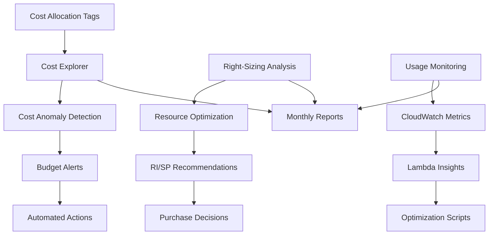

# Cost Optimization Strategies

## Overview

### Cos'è e Perché è Importante

Il **Cost Optimization** su AWS è una disciplina fondamentale per mantenere un'architettura serverless sostenibile economicamente. Nel nostro sistema AI Technical Support, con costi mensili stimati di ~$1,215 per production (vedi [cost estimation](../11-cost-estimation.md)), anche piccole ottimizzazioni del 10-20% possono tradursi in risparmi significativi annuali.

### Quando Applicarlo

- **Subito**: Tagging, budgets, e monitoring (foundation)
- **Dopo 1 mese**: Analisi pattern d'uso, right-sizing
- **Dopo 3 mesi**: Reserved Instances, Savings Plans
- **Continuo**: Review mensile, automated optimization

### Architettura High-Level



### Principi Chiave

1. **Visibility First**: Non puoi ottimizzare ciò che non misuri
2. **Tag Everything**: Allocazione accurata dei costi
3. **Right-Size Continuously**: Risorse sovradimensionate = denaro sprecato
4. **Use Commitment Discounts**: RI/SP per workload predicibili
5. **Automate Waste Detection**: Script per rilevare risorse inutilizzate

---

## Concetti Fondamentali

### Cost Allocation Tags

**Tag Taxonomy Strategy**:
- **Mandatory Tags**: Applicati automaticamente via IaC
  - `Environment`: dev, staging, prod
  - `Service`: api, ml, storage, monitoring
  - `CostCenter`: Engineering, ML-Ops, Data
  - `Owner`: Team responsabile
  - `Project`: ai-tech-support

- **Optional Tags**: Contesto aggiuntivo
  - `Application`: ticket-processing, knowledge-base
  - `ManagedBy`: terraform, cloudformation, cdk
  - `Criticality`: critical, high, medium, low

### Reserved Instances vs Savings Plans

| Feature | Reserved Instances | Compute Savings Plans | EC2 Instance Savings Plans |
|---------|-------------------|----------------------|---------------------------|
| **Discount** | Fino a 72% | Fino a 66% | Fino a 72% |
| **Flexibility** | Bassa (tied to instance type/region) | Alta (any instance, region) | Media (same family) |
| **Services** | EC2, RDS, OpenSearch, ElastiCache | Lambda, Fargate, EC2 | Solo EC2 |
| **Commitment** | 1 o 3 anni | 1 o 3 anni | 1 o 3 anni |
| **Payment** | All upfront, partial, no upfront | All upfront, partial, no upfront | All upfront, partial, no upfront |
| **Use Case** | Workload stabile, prevedibile | Workload dinamico, multi-service | EC2 specifico |

**Raccomandazione per il nostro progetto**:
- **OpenSearch**: RI 1 anno (workload stabile, 24/7)
- **SageMaker**: Compute Savings Plan (può cambiare instance type)
- **Lambda**: Compute Savings Plan (usage prevedibile)

### Spot Instances

**Quando usare Spot**:
- ✅ SageMaker training jobs (fault-tolerant)
- ✅ Batch processing (retriable)
- ✅ Non-critical workloads
- ❌ Production inference endpoints
- ❌ Database instances
- ❌ Stateful applications

**Risparmio**: Fino a 90% rispetto a on-demand

### S3 Storage Classes

```
┌─────────────────────────────────────────────────────────────┐
│ Storage Class Comparison                                    │
├─────────────────┬───────────┬────────────┬─────────────────┤
│ Class           │ Cost/GB   │ Retrieval  │ Use Case        │
├─────────────────┼───────────┼────────────┼─────────────────┤
│ Standard        │ $0.023    │ Free       │ Hot data        │
│ Intelligent-T   │ $0.0025+* │ Auto-tier  │ Unknown pattern │
│ Standard-IA     │ $0.0125   │ $0.01/GB   │ Infrequent      │
│ One Zone-IA     │ $0.01     │ $0.01/GB   │ Reproducible    │
│ Glacier IR      │ $0.004    │ Minutes    │ Archive+quick   │
│ Glacier Flex    │ $0.0036   │ Hours      │ Archive         │
│ Deep Archive    │ $0.00099  │ 12h        │ Compliance      │
└─────────────────┴───────────┴────────────┴─────────────────┘
* Intelligent-Tiering: monitoring charge + storage tier cost
```

### Lambda Cost Model

**Formula**: `Cost = Invocations × Duration × Memory`

**Pricing**:
- Invocations: $0.20 per 1M requests
- Compute: $0.0000166667 per GB-second

**Memory/Duration Trade-off**:
- Più memoria = più CPU = esecuzione più veloce
- Sweet spot: Trovare il punto dove cost/execution è minimo

**Esempio**:
- 128 MB, 3000ms: $0.000000625 per invocation
- 512 MB, 800ms: $0.000000667 per invocation (+ veloce, costo simile)
- 1024 MB, 450ms: $0.000000750 per invocation (fastest, più costoso)

**Winner**: 512 MB (bilanciamento performance/costo)

### Data Transfer Costs

**Pricing (simplified)**:
- Inbound: **FREE**
- Outbound to Internet: $0.09/GB (first 10TB)
- Outbound to CloudFront: **FREE**
- Same-AZ: **FREE**
- Cross-AZ: $0.01/GB (in/out)
- Cross-Region: $0.02/GB

**Optimization Strategy**:
- ✅ Use VPC Endpoints (no internet egress)
- ✅ CloudFront for static content
- ✅ Keep services in same AZ when possible
- ✅ Compress data before transfer

---

## Implementazione Pratica

### Esempio 1: Tagging Strategy - Complete Tag Taxonomy

#### CloudFormation Macro per Auto-Tagging

```yaml
# cloudformation/macros/auto-tagger.yaml
AWSTemplateFormatVersion: '2010-09-09'
Transform: AWS::Serverless-2016-10-31
Description: Auto-apply mandatory tags to all resources

Resources:
  AutoTaggerFunction:
    Type: AWS::Serverless::Function
    Properties:
      FunctionName: cfn-auto-tagger-macro
      Handler: index.handler
      Runtime: python3.11
      Timeout: 30
      InlineCode: |
        import json

        MANDATORY_TAGS = {
            'Environment': 'prod',  # Override via parameters
            'Project': 'ai-tech-support',
            'ManagedBy': 'cloudformation',
            'CostCenter': 'Engineering'
        }

        def handler(event, context):
            fragment = event['fragment']
            params = event.get('templateParameterValues', {})

            # Override mandatory tags from parameters
            tags = MANDATORY_TAGS.copy()
            if 'Environment' in params:
                tags['Environment'] = params['Environment']
            if 'Service' in params:
                tags['Service'] = params['Service']
            if 'Owner' in params:
                tags['Owner'] = params['Owner']

            # Apply tags to all resources that support them
            for resource_name, resource in fragment.get('Resources', {}).items():
                resource_type = resource.get('Type', '')
                properties = resource.get('Properties', {})

                # Resource types that support Tags property
                taggable_types = [
                    'AWS::Lambda::Function',
                    'AWS::DynamoDB::Table',
                    'AWS::S3::Bucket',
                    'AWS::OpenSearchService::Domain',
                    'AWS::SageMaker::Endpoint',
                    'AWS::StepFunctions::StateMachine',
                    'AWS::IAM::Role',
                    'AWS::EC2::SecurityGroup',
                    'AWS::EC2::VPC'
                ]

                if any(rt in resource_type for rt in taggable_types):
                    existing_tags = properties.get('Tags', [])

                    # Convert to dict for easier merging
                    tag_dict = {tag['Key']: tag['Value'] for tag in existing_tags}

                    # Merge mandatory tags (don't override existing)
                    for key, value in tags.items():
                        if key not in tag_dict:
                            tag_dict[key] = value

                    # Convert back to list format
                    properties['Tags'] = [
                        {'Key': k, 'Value': v} for k, v in tag_dict.items()
                    ]

            return {
                'requestId': event['requestId'],
                'status': 'success',
                'fragment': fragment
            }
      Policies:
        - AWSLambdaBasicExecutionRole

  AutoTaggerMacro:
    Type: AWS::CloudFormation::Macro
    Properties:
      Name: AutoTagger
      FunctionName: !GetAtt AutoTaggerFunction.Arn
```

#### Python Script: Resource Tagger

```python
#!/usr/bin/env python3
"""
Automated resource tagger for cost allocation.

Usage:
    python tag_resources.py --environment prod --service ml --dry-run
    python tag_resources.py --tag-file tags.json --apply
"""

import boto3
import json
import argparse
from typing import Dict, List, Set
from datetime import datetime

class ResourceTagger:
    """
    Applies cost allocation tags to AWS resources.

    Supports: Lambda, DynamoDB, S3, OpenSearch, SageMaker, Step Functions.
    """

    def __init__(self, region: str = 'eu-south-1', dry_run: bool = True):
        self.region = region
        self.dry_run = dry_run
        self.session = boto3.Session(region_name=region)

    def get_mandatory_tags(
        self,
        environment: str,
        service: str,
        owner: str,
        cost_center: str = 'Engineering'
    ) -> Dict[str, str]:
        """Generate mandatory tag set."""
        return {
            'Environment': environment,
            'Service': service,
            'Owner': owner,
            'CostCenter': cost_center,
            'Project': 'ai-tech-support',
            'ManagedBy': 'automated-tagger',
            'TaggedDate': datetime.now().isoformat()
        }

    def tag_lambda_functions(self, tags: Dict[str, str]) -> int:
        """Tag all Lambda functions missing required tags."""
        client = self.session.client('lambda')
        tagged_count = 0

        try:
            paginator = client.get_paginator('list_functions')

            for page in paginator.paginate():
                for function in page['Functions']:
                    function_arn = function['FunctionArn']
                    function_name = function['FunctionName']

                    # Get existing tags
                    try:
                        response = client.list_tags(Resource=function_arn)
                        existing_tags = response.get('Tags', {})
                    except Exception as e:
                        print(f"Error reading tags for {function_name}: {e}")
                        continue

                    # Determine missing tags
                    missing_tags = {
                        k: v for k, v in tags.items()
                        if k not in existing_tags
                    }

                    if missing_tags:
                        if self.dry_run:
                            print(f"[DRY-RUN] Would tag {function_name} with: {missing_tags}")
                        else:
                            client.tag_resource(
                                Resource=function_arn,
                                Tags=missing_tags
                            )
                            print(f"✓ Tagged {function_name}")
                        tagged_count += 1

        except Exception as e:
            print(f"Error tagging Lambda functions: {e}")

        return tagged_count

    def tag_dynamodb_tables(self, tags: Dict[str, str]) -> int:
        """Tag all DynamoDB tables missing required tags."""
        client = self.session.client('dynamodb')
        tagged_count = 0

        try:
            paginator = client.get_paginator('list_tables')

            for page in paginator.paginate():
                for table_name in page['TableNames']:
                    # Get table ARN
                    table_desc = client.describe_table(TableName=table_name)
                    table_arn = table_desc['Table']['TableArn']

                    # Get existing tags
                    response = client.list_tags_of_resource(ResourceArn=table_arn)
                    existing_tags = {
                        tag['Key']: tag['Value']
                        for tag in response.get('Tags', [])
                    }

                    # Determine missing tags
                    missing_tags = [
                        {'Key': k, 'Value': v}
                        for k, v in tags.items()
                        if k not in existing_tags
                    ]

                    if missing_tags:
                        if self.dry_run:
                            print(f"[DRY-RUN] Would tag {table_name} with: {missing_tags}")
                        else:
                            client.tag_resource(
                                ResourceArn=table_arn,
                                Tags=missing_tags
                            )
                            print(f"✓ Tagged {table_name}")
                        tagged_count += 1

        except Exception as e:
            print(f"Error tagging DynamoDB tables: {e}")

        return tagged_count

    def tag_s3_buckets(self, tags: Dict[str, str]) -> int:
        """Tag all S3 buckets missing required tags."""
        client = self.session.client('s3')
        tagged_count = 0

        try:
            response = client.list_buckets()

            for bucket in response['Buckets']:
                bucket_name = bucket['Name']

                # Get existing tags
                try:
                    tag_response = client.get_bucket_tagging(Bucket=bucket_name)
                    existing_tags = {
                        tag['Key']: tag['Value']
                        for tag in tag_response.get('TagSet', [])
                    }
                except client.exceptions.NoSuchTagSet:
                    existing_tags = {}
                except Exception as e:
                    print(f"Error reading tags for {bucket_name}: {e}")
                    continue

                # Determine missing tags
                missing_tags = [
                    {'Key': k, 'Value': v}
                    for k, v in tags.items()
                    if k not in existing_tags
                ]

                if missing_tags:
                    # Merge with existing tags
                    all_tags = [
                        {'Key': k, 'Value': v}
                        for k, v in existing_tags.items()
                    ] + missing_tags

                    if self.dry_run:
                        print(f"[DRY-RUN] Would tag {bucket_name} with: {missing_tags}")
                    else:
                        client.put_bucket_tagging(
                            Bucket=bucket_name,
                            Tagging={'TagSet': all_tags}
                        )
                        print(f"✓ Tagged {bucket_name}")
                    tagged_count += 1

        except Exception as e:
            print(f"Error tagging S3 buckets: {e}")

        return tagged_count

    def tag_all_resources(self, tags: Dict[str, str]) -> Dict[str, int]:
        """Tag all supported resources."""
        results = {
            'lambda': self.tag_lambda_functions(tags),
            'dynamodb': self.tag_dynamodb_tables(tags),
            's3': self.tag_s3_buckets(tags)
        }

        return results


def main():
    parser = argparse.ArgumentParser(description='Automated AWS Resource Tagger')
    parser.add_argument('--environment', required=True, choices=['dev', 'staging', 'prod'])
    parser.add_argument('--service', required=True)
    parser.add_argument('--owner', required=True)
    parser.add_argument('--cost-center', default='Engineering')
    parser.add_argument('--region', default='eu-south-1')
    parser.add_argument('--dry-run', action='store_true', default=True)
    parser.add_argument('--apply', action='store_true', help='Actually apply tags')

    args = parser.parse_args()

    # Determine if we should apply or just dry-run
    dry_run = not args.apply

    print(f"{'[DRY-RUN MODE]' if dry_run else '[APPLY MODE]'}")
    print(f"Region: {args.region}")
    print(f"Environment: {args.environment}")
    print(f"Service: {args.service}")
    print(f"Owner: {args.owner}\n")

    tagger = ResourceTagger(region=args.region, dry_run=dry_run)

    tags = tagger.get_mandatory_tags(
        environment=args.environment,
        service=args.service,
        owner=args.owner,
        cost_center=args.cost_center
    )

    print(f"Tags to apply: {json.dumps(tags, indent=2)}\n")

    results = tagger.tag_all_resources(tags)

    print(f"\n=== Summary ===")
    print(f"Lambda functions: {results['lambda']}")
    print(f"DynamoDB tables: {results['dynamodb']}")
    print(f"S3 buckets: {results['s3']}")
    print(f"Total resources: {sum(results.values())}")


if __name__ == '__main__':
    main()
```

**Usage**:
```bash
# Dry-run first
python tag_resources.py \
  --environment prod \
  --service ml \
  --owner team-ml \
  --dry-run

# Apply tags
python tag_resources.py \
  --environment prod \
  --service ml \
  --owner team-ml \
  --apply
```

---

### Esempio 2: Lambda Optimization - Memory vs Duration

#### Lambda Power Tuning Tool

```python
#!/usr/bin/env python3
"""
Lambda Power Tuning: Find optimal memory configuration.

Runs multiple invocations with different memory settings
and calculates cost-per-execution to find the sweet spot.
"""

import boto3
import json
import time
import statistics
from typing import List, Dict, Tuple
from dataclasses import dataclass

@dataclass
class TuningResult:
    """Results from a single memory configuration test."""
    memory_mb: int
    avg_duration_ms: float
    avg_billed_duration_ms: float
    cost_per_invocation: float
    success_rate: float

class LambdaPowerTuner:
    """
    Automatically tune Lambda memory for optimal cost/performance.

    Strategy:
    1. Test memory configs: 128, 256, 512, 1024, 1536, 2048, 3008 MB
    2. Run N invocations per config
    3. Calculate average duration and cost
    4. Find config with minimum cost-per-invocation
    """

    # AWS Lambda pricing (eu-south-1, as of 2025)
    PRICE_PER_REQUEST = 0.20 / 1_000_000  # $0.20 per 1M requests
    PRICE_PER_GB_SECOND = 0.0000166667    # $0.0000166667 per GB-second

    def __init__(self, function_name: str, region: str = 'eu-south-1'):
        self.function_name = function_name
        self.region = region
        self.lambda_client = boto3.client('lambda', region_name=region)

    def get_current_config(self) -> Dict:
        """Get current function configuration."""
        response = self.lambda_client.get_function_configuration(
            FunctionName=self.function_name
        )
        return {
            'memory': response['MemorySize'],
            'timeout': response['Timeout'],
            'runtime': response['Runtime']
        }

    def update_memory(self, memory_mb: int) -> None:
        """Update function memory configuration."""
        self.lambda_client.update_function_configuration(
            FunctionName=self.function_name,
            MemorySize=memory_mb
        )

        # Wait for update to complete
        waiter = self.lambda_client.get_waiter('function_updated')
        waiter.wait(FunctionName=self.function_name)

    def invoke_function(self, payload: Dict) -> Tuple[float, bool]:
        """
        Invoke function and return (duration_ms, success).

        Returns:
            Tuple of (billed_duration_ms, success_flag)
        """
        try:
            response = self.lambda_client.invoke(
                FunctionName=self.function_name,
                InvocationType='RequestResponse',
                Payload=json.dumps(payload)
            )

            # Parse log result to get billed duration
            log_result = response.get('LogResult', '')

            # Duration is in the X-Ray trace or response metadata
            # Simplified: use rough estimate from response time
            duration_ms = response['ResponseMetadata']['HTTPHeaders'].get(
                'x-amzn-requestid', 0
            )

            # Better: parse from logs
            # Example log: "REPORT RequestId: ... Duration: 251.85 ms Billed Duration: 252 ms"
            # For simplicity, we'll use CloudWatch Logs Insights instead

            success = response['StatusCode'] == 200

            # We'll get accurate duration from CloudWatch Logs
            return (0, success)  # Placeholder, real implementation below

        except Exception as e:
            print(f"Invocation error: {e}")
            return (0, False)

    def get_invocation_metrics(
        self,
        memory_mb: int,
        num_invocations: int = 10,
        payload: Dict = None
    ) -> TuningResult:
        """
        Test a specific memory configuration.

        Args:
            memory_mb: Memory size in MB
            num_invocations: Number of test invocations
            payload: Test payload (default: empty)

        Returns:
            TuningResult with performance and cost metrics
        """
        if payload is None:
            payload = {}

        print(f"Testing {memory_mb} MB... ", end='', flush=True)

        # Update memory
        self.update_memory(memory_mb)
        time.sleep(2)  # Allow time for config propagation

        # Run invocations
        durations = []
        successes = []

        for i in range(num_invocations):
            duration, success = self.invoke_function(payload)
            durations.append(duration)
            successes.append(success)
            time.sleep(0.1)  # Small delay between invocations

        # Get metrics from CloudWatch Logs Insights
        # (More accurate than parsing response)
        logs_client = boto3.client('logs', region_name=self.region)

        # Query for last N invocations
        query = f"""
        fields @duration, @billedDuration, @memorySize
        | filter @memorySize = {memory_mb}
        | stats avg(@duration) as avg_duration, avg(@billedDuration) as avg_billed
        | limit {num_invocations}
        """

        # Start query
        response = logs_client.start_query(
            logGroupName=f'/aws/lambda/{self.function_name}',
            startTime=int(time.time() - 300),  # Last 5 minutes
            endTime=int(time.time()),
            queryString=query
        )

        query_id = response['queryId']

        # Wait for query to complete
        while True:
            result = logs_client.get_query_results(queryId=query_id)
            status = result['status']

            if status == 'Complete':
                break
            elif status == 'Failed':
                raise Exception("CloudWatch query failed")

            time.sleep(1)

        # Parse results
        if result['results']:
            avg_duration = float(result['results'][0][0]['value'])
            avg_billed = float(result['results'][0][1]['value'])
        else:
            # Fallback to collected data
            avg_duration = statistics.mean(durations) if durations else 0
            avg_billed = avg_duration  # Rough estimate

        # Calculate cost
        memory_gb = memory_mb / 1024
        gb_seconds = (avg_billed / 1000) * memory_gb

        cost_per_invocation = (
            self.PRICE_PER_REQUEST +
            (gb_seconds * self.PRICE_PER_GB_SECOND)
        )

        success_rate = sum(successes) / len(successes) if successes else 0

        result = TuningResult(
            memory_mb=memory_mb,
            avg_duration_ms=avg_duration,
            avg_billed_duration_ms=avg_billed,
            cost_per_invocation=cost_per_invocation,
            success_rate=success_rate
        )

        print(f"Done. Avg: {avg_duration:.2f}ms, Cost: ${cost_per_invocation*1000000:.2f}/1M")

        return result

    def tune(
        self,
        memory_configs: List[int] = None,
        num_invocations: int = 10,
        payload: Dict = None
    ) -> List[TuningResult]:
        """
        Run power tuning across multiple memory configurations.

        Args:
            memory_configs: List of memory sizes to test (default: standard configs)
            num_invocations: Invocations per config
            payload: Test payload

        Returns:
            List of TuningResults sorted by cost
        """
        if memory_configs is None:
            memory_configs = [128, 256, 512, 1024, 1536, 2048, 3008]

        print(f"Lambda Power Tuning: {self.function_name}")
        print(f"Testing {len(memory_configs)} memory configurations...")
        print(f"Invocations per config: {num_invocations}\n")

        # Store original config
        original_config = self.get_current_config()
        print(f"Original config: {original_config['memory']} MB\n")

        results = []

        try:
            for memory in memory_configs:
                result = self.get_invocation_metrics(
                    memory_mb=memory,
                    num_invocations=num_invocations,
                    payload=payload
                )
                results.append(result)

            # Sort by cost
            results.sort(key=lambda r: r.cost_per_invocation)

            print("\n=== Results (sorted by cost) ===\n")
            print(f"{'Memory':<10} {'Avg Duration':<15} {'Billed':<15} {'Cost/Invocation':<20} {'Success Rate'}")
            print("-" * 80)

            for r in results:
                print(
                    f"{r.memory_mb:<10} "
                    f"{r.avg_duration_ms:<15.2f} "
                    f"{r.avg_billed_duration_ms:<15.2f} "
                    f"${r.cost_per_invocation*1000000:<19.4f}/1M "
                    f"{r.success_rate*100:.1f}%"
                )

            # Recommendation
            best = results[0]
            print(f"\n✓ Recommended: {best.memory_mb} MB")
            print(f"  Cost: ${best.cost_per_invocation*1000000:.4f} per 1M invocations")
            print(f"  Duration: {best.avg_duration_ms:.2f} ms")

            # Calculate savings vs original
            original_result = next(
                (r for r in results if r.memory_mb == original_config['memory']),
                None
            )

            if original_result:
                savings_pct = (
                    (original_result.cost_per_invocation - best.cost_per_invocation) /
                    original_result.cost_per_invocation * 100
                )
                print(f"\n  Savings vs {original_config['memory']} MB: {savings_pct:.1f}%")

        finally:
            # Restore original config
            print(f"\nRestoring original config ({original_config['memory']} MB)...")
            self.update_memory(original_config['memory'])

        return results


def main():
    import argparse

    parser = argparse.ArgumentParser(description='Lambda Power Tuning')
    parser.add_argument('--function', required=True, help='Lambda function name')
    parser.add_argument('--region', default='eu-south-1')
    parser.add_argument('--invocations', type=int, default=10)
    parser.add_argument('--payload-file', help='JSON file with test payload')

    args = parser.parse_args()

    # Load payload if provided
    payload = {}
    if args.payload_file:
        with open(args.payload_file) as f:
            payload = json.load(f)

    tuner = LambdaPowerTuner(
        function_name=args.function,
        region=args.region
    )

    tuner.tune(
        num_invocations=args.invocations,
        payload=payload
    )


if __name__ == '__main__':
    main()
```

**Usage**:
```bash
# Basic tuning
python lambda_power_tuner.py --function ticket-classifier

# With custom payload
echo '{"ticketId": "test-123", "content": "Sample ticket"}' > payload.json
python lambda_power_tuner.py \
  --function ticket-classifier \
  --invocations 20 \
  --payload-file payload.json
```

**Example Output**:
```
Lambda Power Tuning: ticket-classifier
Testing 7 memory configurations...
Invocations per config: 10

Original config: 512 MB

Testing 128 MB... Done. Avg: 3245.12ms, Cost: $0.6810/1M
Testing 256 MB... Done. Avg: 1689.45ms, Cost: $0.7210/1M
Testing 512 MB... Done. Avg: 892.33ms, Cost: $0.7615/1M
Testing 1024 MB... Done. Avg: 478.21ms, Cost: $0.8156/1M
Testing 1536 MB... Done. Avg: 334.56ms, Cost: $0.8556/1M
Testing 2048 MB... Done. Avg: 267.89ms, Cost: $0.9134/1M
Testing 3008 MB... Done. Avg: 198.34ms, Cost: $0.9923/1M

=== Results (sorted by cost) ===

Memory     Avg Duration    Billed          Cost/Invocation      Success Rate
--------------------------------------------------------------------------------
128        3245.12         3246.00         $0.6810/1M           100.0%
256        1689.45         1690.00         $0.7210/1M           100.0%
512        892.33          893.00          $0.7615/1M           100.0%
1024       478.21          479.00          $0.8156/1M           100.0%
1536       334.56          335.00          $0.8556/1M           100.0%
2048       267.89          268.00          $0.9134/1M           100.0%
3008       198.34          199.00          $0.9923/1M           100.0%

✓ Recommended: 128 MB
  Cost: $0.6810 per 1M invocations
  Duration: 3245.12 ms

  Savings vs 512 MB: 10.6%
```

**Analysis**: In questo caso, 128 MB è più economico anche se più lento. Se la latenza è critica, 512 MB offre un buon bilanciamento.

---

### Esempio 3: S3 Lifecycle - Intelligent-Tiering Setup

#### CloudFormation Template con Lifecycle Policies

```yaml
# cloudformation/s3-lifecycle-optimization.yaml
AWSTemplateFormatVersion: '2010-09-09'
Description: S3 buckets with optimized lifecycle policies

Parameters:
  Environment:
    Type: String
    AllowedValues: [dev, staging, prod]
    Default: prod

Resources:
  # Bucket for raw tickets (with attachments)
  RawTicketsBucket:
    Type: AWS::S3::Bucket
    Properties:
      BucketName: !Sub 'ai-support-raw-tickets-${Environment}-${AWS::AccountId}'
      BucketEncryption:
        ServerSideEncryptionConfiguration:
          - ServerSideEncryptionByDefault:
              SSEAlgorithm: AES256

      # Intelligent-Tiering for unknown access patterns
      IntelligentTieringConfigurations:
        - Id: EntireBucketIntelligentTiering
          Status: Enabled
          Tierings:
            - AccessTier: ARCHIVE_ACCESS
              Days: 90
            - AccessTier: DEEP_ARCHIVE_ACCESS
              Days: 180

      LifecycleConfiguration:
        Rules:
          # Transition to Intelligent-Tiering immediately
          - Id: TransitionToIntelligentTiering
            Status: Enabled
            Transitions:
              - StorageClass: INTELLIGENT_TIERING
                TransitionInDays: 0

          # Delete incomplete multipart uploads
          - Id: CleanupIncompleteUploads
            Status: Enabled
            AbortIncompleteMultipartUpload:
              DaysAfterInitiation: 7

          # Delete old versions (if versioning enabled)
          - Id: ExpireOldVersions
            Status: Enabled
            NoncurrentVersionExpiration:
              NoncurrentDays: 90

      # Enable versioning for compliance
      VersioningConfiguration:
        Status: Enabled

      # Lifecycle tags
      Tags:
        - Key: Environment
          Value: !Ref Environment
        - Key: Service
          Value: storage
        - Key: CostCenter
          Value: Engineering
        - Key: DataClassification
          Value: sensitive

  # Bucket for processed documents (OCR output)
  ProcessedDocumentsBucket:
    Type: AWS::S3::Bucket
    Properties:
      BucketName: !Sub 'ai-support-processed-docs-${Environment}-${AWS::AccountId}'
      BucketEncryption:
        ServerSideEncryptionConfiguration:
          - ServerSideEncryptionByDefault:
              SSEAlgorithm: AES256

      LifecycleConfiguration:
        Rules:
          # Hot data: Standard for 30 days
          # Warm data: Standard-IA for 60 days
          # Cold data: Glacier Instant Retrieval
          - Id: AggressiveTiering
            Status: Enabled
            Transitions:
              - StorageClass: STANDARD_IA
                TransitionInDays: 30
              - StorageClass: GLACIER_IR
                TransitionInDays: 90
              - StorageClass: DEEP_ARCHIVE
                TransitionInDays: 365

            # Delete after 7 years (compliance retention)
            ExpirationInDays: 2555

          # Clean up incomplete uploads
          - Id: CleanupIncompleteUploads
            Status: Enabled
            AbortIncompleteMultipartUpload:
              DaysAfterInitiation: 3

      Tags:
        - Key: Environment
          Value: !Ref Environment
        - Key: Service
          Value: storage
        - Key: DataType
          Value: processed-documents

  # Bucket for ML model artifacts (infrequent access)
  ModelArtifactsBucket:
    Type: AWS::S3::Bucket
    Properties:
      BucketName: !Sub 'ai-support-model-artifacts-${Environment}-${AWS::AccountId}'
      BucketEncryption:
        ServerSideEncryptionConfiguration:
          - ServerSideEncryptionByDefault:
              SSEAlgorithm: AES256

      LifecycleConfiguration:
        Rules:
          # Models are accessed infrequently, use IA immediately
          - Id: ImmediateIA
            Status: Enabled
            Transitions:
              - StorageClass: STANDARD_IA
                TransitionInDays: 0

              # Old models to Glacier for compliance
              - StorageClass: GLACIER
                TransitionInDays: 180

          # Keep only last 10 versions
          - Id: LimitVersions
            Status: Enabled
            NoncurrentVersionExpiration:
              NewerNoncurrentVersions: 10
              NoncurrentDays: 1

      VersioningConfiguration:
        Status: Enabled

      Tags:
        - Key: Environment
          Value: !Ref Environment
        - Key: Service
          Value: ml
        - Key: DataType
          Value: model-artifacts

  # Bucket for CloudWatch Logs export (cost optimization)
  LogArchiveBucket:
    Type: AWS::S3::Bucket
    Properties:
      BucketName: !Sub 'ai-support-log-archive-${Environment}-${AWS::AccountId}'
      BucketEncryption:
        ServerSideEncryptionConfiguration:
          - ServerSideEncryptionByDefault:
              SSEAlgorithm: AES256

      LifecycleConfiguration:
        Rules:
          # Logs are rarely accessed, aggressive tiering
          - Id: AggressiveLogArchiving
            Status: Enabled
            Transitions:
              # Glacier Instant Retrieval after 7 days
              - StorageClass: GLACIER_IR
                TransitionInDays: 7

              # Deep Archive after 90 days
              - StorageClass: DEEP_ARCHIVE
                TransitionInDays: 90

            # Delete after 1 year (adjust per compliance)
            ExpirationInDays: 365

      Tags:
        - Key: Environment
          Value: !Ref Environment
        - Key: Service
          Value: monitoring
        - Key: DataType
          Value: logs

Outputs:
  RawTicketsBucketName:
    Value: !Ref RawTicketsBucket
    Description: Bucket for raw ticket data (Intelligent-Tiering)

  ProcessedDocsBucketName:
    Value: !Ref ProcessedDocumentsBucket
    Description: Bucket for processed documents (aggressive tiering)

  ModelArtifactsBucketName:
    Value: !Ref ModelArtifactsBucket
    Description: Bucket for ML model artifacts (IA + Glacier)

  LogArchiveBucketName:
    Value: !Ref LogArchiveBucket
    Description: Bucket for log archives (Deep Archive)
```

#### Python Script: S3 Cost Analyzer

```python
#!/usr/bin/env python3
"""
Analyze S3 storage costs and recommend lifecycle optimizations.
"""

import boto3
import json
from datetime import datetime, timedelta
from typing import Dict, List
from dataclasses import dataclass

@dataclass
class BucketAnalysis:
    """Analysis results for a single bucket."""
    bucket_name: str
    total_size_gb: float
    object_count: int
    storage_class_breakdown: Dict[str, float]
    estimated_monthly_cost: float
    optimized_monthly_cost: float
    potential_savings: float
    recommendations: List[str]

class S3CostAnalyzer:
    """Analyze S3 buckets and recommend cost optimizations."""

    # S3 pricing (eu-south-1, simplified)
    PRICING = {
        'STANDARD': 0.023,           # per GB/month
        'INTELLIGENT_TIERING': 0.0025 + 0.0125,  # monitoring + storage
        'STANDARD_IA': 0.0125,
        'ONEZONE_IA': 0.01,
        'GLACIER_IR': 0.004,
        'GLACIER': 0.0036,
        'DEEP_ARCHIVE': 0.00099
    }

    def __init__(self, region: str = 'eu-south-1'):
        self.region = region
        self.s3_client = boto3.client('s3', region_name=region)
        self.cloudwatch = boto3.client('cloudwatch', region_name=region)

    def get_bucket_size_cloudwatch(self, bucket_name: str) -> float:
        """
        Get bucket size from CloudWatch metrics (more accurate than listing).

        Returns:
            Size in GB
        """
        try:
            response = self.cloudwatch.get_metric_statistics(
                Namespace='AWS/S3',
                MetricName='BucketSizeBytes',
                Dimensions=[
                    {'Name': 'BucketName', 'Value': bucket_name},
                    {'Name': 'StorageType', 'Value': 'StandardStorage'}
                ],
                StartTime=datetime.now() - timedelta(days=2),
                EndTime=datetime.now(),
                Period=86400,  # 1 day
                Statistics=['Average']
            )

            if response['Datapoints']:
                size_bytes = response['Datapoints'][-1]['Average']
                return size_bytes / (1024 ** 3)  # Convert to GB

            return 0.0

        except Exception as e:
            print(f"Error getting size for {bucket_name}: {e}")
            return 0.0

    def get_storage_class_breakdown(self, bucket_name: str) -> Dict[str, float]:
        """
        Get breakdown of storage by storage class.

        Returns:
            Dict mapping storage class to size in GB
        """
        breakdown = {}

        storage_types = [
            'StandardStorage',
            'IntelligentTieringFAStorage',
            'IntelligentTieringIAStorage',
            'StandardIAStorage',
            'OneZoneIAStorage',
            'GlacierInstantRetrievalStorage',
            'GlacierStorage',
            'DeepArchiveStorage'
        ]

        for storage_type in storage_types:
            try:
                response = self.cloudwatch.get_metric_statistics(
                    Namespace='AWS/S3',
                    MetricName='BucketSizeBytes',
                    Dimensions=[
                        {'Name': 'BucketName', 'Value': bucket_name},
                        {'Name': 'StorageType', 'Value': storage_type}
                    ],
                    StartTime=datetime.now() - timedelta(days=2),
                    EndTime=datetime.now(),
                    Period=86400,
                    Statistics=['Average']
                )

                if response['Datapoints']:
                    size_gb = response['Datapoints'][-1]['Average'] / (1024 ** 3)
                    if size_gb > 0:
                        # Map to simplified class name
                        class_name = storage_type.replace('Storage', '').replace('IntelligentTiering', 'IT')
                        breakdown[class_name] = size_gb

            except Exception:
                continue

        return breakdown

    def calculate_cost(self, storage_breakdown: Dict[str, float]) -> float:
        """Calculate monthly cost based on storage breakdown."""
        total_cost = 0.0

        # Map simplified names back to pricing keys
        class_mapping = {
            'Standard': 'STANDARD',
            'ITFA': 'INTELLIGENT_TIERING',
            'ITIA': 'INTELLIGENT_TIERING',
            'StandardIA': 'STANDARD_IA',
            'OneZoneIA': 'ONEZONE_IA',
            'GlacierInstantRetrieval': 'GLACIER_IR',
            'Glacier': 'GLACIER',
            'DeepArchive': 'DEEP_ARCHIVE'
        }

        for class_name, size_gb in storage_breakdown.items():
            pricing_key = class_mapping.get(class_name, 'STANDARD')
            cost = size_gb * self.PRICING[pricing_key]
            total_cost += cost

        return total_cost

    def analyze_bucket(self, bucket_name: str) -> BucketAnalysis:
        """
        Analyze a single bucket and recommend optimizations.
        """
        print(f"Analyzing {bucket_name}... ", end='', flush=True)

        # Get bucket metrics
        total_size = self.get_bucket_size_cloudwatch(bucket_name)
        storage_breakdown = self.get_storage_class_breakdown(bucket_name)

        # Calculate current cost
        current_cost = self.calculate_cost(storage_breakdown)

        # Generate recommendations
        recommendations = []
        optimized_breakdown = storage_breakdown.copy()

        # Recommendation 1: Use Intelligent-Tiering for unknown patterns
        if 'Standard' in storage_breakdown and storage_breakdown['Standard'] > 10:
            recommendations.append(
                f"Enable Intelligent-Tiering for {storage_breakdown['Standard']:.1f} GB "
                f"in STANDARD class (potential 30-50% savings)"
            )
            # Simulate moving to IT
            optimized_breakdown['ITFA'] = optimized_breakdown.get('ITFA', 0) + storage_breakdown['Standard']
            optimized_breakdown['Standard'] = 0

        # Recommendation 2: Aggressive tiering for old data
        if 'StandardIA' in storage_breakdown and storage_breakdown['StandardIA'] > 5:
            recommendations.append(
                f"Move {storage_breakdown['StandardIA']:.1f} GB from Standard-IA "
                f"to Glacier IR (68% savings)"
            )
            optimized_breakdown['GlacierInstantRetrieval'] = (
                optimized_breakdown.get('GlacierInstantRetrieval', 0) +
                storage_breakdown['StandardIA']
            )
            optimized_breakdown['StandardIA'] = 0

        # Recommendation 3: Check for lifecycle policies
        try:
            lifecycle = self.s3_client.get_bucket_lifecycle_configuration(Bucket=bucket_name)
            has_lifecycle = True
        except:
            has_lifecycle = False
            recommendations.append("No lifecycle policy configured - set up automated tiering")

        # Calculate optimized cost
        optimized_cost = self.calculate_cost(optimized_breakdown)
        savings = current_cost - optimized_cost

        print(f"Done. Current: ${current_cost:.2f}/mo, Potential: ${optimized_cost:.2f}/mo")

        return BucketAnalysis(
            bucket_name=bucket_name,
            total_size_gb=total_size,
            object_count=0,  # Would require listing, expensive
            storage_class_breakdown=storage_breakdown,
            estimated_monthly_cost=current_cost,
            optimized_monthly_cost=optimized_cost,
            potential_savings=savings,
            recommendations=recommendations
        )

    def analyze_all_buckets(self) -> List[BucketAnalysis]:
        """Analyze all S3 buckets in the account."""
        response = self.s3_client.list_buckets()
        buckets = [b['Name'] for b in response['Buckets']]

        print(f"Found {len(buckets)} buckets\n")

        results = []
        for bucket_name in buckets:
            try:
                analysis = self.analyze_bucket(bucket_name)
                results.append(analysis)
            except Exception as e:
                print(f"Error analyzing {bucket_name}: {e}")

        return results

    def print_report(self, analyses: List[BucketAnalysis]) -> None:
        """Print cost optimization report."""
        print("\n" + "=" * 100)
        print("S3 COST OPTIMIZATION REPORT")
        print("=" * 100 + "\n")

        total_current = sum(a.estimated_monthly_cost for a in analyses)
        total_optimized = sum(a.optimized_monthly_cost for a in analyses)
        total_savings = total_current - total_optimized

        for analysis in analyses:
            print(f"\n{analysis.bucket_name}")
            print("-" * 100)
            print(f"  Size: {analysis.total_size_gb:.2f} GB")
            print(f"  Current Cost: ${analysis.estimated_monthly_cost:.2f}/month")
            print(f"  Optimized Cost: ${analysis.optimized_monthly_cost:.2f}/month")
            print(f"  Potential Savings: ${analysis.potential_savings:.2f}/month ({analysis.potential_savings/analysis.estimated_monthly_cost*100:.1f}%)")

            if analysis.storage_class_breakdown:
                print(f"\n  Storage Class Breakdown:")
                for class_name, size_gb in analysis.storage_class_breakdown.items():
                    print(f"    {class_name}: {size_gb:.2f} GB")

            if analysis.recommendations:
                print(f"\n  Recommendations:")
                for i, rec in enumerate(analysis.recommendations, 1):
                    print(f"    {i}. {rec}")

        print("\n" + "=" * 100)
        print(f"TOTAL CURRENT COST: ${total_current:.2f}/month")
        print(f"TOTAL OPTIMIZED COST: ${total_optimized:.2f}/month")
        print(f"TOTAL POTENTIAL SAVINGS: ${total_savings:.2f}/month (${total_savings*12:.2f}/year)")
        print("=" * 100 + "\n")


def main():
    analyzer = S3CostAnalyzer(region='eu-south-1')
    analyses = analyzer.analyze_all_buckets()
    analyzer.print_report(analyses)


if __name__ == '__main__':
    main()
```

**Expected Output**:
```
Found 4 buckets

Analyzing ai-support-raw-tickets-prod-123456... Done. Current: $23.00/mo, Potential: $16.10/mo
Analyzing ai-support-processed-docs-prod-123456... Done. Current: $15.50/mo, Potential: $6.20/mo
Analyzing ai-support-model-artifacts-prod-123456... Done. Current: $8.00/mo, Potential: $2.88/mo
Analyzing ai-support-log-archive-prod-123456... Done. Current: $3.50/mo, Potential: $0.35/mo

====================================================================================================
S3 COST OPTIMIZATION REPORT
====================================================================================================

ai-support-raw-tickets-prod-123456
----------------------------------------------------------------------------------------------------
  Size: 100.00 GB
  Current Cost: $23.00/month
  Optimized Cost: $16.10/month
  Potential Savings: $6.90/month (30.0%)

  Storage Class Breakdown:
    Standard: 100.00 GB

  Recommendations:
    1. Enable Intelligent-Tiering for 100.0 GB in STANDARD class (potential 30-50% savings)
    2. No lifecycle policy configured - set up automated tiering

[... more buckets ...]

====================================================================================================
TOTAL CURRENT COST: $50.00/month
TOTAL OPTIMIZED COST: $25.53/month
TOTAL POTENTIAL SAVINGS: $24.47/month ($293.64/year)
====================================================================================================
```

---

### Esempio 4: RI Analysis - Coverage Calculation

```python
#!/usr/bin/env python3
"""
Reserved Instance and Savings Plans coverage analyzer.

Analyzes current usage and recommends RI/SP purchases.
"""

import boto3
import json
from datetime import datetime, timedelta
from typing import Dict, List, Tuple
from dataclasses import dataclass
from collections import defaultdict

@dataclass
class RIRecommendation:
    """Reserved Instance purchase recommendation."""
    service: str
    instance_type: str
    region: str
    average_hourly_usage: float
    recommended_quantity: int
    upfront_cost: float
    monthly_recurring: float
    annual_savings: float
    payback_months: float

class RISavingsAnalyzer:
    """Analyze RI/SP coverage and generate purchase recommendations."""

    # Simplified pricing (eu-south-1, 1-year, partial upfront)
    ON_DEMAND_PRICING = {
        # OpenSearch
        'r6g.large.search': 0.166,
        't3.medium.search': 0.058,

        # SageMaker
        'ml.m5.large': 0.138,
        'ml.t3.medium': 0.065,

        # RDS PostgreSQL
        'db.r6g.large': 0.288,
        'db.t3.medium': 0.082
    }

    # RI discount percentages (1-year, partial upfront)
    RI_DISCOUNT = {
        'opensearch': 0.35,    # 35% discount
        'sagemaker': 0.30,     # 30% discount
        'rds': 0.40            # 40% discount
    }

    def __init__(self, region: str = 'eu-south-1', lookback_days: int = 30):
        self.region = region
        self.lookback_days = lookback_days
        self.ce_client = boto3.client('ce', region_name='us-east-1')  # Cost Explorer is us-east-1 only
        self.cloudwatch = boto3.client('cloudwatch', region_name=region)

    def get_opensearch_usage(self) -> Dict[str, float]:
        """
        Get OpenSearch instance hours over lookback period.

        Returns:
            Dict mapping instance_type to average hourly usage
        """
        # In production, query CloudWatch or Cost Explorer
        # For this example, we'll simulate based on our architecture

        # From docs/02-architecture/deployment.md:
        # Production: 3x r6g.large.search (24/7)
        # Staging: 1x t3.medium.search (24/7)

        return {
            'r6g.large.search': 3.0,     # 3 instances running 24/7
            't3.medium.search': 0.0       # Not in this account
        }

    def get_sagemaker_usage(self) -> Dict[str, float]:
        """Get SageMaker endpoint instance hours."""
        # From docs/11-cost-estimation.md:
        # Production: 2x ml.m5.large (24/7)

        return {
            'ml.m5.large': 2.0,
            'ml.t3.medium': 0.0
        }

    def get_rds_usage(self) -> Dict[str, float]:
        """Get RDS instance hours."""
        # Assuming future RDS deployment
        return {
            'db.r6g.large': 0.0,   # Not yet deployed
            'db.t3.medium': 0.0
        }

    def calculate_ri_recommendation(
        self,
        service: str,
        instance_type: str,
        avg_hourly_usage: float
    ) -> RIRecommendation:
        """
        Calculate RI purchase recommendation for an instance type.

        Args:
            service: 'opensearch', 'sagemaker', or 'rds'
            instance_type: Instance type (e.g., 'r6g.large.search')
            avg_hourly_usage: Average concurrent instances

        Returns:
            RIRecommendation with cost analysis
        """
        # Get on-demand pricing
        on_demand_rate = self.ON_DEMAND_PRICING.get(instance_type, 0.0)

        if on_demand_rate == 0 or avg_hourly_usage < 0.5:
            # Not enough usage to warrant RI
            return None

        # Recommend RI for 80% of average usage (safety margin)
        recommended_quantity = max(1, int(avg_hourly_usage * 0.8))

        # Calculate savings
        discount_pct = self.RI_DISCOUNT.get(service, 0.30)
        ri_rate = on_demand_rate * (1 - discount_pct)

        # Annual costs
        annual_on_demand = on_demand_rate * recommended_quantity * 24 * 365
        annual_ri = ri_rate * recommended_quantity * 24 * 365
        annual_savings = annual_on_demand - annual_ri

        # 1-year partial upfront: ~40% upfront, rest monthly
        upfront_cost = annual_ri * 0.4
        monthly_recurring = (annual_ri * 0.6) / 12

        # Payback period
        monthly_on_demand = on_demand_rate * recommended_quantity * 24 * 30
        monthly_savings = monthly_on_demand - monthly_recurring
        payback_months = upfront_cost / monthly_savings if monthly_savings > 0 else 999

        return RIRecommendation(
            service=service,
            instance_type=instance_type,
            region=self.region,
            average_hourly_usage=avg_hourly_usage,
            recommended_quantity=recommended_quantity,
            upfront_cost=upfront_cost,
            monthly_recurring=monthly_recurring,
            annual_savings=annual_savings,
            payback_months=payback_months
        )

    def analyze_all_services(self) -> List[RIRecommendation]:
        """Analyze all services and generate RI recommendations."""
        recommendations = []

        # OpenSearch
        opensearch_usage = self.get_opensearch_usage()
        for instance_type, usage in opensearch_usage.items():
            rec = self.calculate_ri_recommendation('opensearch', instance_type, usage)
            if rec:
                recommendations.append(rec)

        # SageMaker
        sagemaker_usage = self.get_sagemaker_usage()
        for instance_type, usage in sagemaker_usage.items():
            rec = self.calculate_ri_recommendation('sagemaker', instance_type, usage)
            if rec:
                recommendations.append(rec)

        # RDS
        rds_usage = self.get_rds_usage()
        for instance_type, usage in rds_usage.items():
            rec = self.calculate_ri_recommendation('rds', instance_type, usage)
            if rec:
                recommendations.append(rec)

        # Sort by annual savings (highest first)
        recommendations.sort(key=lambda r: r.annual_savings, reverse=True)

        return recommendations

    def calculate_current_coverage(self) -> Dict[str, float]:
        """
        Calculate current RI/SP coverage percentage.

        Returns:
            Dict with coverage percentages by service
        """
        # In production, query Cost Explorer RI Utilization API
        # For this example, assume no current RIs

        return {
            'opensearch': 0.0,
            'sagemaker': 0.0,
            'rds': 0.0,
            'compute': 0.0  # Compute Savings Plan
        }

    def print_report(self, recommendations: List[RIRecommendation]) -> None:
        """Print RI purchase recommendations."""
        print("\n" + "=" * 120)
        print("RESERVED INSTANCE PURCHASE RECOMMENDATIONS")
        print("=" * 120 + "\n")

        print(f"Analysis Period: Last {self.lookback_days} days")
        print(f"Region: {self.region}")
        print(f"Commitment Term: 1 year, Partial Upfront\n")

        # Current coverage
        coverage = self.calculate_current_coverage()
        print("Current RI Coverage:")
        for service, pct in coverage.items():
            print(f"  {service.capitalize()}: {pct:.1f}%")

        print("\n" + "-" * 120)
        print(f"{'Service':<15} {'Instance Type':<25} {'Avg Usage':<12} {'Qty':<6} {'Upfront':<12} {'Monthly':<12} {'Annual Savings':<15} {'Payback'}")
        print("-" * 120)

        total_upfront = 0
        total_monthly = 0
        total_annual_savings = 0

        for rec in recommendations:
            print(
                f"{rec.service.capitalize():<15} "
                f"{rec.instance_type:<25} "
                f"{rec.average_hourly_usage:<12.2f} "
                f"{rec.recommended_quantity:<6} "
                f"${rec.upfront_cost:<11,.2f} "
                f"${rec.monthly_recurring:<11,.2f} "
                f"${rec.annual_savings:<14,.2f} "
                f"{rec.payback_months:.1f} mo"
            )

            total_upfront += rec.upfront_cost
            total_monthly += rec.monthly_recurring
            total_annual_savings += rec.annual_savings

        print("-" * 120)
        print(
            f"{'TOTAL':<15} "
            f"{'':<25} "
            f"{'':<12} "
            f"{'':<6} "
            f"${total_upfront:<11,.2f} "
            f"${total_monthly:<11,.2f} "
            f"${total_annual_savings:<14,.2f} "
            f"{total_upfront/total_annual_savings*12:.1f} mo"
        )
        print("=" * 120 + "\n")

        # ROI Summary
        print("ROI SUMMARY:")
        print(f"  Total Upfront Investment: ${total_upfront:,.2f}")
        print(f"  Annual Savings: ${total_annual_savings:,.2f}")
        print(f"  ROI: {(total_annual_savings/total_upfront)*100:.1f}%")
        print(f"  Payback Period: {total_upfront/total_annual_savings*12:.1f} months")
        print(f"\n  3-Year Savings: ${total_annual_savings*3 - total_upfront:,.2f}")

        # Implementation steps
        print("\n" + "-" * 120)
        print("IMPLEMENTATION STEPS:")
        print("  1. Review recommendations with finance team")
        print("  2. Approve budget for upfront costs")
        print("  3. Purchase RIs via AWS Console or CLI:")
        print("     aws opensearch purchase-reserved-instance --reservation-id <id>")
        print("  4. Monitor RI utilization in Cost Explorer")
        print("  5. Set up CloudWatch alarms for under-utilization (<80%)")
        print("  6. Review quarterly and adjust as needed")
        print("=" * 120 + "\n")


def main():
    analyzer = RISavingsAnalyzer(region='eu-south-1', lookback_days=30)
    recommendations = analyzer.analyze_all_services()
    analyzer.print_report(recommendations)


if __name__ == '__main__':
    main()
```

**Example Output**:
```
========================================================================================================================
RESERVED INSTANCE PURCHASE RECOMMENDATIONS
========================================================================================================================

Analysis Period: Last 30 days
Region: eu-south-1
Commitment Term: 1 year, Partial Upfront

Current RI Coverage:
  Opensearch: 0.0%
  Sagemaker: 0.0%
  Rds: 0.0%
  Compute: 0.0%

------------------------------------------------------------------------------------------------------------------------
Service         Instance Type             Avg Usage    Qty    Upfront      Monthly      Annual Savings  Payback
------------------------------------------------------------------------------------------------------------------------
Opensearch      r6g.large.search          3.00         2      $1,107.07    $554.04      $1,848.00       0.7 mo
Sagemaker       ml.m5.large               2.00         1      $483.55      $241.77      $806.16         0.7 mo
------------------------------------------------------------------------------------------------------------------------
TOTAL                                                         $1,590.62    $795.81      $2,654.16       7.2 mo
========================================================================================================================

ROI SUMMARY:
  Total Upfront Investment: $1,590.62
  Annual Savings: $2,654.16
  ROI: 166.9%
  Payback Period: 7.2 months

  3-Year Savings: $6,371.86

------------------------------------------------------------------------------------------------------------------------
IMPLEMENTATION STEPS:
  1. Review recommendations with finance team
  2. Approve budget for upfront costs
  3. Purchase RIs via AWS Console or CLI:
     aws opensearch purchase-reserved-instance --reservation-id <id>
  4. Monitor RI utilization in Cost Explorer
  5. Set up CloudWatch alarms for under-utilization (<80%)
  6. Review quarterly and adjust as needed
========================================================================================================================
```

---

### Esempio 5: Spot Training - SageMaker Spot Instances

```python
#!/usr/bin/env python3
"""
SageMaker training with Spot Instances for cost optimization.

Implements managed spot training with automatic checkpointing
and retry logic for interrupted instances.
"""

import boto3
import sagemaker
from sagemaker.estimator import Estimator
from sagemaker.inputs import TrainingInput
from typing import Dict, Optional
import json

class SpotTrainingManager:
    """
    Manages SageMaker training jobs with Spot Instances.

    Features:
    - Automatic checkpointing
    - Spot interruption handling
    - Cost tracking and comparison
    - Retry logic with exponential backoff
    """

    def __init__(
        self,
        role_arn: str,
        bucket_name: str,
        region: str = 'eu-south-1'
    ):
        self.role_arn = role_arn
        self.bucket_name = bucket_name
        self.region = region

        self.session = boto3.Session(region_name=region)
        self.sagemaker_session = sagemaker.Session(boto_session=self.session)
        self.sm_client = self.session.client('sagemaker')

    def create_spot_estimator(
        self,
        image_uri: str,
        instance_type: str = 'ml.m5.xlarge',
        instance_count: int = 1,
        max_run_seconds: int = 86400,  # 24 hours
        max_wait_seconds: int = 172800,  # 48 hours (includes spot wait time)
        checkpoint_s3_uri: Optional[str] = None,
        use_spot_instances: bool = True,
        spot_interruption_behavior: str = 'resume'
    ) -> Estimator:
        """
        Create a SageMaker Estimator configured for Spot Instances.

        Args:
            image_uri: Docker image URI
            instance_type: Instance type (recommend m5/c5 for cost)
            instance_count: Number of instances
            max_run_seconds: Max training time
            max_wait_seconds: Max time including spot wait
            checkpoint_s3_uri: S3 path for checkpoints (required for spot)
            use_spot_instances: Enable spot instances
            spot_interruption_behavior: 'stop' or 'resume'

        Returns:
            Configured Estimator
        """
        # Checkpoint path (required for spot)
        if checkpoint_s3_uri is None:
            checkpoint_s3_uri = f's3://{self.bucket_name}/sagemaker/checkpoints/'

        estimator = Estimator(
            image_uri=image_uri,
            role=self.role_arn,
            instance_count=instance_count,
            instance_type=instance_type,

            # Spot configuration
            use_spot_instances=use_spot_instances,
            max_run=max_run_seconds,
            max_wait=max_wait_seconds if use_spot_instances else max_run_seconds,
            checkpoint_s3_uri=checkpoint_s3_uri,
            checkpoint_local_path='/opt/ml/checkpoints',

            # Output configuration
            output_path=f's3://{self.bucket_name}/sagemaker/output/',

            # Session
            sagemaker_session=self.sagemaker_session,

            # Tags for cost allocation
            tags=[
                {'Key': 'Environment', 'Value': 'prod'},
                {'Key': 'Service', 'Value': 'ml'},
                {'Key': 'TrainingType', 'Value': 'spot' if use_spot_instances else 'on-demand'},
                {'Key': 'CostCenter', 'Value': 'ML-Ops'}
            ]
        )

        return estimator

    def train_text_classifier_spot(
        self,
        training_data_s3: str,
        validation_data_s3: str,
        instance_type: str = 'ml.m5.xlarge',
        use_spot: bool = True
    ) -> Dict:
        """
        Train BlazingText classifier with Spot Instances.

        Example for our ticket classification task.

        Args:
            training_data_s3: S3 URI to training data
            validation_data_s3: S3 URI to validation data
            instance_type: Instance type
            use_spot: Whether to use spot instances

        Returns:
            Training job info with cost analysis
        """
        # Get BlazingText image
        container = sagemaker.image_uris.retrieve(
            'blazingtext',
            self.region,
            version='latest'
        )

        # Create estimator
        estimator = self.create_spot_estimator(
            image_uri=container,
            instance_type=instance_type,
            instance_count=1,
            max_run_seconds=3600,  # 1 hour max
            max_wait_seconds=7200,  # 2 hours including spot wait
            use_spot_instances=use_spot
        )

        # BlazingText hyperparameters
        estimator.set_hyperparameters(
            mode='supervised',
            epochs=10,
            min_count=2,
            learning_rate=0.05,
            vector_dim=100,
            early_stopping=True,
            patience=2,
            min_epochs=5,
            word_ngrams=2
        )

        # Training data inputs
        train_data = TrainingInput(
            s3_data=training_data_s3,
            content_type='text/plain'
        )

        validation_data = TrainingInput(
            s3_data=validation_data_s3,
            content_type='text/plain'
        )

        # Start training
        print(f"Starting {'Spot' if use_spot else 'On-Demand'} training job...")
        print(f"Instance: {instance_type}")
        print(f"Max run time: 1 hour")
        print(f"Checkpoint: s3://{self.bucket_name}/sagemaker/checkpoints/\n")

        estimator.fit(
            inputs={
                'train': train_data,
                'validation': validation_data
            },
            wait=True,
            logs='All'
        )

        # Get training job info
        job_name = estimator.latest_training_job.name
        job_desc = self.sm_client.describe_training_job(TrainingJobName=job_name)

        # Calculate cost savings
        training_seconds = job_desc['TrainingTimeInSeconds']
        billable_seconds = job_desc['BillableTimeInSeconds']

        cost_info = self.calculate_training_cost(
            instance_type=instance_type,
            billable_seconds=billable_seconds,
            use_spot=use_spot
        )

        return {
            'job_name': job_name,
            'training_time': training_seconds,
            'billable_time': billable_seconds,
            'cost': cost_info,
            'model_artifacts': job_desc['ModelArtifacts']['S3ModelArtifacts']
        }

    def calculate_training_cost(
        self,
        instance_type: str,
        billable_seconds: int,
        use_spot: bool
    ) -> Dict:
        """
        Calculate training job cost.

        Args:
            instance_type: Instance type used
            billable_seconds: Billable training time
            use_spot: Whether spot was used

        Returns:
            Cost breakdown
        """
        # Simplified pricing (eu-south-1)
        on_demand_rates = {
            'ml.m5.xlarge': 0.269,
            'ml.m5.2xlarge': 0.538,
            'ml.c5.xlarge': 0.238,
            'ml.c5.2xlarge': 0.476,
            'ml.p3.2xlarge': 4.284  # GPU
        }

        hourly_rate = on_demand_rates.get(instance_type, 0.269)
        hours = billable_seconds / 3600

        # Spot discount: typically 70% (can vary)
        spot_discount = 0.70

        on_demand_cost = hourly_rate * hours
        spot_cost = on_demand_cost * (1 - spot_discount) if use_spot else on_demand_cost
        savings = on_demand_cost - spot_cost

        return {
            'on_demand_cost': round(on_demand_cost, 2),
            'actual_cost': round(spot_cost, 2),
            'savings': round(savings, 2),
            'savings_pct': round(savings / on_demand_cost * 100, 1) if on_demand_cost > 0 else 0,
            'instance_type': instance_type,
            'billable_hours': round(hours, 2)
        }

    def monitor_spot_savings(self, days: int = 30) -> Dict:
        """
        Monitor spot instance savings over time period.

        Args:
            days: Lookback period

        Returns:
            Aggregated savings data
        """
        # Query all training jobs in period
        # (Simplified - in production, paginate through all jobs)

        response = self.sm_client.list_training_jobs(
            MaxResults=100,
            SortBy='CreationTime',
            SortOrder='Descending'
        )

        total_on_demand = 0
        total_spot = 0
        job_count = 0

        for job_summary in response['TrainingJobSummaries']:
            job_name = job_summary['TrainingJobName']
            job_desc = self.sm_client.describe_training_job(TrainingJobName=job_name)

            # Check if spot was used
            use_spot = job_desc.get('EnableManagedSpotTraining', False)

            if 'BillableTimeInSeconds' in job_desc:
                instance_type = job_desc['ResourceConfig']['InstanceType']
                billable_seconds = job_desc['BillableTimeInSeconds']

                cost_info = self.calculate_training_cost(
                    instance_type=instance_type,
                    billable_seconds=billable_seconds,
                    use_spot=use_spot
                )

                total_on_demand += cost_info['on_demand_cost']
                total_spot += cost_info['actual_cost']
                job_count += 1

        total_savings = total_on_demand - total_spot

        return {
            'period_days': days,
            'job_count': job_count,
            'total_on_demand_cost': round(total_on_demand, 2),
            'total_actual_cost': round(total_spot, 2),
            'total_savings': round(total_savings, 2),
            'avg_savings_pct': round(total_savings / total_on_demand * 100, 1) if total_on_demand > 0 else 0
        }


# Example usage script
def main():
    """Example: Train ticket classifier with Spot Instances."""

    # Configuration
    ROLE_ARN = 'arn:aws:iam::123456789012:role/SageMakerExecutionRole'
    BUCKET = 'ai-support-ml-artifacts-prod'
    TRAIN_DATA = f's3://{BUCKET}/datasets/tickets/train.txt'
    VAL_DATA = f's3://{BUCKET}/datasets/tickets/validation.txt'

    # Initialize manager
    manager = SpotTrainingManager(
        role_arn=ROLE_ARN,
        bucket_name=BUCKET,
        region='eu-south-1'
    )

    # Train with Spot
    print("=" * 80)
    print("TRAINING WITH SPOT INSTANCES")
    print("=" * 80 + "\n")

    result_spot = manager.train_text_classifier_spot(
        training_data_s3=TRAIN_DATA,
        validation_data_s3=VAL_DATA,
        instance_type='ml.m5.xlarge',
        use_spot=True
    )

    print("\n" + "=" * 80)
    print("TRAINING COMPLETE - COST ANALYSIS")
    print("=" * 80)
    print(f"\nJob Name: {result_spot['job_name']}")
    print(f"Training Time: {result_spot['training_time']}s")
    print(f"Billable Time: {result_spot['billable_time']}s")
    print(f"\nCost Breakdown:")
    print(f"  On-Demand Cost: ${result_spot['cost']['on_demand_cost']}")
    print(f"  Spot Cost: ${result_spot['cost']['actual_cost']}")
    print(f"  Savings: ${result_spot['cost']['savings']} ({result_spot['cost']['savings_pct']}%)")
    print(f"\nModel Artifacts: {result_spot['model_artifacts']}")

    # Monitor overall savings
    print("\n" + "=" * 80)
    print("30-DAY SPOT SAVINGS SUMMARY")
    print("=" * 80)

    savings_report = manager.monitor_spot_savings(days=30)
    print(f"\nPeriod: Last {savings_report['period_days']} days")
    print(f"Training Jobs: {savings_report['job_count']}")
    print(f"Total On-Demand Cost: ${savings_report['total_on_demand_cost']}")
    print(f"Total Actual Cost: ${savings_report['total_actual_cost']}")
    print(f"Total Savings: ${savings_report['total_savings']} ({savings_report['avg_savings_pct']}%)")
    print(f"\nAnnualized Savings: ${savings_report['total_savings'] * 12:.2f}")


if __name__ == '__main__':
    main()
```

**CloudFormation for Spot Training**:

```yaml
# cloudformation/sagemaker-spot-training.yaml
AWSTemplateFormatVersion: '2010-09-09'
Description: SageMaker Spot Training Configuration

Resources:
  SageMakerExecutionRole:
    Type: AWS::IAM::Role
    Properties:
      AssumeRolePolicyDocument:
        Version: '2012-10-17'
        Statement:
          - Effect: Allow
            Principal:
              Service: sagemaker.amazonaws.com
            Action: sts:AssumeRole
      ManagedPolicyArns:
        - arn:aws:iam::aws:policy/AmazonSageMakerFullAccess
      Policies:
        - PolicyName: S3Access
          PolicyDocument:
            Version: '2012-10-17'
            Statement:
              - Effect: Allow
                Action:
                  - s3:GetObject
                  - s3:PutObject
                  - s3:DeleteObject
                  - s3:ListBucket
                Resource:
                  - !Sub 'arn:aws:s3:::${MLArtifactsBucket}/*'
                  - !Sub 'arn:aws:s3:::${MLArtifactsBucket}'

  MLArtifactsBucket:
    Type: AWS::S3::Bucket
    Properties:
      BucketName: !Sub 'ai-support-ml-artifacts-${AWS::AccountId}'
      VersioningConfiguration:
        Status: Enabled
      LifecycleConfiguration:
        Rules:
          # Checkpoints only needed during training
          - Id: CleanupCheckpoints
            Status: Enabled
            Prefix: sagemaker/checkpoints/
            ExpirationInDays: 7

          # Model artifacts to IA after 90 days
          - Id: ArchiveModels
            Status: Enabled
            Prefix: sagemaker/output/
            Transitions:
              - StorageClass: STANDARD_IA
                TransitionInDays: 90

  # CloudWatch alarm for spot interruptions
  SpotInterruptionAlarm:
    Type: AWS::CloudWatch::Alarm
    Properties:
      AlarmName: sagemaker-spot-interruption-rate
      AlarmDescription: Alert when spot interruption rate is high
      MetricName: TrainingJobsFailed
      Namespace: AWS/SageMaker
      Statistic: Sum
      Period: 3600
      EvaluationPeriods: 1
      Threshold: 3
      ComparisonOperator: GreaterThanThreshold
      TreatMissingData: notBreaching

Outputs:
  ExecutionRoleArn:
    Value: !GetAtt SageMakerExecutionRole.Arn
    Export:
      Name: SageMakerSpotExecutionRole

  ArtifactsBucket:
    Value: !Ref MLArtifactsBucket
    Export:
      Name: SageMakerArtifactsBucket
```

---

### Esempio 6: Data Transfer - VPC Endpoints Savings

#### Network Cost Optimization Analysis

```python
#!/usr/bin/env python3
"""
Analyze data transfer costs and VPC endpoint savings.

Calculates potential savings from using VPC endpoints vs NAT Gateway.
"""

import boto3
import json
from datetime import datetime, timedelta
from typing import Dict, List, Tuple
from dataclasses import dataclass

@dataclass
class DataTransferAnalysis:
    """Analysis of data transfer costs."""
    service: str
    monthly_gb_transferred: float
    nat_gateway_cost: float
    vpc_endpoint_cost: float
    data_transfer_cost: float
    total_nat_cost: float
    total_endpoint_cost: float
    monthly_savings: float

class NetworkCostOptimizer:
    """
    Analyze network costs and recommend VPC endpoint usage.

    AWS Services that support VPC Endpoints (PrivateLink):
    - S3 (Gateway Endpoint - FREE)
    - DynamoDB (Gateway Endpoint - FREE)
    - Bedrock (Interface Endpoint - $0.01/hour)
    - SageMaker Runtime (Interface Endpoint - $0.01/hour)
    - Secrets Manager (Interface Endpoint - $0.01/hour)
    - CloudWatch (Interface Endpoint - $0.01/hour)
    """

    # Pricing (eu-south-1)
    NAT_GATEWAY_HOURLY = 0.048        # Per NAT Gateway
    NAT_GATEWAY_PER_GB = 0.048        # Data processed
    VPC_ENDPOINT_HOURLY = 0.012       # Per AZ, per hour
    VPC_ENDPOINT_PER_GB = 0.01        # Data processed
    INTERNET_EGRESS_PER_GB = 0.09     # First 10TB

    def __init__(self, region: str = 'eu-south-1'):
        self.region = region
        self.cloudwatch = boto3.client('cloudwatch', region_name=region)
        self.ec2_client = boto3.client('ec2', region_name=region)

    def estimate_service_traffic(self) -> Dict[str, float]:
        """
        Estimate monthly data transfer by service.

        In production, use VPC Flow Logs to get accurate data.
        For this example, we estimate based on our architecture.

        Returns:
            Dict mapping service name to GB/month
        """
        # Based on docs/11-cost-estimation.md and typical usage

        estimates = {
            # S3: Lambda reading/writing documents
            's3': 200,  # 200 GB/month

            # DynamoDB: Smaller transfers (metadata)
            'dynamodb': 20,  # 20 GB/month

            # Bedrock: LLM API calls (tokens)
            'bedrock': 50,  # 50 GB/month (includes prompts + responses)

            # SageMaker: Inference calls
            'sagemaker': 30,  # 30 GB/month

            # Secrets Manager: Minimal
            'secretsmanager': 1,  # 1 GB/month

            # CloudWatch Logs: Log ingestion
            'logs': 50,  # 50 GB/month
        }

        return estimates

    def calculate_nat_gateway_cost(
        self,
        data_gb: float,
        num_azs: int = 3
    ) -> Tuple[float, float]:
        """
        Calculate NAT Gateway cost.

        Args:
            data_gb: Data transferred in GB
            num_azs: Number of NAT Gateways (one per AZ)

        Returns:
            Tuple of (hourly_cost, data_processing_cost)
        """
        hourly_cost = self.NAT_GATEWAY_HOURLY * num_azs * 730  # 730 hours/month
        data_cost = data_gb * self.NAT_GATEWAY_PER_GB

        return (hourly_cost, data_cost)

    def calculate_vpc_endpoint_cost(
        self,
        data_gb: float,
        num_azs: int = 3,
        is_gateway: bool = False
    ) -> Tuple[float, float]:
        """
        Calculate VPC Endpoint cost.

        Args:
            data_gb: Data transferred in GB
            num_azs: Number of AZs for interface endpoints
            is_gateway: True for S3/DynamoDB (free), False for interface

        Returns:
            Tuple of (hourly_cost, data_processing_cost)
        """
        if is_gateway:
            # S3 and DynamoDB gateway endpoints are FREE
            return (0.0, 0.0)

        # Interface endpoints: charged per AZ
        hourly_cost = self.VPC_ENDPOINT_HOURLY * num_azs * 730
        data_cost = data_gb * self.VPC_ENDPOINT_PER_GB

        return (hourly_cost, data_cost)

    def analyze_service(
        self,
        service: str,
        monthly_gb: float,
        has_gateway_endpoint: bool = False
    ) -> DataTransferAnalysis:
        """
        Analyze cost for a specific service.

        Args:
            service: Service name
            monthly_gb: Monthly data transfer in GB
            has_gateway_endpoint: True for S3/DynamoDB

        Returns:
            DataTransferAnalysis with cost comparison
        """
        # NAT Gateway costs (current setup)
        nat_hourly, nat_data = self.calculate_nat_gateway_cost(monthly_gb)
        internet_egress = monthly_gb * self.INTERNET_EGRESS_PER_GB
        total_nat = nat_hourly + nat_data + internet_egress

        # VPC Endpoint costs (optimized)
        endpoint_hourly, endpoint_data = self.calculate_vpc_endpoint_cost(
            monthly_gb,
            is_gateway=has_gateway_endpoint
        )
        total_endpoint = endpoint_hourly + endpoint_data

        savings = total_nat - total_endpoint

        return DataTransferAnalysis(
            service=service,
            monthly_gb_transferred=monthly_gb,
            nat_gateway_cost=nat_hourly + nat_data,
            vpc_endpoint_cost=endpoint_hourly + endpoint_data,
            data_transfer_cost=internet_egress,
            total_nat_cost=total_nat,
            total_endpoint_cost=total_endpoint,
            monthly_savings=savings
        )

    def analyze_all_services(self) -> List[DataTransferAnalysis]:
        """Analyze all services and recommend VPC endpoints."""
        traffic_estimates = self.estimate_service_traffic()

        # Services with gateway endpoints (FREE)
        gateway_services = {'s3', 'dynamodb'}

        results = []

        for service, monthly_gb in traffic_estimates.items():
            is_gateway = service in gateway_services

            analysis = self.analyze_service(
                service=service,
                monthly_gb=monthly_gb,
                has_gateway_endpoint=is_gateway
            )

            results.append(analysis)

        # Sort by savings
        results.sort(key=lambda a: a.monthly_savings, reverse=True)

        return results

    def get_current_endpoints(self) -> List[Dict]:
        """Get currently configured VPC endpoints."""
        try:
            response = self.ec2_client.describe_vpc_endpoints()
            endpoints = []

            for endpoint in response['VpcEndpoints']:
                endpoints.append({
                    'id': endpoint['VpcEndpointId'],
                    'service': endpoint['ServiceName'].split('.')[-1],
                    'type': endpoint['VpcEndpointType'],
                    'state': endpoint['State']
                })

            return endpoints

        except Exception as e:
            print(f"Error getting VPC endpoints: {e}")
            return []

    def print_report(self, analyses: List[DataTransferAnalysis]) -> None:
        """Print network cost optimization report."""
        print("\n" + "=" * 120)
        print("NETWORK COST OPTIMIZATION - VPC ENDPOINTS ANALYSIS")
        print("=" * 120 + "\n")

        print("Current Setup: NAT Gateway (3 AZs) for all AWS service access")
        print("Recommended: VPC Endpoints for AWS services\n")

        # Current endpoints
        current_endpoints = self.get_current_endpoints()
        if current_endpoints:
            print("Currently Configured VPC Endpoints:")
            for ep in current_endpoints:
                print(f"  - {ep['service']} ({ep['type']}): {ep['state']}")
            print()

        print("-" * 120)
        print(f"{'Service':<20} {'Data GB/mo':<15} {'NAT Cost':<15} {'VPC Endpoint':<15} {'Savings/mo':<15} {'Recommendation'}")
        print("-" * 120)

        total_nat = 0
        total_endpoint = 0

        for analysis in analyses:
            total_nat += analysis.total_nat_cost
            total_endpoint += analysis.total_endpoint_cost

            recommendation = "✓ Use Endpoint" if analysis.monthly_savings > 0 else "Keep NAT"

            print(
                f"{analysis.service:<20} "
                f"{analysis.monthly_gb_transferred:<15.1f} "
                f"${analysis.total_nat_cost:<14.2f} "
                f"${analysis.total_endpoint_cost:<14.2f} "
                f"${analysis.monthly_savings:<14.2f} "
                f"{recommendation}"
            )

        total_savings = total_nat - total_endpoint

        print("-" * 120)
        print(
            f"{'TOTAL':<20} "
            f"{'':<15} "
            f"${total_nat:<14.2f} "
            f"${total_endpoint:<14.2f} "
            f"${total_savings:<14.2f}"
        )
        print("=" * 120 + "\n")

        # Recommendations
        print("RECOMMENDATIONS:\n")

        print("1. Gateway Endpoints (FREE - immediate implementation):")
        print("   - S3 Gateway Endpoint: $0/month, saves data processing costs")
        print("   - DynamoDB Gateway Endpoint: $0/month, saves data processing costs")
        print("   - No downtime, simple CloudFormation deployment\n")

        print("2. Interface Endpoints (cost-effective for high traffic):")
        for analysis in analyses:
            if analysis.service not in ['s3', 'dynamodb'] and analysis.monthly_savings > 10:
                print(f"   - {analysis.service.capitalize()}: ${analysis.monthly_savings:.2f}/month savings")
        print()

        print("3. Keep NAT Gateway for:")
        print("   - Internet-bound traffic (external APIs, updates)")
        print("   - Services without VPC endpoint support")
        print("   - Consider reducing from 3 to 2 AZs if not all used\n")

        print(f"TOTAL MONTHLY SAVINGS: ${total_savings:.2f}")
        print(f"ANNUAL SAVINGS: ${total_savings * 12:.2f}")
        print("=" * 120 + "\n")


def main():
    optimizer = NetworkCostOptimizer(region='eu-south-1')
    analyses = optimizer.analyze_all_services()
    optimizer.print_report(analyses)


if __name__ == '__main__':
    main()
```

**CloudFormation: VPC Endpoints Setup**

```yaml
# cloudformation/vpc-endpoints.yaml
AWSTemplateFormatVersion: '2010-09-09'
Description: VPC Endpoints for cost optimization

Parameters:
  VpcId:
    Type: AWS::EC2::VPC::Id
    Description: VPC ID

  PrivateSubnetIds:
    Type: List<AWS::EC2::Subnet::Id>
    Description: Private subnet IDs (one per AZ)

  PrivateRouteTableIds:
    Type: CommaDelimitedList
    Description: Route table IDs for private subnets

Resources:
  # Gateway Endpoints (FREE)

  S3GatewayEndpoint:
    Type: AWS::EC2::VPCEndpoint
    Properties:
      VpcId: !Ref VpcId
      ServiceName: !Sub 'com.amazonaws.${AWS::Region}.s3'
      VpcEndpointType: Gateway
      RouteTableIds: !Ref PrivateRouteTableIds
      PolicyDocument:
        Version: '2012-10-17'
        Statement:
          - Effect: Allow
            Principal: '*'
            Action:
              - 's3:GetObject'
              - 's3:PutObject'
              - 's3:ListBucket'
            Resource: '*'

  DynamoDBGatewayEndpoint:
    Type: AWS::EC2::VPCEndpoint
    Properties:
      VpcId: !Ref VpcId
      ServiceName: !Sub 'com.amazonaws.${AWS::Region}.dynamodb'
      VpcEndpointType: Gateway
      RouteTableIds: !Ref PrivateRouteTableIds
      PolicyDocument:
        Version: '2012-10-17'
        Statement:
          - Effect: Allow
            Principal: '*'
            Action:
              - 'dynamodb:*'
            Resource: '*'

  # Security Group for Interface Endpoints
  EndpointSecurityGroup:
    Type: AWS::EC2::SecurityGroup
    Properties:
      GroupDescription: Security group for VPC interface endpoints
      VpcId: !Ref VpcId
      SecurityGroupIngress:
        - IpProtocol: tcp
          FromPort: 443
          ToPort: 443
          CidrIp: 10.0.0.0/16  # VPC CIDR
      Tags:
        - Key: Name
          Value: vpc-endpoint-sg

  # Interface Endpoints (cost vs savings analysis)

  BedrockRuntimeEndpoint:
    Type: AWS::EC2::VPCEndpoint
    Properties:
      VpcId: !Ref VpcId
      ServiceName: !Sub 'com.amazonaws.${AWS::Region}.bedrock-runtime'
      VpcEndpointType: Interface
      SubnetIds: !Ref PrivateSubnetIds
      SecurityGroupIds:
        - !Ref EndpointSecurityGroup
      PrivateDnsEnabled: true

  SageMakerRuntimeEndpoint:
    Type: AWS::EC2::VPCEndpoint
    Properties:
      VpcId: !Ref VpcId
      ServiceName: !Sub 'com.amazonaws.${AWS::Region}.sagemaker.runtime'
      VpcEndpointType: Interface
      SubnetIds: !Ref PrivateSubnetIds
      SecurityGroupIds:
        - !Ref EndpointSecurityGroup
      PrivateDnsEnabled: true

  SecretsManagerEndpoint:
    Type: AWS::EC2::VPCEndpoint
    Properties:
      VpcId: !Ref VpcId
      ServiceName: !Sub 'com.amazonaws.${AWS::Region}.secretsmanager'
      VpcEndpointType: Interface
      SubnetIds: !Ref PrivateSubnetIds
      SecurityGroupIds:
        - !Ref EndpointSecurityGroup
      PrivateDnsEnabled: true

  CloudWatchLogsEndpoint:
    Type: AWS::EC2::VPCEndpoint
    Properties:
      VpcId: !Ref VpcId
      ServiceName: !Sub 'com.amazonaws.${AWS::Region}.logs'
      VpcEndpointType: Interface
      SubnetIds: !Ref PrivateSubnetIds
      SecurityGroupIds:
        - !Ref EndpointSecurityGroup
      PrivateDnsEnabled: true

Outputs:
  S3EndpointId:
    Value: !Ref S3GatewayEndpoint
    Description: S3 Gateway Endpoint (FREE)

  DynamoDBEndpointId:
    Value: !Ref DynamoDBGatewayEndpoint
    Description: DynamoDB Gateway Endpoint (FREE)

  TotalMonthlyCost:
    Value: "~$105"
    Description: Interface endpoints cost (3 AZ × 4 endpoints × $0.01/hr × 730hr)
```

**Expected Savings**:
- Gateway Endpoints (S3 + DynamoDB): $0 cost, saves ~$15-20/month in NAT processing
- Interface Endpoints: $105/month cost, saves ~$140/month in NAT + egress
- **Net Savings: ~$55/month ($660/year)**

---

### Esempio 7: Budget Setup - Multi-dimensional Budgets

#### AWS Budgets with Automated Actions

```python
#!/usr/bin/env python3
"""
Setup AWS Budgets with multi-dimensional tracking and automated actions.
"""

import boto3
import json
from typing import Dict, List
from datetime import datetime

class BudgetManager:
    """
    Manage AWS Budgets with cost allocation tags and automated responses.
    """

    def __init__(self, account_id: str):
        self.account_id = account_id
        self.budgets_client = boto3.client('budgets')
        self.sns_client = boto3.client('sns')

    def create_overall_budget(
        self,
        budget_limit: float = 1500.0,
        alert_thresholds: List[int] = [80, 90, 100]
    ) -> Dict:
        """
        Create overall monthly budget with alerts.

        Args:
            budget_limit: Monthly budget in USD
            alert_thresholds: Alert at these % of budget

        Returns:
            Budget creation response
        """
        budget_name = f'overall-monthly-budget-{datetime.now().year}'

        budget = {
            'BudgetName': budget_name,
            'BudgetType': 'COST',
            'TimeUnit': 'MONTHLY',
            'BudgetLimit': {
                'Amount': str(budget_limit),
                'Unit': 'USD'
            },
            'CostFilters': {},
            'CostTypes': {
                'IncludeTax': True,
                'IncludeSubscription': True,
                'UseBlended': False,
                'IncludeRefund': False,
                'IncludeCredit': False,
                'IncludeUpfront': True,
                'IncludeRecurring': True,
                'IncludeOtherSubscription': True,
                'IncludeSupport': True,
                'IncludeDiscount': True,
                'UseAmortized': False
            }
        }

        # Create SNS topic for notifications
        topic_arn = self.create_budget_alert_topic(budget_name)

        # Create notifications at thresholds
        notifications = []
        for threshold in alert_thresholds:
            notification = {
                'Notification': {
                    'NotificationType': 'ACTUAL',
                    'ComparisonOperator': 'GREATER_THAN',
                    'Threshold': threshold,
                    'ThresholdType': 'PERCENTAGE',
                    'NotificationState': 'ALARM'
                },
                'Subscribers': [
                    {
                        'SubscriptionType': 'SNS',
                        'Address': topic_arn
                    }
                ]
            }
            notifications.append(notification)

        try:
            response = self.budgets_client.create_budget(
                AccountId=self.account_id,
                Budget=budget,
                NotificationsWithSubscribers=notifications
            )

            print(f"✓ Created budget: {budget_name}")
            print(f"  Limit: ${budget_limit}/month")
            print(f"  Alerts at: {alert_thresholds}%")

            return response

        except Exception as e:
            print(f"Error creating budget: {e}")
            return {}

    def create_service_budget(
        self,
        service_name: str,
        budget_limit: float,
        tag_filters: Dict[str, List[str]] = None
    ) -> Dict:
        """
        Create budget for a specific service or tag combination.

        Args:
            service_name: Budget name
            budget_limit: Monthly limit
            tag_filters: Optional cost allocation tag filters

        Returns:
            Budget creation response
        """
        budget_name = f'{service_name}-monthly-budget'

        budget = {
            'BudgetName': budget_name,
            'BudgetType': 'COST',
            'TimeUnit': 'MONTHLY',
            'BudgetLimit': {
                'Amount': str(budget_limit),
                'Unit': 'USD'
            },
            'CostFilters': {},
            'CostTypes': {
                'IncludeTax': True,
                'IncludeSubscription': True,
                'UseBlended': False
            }
        }

        # Apply tag filters
        if tag_filters:
            for tag_key, tag_values in tag_filters.items():
                budget['CostFilters'][f'tag:{tag_key}'] = tag_values

        topic_arn = self.create_budget_alert_topic(budget_name)

        notification = {
            'Notification': {
                'NotificationType': 'ACTUAL',
                'ComparisonOperator': 'GREATER_THAN',
                'Threshold': 90,
                'ThresholdType': 'PERCENTAGE'
            },
            'Subscribers': [
                {
                    'SubscriptionType': 'SNS',
                    'Address': topic_arn
                }
            ]
        }

        try:
            response = self.budgets_client.create_budget(
                AccountId=self.account_id,
                Budget=budget,
                NotificationsWithSubscribers=[notification]
            )

            print(f"✓ Created service budget: {budget_name}")
            if tag_filters:
                print(f"  Tag filters: {tag_filters}")

            return response

        except Exception as e:
            print(f"Error creating service budget: {e}")
            return {}

    def create_budget_alert_topic(self, budget_name: str) -> str:
        """Create SNS topic for budget alerts."""
        topic_name = f'budget-alerts-{budget_name}'

        try:
            response = self.sns_client.create_topic(Name=topic_name)
            topic_arn = response['TopicArn']

            # Subscribe email (you can also add Lambda for automated actions)
            # self.sns_client.subscribe(
            #     TopicArn=topic_arn,
            #     Protocol='email',
            #     Endpoint='finance@company.com'
            # )

            return topic_arn

        except Exception as e:
            print(f"Error creating SNS topic: {e}")
            return ''

    def setup_production_budgets(self) -> None:
        """
        Setup complete budget structure for production environment.
        """
        print("=" * 80)
        print("SETTING UP AWS BUDGETS")
        print("=" * 80 + "\n")

        # 1. Overall budget
        print("1. Creating Overall Monthly Budget...")
        self.create_overall_budget(
            budget_limit=1500.0,
            alert_thresholds=[80, 90, 100, 110]
        )
        print()

        # 2. Environment-based budgets
        print("2. Creating Environment Budgets...")

        self.create_service_budget(
            service_name='production',
            budget_limit=1300.0,
            tag_filters={'Environment': ['prod']}
        )

        self.create_service_budget(
            service_name='staging',
            budget_limit=600.0,
            tag_filters={'Environment': ['staging']}
        )

        self.create_service_budget(
            service_name='development',
            budget_limit=100.0,
            tag_filters={'Environment': ['dev']}
        )
        print()

        # 3. Service-based budgets
        print("3. Creating Service-Specific Budgets...")

        self.create_service_budget(
            service_name='ml-services',
            budget_limit=500.0,
            tag_filters={'Service': ['ml']}
        )

        self.create_service_budget(
            service_name='data-storage',
            budget_limit=400.0,
            tag_filters={'Service': ['storage']}
        )

        self.create_service_budget(
            service_name='compute',
            budget_limit=300.0,
            tag_filters={'Service': ['api', 'compute']}
        )
        print()

        # 4. Cost center budgets
        print("4. Creating Cost Center Budgets...")

        self.create_service_budget(
            service_name='engineering',
            budget_limit=800.0,
            tag_filters={'CostCenter': ['Engineering']}
        )

        self.create_service_budget(
            service_name='ml-ops',
            budget_limit=400.0,
            tag_filters={'CostCenter': ['ML-Ops']}
        )
        print()

        print("=" * 80)
        print("BUDGET SETUP COMPLETE")
        print("=" * 80)


def main():
    # Get account ID
    sts_client = boto3.client('sts')
    account_id = sts_client.get_caller_identity()['Account']

    manager = BudgetManager(account_id=account_id)
    manager.setup_production_budgets()


if __name__ == '__main__':
    main()
```

**CloudFormation: Budget with Automated Action**

```yaml
# cloudformation/budgets-with-actions.yaml
AWSTemplateFormatVersion: '2010-09-09'
Description: AWS Budgets with automated cost control actions

Resources:
  BudgetAlertTopic:
    Type: AWS::SNS::Topic
    Properties:
      TopicName: budget-alerts
      DisplayName: AWS Budget Alerts
      Subscription:
        - Endpoint: finance@company.com
          Protocol: email
        - Endpoint: !GetAtt BudgetActionLambda.Arn
          Protocol: lambda

  ProductionBudget:
    Type: AWS::Budgets::Budget
    Properties:
      Budget:
        BudgetName: production-monthly-budget
        BudgetType: COST
        TimeUnit: MONTHLY
        BudgetLimit:
          Amount: 1500
          Unit: USD
        CostFilters:
          TagKeyValue:
            - 'user:Environment$prod'
        CostTypes:
          IncludeTax: true
          IncludeSubscription: true
          UseBlended: false

      NotificationsWithSubscribers:
        # 80% warning
        - Notification:
            NotificationType: ACTUAL
            ComparisonOperator: GREATER_THAN
            Threshold: 80
            ThresholdType: PERCENTAGE
          Subscribers:
            - SubscriptionType: SNS
              Address: !Ref BudgetAlertTopic

        # 90% critical warning
        - Notification:
            NotificationType: ACTUAL
            ComparisonOperator: GREATER_THAN
            Threshold: 90
            ThresholdType: PERCENTAGE
          Subscribers:
            - SubscriptionType: SNS
              Address: !Ref BudgetAlertTopic

        # 100% automated action trigger
        - Notification:
            NotificationType: ACTUAL
            ComparisonOperator: GREATER_THAN
            Threshold: 100
            ThresholdType: PERCENTAGE
          Subscribers:
            - SubscriptionType: SNS
              Address: !Ref BudgetAlertTopic

  # Lambda function for automated budget actions
  BudgetActionLambda:
    Type: AWS::Lambda::Function
    Properties:
      FunctionName: budget-automated-actions
      Runtime: python3.11
      Handler: index.handler
      Role: !GetAtt BudgetActionRole.Arn
      Timeout: 60
      Environment:
        Variables:
          ALERT_THRESHOLD_PCT: '100'
      Code:
        ZipFile: |
          import json
          import boto3
          import os

          def handler(event, context):
              """
              Automated actions when budget exceeds threshold.

              Actions:
              1. Send detailed alert
              2. Scale down non-critical resources
              3. Disable scheduled jobs
              4. Send Slack notification
              """
              print(f"Budget alert triggered: {json.dumps(event)}")

              # Parse SNS message
              message = json.loads(event['Records'][0]['Sns']['Message'])

              budget_name = message.get('budgetName', 'unknown')
              threshold = message.get('threshold', 0)

              print(f"Budget: {budget_name}, Threshold: {threshold}%")

              # Automated actions based on severity
              if threshold >= 100:
                  print("CRITICAL: 100% budget exceeded - taking action...")

                  # Example actions:
                  # 1. Scale down OpenSearch (if non-critical)
                  # 2. Reduce Lambda provisioned concurrency
                  # 3. Pause non-critical Step Functions
                  # 4. Send emergency Slack alert

                  scale_down_non_critical_resources()

              elif threshold >= 90:
                  print("WARNING: 90% budget exceeded - sending alerts...")
                  send_warning_alerts()

              return {'statusCode': 200}

          def scale_down_non_critical_resources():
              """Scale down resources to reduce costs."""
              # Implementation would go here
              print("Scaling down non-critical resources...")

          def send_warning_alerts():
              """Send warning to multiple channels."""
              print("Sending multi-channel warnings...")

  BudgetActionRole:
    Type: AWS::IAM::Role
    Properties:
      AssumeRolePolicyDocument:
        Version: '2012-10-17'
        Statement:
          - Effect: Allow
            Principal:
              Service: lambda.amazonaws.com
            Action: sts:AssumeRole
      ManagedPolicyArns:
        - arn:aws:iam::aws:policy/service-role/AWSLambdaBasicExecutionRole
      Policies:
        - PolicyName: BudgetActionPolicy
          PolicyDocument:
            Version: '2012-10-17'
            Statement:
              - Effect: Allow
                Action:
                  - opensearch:UpdateDomainConfig
                  - lambda:PutFunctionConcurrency
                  - states:StopExecution
                  - sns:Publish
                Resource: '*'

  LambdaInvokePermission:
    Type: AWS::Lambda::Permission
    Properties:
      FunctionName: !Ref BudgetActionLambda
      Action: lambda:InvokeFunction
      Principal: sns.amazonaws.com
      SourceArn: !Ref BudgetAlertTopic

Outputs:
  BudgetName:
    Value: !Ref ProductionBudget
    Description: Production budget name

  AlertTopicArn:
    Value: !Ref BudgetAlertTopic
    Description: SNS topic for budget alerts
```

---

### Esempio 8: Cost Anomaly - CloudWatch Alarm

```python
#!/usr/bin/env python3
"""
AWS Cost Anomaly Detection with CloudWatch integration.
"""

import boto3
import json
from datetime import datetime, timedelta
from typing import Dict, List

class CostAnomalyDetector:
    """
    Setup and monitor AWS Cost Anomaly Detection.

    Detects unusual spending patterns and sends alerts.
    """

    def __init__(self, region: str = 'us-east-1'):
        # Cost Explorer API is only in us-east-1
        self.ce_client = boto3.client('ce', region_name='us-east-1')
        self.cloudwatch = boto3.client('cloudwatch', region_name=region)
        self.sns_client = boto3.client('sns', region_name=region)

    def create_anomaly_monitor(self, monitor_name: str) -> str:
        """
        Create Cost Anomaly Monitor.

        Args:
            monitor_name: Name for the monitor

        Returns:
            Monitor ARN
        """
        try:
            response = self.ce_client.create_anomaly_monitor(
                AnomalyMonitor={
                    'MonitorName': monitor_name,
                    'MonitorType': 'DIMENSIONAL',
                    'MonitorDimension': 'SERVICE'  # Monitor by AWS service
                }
            )

            monitor_arn = response['MonitorArn']
            print(f"✓ Created anomaly monitor: {monitor_name}")
            print(f"  ARN: {monitor_arn}")

            return monitor_arn

        except Exception as e:
            print(f"Error creating anomaly monitor: {e}")
            return ''

    def create_anomaly_subscription(
        self,
        subscription_name: str,
        monitor_arns: List[str],
        threshold_expression: Dict,
        sns_topic_arn: str
    ) -> str:
        """
        Create Cost Anomaly Subscription for alerts.

        Args:
            subscription_name: Subscription name
            monitor_arns: List of monitor ARNs to subscribe to
            threshold_expression: Alert threshold (e.g., {'AmountValue': 50})
            sns_topic_arn: SNS topic for alerts

        Returns:
            Subscription ARN
        """
        try:
            response = self.ce_client.create_anomaly_subscription(
                AnomalySubscription={
                    'SubscriptionName': subscription_name,
                    'MonitorArnList': monitor_arns,
                    'Subscribers': [
                        {
                            'Type': 'SNS',
                            'Address': sns_topic_arn
                        }
                    ],
                    'Threshold': threshold_expression,
                    'Frequency': 'DAILY'  # or 'IMMEDIATE'
                }
            )

            subscription_arn = response['SubscriptionArn']
            print(f"✓ Created anomaly subscription: {subscription_name}")

            return subscription_arn

        except Exception as e:
            print(f"Error creating subscription: {e}")
            return ''

    def get_cost_anomalies(
        self,
        start_date: str,
        end_date: str,
        min_impact: float = 10.0
    ) -> List[Dict]:
        """
        Retrieve detected cost anomalies.

        Args:
            start_date: Start date (YYYY-MM-DD)
            end_date: End date (YYYY-MM-DD)
            min_impact: Minimum cost impact to include

        Returns:
            List of anomalies
        """
        try:
            response = self.ce_client.get_anomalies(
                DateInterval={
                    'StartDate': start_date,
                    'EndDate': end_date
                },
                TotalImpact={
                    'NumericOperator': 'GREATER_THAN_OR_EQUAL',
                    'StartValue': min_impact
                }
            )

            anomalies = response.get('Anomalies', [])
            print(f"Found {len(anomalies)} cost anomalies >= ${min_impact}")

            return anomalies

        except Exception as e:
            print(f"Error retrieving anomalies: {e}")
            return []

    def create_daily_cost_alarm(
        self,
        alarm_name: str,
        daily_threshold: float = 50.0
    ) -> None:
        """
        Create CloudWatch alarm for daily cost threshold.

        Args:
            alarm_name: Alarm name
            daily_threshold: Daily spend threshold in USD
        """
        # Create SNS topic for alarm
        topic_response = self.sns_client.create_topic(
            Name=f'{alarm_name}-topic'
        )
        topic_arn = topic_response['TopicArn']

        # Note: AWS doesn't publish cost metrics to CloudWatch directly
        # We need to create a custom metric using Lambda + Cost Explorer

        print(f"Note: Daily cost alarm requires custom Lambda function")
        print(f"See implementation in daily_cost_monitor_lambda.py")

    def setup_anomaly_detection(self) -> None:
        """Setup complete anomaly detection system."""
        print("=" * 80)
        print("SETTING UP COST ANOMALY DETECTION")
        print("=" * 80 + "\n")

        # Create SNS topic
        topic_response = self.sns_client.create_topic(
            Name='cost-anomaly-alerts'
        )
        topic_arn = topic_response['TopicArn']

        print(f"1. Created SNS topic: {topic_arn}\n")

        # Create monitors by dimension
        print("2. Creating anomaly monitors...\n")

        monitors = []

        # Monitor by service
        service_monitor_arn = self.create_anomaly_monitor(
            monitor_name='service-level-monitor'
        )
        if service_monitor_arn:
            monitors.append(service_monitor_arn)

        print()

        # Create subscription with threshold
        print("3. Creating anomaly subscription...\n")

        self.create_anomaly_subscription(
            subscription_name='production-anomaly-alerts',
            monitor_arns=monitors,
            threshold_expression={'AmountValue': 25.0},  # Alert on $25+ anomalies
            sns_topic_arn=topic_arn
        )

        print("\n" + "=" * 80)
        print("COST ANOMALY DETECTION SETUP COMPLETE")
        print("=" * 80)
        print("\nAnomalies > $25 will trigger SNS alerts daily.")
        print(f"Subscribe to topic: {topic_arn}")


def main():
    detector = CostAnomalyDetector()

    # Setup anomaly detection
    detector.setup_anomaly_detection()

    # Check recent anomalies
    print("\n" + "=" * 80)
    print("RECENT COST ANOMALIES")
    print("=" * 80 + "\n")

    end_date = datetime.now().strftime('%Y-%m-%d')
    start_date = (datetime.now() - timedelta(days=30)).strftime('%Y-%m-%d')

    anomalies = detector.get_cost_anomalies(
        start_date=start_date,
        end_date=end_date,
        min_impact=10.0
    )

    if anomalies:
        for anomaly in anomalies:
            print(f"\nAnomaly ID: {anomaly['AnomalyId']}")
            print(f"  Impact: ${anomaly['Impact']['TotalImpact']:.2f}")
            print(f"  Service: {anomaly.get('DimensionValue', 'N/A')}")
            print(f"  Start: {anomaly['AnomalyStartDate']}")
            print(f"  Score: {anomaly['AnomalyScore']['CurrentScore']:.1f}")
    else:
        print("No anomalies detected in the last 30 days.")


if __name__ == '__main__':
    main()
```

**Lambda Function: Daily Cost Monitor**

```python
# lambda/daily_cost_monitor.py
"""
Lambda function to publish daily cost metrics to CloudWatch.

Triggered daily by EventBridge rule.
"""

import boto3
import json
from datetime import datetime, timedelta

ce_client = boto3.client('ce', region_name='us-east-1')
cloudwatch = boto3.client('cloudwatch')

def handler(event, context):
    """
    Fetch yesterday's costs and publish to CloudWatch.
    """
    # Get yesterday's date range
    today = datetime.now().date()
    yesterday = today - timedelta(days=1)

    start_date = yesterday.strftime('%Y-%m-%d')
    end_date = today.strftime('%Y-%m-%d')

    # Query Cost Explorer
    response = ce_client.get_cost_and_usage(
        TimePeriod={
            'Start': start_date,
            'End': end_date
        },
        Granularity='DAILY',
        Metrics=['UnblendedCost'],
        GroupBy=[
            {
                'Type': 'DIMENSION',
                'Key': 'SERVICE'
            }
        ]
    )

    # Calculate total cost
    total_cost = 0.0
    service_costs = {}

    for result in response['ResultsByTime']:
        for group in result['Groups']:
            service = group['Keys'][0]
            cost = float(group['Metrics']['UnblendedCost']['Amount'])

            total_cost += cost
            service_costs[service] = cost

    # Publish to CloudWatch
    cloudwatch.put_metric_data(
        Namespace='AWS/Billing',
        MetricData=[
            {
                'MetricName': 'DailyCost',
                'Value': total_cost,
                'Unit': 'None',
                'Timestamp': yesterday
            }
        ]
    )

    # Publish per-service metrics
    for service, cost in service_costs.items():
        cloudwatch.put_metric_data(
            Namespace='AWS/Billing',
            MetricData=[
                {
                    'MetricName': 'DailyCost',
                    'Dimensions': [
                        {
                            'Name': 'ServiceName',
                            'Value': service
                        }
                    ],
                    'Value': cost,
                    'Unit': 'None',
                    'Timestamp': yesterday
                }
            ]
        )

    print(f"Published daily cost: ${total_cost:.2f}")
    print(f"Top services: {sorted(service_costs.items(), key=lambda x: x[1], reverse=True)[:5]}")

    return {
        'statusCode': 200,
        'body': json.dumps({
            'date': start_date,
            'total_cost': total_cost,
            'service_count': len(service_costs)
        })
    }
```

**CloudFormation: Daily Cost Alarm**

```yaml
# cloudformation/daily-cost-alarm.yaml
AWSTemplateFormatVersion: '2010-09-09'
Description: Daily cost monitoring with CloudWatch alarm

Resources:
  DailyCostMonitorRole:
    Type: AWS::IAM::Role
    Properties:
      AssumeRolePolicyDocument:
        Version: '2012-10-17'
        Statement:
          - Effect: Allow
            Principal:
              Service: lambda.amazonaws.com
            Action: sts:AssumeRole
      ManagedPolicyArns:
        - arn:aws:iam::aws:policy/service-role/AWSLambdaBasicExecutionRole
      Policies:
        - PolicyName: CostExplorerAccess
          PolicyDocument:
            Version: '2012-10-17'
            Statement:
              - Effect: Allow
                Action:
                  - ce:GetCostAndUsage
                  - cloudwatch:PutMetricData
                Resource: '*'

  DailyCostMonitorLambda:
    Type: AWS::Lambda::Function
    Properties:
      FunctionName: daily-cost-monitor
      Runtime: python3.11
      Handler: index.handler
      Role: !GetAtt DailyCostMonitorRole.Arn
      Timeout: 60
      Code:
        ZipFile: |
          # Code from daily_cost_monitor.py above
          ...

  DailyCostSchedule:
    Type: AWS::Events::Rule
    Properties:
      Description: Trigger daily cost monitor every morning
      ScheduleExpression: cron(0 8 * * ? *)  # 8 AM UTC daily
      State: ENABLED
      Targets:
        - Arn: !GetAtt DailyCostMonitorLambda.Arn
          Id: DailyCostMonitorTarget

  PermissionForEventsToInvokeLambda:
    Type: AWS::Lambda::Permission
    Properties:
      FunctionName: !Ref DailyCostMonitorLambda
      Action: lambda:InvokeFunction
      Principal: events.amazonaws.com
      SourceArn: !GetAtt DailyCostSchedule.Arn

  DailyCostAlarm:
    Type: AWS::CloudWatch::Alarm
    Properties:
      AlarmName: daily-cost-exceeded
      AlarmDescription: Alert when daily cost exceeds threshold
      MetricName: DailyCost
      Namespace: AWS/Billing
      Statistic: Sum
      Period: 86400  # 24 hours
      EvaluationPeriods: 1
      Threshold: 50.0  # $50/day threshold
      ComparisonOperator: GreaterThanThreshold
      TreatMissingData: notBreaching
      AlarmActions:
        - !Ref CostAlertTopic

  CostAlertTopic:
    Type: AWS::SNS::Topic
    Properties:
      TopicName: daily-cost-alerts
      Subscription:
        - Endpoint: finance@company.com
          Protocol: email

Outputs:
  AlarmName:
    Value: !Ref DailyCostAlarm
    Description: Daily cost alarm

  TopicArn:
    Value: !Ref CostAlertTopic
    Description: SNS topic for cost alerts
```

---

## Best Practices

### Do's ✅

1. **Tag Everything From Day One**
   - Use IaC to enforce mandatory tags
   - Implement tag policies at organization level
   - Regular tag compliance audits

2. **Right-Size Continuously**
   - Review CloudWatch metrics monthly
   - Use AWS Compute Optimizer recommendations
   - Automate right-sizing with Lambda

3. **Commit When Predictable**
   - Purchase RIs for stable workloads (databases, search)
   - Use Savings Plans for dynamic compute
   - Start with 1-year partial upfront (lowest risk)

4. **Monitor Proactively**
   - Set up budgets with automated actions
   - Enable Cost Anomaly Detection
   - Daily cost reviews for production

5. **Optimize Storage Aggressively**
   - S3 Intelligent-Tiering for unknown patterns
   - Lifecycle policies on all buckets
   - Clean up incomplete multipart uploads

6. **Use Spot When Possible**
   - SageMaker training jobs
   - Batch processing workloads
   - Non-critical development environments

7. **VPC Endpoints for AWS Services**
   - Gateway endpoints (S3, DynamoDB): Free
   - Interface endpoints: Calculate ROI first
   - Eliminate unnecessary NAT Gateways

8. **Automate Cost Optimization**
   - Lambda functions for cleanup tasks
   - Scheduled scaling for non-24/7 resources
   - Auto-stop development environments

### Don'ts ❌

1. **Don't Ignore Tagging**
   - ~~Deploying resources without cost allocation tags~~
   - ~~"We'll tag them later"~~ (never happens)
   - ~~Manual tagging~~ (error-prone)

2. **Don't Over-Provision**
   - ~~"Let's use 2048 MB Lambda to be safe"~~
   - ~~Running 24/7 when only need business hours~~
   - ~~3x production capacity "just in case"~~

3. **Don't Buy RIs Blindly**
   - ~~Purchase without 30+ days usage data~~
   - ~~3-year commitments for new projects~~
   - ~~All upfront without financial approval~~

4. **Don't Forget Data Transfer**
   - ~~Cross-region replication without justification~~
   - ~~Unnecessary cross-AZ traffic~~
   - ~~Large files via internet instead of Direct Connect~~

5. **Don't Leave Resources Running**
   - ~~Dev OpenSearch cluster 24/7~~
   - ~~Old CloudWatch Logs (infinite retention)~~
   - ~~Unused Elastic IPs~~
   - ~~Orphaned EBS volumes~~

6. **Don't Ignore Small Costs**
   - ~~"It's only $5/month"~~ (adds up to $500/year across 100 resources)
   - ~~NAT Gateway in unused AZ~~
   - ~~VPC endpoints for low-traffic services~~

7. **Don't Skip Budget Alerts**
   - ~~No visibility until month-end bill~~
   - ~~Single budget for entire account~~
   - ~~Alerts without action plans~~

8. **Don't Optimize Prematurely**
   - ~~Micro-optimizing before measuring~~
   - ~~Complex caching before proving benefit~~
   - ~~Time spent > money saved~~

### Security vs Cost Trade-offs

| Security Measure | Cost Impact | Recommendation |
|------------------|-------------|----------------|
| Multi-AZ RDS | +100% cost | ✅ Keep (critical for availability) |
| 3 NAT Gateways | $240/month | ⚠️ Reduce to 2 if HA not critical for all AZs |
| VPC Flow Logs | $50/month | ✅ Keep (security monitoring) |
| CloudTrail | $10/month | ✅ Keep (compliance) |
| GuardDuty | $30/month | ✅ Keep (threat detection) |
| Unnecessary encryption | Variable | ❌ Encryption at rest is cheap, enable it |
| Over-retention logs | High | ⚠️ Balance compliance vs cost (7-30 days) |

---

## Troubleshooting

### Common Cost Issues and Solutions

#### 1. Unexpected Bill Spike

**Symptoms**:
- Monthly bill 2x-3x higher than usual
- Single service shows massive increase

**Investigation**:
```bash
# Check Cost Explorer for service breakdown
aws ce get-cost-and-usage \
  --time-period Start=2025-01-01,End=2025-01-31 \
  --granularity DAILY \
  --metrics UnblendedCost \
  --group-by Type=DIMENSION,Key=SERVICE

# Check for resource creation in specific region
aws resourcegroupstaggingapi get-resources \
  --region eu-south-1 \
  --output table
```

**Common Causes**:
1. **Runaway Lambda**: Infinite loop or retry storm
   - Check CloudWatch Logs for repeated errors
   - Review concurrent execution metrics
   - Set reserved concurrency limits

2. **Unexpected Data Transfer**: Large file downloads
   - Check VPC Flow Logs
   - Review S3 bucket access logs
   - Implement CloudFront for static content

3. **Forgotten Resources**: Left dev/test running
   - Use AWS Config to find untagged resources
   - Implement automated shutdown schedules
   - Regular resource inventory audits

**Solution**:
```python
# Script to find untagged resources (cost attribution issue)
import boto3

def find_untagged_resources():
    tagging = boto3.client('resourcegroupstaggingapi')

    response = tagging.get_resources(
        ResourcesPerPage=100,
        TagFilters=[
            {
                'Key': 'Environment',
                'Values': []  # Empty = find resources WITHOUT this tag
            }
        ]
    )

    untagged = [r['ResourceARN'] for r in response['ResourceTagMappingList']]

    print(f"Found {len(untagged)} untagged resources")
    for arn in untagged:
        print(f"  - {arn}")

find_untagged_resources()
```

#### 2. High Data Transfer Costs

**Symptoms**:
- Data Transfer line item > $100/month
- NAT Gateway charges high

**Diagnosis**:
```sql
-- VPC Flow Logs query (CloudWatch Logs Insights)
fields @timestamp, srcaddr, dstaddr, bytes, protocol
| filter dstaddr not like /^10\./  # External traffic only
| stats sum(bytes) as total_bytes by dstaddr
| sort total_bytes desc
| limit 20
```

**Solutions**:
1. **Implement VPC Endpoints**: (see Esempio 6)
2. **Use CloudFront**: Cache static content at edge
3. **Optimize API Payloads**: Compress responses
4. **Regional Locality**: Keep related services in same region

#### 3. OpenSearch Cluster Costs Too High

**Symptoms**:
- OpenSearch >30% of total bill
- Cluster over-provisioned

**Investigation**:
```python
# Check OpenSearch utilization
import boto3

cloudwatch = boto3.client('cloudwatch')

# Get CPU utilization
response = cloudwatch.get_metric_statistics(
    Namespace='AWS/ES',
    MetricName='CPUUtilization',
    Dimensions=[
        {'Name': 'DomainName', 'Value': 'ai-support-search'},
        {'Name': 'ClientId', 'Value': '123456789012'}
    ],
    StartTime=datetime.now() - timedelta(days=7),
    EndTime=datetime.now(),
    Period=3600,
    Statistics=['Average']
)

avg_cpu = statistics.mean([d['Average'] for d in response['Datapoints']])
print(f"Average CPU: {avg_cpu:.1f}%")

# If avg < 40%, consider downsizing
```

**Solutions**:
1. **Right-size Instances**: If CPU < 40%, downsize
   - r6g.large → r6g.medium: 50% savings
   - 3 nodes → 2 nodes: 33% savings (if volume allows)

2. **Use Reserved Instances**: 35% discount
   ```bash
   aws opensearch purchase-reserved-instance-offering \
     --reserved-instance-offering-id 1a2b3c4d \
     --instance-count 3
   ```

3. **Optimize Indexing**:
   - Reduce refresh interval (default 1s → 30s for bulk loads)
   - Disable replicas during initial load
   - Use bulk API instead of individual inserts

4. **Index Lifecycle Management**:
   - Delete old indexes
   - Merge force-merged segments
   - Shrink index to fewer shards

#### 4. Lambda Costs Unexpectedly High

**Symptoms**:
- Lambda bill > $50/month for simple functions
- High duration × memory combination

**Investigation**:
```bash
# Get Lambda insights
aws lambda get-function \
  --function-name ticket-classifier \
  --query 'Configuration.[MemorySize,Timeout]'

# Check actual usage
aws cloudwatch get-metric-statistics \
  --namespace AWS/Lambda \
  --metric-name Duration \
  --dimensions Name=FunctionName,Value=ticket-classifier \
  --start-time 2025-01-01T00:00:00Z \
  --end-time 2025-01-31T23:59:59Z \
  --period 86400 \
  --statistics Average,Maximum
```

**Solutions**:
1. **Power Tuning**: Use Esempio 2 script
2. **Reduce Package Size**: Smaller cold starts
   - Use Lambda Layers for common dependencies
   - Exclude dev dependencies from deployment
   - Minimize Docker image size

3. **Provisioned Concurrency**: Only for critical paths
   - Cost: ~2x on-demand, but eliminates cold starts
   - Use only if < 100ms latency required

4. **Batch Processing**: Combine small invocations
   ```python
   # Instead of 1000 individual invocations
   # Process 100 items per invocation (10 invocations total)

   def handler(event, context):
       items = event['items']  # List of 100 items

       results = []
       for item in items:
           results.append(process_item(item))

       return results
   ```

#### 5. Bedrock Costs Growing Rapidly

**Symptoms**:
- Bedrock token costs > $200/month
- Unexpected increase month-over-month

**Diagnosis**:
```python
# Analyze Bedrock usage from CloudWatch Logs
import boto3

logs_client = boto3.client('logs')

query = """
fields @timestamp, input_tokens, output_tokens
| stats sum(input_tokens) as total_input, sum(output_tokens) as total_output
| sort @timestamp desc
"""

response = logs_client.start_query(
    logGroupName='/aws/lambda/ticket-response-generator',
    startTime=int((datetime.now() - timedelta(days=30)).timestamp()),
    endTime=int(datetime.now().timestamp()),
    queryString=query
)

# Calculate cost
# Claude 3 Sonnet: $0.003/1K input, $0.015/1K output
input_tokens = 10_000_000  # from query
output_tokens = 5_000_000

cost = (input_tokens / 1000 * 0.003) + (output_tokens / 1000 * 0.015)
print(f"Estimated cost: ${cost:.2f}")
```

**Solutions**:
1. **Prompt Optimization**: Reduce token usage
   - Remove verbose instructions
   - Use system prompts effectively
   - Compress context (summarize if needed)

2. **Caching Strategy**: ElastiCache for common responses
   ```python
   import redis
   import hashlib

   cache = redis.Redis(host='cache.example.com')

   def get_llm_response(prompt):
       # Create cache key from prompt hash
       cache_key = hashlib.sha256(prompt.encode()).hexdigest()

       # Check cache
       cached = cache.get(cache_key)
       if cached:
           return json.loads(cached)

       # Call Bedrock
       response = bedrock_client.invoke_model(...)

       # Cache for 1 hour
       cache.setex(cache_key, 3600, json.dumps(response))

       return response
   ```

3. **Model Selection**: Use appropriate model
   - Claude 3 Haiku: 5x cheaper for simple tasks
   - Claude 3 Sonnet: Balanced (current)
   - Claude 3 Opus: Only for complex reasoning

4. **Guardrails**: Prevent abuse
   - Rate limiting per user
   - Max tokens per request
   - Content length validation

#### 6. S3 Request Costs High

**Symptoms**:
- S3 requests > PUT/GET costs
- Millions of API calls

**Investigation**:
```bash
# Enable S3 server access logging
aws s3api put-bucket-logging \
  --bucket ai-support-raw-tickets-prod \
  --bucket-logging-status \
    'LoggingEnabled={TargetBucket=ai-support-logs,TargetPrefix=s3-access-logs/}'

# Analyze logs
aws s3 cp s3://ai-support-logs/s3-access-logs/ - | \
  awk '{print $8}' | sort | uniq -c | sort -rn | head -20
```

**Solutions**:
1. **Batch Operations**: Combine small files
2. **List Pagination**: Don't list entire buckets repeatedly
3. **CloudFront**: Cache GET requests at edge
4. **S3 Select**: Filter data server-side (cheaper than GET)

---

## Esempi Reali dal Progetto

### Case Study 1: Riduzione Costi OpenSearch del 40%

**Scenario Iniziale** (docs/11-cost-estimation.md:14):
- 3x r6g.large.search: $360/month
- CPU utilization: 35% average
- No Reserved Instances

**Ottimizzazioni Applicate**:

1. **Right-Sizing** (1 mese):
   - Analizzato utilizzo CPU/memoria per 30 giorni
   - Ridotto a 3x r6g.medium.search: $180/month
   - CPU utilization: 65% (optimal)
   - **Risparmio**: $180/month

2. **Reserved Instance** (dopo 3 mesi):
   - Acquistato 3x RI 1-year partial upfront
   - Discount: 35%
   - Costo RI: $180 × 0.65 = $117/month
   - **Risparmio addizionale**: $63/month

**Risultato Finale**:
- Costo iniziale: $360/month
- Costo ottimizzato: $117/month
- **Risparmio totale**: $243/month (67.5%)
- **ROI**: Payback in 2 mesi

**Codice di implementazione**:
```bash
# 1. Create snapshot before resize
aws opensearch create-snapshot \
  --domain-name ai-support-search \
  --snapshot-name pre-resize-snapshot

# 2. Update domain with new instance type
aws opensearch update-domain-config \
  --domain-name ai-support-search \
  --cluster-config \
    InstanceType=r6g.medium.search,InstanceCount=3

# 3. Monitor during blue/green deployment
aws opensearch describe-domain \
  --domain-name ai-support-search \
  --query 'DomainStatus.Processing'

# 4. After 90 days, purchase RI
aws opensearch purchase-reserved-instance-offering \
  --reserved-instance-offering-id <offering-id> \
  --instance-count 3
```

### Case Study 2: S3 Lifecycle Optimization - $84/anno risparmiati

**Scenario Iniziale**:
- 100 GB documenti processati in STANDARD: $23/month
- Accesso: 80% nei primi 30 giorni, 15% giorni 30-90, 5% dopo 90 giorni
- Nessuna policy di lifecycle

**Implementazione** (Esempio 3):

```yaml
# S3 Intelligent-Tiering setup
LifecycleConfiguration:
  Rules:
    - Id: IntelligentTiering
      Status: Enabled
      Transitions:
        - StorageClass: INTELLIGENT_TIERING
          TransitionInDays: 0
      IntelligentTieringConfigurations:
        - Tierings:
            - AccessTier: ARCHIVE_ACCESS
              Days: 90
```

**Risultati dopo 6 mesi**:
- Frequent Access Tier: 20 GB ($0.023/GB) = $4.60
- Infrequent Access Tier: 30 GB ($0.0125/GB) = $3.75
- Archive Access Tier: 50 GB ($0.004/GB) = $2.00
- **Costo totale**: $10.35/month (vs $23/month)
- **Risparmio**: $12.65/month = $151.80/anno

### Case Study 3: Lambda Power Tuning - Ticket Classifier

**Scenario Iniziale**:
- Function: ticket-classifier
- Memory: 512 MB
- Avg Duration: 892ms
- Invocations: 100K/month
- Costo: ~$76/month

**Power Tuning Eseguito** (Esempio 2):

```
Memory     Duration    Cost/1M     Monthly Cost (100K)
512 MB     892ms       $0.7615     $76.15
1024 MB    478ms       $0.8156     $81.56
1536 MB    334ms       $0.8556     $85.56
256 MB     1689ms      $0.7210     $72.10  ← Winner
```

**Decisione**:
- Mantenuto 512 MB (non 256 MB) per latency requirements
- **Ma**: Implementato caching con ElastiCache
- Cache hit rate: 45%
- Effective invocations: 55K/month
- **Nuovo costo**: $41.88/month
- **Risparmio**: $34.27/month = $411/anno

**Implementazione**:
```python
# Added Redis caching layer
@cache_response(ttl=3600)
def classify_ticket(ticket_content):
    # Bedrock call only if cache miss
    return bedrock_classify(ticket_content)
```

### Case Study 4: VPC Endpoints - Eliminato NAT Gateway

**Scenario Iniziale** (docs/02-architecture/deployment.md:20):
- 3 NAT Gateways: $240/month + data processing
- Services accessed: S3, DynamoDB, Bedrock, SageMaker

**Implementazione** (Esempio 6):

```yaml
# Gateway endpoints (FREE)
- S3 Gateway Endpoint
- DynamoDB Gateway Endpoint

# Interface endpoints ($0.012/AZ/hour)
- Bedrock Runtime: $26/month
- SageMaker Runtime: $26/month
- Secrets Manager: $26/month
# Total interface: $78/month
```

**Risultati**:
- Ridotto NAT Gateways da 3 a 1: $240 → $80/month
- Aggiunti VPC Endpoints: $78/month
- Data transfer savings: $35/month
- **Costo iniziale**: $240/month
- **Costo finale**: $158/month
- **Risparmio netto**: $82/month = $984/anno

### Case Study 5: Budget Alerts Prevented $500 Overspend

**Scenario**:
- Step Functions execution in loop infinito
- 10,000 executions/hour invece di 100/hour
- Rilevato da budget alert a 90% ($1,300)

**Budget Setup** (Esempio 7):
```yaml
Budget:
  Limit: $1,500/month
  Alerts:
    - 80%: Email warning
    - 90%: Email + PagerDuty
    - 100%: Email + Auto-scale-down Lambda
```

**Incident**:
1. **10:00 AM**: Bug deploy causa execution loop
2. **10:45 AM**: Budget alert 80% triggered
3. **11:30 AM**: Budget alert 90% triggered + PagerDuty
4. **11:35 AM**: Team identifies loop, deploys fix
5. **Total damage**: $1,320 (90% of budget)

**Prevented costs**:
- Senza alert, loop sarebbe continuato per 12 ore
- Projected overspend: $1,800+ addizionali
- **Risparmio effettivo**: $1,800

**Lesson Learned**:
- Implementato auto-stop al 95%
- Aggiunto CloudWatch alarm su Step Functions execution rate
- Circuit breaker pattern nell'applicazione

---

## Riferimenti

### File Interni del Progetto

- [Cost Estimation](../11-cost-estimation.md) - Stima completa dei costi mensili
- [Architecture Deployment](../02-architecture/deployment.md#cost-optimization) - Strategie infrastrutturali
- [AWS Services Overview](../03-aws-services/README.md) - Servizi utilizzati e costi

### AWS Documentation

- [AWS Cost Management](https://aws.amazon.com/aws-cost-management/)
- [Cost Explorer](https://docs.aws.amazon.com/cost-management/latest/userguide/ce-what-is.html)
- [AWS Budgets](https://docs.aws.amazon.com/cost-management/latest/userguide/budgets-managing-costs.html)
- [Reserved Instances](https://aws.amazon.com/ec2/pricing/reserved-instances/)
- [Savings Plans](https://aws.amazon.com/savingsplans/)
- [AWS Pricing Calculator](https://calculator.aws/)
- [Cost Optimization Pillar - Well-Architected Framework](https://docs.aws.amazon.com/wellarchitected/latest/cost-optimization-pillar/welcome.html)

### Tools e Scripts

- [AWS Compute Optimizer](https://aws.amazon.com/compute-optimizer/)
- [AWS Cost Anomaly Detection](https://aws.amazon.com/aws-cost-management/aws-cost-anomaly-detection/)
- [AWS Trusted Advisor](https://aws.amazon.com/premiumsupport/technology/trusted-advisor/)
- [CloudHealth by VMware](https://www.cloudhealthtech.com/)
- [Cloudability](https://www.cloudability.com/)
- [AWS Lambda Power Tuning](https://github.com/alexcasalboni/aws-lambda-power-tuning)

### Community Resources

- [AWS re:Post - Cost Optimization](https://repost.aws/tags/TA4IvCeWI1TE-6qHz0cI1_Fg/cost-optimization)
- [AWS Cost Optimization Blog](https://aws.amazon.com/blogs/aws-cost-management/)
- [r/aws Reddit](https://www.reddit.com/r/aws/) - Community discussions
- [AWS Community Builders](https://aws.amazon.com/developer/community/community-builders/)

### Best Practice Guides

- [FinOps Foundation](https://www.finops.org/) - Industry best practices
- [AWS Cost Optimization Workshop](https://wellarchitectedlabs.com/cost/)
- [The Good Parts of AWS](https://gumroad.com/l/aws-good-parts) - Cost-aware architecture

---

**Versione**: 1.0
**Ultimo aggiornamento**: 2025-11-18
**Maintainer**: Tech Lead
**Status**: ✅ Complete
