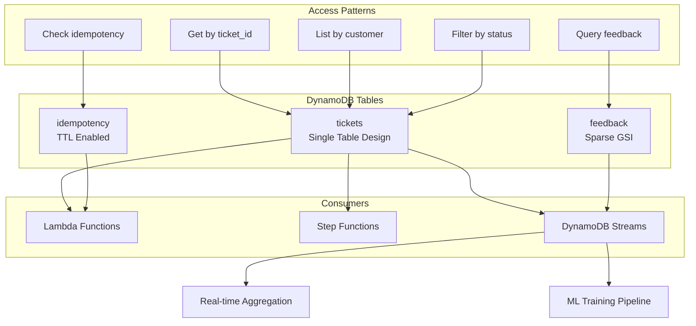

# DynamoDB Advanced Data Modeling

## Overview

Amazon DynamoDB è un database NoSQL serverless che richiede un approccio di modellazione dati radicalmente diverso dai database relazionali. Questo documento copre pattern avanzati per progettare schemi DynamoDB production-ready, con focus sul nostro sistema di AI Technical Support.

### Quando Usare DynamoDB

**✅ Casi d'uso ideali**:
- Applicazioni con latenza < 10ms richiesta
- Workload con pattern di accesso prevedibili
- Necessità di scalabilità automatica
- Architetture serverless (Lambda)
- Sessioni utente, carrelli, idempotency keys

**❌ Quando evitarlo**:
- Query analitiche complesse (usa Redshift/Athena)
- Relazioni molti-a-molti non prevedibili
- Aggregazioni pesanti in real-time
- Reporting ad-hoc con filtri dinamici

### Architettura nel Nostro Sistema



## Concetti Fondamentali

### 1. Single-Table Design

**Principio**: Un'unica tabella ospita più entity types usando pattern di chiavi composte.

**Vantaggi**:
- Meno connessioni da gestire
- Operazioni transazionali tra entity
- Costi ridotti (meno tabelle = meno RCU/WCU)
- Join locali tramite query

**Trade-off**:
- Complessità iniziale maggiore
- Richiede analisi access patterns approfondita
- Difficile da modificare dopo deployment

### 2. Partition Key vs Sort Key

```
Primary Key = Partition Key (PK) + Sort Key (SK)
```

**Partition Key (PK)**:
- Determina la distribuzione fisica dei dati
- Deve avere alta cardinalità
- Usata per routing delle query

**Sort Key (SK)**:
- Opzionale, ordina item nella stessa partition
- Supporta range queries (`begins_with`, `between`)
- Abilita pattern gerarchici

**Esempio**:
```python
# Entity: Ticket
PK = "TICKET#tkt_123"
SK = "METADATA"

# Entity: Feedback for Ticket
PK = "TICKET#tkt_123"
SK = "FEEDBACK#2025-11-18T10:30:00Z"

# Query: Get ticket + all feedback
query(
    KeyConditionExpression="PK = :pk",
    ExpressionAttributeValues={":pk": "TICKET#tkt_123"}
)
# Returns: ticket metadata + all feedback items
```

### 3. Global Secondary Index (GSI)

**Caratteristiche**:
- Proietta dati in diversa key structure
- Eventually consistent (ritardo < 1 secondo tipicamente)
- Costi separati (RCU/WCU propri)
- Può proiettare solo alcuni attributi (risparmio costi)

**Tipi di proiezione**:
- `KEYS_ONLY`: Solo chiavi (minimo storage)
- `INCLUDE`: Chiavi + attributi specifici
- `ALL`: Intera item (massima flessibilità, massimo costo)

**Esempio**:
```yaml
GSI: customer-status-index
  PK: customer_id
  SK: status#created_at
  Projection: ALL

# Query: All PROCESSING tickets for customer "cust_456"
query(
    IndexName="customer-status-index",
    KeyConditionExpression="customer_id = :cid AND begins_with(SK, :status)",
    ExpressionAttributeValues={
        ":cid": "cust_456",
        ":status": "PROCESSING#"
    }
)
```

### 4. Sparse Indexes

**Concetto**: GSI creato solo su item con un attributo specifico.

**Caso d'uso**: Filtrare subset di item senza scansionare tutta la tabella.

**Esempio**:
```python
# Solo ticket con escalation
# Main Table: 1M tickets
# GSI "escalated-index": 5K tickets (solo quelli escalati)

# Item normale (non in GSI)
{
    "ticket_id": "tkt_123",
    "status": "READY"
    # No "escalated_at" attribute
}

# Item escalato (appare in GSI)
{
    "ticket_id": "tkt_789",
    "status": "ESCALATED",
    "escalated_at": "2025-11-18T10:00:00Z"  # ← Attributo sparse
}

# GSI definition
GSI: escalated-index
  PK: escalated_at (exists only on escalated items)
  SK: ticket_id
  Projection: INCLUDE [customer_id, priority]
```

**Benefici**:
- Storage ridotto (solo item rilevanti)
- Query velocissime (indice piccolo)
- Costi minimi

### 5. Write Sharding

**Problema**: Hot partition quando molti write vanno allo stesso PK.

**Soluzione**: Aggiungere suffix random alla partition key.

```python
import random

def create_ticket_id_with_shard():
    shard = random.randint(0, 9)  # 10 shards
    ticket_id = f"tkt_{uuid.uuid4()}"
    return f"{ticket_id}#{shard}"

# Risultato: Distribuzione uniforme su 10 partizioni
# tkt_abc123#0
# tkt_def456#3
# tkt_ghi789#7
```

**Quando serve**:
- > 1000 WCU su singola partition
- Burst di write (es. campagne marketing)
- Time-series data con timestamp come PK

### 6. Item Collections

**Definizione**: Gruppo di item con stesso PK, diverso SK.

**Limite**: 10GB per item collection.

**Esempio dal nostro sistema**:
```python
# Item Collection per ticket "tkt_123"
# Contiene: metadata + feedback + eventi

PK = "TICKET#tkt_123"
SK = "METADATA"             # Ticket principale (1KB)
SK = "FEEDBACK#2025-11-18"  # Feedback 1 (500B)
SK = "FEEDBACK#2025-11-19"  # Feedback 2 (500B)
SK = "EVENT#2025-11-18#001" # Event log (300B)
SK = "EVENT#2025-11-18#002" # Event log (300B)

# Total collection size: ~2.6KB (molto sotto 10GB)
```

**Monitoring**:
```python
# CloudWatch Metric
# AccountMaxReads/AccountMaxWrites per item collection
```

## Implementazione Pratica

### Esempio 1: Single-Table Design (Tickets + Feedback + Sessions)

**Access Patterns Identificati**:
1. Get ticket by ID (PK query)
2. List tickets by customer (GSI)
3. List tickets by status (GSI)
4. Get all feedback for ticket (PK + SK range query)
5. Get feedback by operator (GSI)
6. Check session validity (PK query con TTL)
7. List recent tickets (GSI con date range)

**Schema Design**:

```python
from typing import Dict, List, Optional
from datetime import datetime, timedelta
import boto3
from boto3.dynamodb.conditions import Key, Attr

dynamodb = boto3.resource('dynamodb')
table = dynamodb.Table('prod-tickets-unified')

class SingleTableDesign:
    """
    Single-table design per Tickets, Feedback, Sessions.

    Entity Types:
    1. TICKET#<id> + METADATA → Ticket principale
    2. TICKET#<id> + FEEDBACK#<timestamp> → Feedback
    3. SESSION#<id> + METADATA → User session (con TTL)
    """

    # ================== TICKET OPERATIONS ==================

    @staticmethod
    def put_ticket(ticket: Dict) -> None:
        """
        Crea nuovo ticket nella tabella.

        PK: TICKET#tkt_123
        SK: METADATA
        GSI1PK: CUSTOMER#cust_456
        GSI1SK: STATUS#PROCESSING#2025-11-18T10:00:00Z
        GSI2PK: STATUS#PROCESSING
        GSI2SK: 2025-11-18T10:00:00Z
        """
        item = {
            'PK': f"TICKET#{ticket['ticket_id']}",
            'SK': 'METADATA',
            'entity_type': 'ticket',

            # Main attributes
            'ticket_id': ticket['ticket_id'],
            'customer_id': ticket['customer']['id'],
            'status': ticket['status'],
            'created_at': ticket['created_at'],
            'symptom_text': ticket['symptom_text'],
            'priority': ticket['priority'],

            # GSI1: Query by customer
            'GSI1PK': f"CUSTOMER#{ticket['customer']['id']}",
            'GSI1SK': f"STATUS#{ticket['status']}#{ticket['created_at']}",

            # GSI2: Query by status
            'GSI2PK': f"STATUS#{ticket['status']}",
            'GSI2SK': ticket['created_at'],

            # Full ticket data
            'data': ticket
        }

        table.put_item(Item=item)

    @staticmethod
    def get_ticket(ticket_id: str) -> Optional[Dict]:
        """Retrieve ticket by ID (single-digit millisecond latency)."""
        response = table.get_item(
            Key={
                'PK': f"TICKET#{ticket_id}",
                'SK': 'METADATA'
            }
        )
        return response.get('Item', {}).get('data')

    @staticmethod
    def query_tickets_by_customer(
        customer_id: str,
        status: Optional[str] = None,
        limit: int = 20
    ) -> List[Dict]:
        """
        Query tickets by customer, optionally filtered by status.

        Uses GSI1 (customer-index).
        """
        key_condition = Key('GSI1PK').eq(f"CUSTOMER#{customer_id}")

        if status:
            # Range query on GSI1SK
            key_condition &= Key('GSI1SK').begins_with(f"STATUS#{status}#")

        response = table.query(
            IndexName='GSI1-customer-index',
            KeyConditionExpression=key_condition,
            Limit=limit,
            ScanIndexForward=False  # Descending by created_at
        )

        return [item['data'] for item in response.get('Items', [])]

    @staticmethod
    def query_tickets_by_status(
        status: str,
        start_date: Optional[str] = None,
        end_date: Optional[str] = None,
        limit: int = 100
    ) -> List[Dict]:
        """
        Query all tickets by status, with optional date range.

        Uses GSI2 (status-index).
        """
        key_condition = Key('GSI2PK').eq(f"STATUS#{status}")

        if start_date and end_date:
            key_condition &= Key('GSI2SK').between(start_date, end_date)
        elif start_date:
            key_condition &= Key('GSI2SK').gte(start_date)

        response = table.query(
            IndexName='GSI2-status-index',
            KeyConditionExpression=key_condition,
            Limit=limit,
            ScanIndexForward=False
        )

        return [item['data'] for item in response.get('Items', [])]

    # ================== FEEDBACK OPERATIONS ==================

    @staticmethod
    def put_feedback(ticket_id: str, feedback: Dict) -> None:
        """
        Add feedback to ticket.

        Uses same PK as ticket, different SK → item collection.
        """
        item = {
            'PK': f"TICKET#{ticket_id}",
            'SK': f"FEEDBACK#{feedback['submitted_at']}",
            'entity_type': 'feedback',

            'ticket_id': ticket_id,
            'operator_id': feedback['operator_id'],
            'submitted_at': feedback['submitted_at'],
            'rating': feedback['rating'],

            # GSI3: Query by operator
            'GSI3PK': f"OPERATOR#{feedback['operator_id']}",
            'GSI3SK': feedback['submitted_at'],

            'data': feedback
        }

        table.put_item(Item=item)

    @staticmethod
    def get_ticket_with_feedback(ticket_id: str) -> Dict:
        """
        Get ticket + all feedback in single query.

        Leverages item collection (same PK).
        """
        response = table.query(
            KeyConditionExpression=Key('PK').eq(f"TICKET#{ticket_id}")
        )

        items = response.get('Items', [])

        ticket_data = None
        feedback_list = []

        for item in items:
            if item['SK'] == 'METADATA':
                ticket_data = item['data']
            elif item['SK'].startswith('FEEDBACK#'):
                feedback_list.append(item['data'])

        return {
            'ticket': ticket_data,
            'feedback': feedback_list
        }

    @staticmethod
    def query_feedback_by_operator(
        operator_id: str,
        limit: int = 50
    ) -> List[Dict]:
        """Query all feedback submitted by an operator."""
        response = table.query(
            IndexName='GSI3-operator-index',
            KeyConditionExpression=Key('GSI3PK').eq(f"OPERATOR#{operator_id}"),
            Limit=limit,
            ScanIndexForward=False
        )

        return [item['data'] for item in response.get('Items', [])]

    # ================== SESSION OPERATIONS (TTL) ==================

    @staticmethod
    def create_session(user_id: str, ttl_hours: int = 24) -> str:
        """
        Create user session with automatic expiration.

        Uses TTL attribute for automatic cleanup.
        """
        import uuid

        session_id = f"sess_{uuid.uuid4()}"
        now = datetime.utcnow()
        expiry = now + timedelta(hours=ttl_hours)

        item = {
            'PK': f"SESSION#{session_id}",
            'SK': 'METADATA',
            'entity_type': 'session',

            'session_id': session_id,
            'user_id': user_id,
            'created_at': now.isoformat(),
            'expires_at': expiry.isoformat(),

            # TTL attribute (Unix timestamp)
            'ttl': int(expiry.timestamp()),

            'data': {
                'user_id': user_id,
                'session_id': session_id
            }
        }

        table.put_item(Item=item)
        return session_id

    @staticmethod
    def get_session(session_id: str) -> Optional[Dict]:
        """
        Retrieve session if still valid.

        TTL cleanup happens asynchronously, so check expires_at.
        """
        response = table.get_item(
            Key={
                'PK': f"SESSION#{session_id}",
                'SK': 'METADATA'
            }
        )

        item = response.get('Item')
        if not item:
            return None

        # Check manual expiry (TTL cleanup è async)
        expires_at = datetime.fromisoformat(item['expires_at'])
        if datetime.utcnow() > expires_at:
            return None

        return item['data']


# ================== TABLE DEFINITION (CloudFormation) ==================

CLOUDFORMATION_TEMPLATE = """
AWSTemplateFormatVersion: '2010-09-09'
Resources:
  TicketsUnifiedTable:
    Type: AWS::DynamoDB::Table
    Properties:
      TableName: prod-tickets-unified
      BillingMode: PAY_PER_REQUEST  # On-demand (no capacity planning)

      AttributeDefinitions:
        - AttributeName: PK
          AttributeType: S
        - AttributeName: SK
          AttributeType: S
        - AttributeName: GSI1PK
          AttributeType: S
        - AttributeName: GSI1SK
          AttributeType: S
        - AttributeName: GSI2PK
          AttributeType: S
        - AttributeName: GSI2SK
          AttributeType: S
        - AttributeName: GSI3PK
          AttributeType: S
        - AttributeName: GSI3SK
          AttributeType: S

      KeySchema:
        - AttributeName: PK
          KeyType: HASH
        - AttributeName: SK
          KeyType: RANGE

      GlobalSecondaryIndexes:
        # GSI1: Query by customer
        - IndexName: GSI1-customer-index
          KeySchema:
            - AttributeName: GSI1PK
              KeyType: HASH
            - AttributeName: GSI1SK
              KeyType: RANGE
          Projection:
            ProjectionType: ALL

        # GSI2: Query by status
        - IndexName: GSI2-status-index
          KeySchema:
            - AttributeName: GSI2PK
              KeyType: HASH
            - AttributeName: GSI2SK
              KeyType: RANGE
          Projection:
            ProjectionType: ALL

        # GSI3: Query by operator (sparse - only feedback items)
        - IndexName: GSI3-operator-index
          KeySchema:
            - AttributeName: GSI3PK
              KeyType: HASH
            - AttributeName: GSI3SK
              KeyType: RANGE
          Projection:
            ProjectionType: INCLUDE
            NonKeyAttributes:
              - ticket_id
              - rating
              - was_helpful

      TimeToLiveSpecification:
        Enabled: true
        AttributeName: ttl

      StreamSpecification:
        StreamViewType: NEW_AND_OLD_IMAGES

      PointInTimeRecoverySpecification:
        PointInTimeRecoveryEnabled: true

      Tags:
        - Key: Environment
          Value: production
        - Key: Application
          Value: ai-technical-support
"""
```

### Esempio 2: Composite Keys - Hierarchical Data

**Caso d'uso**: Ticket con nested events timeline.

```python
class HierarchicalDataModel:
    """
    Modellazione gerarchica usando composite sort keys.

    Gerarchia:
    TICKET
      ├── METADATA
      ├── EVENTS
      │   ├── 2025-11-18#001
      │   ├── 2025-11-18#002
      │   └── 2025-11-19#001
      └── FEEDBACK
          ├── 2025-11-18T10:00:00Z
          └── 2025-11-19T15:30:00Z
    """

    @staticmethod
    def add_event(ticket_id: str, event_type: str, details: Dict) -> None:
        """Add event to ticket timeline."""
        now = datetime.utcnow()
        date_prefix = now.strftime('%Y-%m-%d')

        # Generate sequence number for this date
        sequence = HierarchicalDataModel._get_next_sequence(ticket_id, date_prefix)

        item = {
            'PK': f"TICKET#{ticket_id}",
            'SK': f"EVENT#{date_prefix}#{sequence:03d}",  # Zero-padded
            'entity_type': 'event',
            'timestamp': now.isoformat(),
            'event_type': event_type,
            'details': details
        }

        table.put_item(Item=item)

    @staticmethod
    def query_events_by_date_range(
        ticket_id: str,
        start_date: str,
        end_date: str
    ) -> List[Dict]:
        """
        Query events in date range using SK range query.

        Example: Get all events between 2025-11-15 and 2025-11-20
        """
        response = table.query(
            KeyConditionExpression=(
                Key('PK').eq(f"TICKET#{ticket_id}") &
                Key('SK').between(
                    f"EVENT#{start_date}#000",
                    f"EVENT#{end_date}#999"
                )
            )
        )

        return response.get('Items', [])

    @staticmethod
    def query_latest_events(ticket_id: str, limit: int = 10) -> List[Dict]:
        """Get most recent events (reverse chronological)."""
        response = table.query(
            KeyConditionExpression=(
                Key('PK').eq(f"TICKET#{ticket_id}") &
                Key('SK').begins_with('EVENT#')
            ),
            Limit=limit,
            ScanIndexForward=False  # Descending order
        )

        return response.get('Items', [])

    @staticmethod
    def _get_next_sequence(ticket_id: str, date_prefix: str) -> int:
        """Get next sequence number for events on this date."""
        response = table.query(
            KeyConditionExpression=(
                Key('PK').eq(f"TICKET#{ticket_id}") &
                Key('SK').begins_with(f"EVENT#{date_prefix}#")
            ),
            Select='COUNT'
        )

        return response['Count'] + 1
```

### Esempio 3: Transactions - Multi-Item ACID Operations

**Caso d'uso**: Creare ticket + idempotency key + initial event atomicamente.

```python
from boto3.dynamodb.conditions import Attr

class TransactionalOperations:
    """
    DynamoDB transactions per operazioni ACID multi-item.

    Limiti:
    - Max 100 items per transazione
    - Max 4MB totali
    - Tutti item nella stessa region
    """

    @staticmethod
    def create_ticket_transactional(ticket: Dict, idempotency_key: str) -> None:
        """
        Create ticket with idempotency key and initial event.

        Garantisce:
        1. Ticket creato solo se idempotency key non esiste
        2. Ticket + event + idempotency creati atomicamente
        3. Rollback completo se qualsiasi step fallisce
        """
        dynamodb_client = boto3.client('dynamodb')

        ticket_id = ticket['ticket_id']
        now = datetime.utcnow().isoformat()

        try:
            dynamodb_client.transact_write_items(
                TransactItems=[
                    # 1. Check idempotency key doesn't exist
                    {
                        'Put': {
                            'TableName': 'prod-tickets-unified',
                            'Item': {
                                'PK': {'S': f"IDEMPOTENCY#{idempotency_key}"},
                                'SK': {'S': 'METADATA'},
                                'ticket_id': {'S': ticket_id},
                                'created_at': {'S': now},
                                'ttl': {'N': str(int((datetime.utcnow() + timedelta(hours=24)).timestamp()))}
                            },
                            'ConditionExpression': 'attribute_not_exists(PK)'
                        }
                    },
                    # 2. Create ticket
                    {
                        'Put': {
                            'TableName': 'prod-tickets-unified',
                            'Item': {
                                'PK': {'S': f"TICKET#{ticket_id}"},
                                'SK': {'S': 'METADATA'},
                                'entity_type': {'S': 'ticket'},
                                'ticket_id': {'S': ticket_id},
                                'status': {'S': ticket['status']},
                                'created_at': {'S': now},
                                'data': {'S': json.dumps(ticket)}
                            }
                        }
                    },
                    # 3. Create initial event
                    {
                        'Put': {
                            'TableName': 'prod-tickets-unified',
                            'Item': {
                                'PK': {'S': f"TICKET#{ticket_id}"},
                                'SK': {'S': f"EVENT#{now}#001"},
                                'event_type': {'S': 'ticket_created'},
                                'timestamp': {'S': now}
                            }
                        }
                    }
                ]
            )
        except dynamodb_client.exceptions.TransactionCanceledException as e:
            # Check which condition failed
            reasons = e.response.get('CancellationReasons', [])
            for reason in reasons:
                if reason.get('Code') == 'ConditionalCheckFailed':
                    raise ValueError(f"Duplicate request: {idempotency_key}")
            raise

    @staticmethod
    def update_ticket_status_with_event(
        ticket_id: str,
        new_status: str,
        event_details: Dict
    ) -> None:
        """
        Update ticket status and create status change event atomically.
        """
        dynamodb_client = boto3.client('dynamodb')
        now = datetime.utcnow().isoformat()

        dynamodb_client.transact_write_items(
            TransactItems=[
                # 1. Update ticket status
                {
                    'Update': {
                        'TableName': 'prod-tickets-unified',
                        'Key': {
                            'PK': {'S': f"TICKET#{ticket_id}"},
                            'SK': {'S': 'METADATA'}
                        },
                        'UpdateExpression': 'SET #status = :new_status, updated_at = :now',
                        'ExpressionAttributeNames': {
                            '#status': 'status'
                        },
                        'ExpressionAttributeValues': {
                            ':new_status': {'S': new_status},
                            ':now': {'S': now}
                        }
                    }
                },
                # 2. Log status change event
                {
                    'Put': {
                        'TableName': 'prod-tickets-unified',
                        'Item': {
                            'PK': {'S': f"TICKET#{ticket_id}"},
                            'SK': {'S': f"EVENT#{now}#status_change"},
                            'event_type': {'S': 'status_changed'},
                            'old_status': {'S': event_details.get('old_status', '')},
                            'new_status': {'S': new_status},
                            'timestamp': {'S': now}
                        }
                    }
                }
            ]
        )

    @staticmethod
    def batch_get_tickets(ticket_ids: List[str]) -> List[Dict]:
        """
        Get multiple tickets in single batch operation.

        More efficient than multiple GetItem calls.
        Limit: 100 items, 16MB total.
        """
        dynamodb_client = boto3.client('dynamodb')

        response = dynamodb_client.batch_get_item(
            RequestItems={
                'prod-tickets-unified': {
                    'Keys': [
                        {
                            'PK': {'S': f"TICKET#{tid}"},
                            'SK': {'S': 'METADATA'}
                        }
                        for tid in ticket_ids
                    ]
                }
            }
        )

        items = response['Responses']['prod-tickets-unified']
        return [json.loads(item['data']['S']) for item in items]
```

### Esempio 4: DynamoDB Streams - Real-Time Aggregation

**Caso d'uso**: Calcolare metriche real-time quando ticket cambiano stato.

```python
import json
from decimal import Decimal

class StreamProcessor:
    """
    Process DynamoDB Streams per aggregazioni real-time.

    Stream record format:
    {
        'eventName': 'INSERT' | 'MODIFY' | 'REMOVE',
        'dynamodb': {
            'Keys': {...},
            'NewImage': {...},
            'OldImage': {...}
        }
    }
    """

    @staticmethod
    def lambda_handler(event, context):
        """
        Lambda triggered by DynamoDB Stream.

        Aggregates:
        - Ticket count by status
        - Average resolution time
        - Customer satisfaction scores
        """
        metrics_table = boto3.resource('dynamodb').Table('prod-metrics')

        for record in event['Records']:
            event_name = record['eventName']

            if event_name == 'MODIFY':
                StreamProcessor._process_ticket_update(record, metrics_table)
            elif event_name == 'INSERT':
                if record['dynamodb']['NewImage']['SK']['S'].startswith('FEEDBACK#'):
                    StreamProcessor._process_feedback(record, metrics_table)

    @staticmethod
    def _process_ticket_update(record, metrics_table):
        """Update metrics when ticket status changes."""
        old_image = record['dynamodb'].get('OldImage', {})
        new_image = record['dynamodb']['NewImage']

        old_status = old_image.get('status', {}).get('S')
        new_status = new_image.get('status', {}).get('S')

        if old_status != new_status:
            # Decrement old status counter
            if old_status:
                metrics_table.update_item(
                    Key={'metric_name': f"tickets_by_status#{old_status}"},
                    UpdateExpression='ADD count_value :dec',
                    ExpressionAttributeValues={':dec': -1}
                )

            # Increment new status counter
            metrics_table.update_item(
                Key={'metric_name': f"tickets_by_status#{new_status}"},
                UpdateExpression='ADD count_value :inc',
                ExpressionAttributeValues={':inc': 1}
            )

            # Calculate resolution time if completed
            if new_status == 'READY':
                created_at = new_image.get('created_at', {}).get('S')
                completed_at = new_image.get('completed_at', {}).get('S')

                if created_at and completed_at:
                    resolution_seconds = (
                        datetime.fromisoformat(completed_at) -
                        datetime.fromisoformat(created_at)
                    ).total_seconds()

                    # Update average resolution time
                    metrics_table.update_item(
                        Key={'metric_name': 'avg_resolution_time'},
                        UpdateExpression=(
                            'SET total_time = if_not_exists(total_time, :zero) + :time, '
                            'count_value = if_not_exists(count_value, :zero) + :one'
                        ),
                        ExpressionAttributeValues={
                            ':time': Decimal(str(resolution_seconds)),
                            ':one': 1,
                            ':zero': 0
                        }
                    )

    @staticmethod
    def _process_feedback(record, metrics_table):
        """Aggregate feedback ratings."""
        feedback_image = record['dynamodb']['NewImage']
        rating = int(feedback_image.get('rating', {}).get('N', 0))

        metrics_table.update_item(
            Key={'metric_name': 'customer_satisfaction'},
            UpdateExpression=(
                'SET total_ratings = if_not_exists(total_ratings, :zero) + :rating, '
                'count_value = if_not_exists(count_value, :zero) + :one'
            ),
            ExpressionAttributeValues={
                ':rating': Decimal(str(rating)),
                ':one': 1,
                ':zero': 0
            }
        )


# CloudFormation: Enable Streams
STREAM_CONFIG = """
Resources:
  TicketsTable:
    Type: AWS::DynamoDB::Table
    Properties:
      StreamSpecification:
        StreamViewType: NEW_AND_OLD_IMAGES  # Include before/after images

  StreamProcessorLambda:
    Type: AWS::Lambda::Function
    Properties:
      FunctionName: ticket-stream-processor
      Runtime: python3.11
      Handler: index.lambda_handler

  EventSourceMapping:
    Type: AWS::Lambda::EventSourceMapping
    Properties:
      EventSourceArn: !GetAtt TicketsTable.StreamArn
      FunctionName: !Ref StreamProcessorLambda
      StartingPosition: LATEST
      BatchSize: 100
      MaximumBatchingWindowInSeconds: 5
      BisectBatchOnFunctionError: true
      MaximumRetryAttempts: 3
"""
```

### Esempio 5: TTL Pattern - Automatic Cleanup

```python
class TTLPatterns:
    """
    Time-To-Live patterns per cleanup automatico.

    Casi d'uso:
    - Session management
    - Idempotency keys (24h)
    - Temporary data (cache)
    - Audit logs (retention policy)
    """

    @staticmethod
    def create_idempotency_key(key: str, response: Dict, ttl_hours: int = 24):
        """
        Store idempotency key with automatic expiration.

        Prevents duplicate API requests.
        """
        expiry = datetime.utcnow() + timedelta(hours=ttl_hours)

        item = {
            'PK': f"IDEMPOTENCY#{key}",
            'SK': 'METADATA',
            'response': json.dumps(response),
            'created_at': datetime.utcnow().isoformat(),
            'ttl': int(expiry.timestamp())  # Unix timestamp (required)
        }

        table.put_item(Item=item)

    @staticmethod
    def check_idempotency(key: str) -> Optional[Dict]:
        """Check if request was already processed."""
        response = table.get_item(
            Key={
                'PK': f"IDEMPOTENCY#{key}",
                'SK': 'METADATA'
            }
        )

        item = response.get('Item')
        if not item:
            return None

        # TTL deletion is async (up to 48h delay)
        # Always check expiry manually
        if item['ttl'] < int(datetime.utcnow().timestamp()):
            return None

        return json.loads(item['response'])

    @staticmethod
    def create_temporary_cache(cache_key: str, data: Dict, ttl_minutes: int = 15):
        """Cache expensive computation results."""
        expiry = datetime.utcnow() + timedelta(minutes=ttl_minutes)

        item = {
            'PK': f"CACHE#{cache_key}",
            'SK': 'DATA',
            'data': data,
            'ttl': int(expiry.timestamp())
        }

        table.put_item(Item=item)
```

### Esempio 6: Sparse Index - Efficient Filtering

```python
class SparseIndexPattern:
    """
    Sparse GSI per query efficienti su subset di dati.

    Esempio: Query solo ticket escalati (< 1% del totale).
    """

    @staticmethod
    def escalate_ticket(ticket_id: str, reason: str, assigned_to: str):
        """
        Mark ticket as escalated.

        Adds 'escalated_at' attribute → item appears in sparse GSI.
        """
        now = datetime.utcnow().isoformat()

        table.update_item(
            Key={
                'PK': f"TICKET#{ticket_id}",
                'SK': 'METADATA'
            },
            UpdateExpression=(
                'SET #status = :escalated, '
                'escalated_at = :now, '  # ← Sparse GSI key
                'escalation_reason = :reason, '
                'assigned_to = :assigned'
            ),
            ExpressionAttributeNames={'#status': 'status'},
            ExpressionAttributeValues={
                ':escalated': 'ESCALATED',
                ':now': now,
                ':reason': reason,
                ':assigned': assigned_to
            }
        )

    @staticmethod
    def query_escalated_tickets(assigned_to: Optional[str] = None) -> List[Dict]:
        """
        Query only escalated tickets using sparse GSI.

        GSI Definition:
          PK: escalated_at (only exists on escalated tickets)
          SK: assigned_to
          Projection: INCLUDE [ticket_id, priority, customer_id]

        Storage: ~1% of main table (only escalated items)
        """
        if assigned_to:
            # Query specific engineer's escalations
            response = table.query(
                IndexName='escalated-tickets-index',
                KeyConditionExpression=(
                    Key('escalated_at').gte('2000-01-01') &  # All dates
                    Key('assigned_to').eq(assigned_to)
                )
            )
        else:
            # Query all escalations
            response = table.query(
                IndexName='escalated-tickets-index',
                KeyConditionExpression=Key('escalated_at').gte('2000-01-01'),
                ScanIndexForward=False  # Most recent first
            )

        return response.get('Items', [])


# GSI Definition (CloudFormation)
SPARSE_GSI_TEMPLATE = """
GlobalSecondaryIndexes:
  - IndexName: escalated-tickets-index
    KeySchema:
      - AttributeName: escalated_at  # Only exists on escalated items
        KeyType: HASH
      - AttributeName: assigned_to
        KeyType: RANGE
    Projection:
      ProjectionType: INCLUDE
      NonKeyAttributes:
        - ticket_id
        - priority
        - customer_id
        - escalation_reason

    # Note: No capacity units specified (inherits from table if on-demand)
"""
```

### Esempio 7: Capacity Calculator

```python
class CapacityCalculator:
    """
    Utility per calcolare capacity requirements.

    Formule:
    - 1 RCU = 1 strongly consistent read/s di 4KB
    - 1 RCU = 2 eventually consistent reads/s di 4KB
    - 1 WCU = 1 write/s di 1KB
    """

    @staticmethod
    def calculate_read_capacity(
        reads_per_second: int,
        item_size_kb: float,
        consistent: bool = False
    ) -> int:
        """
        Calculate RCU needed.

        Args:
            reads_per_second: Query frequency
            item_size_kb: Average item size
            consistent: Strongly vs eventually consistent

        Returns:
            Required RCU
        """
        # Round up to nearest 4KB block
        blocks_per_item = max(1, int((item_size_kb + 3) / 4))

        if consistent:
            # Strongly consistent: 1 RCU = 1 read/s of 4KB
            rcu = reads_per_second * blocks_per_item
        else:
            # Eventually consistent: 1 RCU = 2 reads/s of 4KB
            rcu = (reads_per_second * blocks_per_item) / 2

        return int(rcu)

    @staticmethod
    def calculate_write_capacity(
        writes_per_second: int,
        item_size_kb: float
    ) -> int:
        """
        Calculate WCU needed.

        1 WCU = 1 write/s of 1KB
        """
        # Round up to nearest 1KB block
        blocks_per_item = max(1, int(item_size_kb))

        wcu = writes_per_second * blocks_per_item
        return int(wcu)

    @staticmethod
    def estimate_monthly_cost(
        rcu: int,
        wcu: int,
        storage_gb: float,
        region: str = 'us-east-1'
    ) -> Dict[str, float]:
        """
        Estimate monthly DynamoDB costs.

        Pricing (us-east-1, provisioned capacity):
        - $0.00065 per RCU-hour
        - $0.00065 per WCU-hour
        - $0.25 per GB-month
        """
        hours_per_month = 730

        rcu_cost = rcu * 0.00065 * hours_per_month
        wcu_cost = wcu * 0.00065 * hours_per_month
        storage_cost = storage_gb * 0.25

        return {
            'rcu_cost': round(rcu_cost, 2),
            'wcu_cost': round(wcu_cost, 2),
            'storage_cost': round(storage_cost, 2),
            'total': round(rcu_cost + wcu_cost + storage_cost, 2)
        }

    @staticmethod
    def on_demand_vs_provisioned_analysis(
        reads_per_second: int,
        writes_per_second: int,
        item_size_kb: float,
        storage_gb: float,
        hours_active_per_day: int = 24
    ) -> Dict:
        """
        Compare on-demand vs provisioned pricing.

        On-demand pricing (us-east-1):
        - $1.25 per million read requests
        - $1.25 per million write requests
        """
        # Provisioned capacity
        rcu = CapacityCalculator.calculate_read_capacity(
            reads_per_second, item_size_kb, consistent=True
        )
        wcu = CapacityCalculator.calculate_write_capacity(
            writes_per_second, item_size_kb
        )

        provisioned_cost = CapacityCalculator.estimate_monthly_cost(
            rcu, wcu, storage_gb
        )

        # On-demand cost
        reads_per_month = reads_per_second * 60 * 60 * hours_active_per_day * 30
        writes_per_month = writes_per_second * 60 * 60 * hours_active_per_day * 30

        on_demand_read_cost = (reads_per_month / 1_000_000) * 1.25
        on_demand_write_cost = (writes_per_month / 1_000_000) * 1.25
        on_demand_storage_cost = storage_gb * 0.25

        on_demand_total = (
            on_demand_read_cost +
            on_demand_write_cost +
            on_demand_storage_cost
        )

        return {
            'provisioned': provisioned_cost,
            'on_demand': {
                'read_cost': round(on_demand_read_cost, 2),
                'write_cost': round(on_demand_write_cost, 2),
                'storage_cost': round(on_demand_storage_cost, 2),
                'total': round(on_demand_total, 2)
            },
            'recommendation': (
                'provisioned' if provisioned_cost['total'] < on_demand_total
                else 'on-demand'
            ),
            'savings': abs(provisioned_cost['total'] - on_demand_total)
        }


# Example usage
if __name__ == '__main__':
    # Scenario: 100 reads/s, 20 writes/s, 3KB items, 50GB storage
    analysis = CapacityCalculator.on_demand_vs_provisioned_analysis(
        reads_per_second=100,
        writes_per_second=20,
        item_size_kb=3,
        storage_gb=50,
        hours_active_per_day=12  # Only active half the day
    )

    print(json.dumps(analysis, indent=2))
    # Output:
    # {
    #   "provisioned": {"rcu_cost": 47.45, "wcu_cost": 28.47, "total": 88.42},
    #   "on_demand": {"read_cost": 162.00, "write_cost": 32.40, "total": 206.90},
    #   "recommendation": "provisioned",
    #   "savings": 118.48
    # }
```

## Best Practices

### Do's ✅

1. **Identifica tutti gli access pattern PRIMA di progettare**
   ```python
   # Document access patterns
   ACCESS_PATTERNS = [
       "Get ticket by ID",
       "List tickets by customer",
       "Filter tickets by status",
       "Query feedback by operator",
       "Search tickets by date range"
   ]
   # Design keys and GSIs to support ALL patterns
   ```

2. **Usa single-table design per entità correlate**
   - Riduce latenza (meno network calls)
   - Abilita transactions
   - Minori costi operativi

3. **Progetta chiavi con alta cardinalità**
   ```python
   # ✅ Good: UUID
   PK = f"TICKET#{uuid.uuid4()}"  # Milioni di valori unici

   # ❌ Bad: Status come PK
   PK = f"STATUS#{status}"  # Solo 5 valori (hot partitions!)
   ```

4. **Usa TTL per cleanup automatico**
   - Sessioni temporanee
   - Idempotency keys
   - Cache entries
   - Audit logs con retention

5. **Abilita Point-in-Time Recovery (production)**
   ```yaml
   PointInTimeRecoverySpecification:
     PointInTimeRecoveryEnabled: true
   ```

6. **Usa projection types appropriati per GSI**
   ```python
   # Se queries ritornano solo pochi attributi
   Projection:
     ProjectionType: INCLUDE
     NonKeyAttributes: ['ticket_id', 'status', 'created_at']
   # Storage ridotto = costi ridotti
   ```

7. **Implementa idempotency per write operations**
   ```python
   # Use condition expressions
   table.put_item(
       Item=item,
       ConditionExpression='attribute_not_exists(PK)'
   )
   ```

### Don'ts ❌

1. **❌ NEVER Scan senza pagination**
   ```python
   # ❌ BAD: Unbounded scan
   response = table.scan()
   items = response['Items']  # Could be millions!

   # ✅ GOOD: Paginated scan
   def scan_table_paginated():
       items = []
       last_evaluated_key = None

       while True:
           params = {'Limit': 100}
           if last_evaluated_key:
               params['ExclusiveStartKey'] = last_evaluated_key

           response = table.scan(**params)
           items.extend(response['Items'])

           last_evaluated_key = response.get('LastEvaluatedKey')
           if not last_evaluated_key:
               break

       return items
   ```

2. **❌ Evita string concatenation in keys**
   ```python
   # ❌ BAD: Parsing required
   PK = f"{customer_id}#{ticket_id}"

   # ✅ GOOD: Structured prefix
   PK = f"CUSTOMER#{customer_id}"
   SK = f"TICKET#{ticket_id}"
   ```

3. **❌ Non usare attributi nested come filter**
   ```python
   # ❌ BAD: Filter on nested attribute (full scan)
   response = table.scan(
       FilterExpression=Attr('data.customer.tier').eq('ENTERPRISE')
   )

   # ✅ GOOD: Promote to top-level attribute + GSI
   item['customer_tier'] = 'ENTERPRISE'  # Top-level
   # Query GSI with customer_tier as key
   ```

4. **❌ Non superare 400KB per item**
   ```python
   # Se item è troppo grande, splitting:
   # Main item: metadata only
   # S3: large payloads (logs, attachments)

   if len(json.dumps(item)) > 350_000:  # Leave margin
       # Store in S3
       s3_uri = store_to_s3(item['large_data'])
       item['data_uri'] = s3_uri
       del item['large_data']
   ```

5. **❌ Evita hot partitions**
   ```python
   # ❌ BAD: All writes go to same partition
   PK = "GLOBAL_COUNTER"  # Single partition!

   # ✅ GOOD: Shard writes
   shard = random.randint(0, 9)
   PK = f"COUNTER#{shard}"
   ```

### Performance Optimization

1. **Batch operations quando possibile**
   ```python
   # Instead of 25 GetItem calls
   response = dynamodb.batch_get_item(
       RequestItems={
           'table': {
               'Keys': [{'PK': f"TICKET#{tid}"} for tid in ticket_ids]
           }
       }
   )
   ```

2. **Use eventually consistent reads per default**
   ```python
   # 50% cheaper, < 1s lag typically
   response = table.get_item(
       Key={'PK': pk, 'SK': sk},
       ConsistentRead=False  # Default, ma esplicito è meglio
   )
   ```

3. **Connection pooling per Lambda**
   ```python
   # Initialize outside handler (reused across invocations)
   dynamodb = boto3.resource('dynamodb')
   table = dynamodb.Table('prod-tickets')

   def lambda_handler(event, context):
       # Use pre-initialized table
       table.get_item(...)
   ```

### Security Best Practices

1. **Encryption at rest (sempre)**
   ```yaml
   SSESpecification:
     SSEEnabled: true
     SSEType: KMS
     KMSMasterKeyId: alias/dynamodb-key
   ```

2. **IAM policies least-privilege**
   ```json
   {
     "Effect": "Allow",
     "Action": [
       "dynamodb:GetItem",
       "dynamodb:Query"
     ],
     "Resource": "arn:aws:dynamodb:region:account:table/tickets",
     "Condition": {
       "ForAllValues:StringEquals": {
         "dynamodb:LeadingKeys": ["TICKET#${cognito-identity.amazonaws.com:sub}"]
       }
     }
   }
   ```

3. **VPC Endpoints per traffico privato**
   ```yaml
   VPCEndpoint:
     Type: AWS::EC2::VPCEndpoint
     Properties:
       VpcId: !Ref VPC
       ServiceName: com.amazonaws.us-east-1.dynamodb
       RouteTableIds:
         - !Ref PrivateRouteTable
   ```

## Troubleshooting

### Problema 1: Hot Partitions

**Sintomo**: `ProvisionedThroughputExceededException` su alcune partizioni.

**Diagnosi**:
```python
# CloudWatch Metrics
# UserErrors → ProvisionedThroughputExceededException
# Correlate con access patterns

# Check top accessed keys
cloudwatch_insights_query = """
fields @timestamp, @message
| filter @message like /ConsumedCapacity/
| stats count() by PK
| sort count desc
| limit 10
"""
```

**Soluzioni**:
1. **Write sharding**:
   ```python
   shard = hash(item_id) % 10
   PK = f"{item_id}#{shard}"
   ```

2. **Burst capacity**: Aumenta provisioned capacity temporaneamente

3. **On-demand mode**: Elimina hot partition issues (auto-scaling)

### Problema 2: Large Items

**Sintomo**: `ItemSizeLimitExceededException` (> 400KB).

**Soluzione**:
```python
def store_large_item(item: Dict, table_name: str, s3_bucket: str):
    """Split large items: metadata in DynamoDB, payload in S3."""
    item_size = len(json.dumps(item).encode('utf-8'))

    if item_size > 350_000:  # 350KB threshold (leave margin)
        # Extract large attributes
        large_data = {
            k: v for k, v in item.items()
            if len(json.dumps(v).encode('utf-8')) > 50_000
        }

        # Store in S3
        s3_key = f"large-items/{item['PK']}/{item['SK']}.json"
        s3.put_object(
            Bucket=s3_bucket,
            Key=s3_key,
            Body=json.dumps(large_data)
        )

        # Keep metadata in DynamoDB
        for key in large_data:
            del item[key]

        item['large_data_uri'] = f"s3://{s3_bucket}/{s3_key}"

    dynamodb.put_item(TableName=table_name, Item=item)
```

### Problema 3: GSI Throttling

**Sintomo**: Writes rallentate da GSI con capacity insufficiente.

**Diagnosi**:
```python
# CloudWatch: GSI ConsumedWriteCapacityUnits vs ProvisionedWriteCapacityUnits
```

**Soluzione**:
1. **Aumenta GSI capacity** (può richiedere fino a 4 ore per provisioning)
2. **Sparse index**: Riduci item in GSI
3. **On-demand mode**

### Problema 4: Eventually Consistent Reads Stale

**Sintomo**: Leggi ritornano dati vecchi (> 1 secondo dopo write).

**Workaround**:
```python
def read_after_write(pk, sk, max_attempts=3):
    """Retry eventually consistent reads fino a convergenza."""
    for attempt in range(max_attempts):
        response = table.get_item(
            Key={'PK': pk, 'SK': sk},
            ConsistentRead=(attempt == max_attempts - 1)  # Last attempt: strongly consistent
        )

        item = response.get('Item')
        if item and item.get('updated_at') == expected_timestamp:
            return item

        time.sleep(0.5)  # Backoff

    raise ValueError("Read-after-write consistency issue")
```

### Problema 5: Transaction Conflicts

**Sintomo**: `TransactionCanceledException` sotto carico.

**Causa**: Concurrent updates allo stesso item.

**Soluzione**:
```python
from botocore.exceptions import ClientError
import time
import random

def transact_with_retry(transact_items, max_retries=5):
    """Retry transactions con exponential backoff."""
    for attempt in range(max_retries):
        try:
            dynamodb.transact_write_items(TransactItems=transact_items)
            return
        except ClientError as e:
            if e.response['Error']['Code'] == 'TransactionCanceledException':
                if attempt < max_retries - 1:
                    # Exponential backoff con jitter
                    delay = (2 ** attempt) + random.uniform(0, 1)
                    time.sleep(delay)
                else:
                    raise
```

## Esempi Reali dal Progetto

### Pattern 1: Idempotent API Requests

**Use case**: Prevent duplicate ticket creation da client retries.

```python
import hashlib

def create_ticket_idempotent(ticket_data: Dict, request_id: str) -> Dict:
    """
    Idempotent ticket creation using DynamoDB conditional writes.

    Process:
    1. Check idempotency key
    2. If exists, return cached response
    3. If not exists, create ticket + store idempotency key (transactional)
    """
    # Generate idempotency key from request
    idempotency_key = hashlib.sha256(
        f"{request_id}:{json.dumps(ticket_data, sort_keys=True)}".encode()
    ).hexdigest()

    # Check if already processed
    existing = table.get_item(
        Key={
            'PK': f"IDEMPOTENCY#{idempotency_key}",
            'SK': 'METADATA'
        }
    )

    if existing.get('Item'):
        # Return cached response
        return json.loads(existing['Item']['response'])

    # Create ticket + idempotency key atomically
    ticket_id = f"tkt_{uuid.uuid4()}"
    now = datetime.utcnow().isoformat()

    response_data = {
        'ticket_id': ticket_id,
        'status': 'PROCESSING',
        'created_at': now
    }

    try:
        dynamodb_client = boto3.client('dynamodb')
        dynamodb_client.transact_write_items(
            TransactItems=[
                {
                    'Put': {
                        'TableName': 'prod-tickets',
                        'Item': {
                            'PK': {'S': f"IDEMPOTENCY#{idempotency_key}"},
                            'SK': {'S': 'METADATA'},
                            'response': {'S': json.dumps(response_data)},
                            'ttl': {'N': str(int((datetime.utcnow() + timedelta(hours=24)).timestamp()))}
                        },
                        'ConditionExpression': 'attribute_not_exists(PK)'
                    }
                },
                {
                    'Put': {
                        'TableName': 'prod-tickets',
                        'Item': {
                            'PK': {'S': f"TICKET#{ticket_id}"},
                            'SK': {'S': 'METADATA'},
                            'ticket_id': {'S': ticket_id},
                            'status': {'S': 'PROCESSING'},
                            'created_at': {'S': now},
                            'data': {'S': json.dumps(ticket_data)}
                        }
                    }
                }
            ]
        )
    except dynamodb_client.exceptions.TransactionCanceledException:
        # Race condition: another request created it first
        # Retry get
        return create_ticket_idempotent(ticket_data, request_id)

    return response_data
```

### Pattern 2: Real-Time Dashboard Metrics

**Use case**: Display ticket counts per status senza scan.

```python
class DashboardMetrics:
    """
    Pre-aggregated metrics usando DynamoDB Streams.

    Alternative to expensive scan operations.
    """

    @staticmethod
    def get_ticket_counts_by_status() -> Dict[str, int]:
        """
        Get current ticket counts per status.

        Uses pre-aggregated counters (updated by Stream processor).
        """
        metrics_table = boto3.resource('dynamodb').Table('prod-metrics')

        statuses = ['NEW', 'PROCESSING', 'READY', 'FAILED', 'ESCALATED']
        counts = {}

        # Batch get all status counters
        response = dynamodb.batch_get_item(
            RequestItems={
                'prod-metrics': {
                    'Keys': [
                        {'metric_name': f"tickets_by_status#{status}"}
                        for status in statuses
                    ]
                }
            }
        )

        for item in response['Responses']['prod-metrics']:
            status = item['metric_name'].split('#')[1]
            counts[status] = item.get('count_value', 0)

        return counts

    @staticmethod
    def get_average_resolution_time() -> float:
        """Get average resolution time in seconds."""
        metrics_table = boto3.resource('dynamodb').Table('prod-metrics')

        response = metrics_table.get_item(
            Key={'metric_name': 'avg_resolution_time'}
        )

        item = response.get('Item', {})
        total_time = float(item.get('total_time', 0))
        count = int(item.get('count_value', 1))

        return total_time / count if count > 0 else 0
```

### Pattern 3: Multi-Tenant Isolation

**Use case**: Isolate customer data con IAM policies.

```python
def get_customer_tickets_isolated(customer_id: str, cognito_sub: str) -> List[Dict]:
    """
    Query tickets with customer isolation enforced by IAM.

    IAM Policy (attached to Lambda execution role):
    {
      "Effect": "Allow",
      "Action": "dynamodb:Query",
      "Resource": "arn:aws:dynamodb:*:*:table/tickets/index/customer-index",
      "Condition": {
        "ForAllValues:StringEquals": {
          "dynamodb:LeadingKeys": ["CUSTOMER#${cognito-identity.amazonaws.com:sub}"]
        }
      }
    }

    This ensures Lambda can only query tickets for authenticated customer.
    """
    # Verify customer_id matches authenticated user
    if customer_id != cognito_sub:
        raise PermissionError("Cannot access other customer's tickets")

    response = table.query(
        IndexName='customer-index',
        KeyConditionExpression=Key('GSI1PK').eq(f"CUSTOMER#{customer_id}")
    )

    return [item['data'] for item in response.get('Items', [])]
```

## Riferimenti

### Internal Documentation
- [Data Models](../06-data-models.md#dynamodb-table-schemas) - Schema definitions
- [Ticket Processing Flow](../04-data-flows/ticket-processing.md#storage) - Storage patterns
- [API Specification](../05-api-specification.md) - API endpoints

### AWS Documentation
- [DynamoDB Best Practices](https://docs.aws.amazon.com/amazondynamodb/latest/developerguide/best-practices.html)
- [Single-Table Design](https://aws.amazon.com/blogs/compute/creating-a-single-table-design-with-amazon-dynamodb/)
- [DynamoDB Streams](https://docs.aws.amazon.com/amazondynamodb/latest/developerguide/Streams.html)
- [Global Tables](https://docs.aws.amazon.com/amazondynamodb/latest/developerguide/GlobalTables.html)

### Community Resources
- [Alex DeBrie - The DynamoDB Book](https://www.dynamodbbook.com/)
- [Rick Houlihan - Advanced Design Patterns](https://www.youtube.com/watch?v=HaEPXoXVf2k)
- [AWS re:Invent Sessions](https://www.youtube.com/results?search_query=dynamodb+reinvent)

### Tools
- [NoSQL Workbench](https://docs.aws.amazon.com/amazondynamodb/latest/developerguide/workbench.html) - Visual data modeling
- [DynamoDB Local](https://docs.aws.amazon.com/amazondynamodb/latest/developerguide/DynamoDBLocal.html) - Local testing
- [AWS CLI DynamoDB](https://docs.aws.amazon.com/cli/latest/reference/dynamodb/) - Command-line operations

---

**Version**: 1.0
**Last Updated**: 2025-11-18
**Author**: AI Technical Support Team
**Status**: Production Ready
