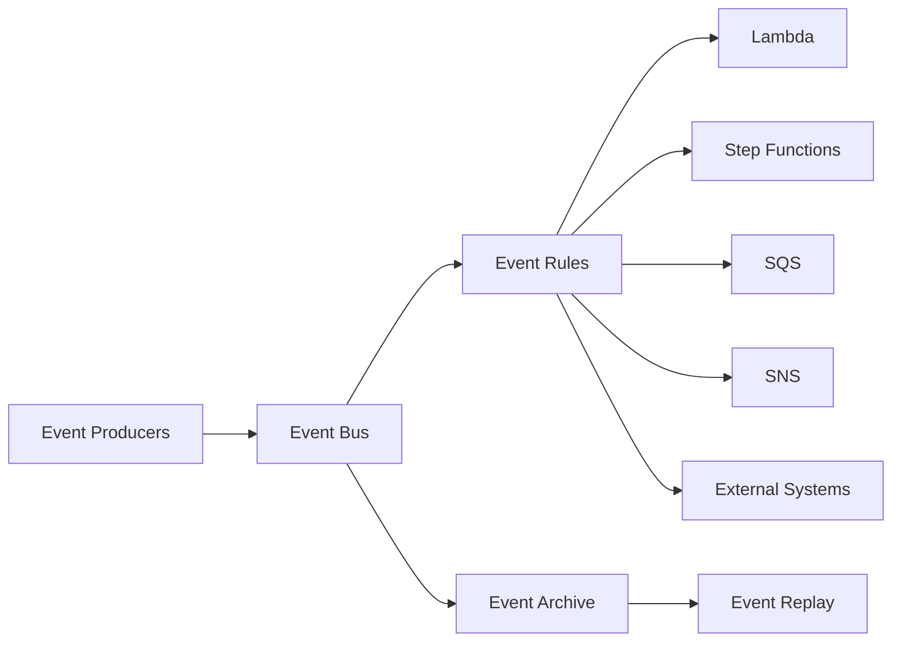

# Event-Driven Architecture con EventBridge

## Overview

### Cos'è EventBridge e perché è importante nel nostro contesto

Amazon EventBridge è un servizio di event bus serverless che semplifica la costruzione di architetture event-driven scalabili. Nel nostro sistema AI Technical Support, EventBridge funge da sistema nervoso centrale per:

- **Coordinamento servizi**: Orchestrazione loosely-coupled tra componenti (ticket processing, notifiche, analytics)
- **Event sourcing**: Tracciamento completo dello stato del sistema attraverso eventi immutabili
- **Integrazione asincrona**: Comunicazione non bloccante tra microservizi
- **Audit e compliance**: Log centralizzato di tutti gli eventi di business

EventBridge ci permette di disaccoppiare producer e consumer, rendendo il sistema più resiliente e facile da evolvere.

### Quando usarlo

EventBridge è la scelta ideale per:

✅ **Event notification**: Notificare sistemi esterni quando un ticket è completato
✅ **Fan-out patterns**: Un evento trigger multiple azioni indipendenti (logging, analytics, notifica)
✅ **Cross-account communication**: Condividere eventi tra account AWS diversi
✅ **Scheduled tasks**: Cron jobs per batch processing, cleanup, retraining
✅ **Event replay**: Riprocessare eventi storici per debugging o recovery
✅ **Schema evolution**: Gestire versioning degli eventi nel tempo

❌ **Non usare EventBridge per**:
- Code FIFO con ordering garantito → usa SQS FIFO
- Throughput estremamente alto (>10K msg/sec) → usa Kinesis
- Messaging transazionale → usa SQS + DynamoDB Transactions

### Architettura high-level



**Componenti chiave**:
- **Event Bus**: Canale logico per eventi (default o custom)
- **Rules**: Pattern matching per routing eventi
- **Targets**: Destinazioni che processano eventi (max 5 per rule)
- **Archive**: Storage long-term per replay
- **Schema Registry**: Catalogo schemi eventi con versioning

---

## Concetti Fondamentali

### Terminologia chiave

**Event**: Oggetto JSON che rappresenta un cambiamento di stato
```json
{
  "version": "0",
  "id": "6a7e8feb-b491-4cf7-a9f1-bf3703467718",
  "detail-type": "ticket.completed",
  "source": "ai-support.ticket-processing",
  "account": "123456789012",
  "time": "2025-11-18T10:30:00Z",
  "region": "us-east-1",
  "resources": ["arn:aws:dynamodb:us-east-1:123456789012:table/tickets"],
  "detail": {
    "ticket_id": "tkt_abc123",
    "status": "READY",
    "category": "hardware.ev_charger.error_E029",
    "solution_confidence": 0.92
  }
}
```

**Event Bus**: Canale su cui vengono pubblicati gli eventi
- **Default bus**: Per eventi AWS (CloudWatch, DynamoDB Streams, etc.)
- **Custom bus**: Per eventi applicazione (es. `ai-support-events`)
- **Partner bus**: Per eventi SaaS partner (Datadog, Zendesk, etc.)

**Event Rule**: Pattern di filtro che determina quali eventi instradare a quali target
```json
{
  "source": ["ai-support.ticket-processing"],
  "detail-type": ["ticket.completed"],
  "detail": {
    "status": ["READY"],
    "category": [{"prefix": "hardware."}]
  }
}
```

**Target**: Servizio AWS che processa l'evento (Lambda, Step Functions, SQS, SNS, API Gateway, etc.)

### Event vs Message: EventBridge vs SQS

| Caratteristica | EventBridge | SQS |
|----------------|-------------|-----|
| **Semantica** | Pub/Sub (broadcast) | Point-to-point (queue) |
| **Consumer** | Multiple targets (max 5/rule) | Single consumer per messaggio |
| **Ordering** | Nessuna garanzia | FIFO queue garantisce ordine |
| **Retention** | 24h (o archive illimitato) | 14 giorni max |
| **Pattern matching** | Avanzato (prefix, exists, cidr) | Nessuno |
| **Replay** | Sì (con archive) | No |
| **Costo** | $1/milione eventi custom | $0.40/milione richieste |

**Regola pratica**:
- Usa **EventBridge** per notifiche broadcast e orchestrazione loosely-coupled
- Usa **SQS** per work queues con garanzie FIFO e exactly-once processing

### Pattern comuni

#### 1. Event Notification
Notifica altri servizi quando accade qualcosa.
```
TicketCompleted → [EventBridge] → Lambda (notify customer)
                                 → SNS (ops team)
                                 → S3 (audit log)
```

#### 2. Event-Carried State Transfer
L'evento contiene tutti i dati necessari (no lookup).
```json
{
  "detail-type": "ticket.completed",
  "detail": {
    "ticket_id": "tkt_123",
    "customer": {"id": "cust_456", "email": "john@acme.com"},
    "solution": {"steps": [...], "citations": [...]}
  }
}
```

#### 3. Event Sourcing
Il sistema state è derivato dalla sequenza di eventi.
```
Event1: ticket.created
Event2: ticket.classified
Event3: ticket.solution_generated
Event4: ticket.validated
Event5: ticket.completed
→ Current State = apply(Event1, Event2, Event3, Event4, Event5)
```

#### 4. Saga Pattern (Choreography)
Workflow distribuito coordinato tramite eventi.
```
CreateTicket → ticket.created
             → ClassifyService (subscribe) → ticket.classified
                                           → RetrievalService (subscribe) → context.retrieved
                                                                          → GenerationService (subscribe) → ticket.completed
```

---

## Implementazione Pratica

### Setup step-by-step

#### 1. Creare Event Bus custom

```bash
aws events create-event-bus --name ai-support-events
```

**CloudFormation**:
```yaml
AiSupportEventBus:
  Type: AWS::Events::EventBus
  Properties:
    Name: ai-support-events

EventBusPolicy:
  Type: AWS::Events::EventBusPolicy
  Properties:
    EventBusName: !Ref AiSupportEventBus
    StatementId: AllowAccountAccess
    Statement:
      Effect: Allow
      Principal:
        AWS: !Sub 'arn:aws:iam::${AWS::AccountId}:root'
      Action:
        - events:PutEvents
      Resource: !GetAtt AiSupportEventBus.Arn
```

#### 2. Creare Schema Registry

```bash
aws schemas create-registry --registry-name ai-support-schemas
```

**Definire schema**:
```json
{
  "$schema": "http://json-schema.org/draft-07/schema#",
  "type": "object",
  "title": "TicketCompletedEvent",
  "properties": {
    "ticket_id": {
      "type": "string",
      "pattern": "^tkt_[a-zA-Z0-9]+$"
    },
    "status": {
      "type": "string",
      "enum": ["READY", "FAILED"]
    },
    "category": {
      "type": "string"
    },
    "solution_confidence": {
      "type": "number",
      "minimum": 0,
      "maximum": 1
    }
  },
  "required": ["ticket_id", "status"]
}
```

### Esempio 1: Event Publishing - Custom events from Lambda

```python
import json
import boto3
from datetime import datetime
from typing import Dict, Any

eventbridge = boto3.client('events')

class EventPublisher:
    """
    Publisher di eventi EventBridge con validazione e retry.
    """

    def __init__(self, event_bus_name: str = 'ai-support-events'):
        self.event_bus_name = event_bus_name
        self.client = eventbridge

    def publish_ticket_completed(
        self,
        ticket_id: str,
        category: str,
        confidence: float,
        metadata: Dict[str, Any]
    ) -> Dict:
        """
        Pubblica evento ticket completato.

        Args:
            ticket_id: ID del ticket
            category: Categoria classificata
            confidence: Confidence score (0-1)
            metadata: Metadati aggiuntivi

        Returns:
            Response di EventBridge
        """
        event = {
            'Source': 'ai-support.ticket-processing',
            'DetailType': 'ticket.completed',
            'Detail': json.dumps({
                'ticket_id': ticket_id,
                'status': 'READY',
                'category': category,
                'solution_confidence': confidence,
                'metadata': metadata,
                'timestamp': datetime.utcnow().isoformat()
            }),
            'EventBusName': self.event_bus_name,
            'Resources': [
                f'arn:aws:dynamodb:us-east-1:123456789012:table/tickets'
            ]
        }

        # Publish event
        response = self.client.put_events(Entries=[event])

        # Check for failures
        if response['FailedEntryCount'] > 0:
            raise Exception(f"Failed to publish event: {response['Entries']}")

        return response

    def publish_ticket_failed(
        self,
        ticket_id: str,
        error_type: str,
        error_message: str
    ):
        """
        Pubblica evento ticket fallito.
        """
        event = {
            'Source': 'ai-support.ticket-processing',
            'DetailType': 'ticket.failed',
            'Detail': json.dumps({
                'ticket_id': ticket_id,
                'status': 'FAILED',
                'error': {
                    'type': error_type,
                    'message': error_message
                },
                'timestamp': datetime.utcnow().isoformat()
            }),
            'EventBusName': self.event_bus_name
        }

        response = self.client.put_events(Entries=[event])
        return response

    def publish_batch(self, events: list) -> Dict:
        """
        Pubblica batch di eventi (max 10 per chiamata).

        Args:
            events: Lista di eventi (max 10)

        Returns:
            Response con successi e failure
        """
        if len(events) > 10:
            raise ValueError("Max 10 events per batch")

        response = self.client.put_events(Entries=events)

        return {
            'successful': response['FailedEntryCount'] == 0,
            'failed_count': response['FailedEntryCount'],
            'entries': response['Entries']
        }

# Uso in Lambda handler
def lambda_handler(event, context):
    publisher = EventPublisher()

    # Publish ticket completed event
    publisher.publish_ticket_completed(
        ticket_id='tkt_abc123',
        category='hardware.ev_charger.error_E029',
        confidence=0.92,
        metadata={
            'model': 'claude-3-sonnet',
            'latency_ms': 2340,
            'chunks_retrieved': 5
        }
    )

    return {'statusCode': 200}
```

### Esempio 2: Event Pattern Matching - Complex filters

```yaml
# CloudFormation Rule con pattern avanzato
HighConfidenceTicketRule:
  Type: AWS::Events::Rule
  Properties:
    Name: high-confidence-tickets
    EventBusName: !Ref AiSupportEventBus
    EventPattern:
      source:
        - ai-support.ticket-processing
      detail-type:
        - ticket.completed
      detail:
        # Solo ticket con confidence > 0.9
        solution_confidence:
          - numeric:
              - ">="
              - 0.9
        # Solo categorie hardware
        category:
          - prefix: "hardware."
        # Esclude test tickets
        metadata:
          environment:
            - anything-but: "test"
    State: ENABLED
    Targets:
      - Arn: !GetAtt HighQualityTicketProcessor.Arn
        Id: HighQualityProcessor

# Pattern con IP CIDR matching
SecurityEventRule:
  Type: AWS::Events::Rule
  Properties:
    Name: suspicious-api-access
    EventPattern:
      source:
        - aws.apigateway
      detail:
        sourceIPAddress:
          # Block IP ranges
          - cidr:
              - "192.0.2.0/24"
              - "198.51.100.0/24"
    Targets:
      - Arn: !GetAtt SecurityAlertFunction.Arn
        Id: SecurityAlert

# Pattern con exists check
MissingCitationRule:
  Type: AWS::Events::Rule
  Properties:
    Name: tickets-without-citations
    EventPattern:
      source:
        - ai-support.ticket-processing
      detail-type:
        - ticket.completed
      detail:
        # Tickets dove citations non esiste
        citations:
          - exists: false
    Targets:
      - Arn: !GetAtt QualityReviewQueue.Arn
        Id: QualityReview
```

**Pattern matching avanzato in Python**:
```python
# Testare pattern localmente prima di deploy
def test_event_pattern(event: dict, pattern: dict) -> bool:
    """
    Simula EventBridge pattern matching localmente.

    Returns:
        True se event matcha pattern
    """
    import re

    def match_value(event_val, pattern_val):
        if isinstance(pattern_val, dict):
            # Numeric comparison
            if 'numeric' in pattern_val:
                comparisons = pattern_val['numeric']
                for i in range(0, len(comparisons), 2):
                    op, threshold = comparisons[i], comparisons[i+1]
                    if op == '>=' and not (event_val >= threshold):
                        return False
                    elif op == '>' and not (event_val > threshold):
                        return False
                    # ... altri operatori
                return True

            # Prefix matching
            if 'prefix' in pattern_val:
                return event_val.startswith(pattern_val['prefix'])

            # Exists check
            if 'exists' in pattern_val:
                exists = event_val is not None
                return exists == pattern_val['exists']

        elif isinstance(pattern_val, list):
            # OR logic - event_val deve matchare almeno uno
            return event_val in pattern_val

        else:
            # Exact match
            return event_val == pattern_val

    # Recursive matching
    for key, pattern_value in pattern.items():
        if key not in event:
            return False

        event_value = event[key]

        if isinstance(pattern_value, dict):
            if not match_value(event_value, pattern_value):
                return False
        elif isinstance(pattern_value, list):
            if not match_value(event_value, pattern_value):
                return False

    return True

# Test
event = {
    'source': 'ai-support.ticket-processing',
    'detail-type': 'ticket.completed',
    'detail': {
        'solution_confidence': 0.95,
        'category': 'hardware.ev_charger.error_E029'
    }
}

pattern = {
    'source': ['ai-support.ticket-processing'],
    'detail': {
        'solution_confidence': {'numeric': ['>=', 0.9]},
        'category': {'prefix': 'hardware.'}
    }
}

assert test_event_pattern(event, pattern) == True
```

### Esempio 3: Fan-out Pattern - One event, multiple targets

```yaml
# CloudFormation: Un evento trigger 5 target diversi
TicketCompletedFanoutRule:
  Type: AWS::Events::Rule
  Properties:
    Name: ticket-completed-fanout
    EventBusName: !Ref AiSupportEventBus
    EventPattern:
      source:
        - ai-support.ticket-processing
      detail-type:
        - ticket.completed
    State: ENABLED
    Targets:
      # Target 1: Notifica cliente via Lambda
      - Arn: !GetAtt CustomerNotificationFunction.Arn
        Id: CustomerNotification
        RetryPolicy:
          MaximumRetryAttempts: 3
          MaximumEventAge: 3600
        DeadLetterConfig:
          Arn: !GetAtt EventDLQ.Arn

      # Target 2: Analytics pipeline via Kinesis
      - Arn: !GetAtt AnalyticsStream.Arn
        Id: Analytics
        RoleArn: !GetAtt EventBridgeKinesisRole.Arn
        KinesisParameters:
          PartitionKeyPath: $.detail.ticket_id

      # Target 3: Audit log via S3 (via Kinesis Firehose)
      - Arn: !GetAtt AuditLogFirehose.Arn
        Id: AuditLog
        RoleArn: !GetAtt EventBridgeFirehoseRole.Arn

      # Target 4: Metrics aggregation via Lambda
      - Arn: !GetAtt MetricsAggregatorFunction.Arn
        Id: MetricsAggregator
        InputTransformer:
          # Trasforma evento prima di inviare
          InputPathsMap:
            ticket_id: $.detail.ticket_id
            confidence: $.detail.solution_confidence
            category: $.detail.category
          InputTemplate: |
            {
              "metric_name": "ticket_completed",
              "ticket_id": "<ticket_id>",
              "dimensions": {
                "category": "<category>"
              },
              "value": <confidence>
            }

      # Target 5: Training pipeline trigger via Step Functions
      - Arn: !GetAtt TrainingPipelineStateMachine.Arn
        Id: TrainingPipeline
        RoleArn: !GetAtt EventBridgeStepFunctionsRole.Arn
        # Solo se confidence bassa (serve retraining)
        # Nota: filtering aggiuntivo gestito dalla state machine

EventDLQ:
  Type: AWS::SQS::Queue
  Properties:
    QueueName: eventbridge-dlq
    MessageRetentionPeriod: 1209600  # 14 giorni

# IAM Roles per targets
EventBridgeKinesisRole:
  Type: AWS::IAM::Role
  Properties:
    AssumeRolePolicyDocument:
      Statement:
        - Effect: Allow
          Principal:
            Service: events.amazonaws.com
          Action: sts:AssumeRole
    Policies:
      - PolicyName: PutKinesisRecords
        PolicyDocument:
          Statement:
            - Effect: Allow
              Action:
                - kinesis:PutRecord
                - kinesis:PutRecords
              Resource: !GetAtt AnalyticsStream.Arn
```

**Gestione Dead Letter Queue**:
```python
import boto3
import json

sqs = boto3.client('sqs')
eventbridge = boto3.client('events')

def process_failed_events():
    """
    Processa eventi falliti in DLQ per retry o alerting.
    """
    dlq_url = 'https://sqs.us-east-1.amazonaws.com/123456789012/eventbridge-dlq'

    while True:
        # Receive failed events
        response = sqs.receive_message(
            QueueUrl=dlq_url,
            MaxNumberOfMessages=10,
            WaitTimeSeconds=20
        )

        if 'Messages' not in response:
            break

        for message in response['Messages']:
            try:
                failed_event = json.loads(message['Body'])

                # Log failure
                print(f"Failed event: {failed_event}")

                # Retry logic
                if should_retry(failed_event):
                    # Re-publish to EventBridge
                    eventbridge.put_events(Entries=[failed_event])
                else:
                    # Alert ops team
                    send_alert(failed_event)

                # Delete from DLQ
                sqs.delete_message(
                    QueueUrl=dlq_url,
                    ReceiptHandle=message['ReceiptHandle']
                )

            except Exception as e:
                print(f"Error processing DLQ message: {e}")

def should_retry(event: dict) -> bool:
    """Determina se evento dovrebbe essere ritentato."""
    # Retry solo se errore transiente
    error_code = event.get('errorCode')
    return error_code in ['ThrottlingException', 'ServiceUnavailable']
```

### Esempio 4: Event Transformation - Input transformer

```yaml
# Trasforma evento prima di inviare a target
TransformTicketEventRule:
  Type: AWS::Events::Rule
  Properties:
    Name: transform-ticket-for-external-api
    EventPattern:
      source:
        - ai-support.ticket-processing
      detail-type:
        - ticket.completed
    Targets:
      - Arn: !GetAtt ExternalAPIFunction.Arn
        Id: ExternalAPI
        InputTransformer:
          # Estrai campi dall'evento
          InputPathsMap:
            ticketId: $.detail.ticket_id
            customerEmail: $.detail.metadata.customer.email
            category: $.detail.category
            confidence: $.detail.solution_confidence
            steps: $.detail.solution.steps
            timestamp: $.time
          # Costruisci nuovo payload
          InputTemplate: |
            {
              "id": "<ticketId>",
              "customer": {
                "email": "<customerEmail>"
              },
              "resolution": {
                "category": "<category>",
                "confidence": <confidence>,
                "steps": <steps>
              },
              "completed_at": "<timestamp>"
            }
```

**Input Transformer in Python (per testing locale)**:
```python
from typing import Dict, Any
import json
import re

class InputTransformer:
    """
    Simula EventBridge InputTransformer localmente.
    """

    def __init__(self, input_paths: Dict[str, str], template: str):
        self.input_paths = input_paths
        self.template = template

    def transform(self, event: Dict[str, Any]) -> Dict[str, Any]:
        """
        Applica trasformazione a evento.

        Args:
            event: Evento EventBridge

        Returns:
            Payload trasformato
        """
        # 1. Estrai valori usando JSONPath
        extracted_values = {}
        for key, path in self.input_paths.items():
            extracted_values[key] = self._extract_value(event, path)

        # 2. Sostituisci nel template
        transformed = self.template
        for key, value in extracted_values.items():
            # Handle strings vs objects
            if isinstance(value, (dict, list)):
                replacement = json.dumps(value)
            else:
                replacement = str(value)

            transformed = transformed.replace(f'<{key}>', replacement)

        # 3. Parse JSON finale
        return json.loads(transformed)

    def _extract_value(self, obj: Any, path: str) -> Any:
        """
        Estrae valore da object usando JSONPath semplificato.

        Es: $.detail.ticket_id → obj['detail']['ticket_id']
        """
        # Remove $. prefix
        path = path.lstrip('$.')

        # Split on dots
        keys = path.split('.')

        current = obj
        for key in keys:
            if isinstance(current, dict):
                current = current.get(key)
            else:
                return None

        return current

# Test
event = {
    'detail': {
        'ticket_id': 'tkt_123',
        'category': 'hardware.ev_charger',
        'solution_confidence': 0.92,
        'solution': {
            'steps': [
                {'order': 1, 'text': 'Check power'},
                {'order': 2, 'text': 'Reset device'}
            ]
        },
        'metadata': {
            'customer': {
                'email': 'john@acme.com'
            }
        }
    },
    'time': '2025-11-18T10:30:00Z'
}

transformer = InputTransformer(
    input_paths={
        'ticketId': '$.detail.ticket_id',
        'customerEmail': '$.detail.metadata.customer.email',
        'category': '$.detail.category',
        'confidence': '$.detail.solution_confidence',
        'steps': '$.detail.solution.steps',
        'timestamp': '$.time'
    },
    template='''{
        "id": "<ticketId>",
        "customer": {"email": "<customerEmail>"},
        "resolution": {
            "category": "<category>",
            "confidence": <confidence>,
            "steps": <steps>
        },
        "completed_at": "<timestamp>"
    }'''
)

result = transformer.transform(event)
print(json.dumps(result, indent=2))
```

### Esempio 5: Scheduled Events - Cron expressions

```yaml
# CloudFormation: Scheduled rules (cron jobs)

# Daily retraining job (ogni giorno alle 2 AM UTC)
DailyRetrainingSchedule:
  Type: AWS::Events::Rule
  Properties:
    Name: daily-model-retraining
    Description: Trigger model retraining pipeline daily
    ScheduleExpression: cron(0 2 * * ? *)
    State: ENABLED
    Targets:
      - Arn: !GetAtt RetrainingStateMachine.Arn
        Id: RetrainingPipeline
        RoleArn: !GetAtt ScheduledRuleRole.Arn

# Cleanup expired sessions (ogni ora)
HourlySessionCleanup:
  Type: AWS::Events::Rule
  Properties:
    Name: hourly-session-cleanup
    ScheduleExpression: rate(1 hour)
    State: ENABLED
    Targets:
      - Arn: !GetAtt SessionCleanupFunction.Arn
        Id: SessionCleanup

# Weekly analytics report (ogni lunedì alle 9 AM)
WeeklyReportSchedule:
  Type: AWS::Events::Rule
  Properties:
    Name: weekly-analytics-report
    ScheduleExpression: cron(0 9 ? * MON *)
    State: ENABLED
    Targets:
      - Arn: !GetAtt ReportGeneratorFunction.Arn
        Id: ReportGenerator
        Input: |
          {
            "report_type": "weekly",
            "recipients": ["ops@company.com"]
          }

# Monthly cost analysis (primo giorno del mese alle 8 AM)
MonthlyCostAnalysis:
  Type: AWS::Events::Rule
  Properties:
    Name: monthly-cost-analysis
    ScheduleExpression: cron(0 8 1 * ? *)
    State: ENABLED
    Targets:
      - Arn: !GetAtt CostAnalysisFunction.Arn
        Id: CostAnalysis
```

**Cron Expression Syntax**:
```
cron(Minutes Hours Day-of-month Month Day-of-week Year)

Esempi:
cron(0 10 * * ? *)          # Ogni giorno alle 10:00 AM UTC
cron(15 12 * * ? *)         # Ogni giorno alle 12:15 PM UTC
cron(0 18 ? * MON-FRI *)    # Weekdays alle 6 PM UTC
cron(0 8 1 * ? *)           # Primo giorno del mese alle 8 AM
cron(0/15 * * * ? *)        # Ogni 15 minuti
cron(0 0/1 * * ? *)         # Ogni ora

Rate expressions:
rate(5 minutes)             # Ogni 5 minuti
rate(1 hour)                # Ogni ora
rate(7 days)                # Ogni 7 giorni
```

**Lambda per scheduled job**:
```python
import boto3
from datetime import datetime, timedelta

dynamodb = boto3.resource('dynamodb')

def cleanup_expired_sessions(event, context):
    """
    Lambda triggered ogni ora per cleanup sessioni expire.

    Args:
        event: EventBridge scheduled event
        context: Lambda context
    """
    # Event contiene metadata dello schedule
    print(f"Triggered at: {event['time']}")
    print(f"Schedule: {event.get('resources', [])}")

    # Calcola cutoff (sessioni > 24h)
    cutoff_timestamp = int((datetime.utcnow() - timedelta(hours=24)).timestamp())

    # Scan DynamoDB per sessioni expired
    table = dynamodb.Table('sessions')
    response = table.scan(
        FilterExpression='last_activity < :cutoff',
        ExpressionAttributeValues={
            ':cutoff': cutoff_timestamp
        }
    )

    # Delete batch
    with table.batch_writer() as batch:
        for item in response['Items']:
            batch.delete_item(Key={'session_id': item['session_id']})

    deleted_count = len(response['Items'])
    print(f"Deleted {deleted_count} expired sessions")

    return {
        'statusCode': 200,
        'deleted_count': deleted_count
    }
```

### Esempio 6: Cross-Account Events - Event sharing

```yaml
# Account A (Producer): Policy per condividere eventi
ProducerAccountEventBusPolicy:
  Type: AWS::Events::EventBusPolicy
  Properties:
    EventBusName: ai-support-events
    StatementId: AllowCrossAccountAccess
    Statement:
      Effect: Allow
      Principal:
        AWS:
          - arn:aws:iam::999999999999:root  # Account B
      Action:
        - events:PutEvents
      Resource: !GetAtt AiSupportEventBus.Arn

# Account B (Consumer): Rule che riceve eventi da Account A
ConsumerAccountRule:
  Type: AWS::Events::Rule
  Properties:
    Name: receive-tickets-from-account-a
    EventBusName: default  # In Account B
    EventPattern:
      account:
        - "123456789012"  # Account A
      source:
        - ai-support.ticket-processing
      detail-type:
        - ticket.completed
    State: ENABLED
    Targets:
      - Arn: !GetAtt ProcessTicketFunction.Arn
        Id: TicketProcessor
```

**Python: Pubblicare eventi cross-account**:
```python
import boto3
import json

# In Account A: publish to Account B's event bus
eventbridge_a = boto3.client('events', region_name='us-east-1')

def publish_cross_account_event(
    target_account_id: str,
    target_region: str,
    event_detail: dict
):
    """
    Pubblica evento su event bus in altro account.

    Args:
        target_account_id: AWS account ID destinazione
        target_region: Region destinazione
        event_detail: Dettagli evento
    """
    target_event_bus_arn = (
        f"arn:aws:events:{target_region}:{target_account_id}:"
        f"event-bus/ai-support-events"
    )

    response = eventbridge_a.put_events(
        Entries=[
            {
                'Source': 'ai-support.ticket-processing',
                'DetailType': 'ticket.completed',
                'Detail': json.dumps(event_detail),
                'EventBusName': target_event_bus_arn
            }
        ]
    )

    if response['FailedEntryCount'] > 0:
        raise Exception(f"Failed to publish: {response['Entries']}")

    return response

# Usage
publish_cross_account_event(
    target_account_id='999999999999',
    target_region='us-east-1',
    event_detail={
        'ticket_id': 'tkt_123',
        'status': 'READY'
    }
)
```

### Esempio 7: Archive & Replay - Event sourcing pattern

```yaml
# CloudFormation: Event Archive configuration
TicketEventsArchive:
  Type: AWS::Events::Archive
  Properties:
    ArchiveName: ticket-events-archive
    SourceArn: !GetAtt AiSupportEventBus.Arn
    Description: Archive all ticket processing events
    EventPattern:
      source:
        - ai-support.ticket-processing
    RetentionDays: 90  # 0 = indefinito

# Archive solo eventi falliti (per debugging)
FailedTicketsArchive:
  Type: AWS::Events::Archive
  Properties:
    ArchiveName: failed-tickets-archive
    SourceArn: !GetAtt AiSupportEventBus.Arn
    EventPattern:
      source:
        - ai-support.ticket-processing
      detail-type:
        - ticket.failed
    RetentionDays: 0  # Keep forever
```

**Python: Replay eventi storici**:
```python
import boto3
from datetime import datetime, timedelta

eventbridge = boto3.client('events')

def replay_events(
    archive_name: str,
    start_time: datetime,
    end_time: datetime,
    destination_bus: str = 'ai-support-events'
):
    """
    Replay eventi da archive per re-processing o debugging.

    Args:
        archive_name: Nome archive
        start_time: Inizio finestra temporale
        end_time: Fine finestra temporale
        destination_bus: Event bus destinazione

    Returns:
        Replay ARN
    """
    response = eventbridge.start_replay(
        ReplayName=f'replay-{datetime.utcnow().strftime("%Y%m%d-%H%M%S")}',
        Description='Replay failed tickets for debugging',
        EventSourceArn=f'arn:aws:events:us-east-1:123456789012:archive/{archive_name}',
        EventStartTime=start_time,
        EventEndTime=end_time,
        Destination={
            'Arn': f'arn:aws:events:us-east-1:123456789012:event-bus/{destination_bus}'
        }
    )

    replay_arn = response['ReplayArn']
    print(f"Started replay: {replay_arn}")

    # Monitor replay progress
    while True:
        status = eventbridge.describe_replay(ReplayName=replay_arn.split('/')[-1])
        state = status['State']

        if state in ['COMPLETED', 'FAILED', 'CANCELLED']:
            print(f"Replay {state}")
            print(f"Events replayed: {status.get('EventLastReplayedTime')}")
            break

        print(f"Replay in progress: {state}")
        time.sleep(10)

    return replay_arn

# Usage: Replay last 24 hours of failed tickets
replay_events(
    archive_name='failed-tickets-archive',
    start_time=datetime.utcnow() - timedelta(days=1),
    end_time=datetime.utcnow(),
    destination_bus='ai-support-events-replay'  # Replay su bus separato per safety
)
```

**Event Sourcing Pattern**:
```python
from typing import List, Dict, Any
from dataclasses import dataclass
from datetime import datetime

@dataclass
class Event:
    event_id: str
    event_type: str
    timestamp: datetime
    data: Dict[str, Any]

class TicketAggregate:
    """
    Aggregate che ricostruisce stato da event stream.
    """

    def __init__(self, ticket_id: str):
        self.ticket_id = ticket_id
        self.status = 'NEW'
        self.category = None
        self.solution = None
        self.events: List[Event] = []

    def apply_event(self, event: Event):
        """
        Applica evento per aggiornare stato.
        """
        self.events.append(event)

        if event.event_type == 'ticket.created':
            self.status = 'NEW'

        elif event.event_type == 'ticket.classified':
            self.category = event.data['category']
            self.status = 'CLASSIFIED'

        elif event.event_type == 'ticket.solution_generated':
            self.solution = event.data['solution']
            self.status = 'PROCESSING'

        elif event.event_type == 'ticket.completed':
            self.status = 'READY'

        elif event.event_type == 'ticket.failed':
            self.status = 'FAILED'

    def reconstruct_from_events(self, events: List[Event]):
        """
        Ricostruisce stato corrente da event stream.
        """
        for event in sorted(events, key=lambda e: e.timestamp):
            self.apply_event(event)

    def get_snapshot(self) -> Dict:
        """
        Snapshot stato corrente.
        """
        return {
            'ticket_id': self.ticket_id,
            'status': self.status,
            'category': self.category,
            'solution': self.solution,
            'event_count': len(self.events),
            'last_updated': self.events[-1].timestamp if self.events else None
        }

# Usage: Reconstruct ticket state from events
ticket = TicketAggregate('tkt_123')
events_from_archive = fetch_events_from_archive('tkt_123')
ticket.reconstruct_from_events(events_from_archive)
print(ticket.get_snapshot())
```

### Esempio 8: Schema Discovery - Automatic schema inference

```python
import boto3
import json

schemas = boto3.client('schemas')

def enable_schema_discovery(event_bus_name: str, registry_name: str):
    """
    Abilita schema discovery automatico su event bus.

    EventBridge analizza eventi pubblicati e genera schemi automaticamente.
    """
    response = schemas.put_discoverer(
        DiscovererId=f'{event_bus_name}-discoverer',
        SourceArn=f'arn:aws:events:us-east-1:123456789012:event-bus/{event_bus_name}',
        Description=f'Schema discovery for {event_bus_name}',
        State='STARTED'
    )

    return response

def get_schema(schema_name: str, registry_name: str = 'ai-support-schemas'):
    """
    Recupera schema generato automaticamente.

    Returns:
        OpenAPI 3.0 schema
    """
    response = schemas.describe_schema(
        RegistryName=registry_name,
        SchemaName=schema_name
    )

    schema_content = response['Content']
    return json.loads(schema_content)

def generate_code_bindings(
    schema_name: str,
    language: str = 'Python3',
    registry_name: str = 'ai-support-schemas'
):
    """
    Genera code bindings da schema per type safety.

    Args:
        schema_name: Nome schema
        language: Python3, Java8, TypeScript3
        registry_name: Nome registry
    """
    # Request code generation
    response = schemas.put_code_binding(
        RegistryName=registry_name,
        SchemaName=schema_name,
        Language=language
    )

    # Download generated code
    code_response = schemas.get_code_binding_source(
        RegistryName=registry_name,
        SchemaName=schema_name,
        Language=language
    )

    return code_response['Body'].read()

# Enable discovery
enable_schema_discovery('ai-support-events', 'ai-support-schemas')

# Dopo che eventi sono pubblicati, recupera schema
schema = get_schema('ai-support.ticket-processing@ticket.completed')
print(json.dumps(schema, indent=2))

# Genera Python bindings
python_code = generate_code_bindings(
    'ai-support.ticket-processing@ticket.completed',
    language='Python3'
)
print(python_code.decode())
```

**Uso code bindings generati**:
```python
# Code generato da schema discovery
# File: aws_events_schemas/aisuport_ticketprocessing_ticketcompleted.py

from dataclasses import dataclass
from typing import Optional

@dataclass
class TicketCompletedDetail:
    ticket_id: str
    status: str
    category: str
    solution_confidence: float
    metadata: Optional[dict] = None

    @classmethod
    def from_dict(cls, data: dict):
        return cls(**data)

@dataclass
class TicketCompletedEvent:
    version: str
    id: str
    detail_type: str
    source: str
    account: str
    time: str
    region: str
    resources: list
    detail: TicketCompletedDetail

    @classmethod
    def from_dict(cls, data: dict):
        detail = TicketCompletedDetail.from_dict(data['detail'])
        return cls(
            version=data['version'],
            id=data['id'],
            detail_type=data['detail-type'],
            source=data['source'],
            account=data['account'],
            time=data['time'],
            region=data['region'],
            resources=data['resources'],
            detail=detail
        )

# Usage in Lambda with type safety
def lambda_handler(event, context):
    # Parse con validazione type
    ticket_event = TicketCompletedEvent.from_dict(event)

    # IDE autocomplete funziona!
    ticket_id = ticket_event.detail.ticket_id
    confidence = ticket_event.detail.solution_confidence

    print(f"Processing ticket {ticket_id} with confidence {confidence}")
```

---

## Best Practices

### Do's and Don'ts

#### ✅ DO

**1. Usa Custom Event Buses per separare concern**
```yaml
# Separa eventi di dominio diversi
ProductionEventBus:
  Type: AWS::Events::EventBus
  Properties:
    Name: production-events

AnalyticsEventBus:
  Type: AWS::Events::EventBus
  Properties:
    Name: analytics-events

AuditEventBus:
  Type: AWS::Events::EventBus
  Properties:
    Name: audit-events
```

**2. Implementa Idempotency**
```python
import hashlib
import boto3

dynamodb = boto3.resource('dynamodb')

def lambda_handler(event, context):
    """
    Handler idempotent usando event ID come deduplication key.
    """
    event_id = event['id']  # EventBridge event ID (unique)

    # Check if already processed
    table = dynamodb.Table('processed-events')
    response = table.get_item(Key={'event_id': event_id})

    if 'Item' in response:
        print(f"Event {event_id} already processed, skipping")
        return {'statusCode': 200, 'body': 'Already processed'}

    # Process event
    result = process_event(event)

    # Mark as processed
    table.put_item(Item={
        'event_id': event_id,
        'processed_at': datetime.utcnow().isoformat(),
        'result': result
    })

    return {'statusCode': 200, 'body': 'Processed'}
```

**3. Usa Dead Letter Queues**
```yaml
TicketProcessingRule:
  Type: AWS::Events::Rule
  Properties:
    Targets:
      - Arn: !GetAtt ProcessorFunction.Arn
        Id: Processor
        RetryPolicy:
          MaximumRetryAttempts: 3
          MaximumEventAge: 3600  # 1 ora
        DeadLetterConfig:
          Arn: !GetAtt FailedEventsDLQ.Arn
```

**4. Versiona gli schemi**
```python
# Includi versione nello schema
{
    "version": "1.0",
    "detail-type": "ticket.completed.v1",
    "detail": {
        "schema_version": "1.0",
        ...
    }
}

# Gestisci backward compatibility
def handle_event(event):
    schema_version = event['detail'].get('schema_version', '1.0')

    if schema_version == '1.0':
        return handle_v1(event)
    elif schema_version == '2.0':
        return handle_v2(event)
    else:
        raise ValueError(f"Unsupported schema version: {schema_version}")
```

**5. Monitora metriche EventBridge**
```python
import boto3

cloudwatch = boto3.client('cloudwatch')

# Publish custom metric
cloudwatch.put_metric_data(
    Namespace='AI-Support/EventBridge',
    MetricData=[
        {
            'MetricName': 'EventsPublished',
            'Value': 1,
            'Unit': 'Count',
            'Dimensions': [
                {'Name': 'EventType', 'Value': 'ticket.completed'},
                {'Name': 'Source', 'Value': 'ai-support.ticket-processing'}
            ]
        }
    ]
)
```

#### ❌ DON'T

**1. Non pubblicare eventi enormi**
```python
# ❌ BAD: Event > 256 KB
eventbridge.put_events(Entries=[{
    'Source': 'ai-support',
    'DetailType': 'ticket.completed',
    'Detail': json.dumps({
        'ticket_id': 'tkt_123',
        'full_solution': '...' * 100000  # Troppo grande!
    })
}])

# ✅ GOOD: Usa reference pattern
eventbridge.put_events(Entries=[{
    'Source': 'ai-support',
    'DetailType': 'ticket.completed',
    'Detail': json.dumps({
        'ticket_id': 'tkt_123',
        's3_solution_uri': 's3://bucket/solutions/tkt_123.json'  # Reference
    })
}])
```

**2. Non usare EventBridge per FIFO**
```python
# ❌ BAD: EventBridge non garantisce ordering
# Eventi possono arrivare out-of-order
eventbridge.put_events(Entries=[
    {'DetailType': 'step1'},
    {'DetailType': 'step2'},
    {'DetailType': 'step3'}
])

# ✅ GOOD: Usa SQS FIFO o include sequence number
eventbridge.put_events(Entries=[{
    'DetailType': 'workflow.step',
    'Detail': json.dumps({
        'workflow_id': 'wf_123',
        'sequence_number': 1,  # Gestisci ordering nel consumer
        'step': 'classify'
    })
}])
```

**3. Non ignorare failed entries**
```python
# ❌ BAD: Non controlla failures
response = eventbridge.put_events(Entries=[...])
# Assume success

# ✅ GOOD: Gestisci failures
response = eventbridge.put_events(Entries=[...])
if response['FailedEntryCount'] > 0:
    for entry in response['Entries']:
        if 'ErrorCode' in entry:
            logger.error(f"Failed to publish: {entry['ErrorCode']}")
            # Retry o alert
```

**4. Non fare polling su EventBridge**
```python
# ❌ BAD: Polling (EventBridge è push-based!)
while True:
    events = eventbridge.list_events()  # Non esiste!
    time.sleep(1)

# ✅ GOOD: Usa push pattern con Lambda/SQS target
# EventBridge invoca Lambda quando evento matcha rule
```

### Performance optimization

**1. Batch publishing**
```python
def publish_events_batch(events: list):
    """
    Pubblica fino a 10 eventi in single API call.
    """
    # EventBridge supporta max 10 entries per put_events
    batch_size = 10

    for i in range(0, len(events), batch_size):
        batch = events[i:i+batch_size]

        response = eventbridge.put_events(Entries=batch)

        if response['FailedEntryCount'] > 0:
            # Handle failures
            handle_failed_entries(response['Entries'])
```

**2. Pattern matching optimization**
```yaml
# ❌ SLOW: Rule troppo generica
SlowRule:
  Type: AWS::Events::Rule
  Properties:
    EventPattern:
      source:
        - prefix: ""  # Matcha tutto!

# ✅ FAST: Rule specifica
FastRule:
  Type: AWS::Events::Rule
  Properties:
    EventPattern:
      source:
        - ai-support.ticket-processing
      detail-type:
        - ticket.completed
      detail:
        category:
          - prefix: "hardware."
```

**3. Target invocation async**
```python
# Lambda target processa async
def lambda_handler(event, context):
    # EventBridge invoca Lambda async (non attende risposta)
    # Lambda può processare in parallelo

    # Per long-running tasks, usa Step Functions target
    pass
```

### Security considerations

**1. IAM Least Privilege**
```yaml
# Policy per pubblicare solo eventi specifici
PublishTicketEventsPolicy:
  Type: AWS::IAM::Policy
  Properties:
    PolicyDocument:
      Statement:
        - Effect: Allow
          Action:
            - events:PutEvents
          Resource:
            - !GetAtt AiSupportEventBus.Arn
          Condition:
            StringEquals:
              events:source:
                - ai-support.ticket-processing
              events:detail-type:
                - ticket.completed
                - ticket.failed
```

**2. Event Bus Policy (Resource-based)**
```yaml
EventBusPolicy:
  Type: AWS::Events::EventBusPolicy
  Properties:
    EventBusName: !Ref AiSupportEventBus
    StatementId: AllowSpecificAccount
    Statement:
      Effect: Allow
      Principal:
        AWS: !Sub 'arn:aws:iam::${TrustedAccountId}:root'
      Action: events:PutEvents
      Resource: !GetAtt AiSupportEventBus.Arn
      Condition:
        StringEquals:
          events:source:
            - trusted-service.events
```

**3. PII Filtering**
```python
import re

def sanitize_event(event_detail: dict) -> dict:
    """
    Rimuovi PII da eventi prima di pubblicare.
    """
    # Redact email
    if 'customer_email' in event_detail:
        email = event_detail['customer_email']
        event_detail['customer_email_hash'] = hashlib.sha256(
            email.encode()
        ).hexdigest()
        del event_detail['customer_email']

    # Redact phone
    if 'phone' in event_detail:
        del event_detail['phone']

    # Redact credit card (regex)
    text = json.dumps(event_detail)
    text = re.sub(r'\b\d{4}[-\s]?\d{4}[-\s]?\d{4}[-\s]?\d{4}\b', '[REDACTED]', text)

    return json.loads(text)
```

### Cost optimization

**1. Usa Archive selettivamente**
```yaml
# Archive solo eventi critici (non tutto)
CriticalEventsArchive:
  Type: AWS::Events::Archive
  Properties:
    ArchiveName: critical-events-only
    SourceArn: !GetAtt AiSupportEventBus.Arn
    EventPattern:
      detail-type:
        - ticket.failed
        - security.alert
        - payment.completed
    RetentionDays: 90  # Non infinito!
```

**2. Monitora costi**
```python
# EventBridge pricing:
# - AWS service events: FREE
# - Custom events: $1.00 per million
# - Cross-region: $0.01 per GB

# Stima costo mensile
def estimate_monthly_cost(events_per_day: int, avg_event_size_kb: float):
    """
    Stima costo mensile EventBridge.
    """
    events_per_month = events_per_day * 30

    # Custom events cost
    custom_events_cost = (events_per_month / 1_000_000) * 1.00

    # Data transfer (se cross-region)
    data_gb = (events_per_month * avg_event_size_kb) / (1024 * 1024)
    transfer_cost = data_gb * 0.01

    total = custom_events_cost + transfer_cost

    return {
        'events_per_month': events_per_month,
        'custom_events_cost': custom_events_cost,
        'transfer_cost': transfer_cost,
        'total_monthly_cost': total
    }

# Es: 1M eventi/giorno, 5KB ciascuno
print(estimate_monthly_cost(1_000_000, 5))
# Output: ~$30/mese
```

---

## Troubleshooting

### Problemi comuni e soluzioni

#### 1. Eventi non arrivano a target

**Sintomo**: Rule configurata, ma Lambda non viene invocata

**Cause**:
- Pattern non matcha eventi
- Target non ha permission
- Rule disabilitata
- Event bus errato

**Soluzione**:
```python
# Debug: Testa pattern localmente
def test_rule_pattern():
    event = {
        'source': 'ai-support.ticket-processing',
        'detail-type': 'ticket.completed',
        'detail': {
            'ticket_id': 'tkt_123',
            'status': 'READY'
        }
    }

    pattern = {
        'source': ['ai-support.ticket-processing'],
        'detail-type': ['ticket.completed']
    }

    # Usa AWS CLI per test
    import subprocess
    result = subprocess.run([
        'aws', 'events', 'test-event-pattern',
        '--event-pattern', json.dumps(pattern),
        '--event', json.dumps(event)
    ], capture_output=True)

    print(f"Pattern matches: {result.stdout.decode()}")

# Verifica permissions
def check_lambda_permission(function_name: str, rule_arn: str):
    lambda_client = boto3.client('lambda')

    try:
        policy = lambda_client.get_policy(FunctionName=function_name)
        print(f"Lambda policy: {policy}")

        # Verifica che rule_arn abbia permission lambda:InvokeFunction
    except Exception as e:
        print(f"Error: {e}")
        print("Aggiungi permission con:")
        print(f"aws lambda add-permission --function-name {function_name} "
              f"--statement-id AllowEventBridge --action lambda:InvokeFunction "
              f"--principal events.amazonaws.com --source-arn {rule_arn}")
```

#### 2. Eventi duplicati

**Sintomo**: Target riceve stesso evento multiple volte

**Cause**:
- Lambda retry automatici (errore nel handler)
- Multiple rules che matchano stesso evento
- Publisher pubblica duplicati

**Soluzione**:
```python
# Implementa idempotency token
import hashlib

def make_idempotent(func):
    """
    Decorator per garantire idempotency.
    """
    processed_ids = set()  # In prod usa DynamoDB!

    def wrapper(event, context):
        # Use EventBridge event ID come idempotency key
        event_id = event.get('id')

        if event_id in processed_ids:
            print(f"Event {event_id} already processed")
            return {'statusCode': 200, 'body': 'Duplicate'}

        # Process
        result = func(event, context)

        # Mark processed
        processed_ids.add(event_id)

        return result

    return wrapper

@make_idempotent
def lambda_handler(event, context):
    # Your logic here
    pass
```

#### 3. Eventi persi

**Sintomo**: Eventi pubblicati ma non visibili in CloudWatch Logs

**Cause**:
- `FailedEntryCount` > 0 non gestito
- Event troppo grande (> 256 KB)
- Throttling
- Event bus errato

**Soluzione**:
```python
import time

def publish_with_retry(event, max_retries=3):
    """
    Pubblica con retry automatico su throttling.
    """
    for attempt in range(max_retries):
        try:
            response = eventbridge.put_events(Entries=[event])

            if response['FailedEntryCount'] == 0:
                return response

            # Check error
            error = response['Entries'][0].get('ErrorCode')

            if error == 'ThrottlingException':
                # Exponential backoff
                sleep_time = 2 ** attempt
                print(f"Throttled, retrying in {sleep_time}s...")
                time.sleep(sleep_time)
            else:
                raise Exception(f"Publish failed: {error}")

        except Exception as e:
            if attempt == max_retries - 1:
                raise
            time.sleep(2 ** attempt)

    raise Exception("Max retries exceeded")
```

#### 4. Archive replay non funziona

**Sintomo**: Replay started ma nessun evento riprocessato

**Cause**:
- Finestra temporale errata
- Archive non contiene eventi (pattern non matcha)
- Destination event bus non ha rules

**Soluzione**:
```python
def debug_archive(archive_name: str):
    """
    Verifica contenuto archive.
    """
    # Describe archive
    response = eventbridge.describe_archive(ArchiveName=archive_name)

    print(f"Archive: {archive_name}")
    print(f"Event count: {response.get('EventCount', 'N/A')}")
    print(f"Size bytes: {response.get('SizeBytes', 'N/A')}")
    print(f"Retention days: {response.get('RetentionDays', 'Indefinite')}")
    print(f"State: {response.get('State')}")

    # Se EventCount = 0, pattern non matcha
    if response.get('EventCount', 0) == 0:
        print("⚠️ Archive vuoto! Verifica EventPattern.")
        print(f"Pattern: {response.get('EventPattern')}")

debug_archive('ticket-events-archive')
```

#### 5. Schema versioning conflicts

**Sintomo**: Schema discovery crea versioni multiple dello stesso evento

**Soluzione**:
```python
# Usa schema esplicito invece di discovery
schemas_client = boto3.client('schemas')

def create_schema_version(
    registry_name: str,
    schema_name: str,
    schema_content: dict,
    version: str
):
    """
    Crea versione esplicita dello schema.
    """
    response = schemas_client.create_schema(
        RegistryName=registry_name,
        SchemaName=f'{schema_name}.v{version}',
        Type='OpenApi3',
        Content=json.dumps(schema_content)
    )

    return response

# Define schema explicitly
ticket_completed_schema = {
    "openapi": "3.0.0",
    "info": {
        "version": "1.0.0",
        "title": "TicketCompleted"
    },
    "components": {
        "schemas": {
            "TicketCompleted": {
                "type": "object",
                "required": ["ticket_id", "status"],
                "properties": {
                    "ticket_id": {"type": "string"},
                    "status": {"type": "string"}
                }
            }
        }
    }
}

create_schema_version(
    'ai-support-schemas',
    'ticket.completed',
    ticket_completed_schema,
    '1.0'
)
```

### Debug techniques

**1. CloudWatch Logs Insights queries**
```sql
-- Eventi pubblicati per type
fields @timestamp, `detail-type`, detail.ticket_id
| filter source = 'ai-support.ticket-processing'
| stats count() by `detail-type`

-- Eventi falliti
fields @timestamp, detail.error.type, detail.error.message
| filter `detail-type` = 'ticket.failed'
| sort @timestamp desc
| limit 20

-- Latency da evento a processing
fields @timestamp, detail.ticket_id,
       (datefloor(@timestamp, 1s) - datefloor(detail.created_at, 1s)) as latency_seconds
| filter `detail-type` = 'ticket.completed'
| stats avg(latency_seconds), max(latency_seconds), min(latency_seconds)
```

**2. X-Ray tracing**
```python
from aws_xray_sdk.core import xray_recorder
from aws_xray_sdk.core import patch_all

# Patch AWS SDK
patch_all()

@xray_recorder.capture('publish_event')
def publish_ticket_event(ticket_id):
    # Trace EventBridge call
    eventbridge.put_events(...)
```

**3. Metric alarms**
```yaml
FailedEventsAlarm:
  Type: AWS::CloudWatch::Alarm
  Properties:
    AlarmName: eventbridge-failed-events
    MetricName: FailedInvocations
    Namespace: AWS/Events
    Statistic: Sum
    Period: 300
    EvaluationPeriods: 1
    Threshold: 5
    ComparisonOperator: GreaterThanThreshold
    Dimensions:
      - Name: RuleName
        Value: ticket-completed-rule

ThrottledEventsAlarm:
  Type: AWS::CloudWatch::Alarm
  Properties:
    AlarmName: eventbridge-throttled-events
    MetricName: ThrottledRules
    Namespace: AWS/Events
    Statistic: Sum
    Period: 60
    Threshold: 10
    ComparisonOperator: GreaterThanThreshold
```

---

## Esempi Reali dal Progetto

### Esempio 1: Ticket Processing Notification Flow

```python
"""
Real-world example: Notification flow quando ticket è completato.

Flow:
1. Step Functions completes ticket processing
2. Pubblica evento ticket.completed su EventBridge
3. EventBridge fa fan-out a 4 target:
   - Lambda: Notifica cliente via email
   - SNS: Alert ops team
   - Kinesis: Stream ad analytics pipeline
   - Step Functions: Trigger feedback collection
"""

import boto3
import json
from typing import Dict

eventbridge = boto3.client('events')
sns = boto3.client('sns')
ses = boto3.client('ses')

# 1. Step Functions task: Publish completion event
def publish_completion_event(ticket_data: Dict):
    """
    Called by Step Functions al completamento processing.

    Riferimento: docs/04-data-flows/ticket-processing.md:401
    """
    event = {
        'Source': 'ai-support.ticket-processing',
        'DetailType': 'ticket.completed',
        'Detail': json.dumps({
            'ticket_id': ticket_data['ticket_id'],
            'status': 'READY',
            'category': ticket_data['category'],
            'solution_confidence': ticket_data['quality_metrics']['confidence'],
            'customer': {
                'id': ticket_data['customer']['id'],
                'email': ticket_data['customer']['email'],
                'sla_tier': ticket_data['customer']['tier']
            },
            'metadata': {
                'model': ticket_data['model_used'],
                'latency_ms': ticket_data['processing_latency'],
                'chunks_retrieved': len(ticket_data['context_chunks'])
            },
            'solution_uri': f"s3://solutions/{ticket_data['ticket_id']}.json"
        }),
        'EventBusName': 'ai-support-events',
        'Resources': [
            f"arn:aws:dynamodb:us-east-1:123456789012:table/tickets"
        ]
    }

    response = eventbridge.put_events(Entries=[event])

    if response['FailedEntryCount'] > 0:
        raise Exception(f"Failed to publish event: {response}")

    return response

# 2. Lambda Target 1: Customer notification
def notify_customer_handler(event, context):
    """
    Triggered by EventBridge rule: ticket-completed-customer-notification

    Invia email al cliente con soluzione.
    """
    detail = event['detail']

    customer_email = detail['customer']['email']
    ticket_id = detail['ticket_id']

    # Fetch full solution from S3
    solution_uri = detail['solution_uri']
    solution = fetch_from_s3(solution_uri)

    # Send email via SES
    ses.send_email(
        Source='support@company.com',
        Destination={'ToAddresses': [customer_email]},
        Message={
            'Subject': {
                'Data': f'Solution Ready: Ticket {ticket_id}'
            },
            'Body': {
                'Html': {
                    'Data': render_solution_email(solution)
                }
            }
        }
    )

    return {'statusCode': 200}

# 3. Lambda Target 2: Ops team notification (solo high priority)
def notify_ops_team_handler(event, context):
    """
    Triggered by EventBridge rule con filter per SLA tier.

    Rule pattern:
    {
      "source": ["ai-support.ticket-processing"],
      "detail-type": ["ticket.completed"],
      "detail": {
        "customer": {
          "sla_tier": ["platinum", "gold"]
        }
      }
    }
    """
    detail = event['detail']

    # Publish to SNS
    sns.publish(
        TopicArn='arn:aws:sns:us-east-1:123456789012:ops-alerts',
        Subject=f"High-priority ticket completed: {detail['ticket_id']}",
        Message=json.dumps(detail, indent=2)
    )

    return {'statusCode': 200}

# 4. Lambda Target 3: Metrics aggregation
def aggregate_metrics_handler(event, context):
    """
    Aggregates metrics per reporting.

    Input transformer estrae solo campi necessari.
    """
    # EventBridge InputTransformer ha trasformato evento a:
    # {
    #   "metric_name": "ticket_completed",
    #   "dimensions": {"category": "hardware.ev_charger"},
    #   "value": 0.92,
    #   "timestamp": "2025-11-18T10:30:00Z"
    # }

    cloudwatch = boto3.client('cloudwatch')

    cloudwatch.put_metric_data(
        Namespace='AI-Support/Tickets',
        MetricData=[{
            'MetricName': event['metric_name'],
            'Value': event['value'],
            'Timestamp': event['timestamp'],
            'Dimensions': [
                {'Name': k, 'Value': v}
                for k, v in event['dimensions'].items()
            ]
        }]
    )

    return {'statusCode': 200}
```

**CloudFormation per questo flow**:
```yaml
# Event Bus
AiSupportEventBus:
  Type: AWS::Events::EventBus
  Properties:
    Name: ai-support-events

# Rule 1: Notifica tutti i clienti
CustomerNotificationRule:
  Type: AWS::Events::Rule
  Properties:
    Name: ticket-completed-customer-notification
    EventBusName: !Ref AiSupportEventBus
    EventPattern:
      source:
        - ai-support.ticket-processing
      detail-type:
        - ticket.completed
    State: ENABLED
    Targets:
      - Arn: !GetAtt NotifyCustomerFunction.Arn
        Id: CustomerNotification
        RetryPolicy:
          MaximumRetryAttempts: 3
          MaximumEventAge: 3600

# Rule 2: Notifica ops solo per high-priority
OpsNotificationRule:
  Type: AWS::Events::Rule
  Properties:
    Name: ticket-completed-ops-notification
    EventBusName: !Ref AiSupportEventBus
    EventPattern:
      source:
        - ai-support.ticket-processing
      detail-type:
        - ticket.completed
      detail:
        customer:
          sla_tier:
            - platinum
            - gold
    State: ENABLED
    Targets:
      - Arn: !GetAtt NotifyOpsFunction.Arn
        Id: OpsNotification

# Rule 3: Metrics aggregation con transformation
MetricsAggregationRule:
  Type: AWS::Events::Rule
  Properties:
    Name: ticket-completed-metrics
    EventBusName: !Ref AiSupportEventBus
    EventPattern:
      source:
        - ai-support.ticket-processing
      detail-type:
        - ticket.completed
    State: ENABLED
    Targets:
      - Arn: !GetAtt AggregateMetricsFunction.Arn
        Id: MetricsAggregator
        InputTransformer:
          InputPathsMap:
            category: $.detail.category
            confidence: $.detail.solution_confidence
            timestamp: $.time
          InputTemplate: |
            {
              "metric_name": "ticket_completed",
              "dimensions": {"category": "<category>"},
              "value": <confidence>,
              "timestamp": "<timestamp>"
            }

# Rule 4: Analytics stream
AnalyticsStreamRule:
  Type: AWS::Events::Rule
  Properties:
    Name: ticket-completed-analytics
    EventBusName: !Ref AiSupportEventBus
    EventPattern:
      source:
        - ai-support.ticket-processing
      detail-type:
        - ticket.completed
    State: ENABLED
    Targets:
      - Arn: !GetAtt AnalyticsStream.Arn
        Id: Analytics
        RoleArn: !GetAtt EventBridgeKinesisRole.Arn
```

### Esempio 2: Model Retraining Trigger (Event-driven MLOps)

```python
"""
Example: Trigger automated retraining quando drift è detectato.

Flow:
1. Daily Lambda controlla model drift metrics
2. Se drift > threshold, pubblica model.drift_detected event
3. EventBridge trigger Step Functions retraining pipeline
4. Al completamento, pubblica model.retrained event
5. EventBridge trigger endpoint deployment pipeline
"""

import boto3
from datetime import datetime, timedelta

eventbridge = boto3.client('events')
cloudwatch = boto3.client('cloudwatch')

def check_model_drift_handler(event, context):
    """
    Scheduled Lambda (daily) che controlla drift metrics.

    Triggered by EventBridge scheduled rule:
    ScheduleExpression: cron(0 2 * * ? *)  # Daily at 2 AM
    """
    # Fetch drift metrics from CloudWatch
    response = cloudwatch.get_metric_statistics(
        Namespace='AWS/SageMaker',
        MetricName='FeatureDrift',
        Dimensions=[
            {'Name': 'EndpointName', 'Value': 'ticket-classifier-v2'}
        ],
        StartTime=datetime.utcnow() - timedelta(days=7),
        EndTime=datetime.utcnow(),
        Period=86400,  # 1 day
        Statistics=['Average']
    )

    # Calculate average drift
    datapoints = response['Datapoints']
    if not datapoints:
        return {'statusCode': 200, 'drift_detected': False}

    avg_drift = sum(d['Average'] for d in datapoints) / len(datapoints)

    # Threshold: 0.15 drift score
    if avg_drift > 0.15:
        # Publish drift detected event
        eventbridge.put_events(Entries=[{
            'Source': 'ai-support.mlops',
            'DetailType': 'model.drift_detected',
            'Detail': json.dumps({
                'model_name': 'ticket-classifier',
                'endpoint_name': 'ticket-classifier-v2',
                'drift_score': avg_drift,
                'threshold': 0.15,
                'detection_time': datetime.utcnow().isoformat(),
                'metrics': {
                    'avg_drift_7d': avg_drift,
                    'datapoints_count': len(datapoints)
                }
            }),
            'EventBusName': 'ai-support-events'
        }])

        return {'statusCode': 200, 'drift_detected': True, 'drift_score': avg_drift}

    return {'statusCode': 200, 'drift_detected': False}

# EventBridge rule trigger retraining
"""
CloudFormation:

ModelDriftDetectedRule:
  Type: AWS::Events::Rule
  Properties:
    Name: model-drift-retraining-trigger
    EventBusName: !Ref AiSupportEventBus
    EventPattern:
      source:
        - ai-support.mlops
      detail-type:
        - model.drift_detected
      detail:
        drift_score:
          - numeric:
              - ">="
              - 0.15
    State: ENABLED
    Targets:
      - Arn: !GetAtt RetrainingPipeline.Arn
        Id: RetrainingTrigger
        RoleArn: !GetAtt EventBridgeStepFunctionsRole.Arn
        InputTransformer:
          InputPathsMap:
            model_name: $.detail.model_name
            drift_score: $.detail.drift_score
          InputTemplate: |
            {
              "model_name": "<model_name>",
              "retraining_reason": "drift_detected",
              "drift_score": <drift_score>,
              "triggered_by": "eventbridge_automation"
            }
"""
```

### Esempio 3: Saga Pattern per Compensating Transactions

```python
"""
Saga pattern: Workflow distribuito con compensating actions.

Scenario: Creazione ticket multi-step con possibilità di rollback.

Steps:
1. Create ticket in DynamoDB → Event: ticket.created
2. Reserve SageMaker capacity → Event: capacity.reserved
3. Initialize KB search session → Event: session.initialized
4. Start processing → Event: processing.started

Se qualsiasi step fallisce:
- Pubblica failure event
- EventBridge trigger compensating actions
- Rollback precedenti steps
"""

import boto3
import json

eventbridge = boto3.client('events')
dynamodb = boto3.resource('dynamodb')

# Step 1: Create ticket
def create_ticket_saga(ticket_data):
    """
    Saga step 1: Create ticket.
    """
    table = dynamodb.Table('tickets')

    try:
        # Create ticket
        table.put_item(Item=ticket_data)

        # Publish success event
        eventbridge.put_events(Entries=[{
            'Source': 'ai-support.saga',
            'DetailType': 'saga.ticket.created',
            'Detail': json.dumps({
                'saga_id': ticket_data['saga_id'],
                'ticket_id': ticket_data['ticket_id'],
                'step': 'create_ticket',
                'status': 'SUCCESS'
            }),
            'EventBusName': 'ai-support-events'
        }])

    except Exception as e:
        # Publish failure event
        eventbridge.put_events(Entries=[{
            'Source': 'ai-support.saga',
            'DetailType': 'saga.ticket.create_failed',
            'Detail': json.dumps({
                'saga_id': ticket_data['saga_id'],
                'step': 'create_ticket',
                'status': 'FAILED',
                'error': str(e)
            }),
            'EventBusName': 'ai-support-events'
        }])
        raise

# Step 2: Reserve capacity (triggered by ticket.created event)
def reserve_capacity_saga_handler(event, context):
    """
    Saga step 2: Reserve SageMaker capacity.

    Triggered by EventBridge rule matching saga.ticket.created
    """
    detail = event['detail']
    saga_id = detail['saga_id']
    ticket_id = detail['ticket_id']

    try:
        # Reserve capacity (simplified)
        reservation_id = reserve_sagemaker_capacity()

        # Publish success
        eventbridge.put_events(Entries=[{
            'Source': 'ai-support.saga',
            'DetailType': 'saga.capacity.reserved',
            'Detail': json.dumps({
                'saga_id': saga_id,
                'ticket_id': ticket_id,
                'reservation_id': reservation_id,
                'step': 'reserve_capacity',
                'status': 'SUCCESS'
            }),
            'EventBusName': 'ai-support-events'
        }])

    except Exception as e:
        # Publish failure → triggers compensating transaction
        eventbridge.put_events(Entries=[{
            'Source': 'ai-support.saga',
            'DetailType': 'saga.capacity.reserve_failed',
            'Detail': json.dumps({
                'saga_id': saga_id,
                'ticket_id': ticket_id,
                'step': 'reserve_capacity',
                'status': 'FAILED',
                'error': str(e),
                'compensate': ['delete_ticket']  # Actions to rollback
            }),
            'EventBusName': 'ai-support-events'
        }])

# Compensating transaction: Delete ticket
def compensate_delete_ticket_handler(event, context):
    """
    Compensating action triggered da failure events.

    EventBridge rule matches:
    {
      "source": ["ai-support.saga"],
      "detail-type": [{"prefix": "saga."}],
      "detail": {
        "status": ["FAILED"],
        "compensate": [{"exists": true}]
      }
    }
    """
    detail = event['detail']
    ticket_id = detail['ticket_id']

    # Rollback: Delete ticket
    table = dynamodb.Table('tickets')
    table.delete_item(Key={'ticket_id': ticket_id})

    # Publish compensation completed
    eventbridge.put_events(Entries=[{
        'Source': 'ai-support.saga',
        'DetailType': 'saga.compensated',
        'Detail': json.dumps({
            'saga_id': detail['saga_id'],
            'ticket_id': ticket_id,
            'compensated_step': 'delete_ticket',
            'status': 'COMPENSATED'
        }),
        'EventBusName': 'ai-support-events'
    }])

    print(f"Saga {detail['saga_id']} compensated: deleted ticket {ticket_id}")
```

---

## Riferimenti

### AWS Documentation
- [Amazon EventBridge User Guide](https://docs.aws.amazon.com/eventbridge/latest/userguide/)
- [EventBridge Event Patterns](https://docs.aws.amazon.com/eventbridge/latest/userguide/eb-event-patterns.html)
- [EventBridge Schema Registry](https://docs.aws.amazon.com/eventbridge/latest/userguide/eb-schema-registry.html)
- [EventBridge Archive and Replay](https://docs.aws.amazon.com/eventbridge/latest/userguide/eb-archive-event.html)

### Best Practices
- [Event-Driven Architecture Best Practices](https://aws.amazon.com/blogs/compute/building-an-event-driven-application-with-amazon-eventbridge/)
- [Saga Pattern with EventBridge](https://aws.amazon.com/blogs/compute/implementing-the-saga-pattern-with-aws-step-functions-and-amazon-eventbridge/)

### Altri file del progetto
- [`docs/04-data-flows/ticket-processing.md`](../04-data-flows/ticket-processing.md#notification) - Notification flow implementation
- [`docs/02-architecture/overview.md`](../02-architecture/overview.md#orchestration-layer) - Event-driven architecture overview
- [`docs/03-aws-services/README.md`](../03-aws-services/README.md) - AWS services integration

### Blog Posts e Risorse
- [EventBridge vs SQS vs SNS](https://lumigo.io/blog/amazon-eventbridge-vs-amazon-sns-vs-amazon-sqs/)
- [Schema Versioning Strategies](https://www.confluent.io/blog/schema-registry-avro-kafka/)
- [Event Sourcing with EventBridge](https://medium.com/aws-architecture-blog/event-sourcing-with-amazon-eventbridge)

---

**Versione**: 1.0
**Creato**: 2025-11-18
**Ultima modifica**: 2025-11-18
**Maintainer**: Tech Lead
**Status**: ✅ Complete
