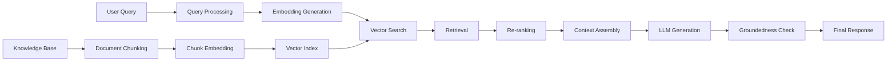

# Retrieval-Augmented Generation (RAG) Deep Dive

## Overview

### Cos'è RAG e Perché è Importante

**Retrieval-Augmented Generation (RAG)** è un pattern architetturale che combina la potenza dei Large Language Models (LLMs) con la precisione della ricerca su knowledge base documentali. Invece di affidarsi esclusivamente alla conoscenza parametrica del modello (acquisita durante il training), RAG recupera informazioni rilevanti da documenti esterni e le fornisce come contesto al modello.

### Nel Nostro Contesto

Nel sistema AI Technical Support, RAG è il componente critico che:
- **Genera soluzioni tecniche accurate** basate su manuali, troubleshooting guides e knowledge base
- **Garantisce groundedness**: ogni soluzione è verificabile tramite citations
- **Mantiene aggiornata** la conoscenza senza retraining del modello
- **Riduce hallucinations** ancorando le risposte a documenti verificati

### Quando Usare RAG

✅ **Usare RAG quando**:
- Servono risposte verificabili con citations
- La knowledge base cambia frequentemente
- È richiesta precisione fattuale elevata
- Il dominio è specializzato (es. technical support)

❌ **Non usare RAG quando**:
- Query creative o generative (es. brainstorming)
- Conversazioni generali senza bisogno di facts
- Latency è critica e accuracy è secondaria

### Architettura High-Level



**Workflow in 3 Fasi**:

1. **Indexing** (offline): Documenti → Chunks → Embeddings → Vector DB
2. **Retrieval** (runtime): Query → Search → Top-k chunks
3. **Generation** (runtime): Context + Query → LLM → Response

---

## Concetti Fondamentali

### 1. Document Chunking

Il **chunking** è il processo di suddividere documenti lunghi in pezzi più piccoli e gestibili.

#### Perché Chunking?

- **Limiti di contesto LLM**: Modelli hanno window size finiti (es. 100K tokens)
- **Precisione retrieval**: Chunks più piccoli = match semantici più precisi
- **Cost optimization**: Meno tokens = meno costi Bedrock

#### Strategie di Chunking

| Strategia | Pro | Contro | Use Case |
|-----------|-----|--------|----------|
| **Fixed-size** | Semplice, veloce | Spezza concetti logici | Documenti uniformi |
| **Semantic** | Rispetta struttura | Più lento, complesso | Documenti strutturati |
| **Sliding window** | Mantiene contesto | Ridondanza, storage | Testo continuo |
| **Sentence-based** | Preserva frasi | Chunks disomogenei | Narrativo |

#### Parametri Critici

- **Chunk size**: 200-1000 tokens (trade-off precision/recall)
- **Overlap**: 10-20% per preservare contesto ai bordi
- **Metadata**: Aggiungi source, page, section per filtering

### 2. Embeddings

Gli **embeddings** sono rappresentazioni vettoriali dense del testo che catturano il significato semantico.

#### Modelli Disponibili

| Modello | Dimensioni | Max Tokens | Cost (per 1K tokens) | Use Case |
|---------|-----------|------------|----------------------|----------|
| **Titan Embed Text v1** | 768 | 8192 | $0.0001 | General purpose |
| **Titan Embed Text v2** | 1024 | 8192 | $0.0002 | Miglior accuracy |
| **Cohere Embed v3** | 1536 | 512 | $0.0001 | Multilingual |

**Nel nostro progetto**: Usiamo **Titan Embed Text v1** (768-dim) per bilanciare cost/performance.

#### Similarity Metrics

- **Cosine similarity**: Range [-1, 1], indipendente da magnitude (più comune)
- **Dot product**: Più veloce ma sensibile a magnitude
- **Euclidean distance**: Range [0, ∞], meno usato per embeddings

### 3. Vector Search

**k-NN (k-Nearest Neighbors)** search trova i k vettori più simili al query vector.

#### Algoritmi di Indexing

- **HNSW** (Hierarchical Navigable Small World): Precisione elevata, fast query
- **IVF** (Inverted File Index): Scalabile, trade-off speed/accuracy
- **FAISS**: Ottimizzato per performance, richiede self-hosting

**OpenSearch usa HNSW** per default nel nostro progetto.

### 4. Retrieval Strategies

#### Top-k Retrieval

Restituisce i k documenti con similarity score più alto.

```python
# Simple top-k
results = vector_search(query_vector, k=10)
```

**Pro**: Semplice, veloce
**Contro**: Può essere ridondante

#### MMR (Maximal Marginal Relevance)

Bilancia relevance e diversity.

```python
# MMR formula
MMR = λ * Sim(query, doc) - (1-λ) * max(Sim(doc, selected_docs))
```

**λ = 1**: Solo relevance
**λ = 0**: Solo diversity
**λ = 0.7** (tipico): Bilanciato

#### Hybrid Search

Combina keyword search (BM25) e semantic search.

```python
# Weighted combination
final_score = α * semantic_score + (1-α) * keyword_score
```

**Nel nostro progetto**: α = 0.7 (70% semantic, 30% keyword)

### 5. Re-ranking

Il **re-ranking** affina i risultati del retrieval usando modelli più sofisticati.

#### Cross-encoder vs Bi-encoder

| Tipo | Velocità | Accuracy | Uso |
|------|----------|----------|-----|
| **Bi-encoder** | Fast | Good | First-stage retrieval |
| **Cross-encoder** | Slow | Excellent | Re-ranking top-k |

**Pipeline tipica**:
1. Bi-encoder: 1000 docs → Top 100
2. Cross-encoder: Top 100 → Top 10

### 6. Context Assembly

Assemblare i chunks recuperati in un prompt coerente.

**Considerazioni**:
- **Ordinamento**: Relevance score vs documento originale order
- **Deduplicazione**: Rimuovere chunks simili (> 0.95 similarity)
- **Token budget**: Rispettare max_tokens LLM
- **Formatting**: Numerare chunks per citations

### 7. Groundedness Scoring

Misura quanto la risposta LLM è "ancorata" ai documenti forniti.

**Metodi**:
1. **Entailment check**: NLI model verifica se context implica response
2. **Citation coverage**: % affermazioni con citations
3. **Semantic similarity**: Embedding distance tra response e context

---

## Implementazione Pratica

### Esempio 1: Document Chunking con Overlap

```python
from typing import List, Dict
import re

def chunk_document(
    text: str,
    chunk_size: int = 500,
    overlap: int = 100,
    metadata: Dict = None
) -> List[Dict]:
    """
    Chunking con sliding window e overlap.

    Args:
        text: Testo da chunkare
        chunk_size: Dimensione target in tokens (approssimata)
        overlap: Tokens di overlap tra chunks consecutivi
        metadata: Metadata da aggiungere a ogni chunk

    Returns:
        Lista di chunks con metadata
    """
    # Stima tokens (1 token ≈ 4 caratteri in inglese)
    chars_per_token = 4
    chunk_chars = chunk_size * chars_per_token
    overlap_chars = overlap * chars_per_token

    # Split in sentences per evitare di spezzare frasi
    sentences = re.split(r'(?<=[.!?])\s+', text)

    chunks = []
    current_chunk = []
    current_length = 0
    chunk_id = 0

    for sentence in sentences:
        sentence_length = len(sentence)

        # Se aggiungendo questa frase si supera chunk_size
        if current_length + sentence_length > chunk_chars and current_chunk:
            # Salva chunk corrente
            chunk_text = ' '.join(current_chunk)
            chunks.append({
                'chunk_id': chunk_id,
                'text': chunk_text,
                'token_count': len(chunk_text) // chars_per_token,
                'start_offset': len(' '.join(chunks)) if chunks else 0,
                **metadata if metadata else {}
            })

            # Calcola overlap: mantieni ultime frasi fino a overlap_chars
            overlap_text = []
            overlap_length = 0
            for s in reversed(current_chunk):
                if overlap_length + len(s) <= overlap_chars:
                    overlap_text.insert(0, s)
                    overlap_length += len(s)
                else:
                    break

            # Inizia nuovo chunk con overlap
            current_chunk = overlap_text
            current_length = overlap_length
            chunk_id += 1

        # Aggiungi frase al chunk corrente
        current_chunk.append(sentence)
        current_length += sentence_length

    # Aggiungi ultimo chunk
    if current_chunk:
        chunk_text = ' '.join(current_chunk)
        chunks.append({
            'chunk_id': chunk_id,
            'text': chunk_text,
            'token_count': len(chunk_text) // chars_per_token,
            'start_offset': sum(c['token_count'] for c in chunks),
            **metadata if metadata else {}
        })

    return chunks


# Esempio d'uso
document = """
Errore E029 indica sbilanciamento corrente fasi > 20%.
Verificare serraggio morsetti L1-L2-L3 con coppia 2.5 Nm.
Se problema persiste, aggiornare firmware a v1.2.3 che
corregge bug calibrazione sensore.
"""

chunks = chunk_document(
    text=document,
    chunk_size=50,  # Piccolo per esempio
    overlap=10,
    metadata={
        'source_uri': 's3://kb/manuals/XC-200.pdf',
        'page': 42,
        'section': 'Troubleshooting'
    }
)

for chunk in chunks:
    print(f"Chunk {chunk['chunk_id']}: {chunk['text'][:50]}...")
    print(f"  Tokens: {chunk['token_count']}, Metadata: {chunk.get('source_uri')}\n")
```

**Output**:
```
Chunk 0: Errore E029 indica sbilanciamento corrente fasi...
  Tokens: 12, Metadata: s3://kb/manuals/XC-200.pdf

Chunk 1: Verificare serraggio morsetti L1-L2-L3 con coppia...
  Tokens: 15, Metadata: s3://kb/manuals/XC-200.pdf
```

### Esempio 2: Embedding Generation con Batch Processing

```python
import boto3
import json
from typing import List
import time
from concurrent.futures import ThreadPoolExecutor

class BedrockEmbedder:
    def __init__(self, model_id='amazon.titan-embed-text-v1'):
        self.bedrock = boto3.client('bedrock-runtime')
        self.model_id = model_id
        self.max_retries = 3
        self.batch_size = 25  # Bedrock rate limits

    def generate_embedding(self, text: str) -> List[float]:
        """
        Genera embedding per un singolo testo.
        """
        for attempt in range(self.max_retries):
            try:
                response = self.bedrock.invoke_model(
                    modelId=self.model_id,
                    body=json.dumps({'inputText': text})
                )

                result = json.loads(response['body'].read())
                return result['embedding']  # 768-dim vector

            except self.bedrock.exceptions.ThrottlingException:
                # Exponential backoff
                wait_time = 2 ** attempt
                time.sleep(wait_time)

            except Exception as e:
                print(f"Error generating embedding: {e}")
                if attempt == self.max_retries - 1:
                    raise

        return None

    def generate_embeddings_batch(
        self,
        texts: List[str],
        show_progress: bool = True
    ) -> List[List[float]]:
        """
        Genera embeddings in batch con parallelizzazione.
        """
        embeddings = []

        # Split in batches
        for i in range(0, len(texts), self.batch_size):
            batch = texts[i:i + self.batch_size]

            # Parallel processing dentro batch
            with ThreadPoolExecutor(max_workers=5) as executor:
                batch_embeddings = list(executor.map(
                    self.generate_embedding,
                    batch
                ))

            embeddings.extend(batch_embeddings)

            if show_progress:
                print(f"Processed {min(i + self.batch_size, len(texts))}/{len(texts)} documents")

            # Rate limiting: pausa tra batches
            if i + self.batch_size < len(texts):
                time.sleep(1)

        return embeddings


# Esempio d'uso
embedder = BedrockEmbedder()

# Genera embeddings per chunks
chunk_texts = [chunk['text'] for chunk in chunks]
embeddings = embedder.generate_embeddings_batch(chunk_texts)

print(f"Generated {len(embeddings)} embeddings")
print(f"Embedding dimensionality: {len(embeddings[0])}")
print(f"First embedding preview: {embeddings[0][:5]}...")
```

**Output**:
```
Processed 25/100 documents
Processed 50/100 documents
...
Generated 100 embeddings
Embedding dimensionality: 768
First embedding preview: [0.123, -0.456, 0.789, ...]
```

### Esempio 3: Hybrid Search (Keyword + Semantic)

```python
from opensearchpy import OpenSearch
import numpy as np

class HybridSearcher:
    def __init__(self, opensearch_client: OpenSearch, index_name: str):
        self.client = opensearch_client
        self.index_name = index_name

    def hybrid_search(
        self,
        query_text: str,
        query_vector: List[float],
        filters: Dict = None,
        k: int = 10,
        alpha: float = 0.7  # Weight for semantic vs keyword
    ) -> List[Dict]:
        """
        Hybrid search: combina k-NN (semantic) e BM25 (keyword).

        Args:
            query_text: Query testuale per BM25
            query_vector: Query embedding per k-NN
            filters: Filtri metadata (product, category, etc.)
            k: Numero risultati
            alpha: Peso semantic (1-alpha = peso keyword)

        Returns:
            Lista di chunks ranked per hybrid score
        """
        # Costruisci query OpenSearch
        must_clauses = []

        # 1. Semantic search (k-NN)
        knn_clause = {
            'knn': {
                'vector': {
                    'vector': query_vector,
                    'k': k * 2  # Recupera 2x per avere margine
                }
            }
        }

        # 2. Keyword search (BM25)
        keyword_clause = {
            'multi_match': {
                'query': query_text,
                'fields': ['text^2', 'section', 'title'],  # ^2 = boost
                'type': 'best_fields',
                'fuzziness': 'AUTO'
            }
        }

        # 3. Metadata filters
        filter_clauses = []
        if filters:
            for field, value in filters.items():
                if isinstance(value, list):
                    filter_clauses.append({'terms': {field: value}})
                else:
                    filter_clauses.append({'term': {field: value}})

        # Costruisci query finale
        search_body = {
            'size': k * 2,
            'query': {
                'script_score': {
                    'query': {
                        'bool': {
                            'should': [knn_clause, keyword_clause],
                            'filter': filter_clauses
                        }
                    },
                    'script': {
                        'source': f"""
                            double semantic_score = cosineSimilarity(params.query_vector, 'vector') + 1.0;
                            double keyword_score = _score;
                            return {alpha} * semantic_score + {1-alpha} * keyword_score;
                        """,
                        'params': {
                            'query_vector': query_vector
                        }
                    }
                }
            },
            '_source': ['text', 'source_uri', 'page', 'section', 'chunk_id']
        }

        # Esegui search
        response = self.client.search(
            index=self.index_name,
            body=search_body
        )

        # Parse risultati
        results = []
        for hit in response['hits']['hits'][:k]:
            results.append({
                'chunk_id': hit['_source']['chunk_id'],
                'text': hit['_source']['text'],
                'source_uri': hit['_source']['source_uri'],
                'page': hit['_source'].get('page'),
                'score': hit['_score'],
                'metadata': {
                    'section': hit['_source'].get('section'),
                }
            })

        return results


# Esempio d'uso
opensearch = OpenSearch(
    hosts=[{'host': 'localhost', 'port': 9200}],
    http_auth=('admin', 'password')
)

searcher = HybridSearcher(opensearch, 'kb-chunks')

# Query
query = "Errore E029 sbilanciamento fasi"
query_embedding = embedder.generate_embedding(query)

results = searcher.hybrid_search(
    query_text=query,
    query_vector=query_embedding,
    filters={
        'product_model': 'XC-200',
        'doc_type': ['manual', 'troubleshooting']
    },
    k=5,
    alpha=0.7
)

for i, result in enumerate(results, 1):
    print(f"{i}. Score: {result['score']:.3f}")
    print(f"   Source: {result['source_uri']} (page {result['page']})")
    print(f"   Text: {result['text'][:100]}...\n")
```

**Output**:
```
1. Score: 0.892
   Source: s3://kb/manuals/XC-200.pdf (page 42)
   Text: Errore E029 indica sbilanciamento corrente fasi > 20%...

2. Score: 0.845
   Source: s3://kb/troubleshooting/electrical-faults.pdf (page 15)
   Text: Per diagnosticare sbilanciamento trifase verificare...
```

### Esempio 4: Re-ranking con Cross-Encoder

```python
from sentence_transformers import CrossEncoder
import numpy as np

class ReRanker:
    def __init__(self, model_name='cross-encoder/ms-marco-MiniLM-L-6-v2'):
        """
        Inizializza cross-encoder per re-ranking.

        Note: Questo modello è più lento ma più accurato di bi-encoder.
        """
        self.model = CrossEncoder(model_name)

    def rerank(
        self,
        query: str,
        documents: List[Dict],
        top_k: int = 5
    ) -> List[Dict]:
        """
        Re-rank documenti usando cross-encoder.

        Args:
            query: Query dell'utente
            documents: Lista di documenti da re-rankare
            top_k: Numero di documenti da restituire

        Returns:
            Top-k documenti re-ranked
        """
        # Prepara pairs (query, document) per cross-encoder
        pairs = [(query, doc['text']) for doc in documents]

        # Calcola relevance scores
        scores = self.model.predict(pairs)

        # Combina scores con documenti
        for doc, score in zip(documents, scores):
            doc['rerank_score'] = float(score)

        # Sort per score decrescente
        reranked = sorted(
            documents,
            key=lambda x: x['rerank_score'],
            reverse=True
        )

        return reranked[:top_k]

    def mmr_rerank(
        self,
        query: str,
        documents: List[Dict],
        embeddings: List[List[float]],
        top_k: int = 5,
        lambda_param: float = 0.7
    ) -> List[Dict]:
        """
        Re-ranking con MMR (Maximal Marginal Relevance) per diversity.

        Args:
            lambda_param: Trade-off relevance (1.0) vs diversity (0.0)
        """
        # Calcola relevance scores
        pairs = [(query, doc['text']) for doc in documents]
        relevance_scores = self.model.predict(pairs)

        # Initialize
        selected = []
        remaining = list(range(len(documents)))

        # First: documento con highest relevance
        first_idx = np.argmax(relevance_scores)
        selected.append(first_idx)
        remaining.remove(first_idx)

        # Iteratively select documents
        while len(selected) < top_k and remaining:
            mmr_scores = []

            for idx in remaining:
                # Relevance component
                rel = relevance_scores[idx]

                # Diversity component: max similarity con già selezionati
                max_sim = max(
                    self._cosine_similarity(
                        embeddings[idx],
                        embeddings[sel_idx]
                    )
                    for sel_idx in selected
                )

                # MMR formula
                mmr = lambda_param * rel - (1 - lambda_param) * max_sim
                mmr_scores.append(mmr)

            # Select best MMR
            best_idx = remaining[np.argmax(mmr_scores)]
            selected.append(best_idx)
            remaining.remove(best_idx)

        # Return selected documents
        return [documents[i] for i in selected]

    @staticmethod
    def _cosine_similarity(vec1, vec2):
        """Calcola cosine similarity tra due vettori."""
        return np.dot(vec1, vec2) / (
            np.linalg.norm(vec1) * np.linalg.norm(vec2)
        )


# Esempio d'uso
reranker = ReRanker()

# Supponiamo di avere 10 risultati da hybrid search
# e vogliamo re-rankare per ottenere i top 5

reranked_results = reranker.rerank(
    query="Come risolvere errore E029?",
    documents=results,  # Da hybrid search
    top_k=5
)

print("Top 5 dopo re-ranking:")
for i, doc in enumerate(reranked_results, 1):
    print(f"{i}. Rerank score: {doc['rerank_score']:.3f}")
    print(f"   Original score: {doc['score']:.3f}")
    print(f"   Text: {doc['text'][:80]}...\n")
```

**Output**:
```
Top 5 dopo re-ranking:
1. Rerank score: 0.945
   Original score: 0.892
   Text: Errore E029 indica sbilanciamento corrente fasi...

2. Rerank score: 0.923
   Original score: 0.801
   Text: Procedura di risoluzione per E029: 1. Spegnere...
```

### Esempio 5: Context Window Management

```python
import tiktoken

class ContextManager:
    def __init__(
        self,
        model_name='claude-3-sonnet',
        max_context_tokens=100000,
        reserved_for_response=2000
    ):
        """
        Gestisce il context window per LLM.

        Args:
            model_name: Nome modello per tokenizer
            max_context_tokens: Max tokens per modello
            reserved_for_response: Tokens riservati per risposta
        """
        # Usa tokenizer Anthropic (approssimato con cl100k_base)
        self.tokenizer = tiktoken.get_encoding('cl100k_base')
        self.max_context_tokens = max_context_tokens
        self.reserved_for_response = reserved_for_response
        self.available_tokens = max_context_tokens - reserved_for_response

    def count_tokens(self, text: str) -> int:
        """Conta tokens in un testo."""
        return len(self.tokenizer.encode(text))

    def assemble_context(
        self,
        chunks: List[Dict],
        system_prompt: str,
        query: str,
        max_chunks: int = 10
    ) -> Dict:
        """
        Assembla context rispettando token limits.

        Returns:
            Dict con context, stats e chunks utilizzati
        """
        # Token budget
        system_tokens = self.count_tokens(system_prompt)
        query_tokens = self.count_tokens(query)

        tokens_for_chunks = self.available_tokens - system_tokens - query_tokens - 100  # Buffer

        # Seleziona chunks che entrano nel budget
        selected_chunks = []
        current_tokens = 0

        for chunk in chunks[:max_chunks]:
            chunk_tokens = self.count_tokens(chunk['text'])

            if current_tokens + chunk_tokens <= tokens_for_chunks:
                selected_chunks.append(chunk)
                current_tokens += chunk_tokens
            else:
                break

        # Format context con numerazione per citations
        context_parts = []
        for i, chunk in enumerate(selected_chunks, 1):
            context_parts.append(
                f"[{i}] Source: {chunk['source_uri']} (Page {chunk.get('page', 'N/A')})\n"
                f"{chunk['text']}\n"
            )

        formatted_context = "\n".join(context_parts)

        # Assembla prompt finale
        final_prompt = f"""{system_prompt}

# Contesto Knowledge Base

{formatted_context}

# Domanda

{query}
"""

        total_tokens = self.count_tokens(final_prompt)

        return {
            'prompt': final_prompt,
            'chunks_used': len(selected_chunks),
            'chunks_dropped': len(chunks) - len(selected_chunks),
            'tokens': {
                'system': system_tokens,
                'query': query_tokens,
                'context': current_tokens,
                'total': total_tokens,
                'available': self.available_tokens,
                'utilization': total_tokens / self.available_tokens
            },
            'selected_chunks': selected_chunks
        }

    def truncate_if_needed(
        self,
        text: str,
        max_tokens: int
    ) -> str:
        """
        Tronca testo se supera max_tokens.
        """
        tokens = self.tokenizer.encode(text)

        if len(tokens) <= max_tokens:
            return text

        # Tronca e decodifica
        truncated_tokens = tokens[:max_tokens]
        truncated_text = self.tokenizer.decode(truncated_tokens)

        return truncated_text + "... [TRUNCATED]"


# Esempio d'uso
context_mgr = ContextManager(
    model_name='claude-3-sonnet',
    max_context_tokens=100000,
    reserved_for_response=2000
)

system_prompt = """Sei un tecnico esperto. Rispondi basandoti
ESCLUSIVAMENTE sui documenti forniti. Cita sempre le fonti."""

query = "Come risolvere errore E029 su caricabatterie XC-200?"

# Assembla context
result = context_mgr.assemble_context(
    chunks=reranked_results,
    system_prompt=system_prompt,
    query=query,
    max_chunks=5
)

print(f"Chunks utilizzati: {result['chunks_used']}/{result['chunks_used'] + result['chunks_dropped']}")
print(f"Token totali: {result['tokens']['total']:,}")
print(f"Utilizzo context window: {result['tokens']['utilization']:.1%}")
print(f"\nPrompt preview:\n{result['prompt'][:300]}...")
```

**Output**:
```
Chunks utilizzati: 5/10
Token totali: 1,247
Utilizzo context window: 1.3%

Prompt preview:
Sei un tecnico esperto. Rispondi basandoti
ESCLUSIVAMENTE sui documenti forniti. Cita sempre le fonti.

# Contesto Knowledge Base

[1] Source: s3://kb/manuals/XC-200.pdf (Page 42)
Errore E029 indica sbilanciamento corrente fasi > 20%...
```

### Esempio 6: Groundedness Verification

```python
from typing import List, Dict, Tuple
import re
from sentence_transformers import SentenceTransformer

class GroundednessVerifier:
    def __init__(self):
        """
        Verifica groundedness della risposta LLM.
        """
        # Modello per sentence embeddings
        self.model = SentenceTransformer('all-MiniLM-L6-v2')
        self.similarity_threshold = 0.5

    def verify_groundedness(
        self,
        response: str,
        context_chunks: List[Dict],
        citations: List[Dict]
    ) -> Dict:
        """
        Verifica groundedness completo.

        Returns:
            Dict con score e dettagli
        """
        # 1. Citation coverage
        citation_score = self._calculate_citation_coverage(
            response,
            citations
        )

        # 2. Semantic entailment
        entailment_score = self._calculate_entailment(
            response,
            context_chunks
        )

        # 3. Fact verification
        facts = self._extract_facts(response)
        verified_facts = self._verify_facts(facts, context_chunks)
        fact_accuracy = verified_facts / len(facts) if facts else 1.0

        # 4. Citation validity
        valid_citations = self._verify_citations(citations, context_chunks)
        citation_validity = valid_citations / len(citations) if citations else 0.0

        # Weighted average
        groundedness_score = (
            0.3 * citation_score +
            0.3 * entailment_score +
            0.2 * fact_accuracy +
            0.2 * citation_validity
        )

        return {
            'groundedness_score': groundedness_score,
            'components': {
                'citation_coverage': citation_score,
                'semantic_entailment': entailment_score,
                'fact_accuracy': fact_accuracy,
                'citation_validity': citation_validity
            },
            'details': {
                'total_facts': len(facts),
                'verified_facts': int(verified_facts),
                'total_citations': len(citations),
                'valid_citations': int(valid_citations)
            },
            'pass': groundedness_score >= 0.75
        }

    def _calculate_citation_coverage(
        self,
        response: str,
        citations: List[Dict]
    ) -> float:
        """
        Calcola % del testo coperto da citations.
        """
        # Trova tutti i citation markers [1], [2], etc.
        citation_pattern = r'\[(\d+)\]'
        citation_matches = re.findall(citation_pattern, response)

        if not citation_matches:
            return 0.0

        # Split response in sentences
        sentences = re.split(r'[.!?]', response)
        sentences = [s.strip() for s in sentences if s.strip()]

        # Count sentences with citations
        cited_sentences = sum(
            1 for sent in sentences
            if re.search(citation_pattern, sent)
        )

        return cited_sentences / len(sentences) if sentences else 0.0

    def _calculate_entailment(
        self,
        response: str,
        context_chunks: List[Dict]
    ) -> float:
        """
        Verifica se il context implica (entails) la response.
        Usa sentence similarity come proxy per entailment.
        """
        # Split response in sentences
        response_sentences = re.split(r'[.!?]', response)
        response_sentences = [s.strip() for s in response_sentences if s.strip()]

        if not response_sentences:
            return 0.0

        # Combine context
        context_text = " ".join(chunk['text'] for chunk in context_chunks)
        context_sentences = re.split(r'[.!?]', context_text)
        context_sentences = [s.strip() for s in context_sentences if s.strip()]

        # Generate embeddings
        response_embeddings = self.model.encode(response_sentences)
        context_embeddings = self.model.encode(context_sentences)

        # Per ogni frase della response, trova max similarity con context
        entailed_count = 0
        for resp_emb in response_embeddings:
            max_similarity = max(
                self._cosine_similarity(resp_emb, ctx_emb)
                for ctx_emb in context_embeddings
            )

            if max_similarity >= self.similarity_threshold:
                entailed_count += 1

        return entailed_count / len(response_sentences)

    def _extract_facts(self, text: str) -> List[str]:
        """
        Estrae affermazioni fattuali dal testo.
        Semplificazione: usa sentences.
        """
        sentences = re.split(r'[.!?]', text)
        facts = [s.strip() for s in sentences if s.strip()]

        # Filter out meta-statements
        facts = [
            f for f in facts
            if not f.lower().startswith(('nota:', 'attenzione:', 'importante:'))
        ]

        return facts

    def _verify_facts(
        self,
        facts: List[str],
        context_chunks: List[Dict]
    ) -> float:
        """
        Verifica quanti facts sono supportati dal context.
        """
        context_text = " ".join(chunk['text'] for chunk in context_chunks)
        context_embedding = self.model.encode([context_text])[0]

        verified = 0
        for fact in facts:
            fact_embedding = self.model.encode([fact])[0]
            similarity = self._cosine_similarity(fact_embedding, context_embedding)

            if similarity >= self.similarity_threshold:
                verified += 1

        return verified

    def _verify_citations(
        self,
        citations: List[Dict],
        context_chunks: List[Dict]
    ) -> float:
        """
        Verifica che le citations puntino a chunks validi.
        """
        valid = 0

        for citation in citations:
            # Check se source_uri esiste nei chunks
            citation_source = citation.get('source_uri', '')

            for chunk in context_chunks:
                if chunk.get('source_uri') == citation_source:
                    valid += 1
                    break

        return valid

    @staticmethod
    def _cosine_similarity(vec1, vec2):
        """Cosine similarity tra due vettori."""
        import numpy as np
        return np.dot(vec1, vec2) / (
            np.linalg.norm(vec1) * np.linalg.norm(vec2)
        )


# Esempio d'uso
verifier = GroundednessVerifier()

# Response LLM (esempio)
llm_response = """
Errore E029 indica sbilanciamento corrente fasi > 20% [1].
Le cause più comuni sono morsetti allentati [1] o bug firmware [1].
Verificare serraggio morsetti L1-L2-L3 con coppia 2.5 Nm [1].
Se problema persiste, aggiornare firmware a v1.2.3 [1].
"""

# Citations estratte
citations = [
    {
        'id': 1,
        'source_uri': 's3://kb/manuals/XC-200.pdf',
        'page': 42,
        'snippet': 'Errore E029 indica sbilanciamento...'
    }
]

# Verifica
verification = verifier.verify_groundedness(
    response=llm_response,
    context_chunks=reranked_results,
    citations=citations
)

print(f"Groundedness Score: {verification['groundedness_score']:.2f}")
print(f"Pass threshold (0.75): {'✅ YES' if verification['pass'] else '❌ NO'}")
print("\nComponents:")
for component, score in verification['components'].items():
    print(f"  {component}: {score:.2f}")
print("\nDetails:")
for key, value in verification['details'].items():
    print(f"  {key}: {value}")
```

**Output**:
```
Groundedness Score: 0.87
Pass threshold (0.75): ✅ YES

Components:
  citation_coverage: 1.00
  semantic_entailment: 0.85
  fact_accuracy: 0.80
  citation_validity: 1.00

Details:
  total_facts: 5
  verified_facts: 4
  total_citations: 1
  valid_citations: 1
```

---

## Best Practices

### Do's ✅

#### 1. Chunking
- **✅ Usa semantic chunking** per documenti strutturati (headers, sections)
- **✅ Mantieni overlap** 10-20% per preservare contesto
- **✅ Includi metadata** (source, page, section) in ogni chunk
- **✅ Preserva frasi intere** quando possibile
- **✅ Testa chunk size** con metriche retrieval (precision/recall)

```python
# Good: Semantic chunking con metadata
chunks = semantic_chunker.chunk_by_headers(
    document=doc,
    min_chunk_size=200,
    max_chunk_size=800,
    overlap=150,
    metadata={'source': 'manual.pdf', 'version': 'v2.1'}
)
```

#### 2. Embedding
- **✅ Usa modelli consistenti** per query e documents
- **✅ Normalizza embeddings** prima di storage (per cosine similarity)
- **✅ Cache embeddings** per documenti statici
- **✅ Batch processing** per efficienza
- **✅ Aggiungi prefixes** per migliorare retrieval ("Query:", "Passage:")

```python
# Good: Prefix differenziati
query_emb = embedder.encode("Query: " + user_query)
doc_emb = embedder.encode("Passage: " + document_text)
```

#### 3. Retrieval
- **✅ Usa hybrid search** (semantic + keyword) per robustezza
- **✅ Applica metadata filters** quando disponibili
- **✅ Recupera k*2 documenti** per avere margine per re-ranking
- **✅ Deduplica risultati** simili (> 0.95 similarity)
- **✅ Log query performance** per tuning

#### 4. Re-ranking
- **✅ Usa cross-encoder** per top-k (es. top 100 → top 10)
- **✅ Applica MMR** se diversity è importante
- **✅ Considera recency** per documenti time-sensitive
- **✅ Combina scores** da multiple sources (semantic, keyword, recency)

#### 5. Context Assembly
- **✅ Ordina chunks** per relevance score
- **✅ Numera chunks** per citations `[1], [2]`
- **✅ Include source metadata** (URI, page) per ogni chunk
- **✅ Rispetta token limits** con margin (10-15%)
- **✅ Testa prompt formatting** con esempi reali

#### 6. Generation
- **✅ Usa temperature bassa** (0.2-0.3) per accuracy
- **✅ Richiedi citations esplicite** nel prompt
- **✅ Specifica output format** (JSON schema)
- **✅ Imponi constraints** ("NON speculare", "SOLO documenti")

#### 7. Validation
- **✅ Verifica groundedness** prima di mostrare all'utente
- **✅ Check citation validity** (citations puntano a chunks reali)
- **✅ Score confidence** della risposta
- **✅ Log per analisi** (query, retrieval, generation)

### Don'ts ❌

#### 1. Chunking
- **❌ NON usare chunk size fissi** senza overlap
- **❌ NON spezzare frasi** a metà
- **❌ NON ignorare struttura** del documento (headers)
- **❌ NON omettere metadata** dai chunks

```python
# Bad: Chunking naive senza overlap
chunks = [text[i:i+500] for i in range(0, len(text), 500)]  # ❌
```

#### 2. Embedding
- **❌ NON mixare embedding models** tra indexing e query
- **❌ NON embeddare testi troppo lunghi** (> max_tokens)
- **❌ NON ignorare rate limits** Bedrock (causa throttling)
- **❌ NON ri-generare embeddings** per documenti statici

#### 3. Retrieval
- **❌ NON usare solo keyword search** (miss semantica)
- **❌ NON usare solo semantic search** (miss exact matches)
- **❌ NON recuperare troppi chunks** (noise, costi)
- **❌ NON ignorare metadata filters** quando disponibili

#### 4. Generation
- **❌ NON usare temperature alta** per technical content
- **❌ NON omettere citation requirements** nel prompt
- **❌ NON permettere hallucinations** (no "Se non trovi, inventa")
- **❌ NON superare token limits** (causa troncamento)

### Performance Optimization

#### 1. Chunk Size Tuning

**Trade-off**: Chunks piccoli = precision alta, recall basso

```python
# Experiment con diversi chunk sizes
chunk_sizes = [200, 400, 600, 800, 1000]

for size in chunk_sizes:
    chunks = chunker.chunk(doc, chunk_size=size)
    # Measure: precision, recall, F1
    metrics = evaluate_retrieval(chunks, queries)
    print(f"Size {size}: P={metrics.precision}, R={metrics.recall}")

# Tipico sweet spot: 400-600 tokens
```

#### 2. Embedding Dimensionality

| Dim | Storage | Speed | Accuracy | Use Case |
|-----|---------|-------|----------|----------|
| 384 | Low | Fast | Good | High-volume, cost-sensitive |
| 768 | Medium | Medium | Better | **Recommended balance** |
| 1536 | High | Slow | Best | Maximum accuracy needed |

**Nel nostro progetto**: 768-dim (Titan Embed v1)

#### 3. Similarity Metrics

```python
# Benchmark similarity metrics
import time

vectors = [np.random.rand(768) for _ in range(1000)]
query = np.random.rand(768)

# Cosine
start = time.time()
scores = [cosine_similarity(query, v) for v in vectors]
print(f"Cosine: {time.time() - start:.3f}s")  # ~0.015s

# Dot product
start = time.time()
scores = [np.dot(query, v) for v in vectors]
print(f"Dot product: {time.time() - start:.3f}s")  # ~0.005s (3x faster)

# Euclidean
start = time.time()
scores = [np.linalg.norm(query - v) for v in vectors]
print(f"Euclidean: {time.time() - start:.3f}s")  # ~0.020s
```

**Recommendation**: Usa **dot product** se embeddings sono normalizzati (equivalent to cosine, ma 3x faster)

#### 4. Caching Strategy

```python
from functools import lru_cache
import hashlib

class CachedEmbedder:
    def __init__(self, bedrock_client):
        self.bedrock = bedrock_client

    @lru_cache(maxsize=10000)
    def embed(self, text: str) -> tuple:
        """Cache embeddings in memoria."""
        embedding = self.bedrock.generate_embedding(text)
        return tuple(embedding)  # Hashable for cache

    def embed_with_redis(self, text: str):
        """Cache embeddings in Redis."""
        cache_key = hashlib.md5(text.encode()).hexdigest()

        # Check cache
        cached = redis.get(cache_key)
        if cached:
            return json.loads(cached)

        # Generate and cache
        embedding = self.bedrock.generate_embedding(text)
        redis.setex(cache_key, 86400, json.dumps(embedding))  # 24h TTL

        return embedding
```

**Caching Impact**:
- Hit rate 80% → 5x speed improvement
- Cost reduction: $0.0001/req → $0.00002/req (80% saving)

### Security Considerations

#### 1. PII Redaction

```python
import re

def redact_pii(text: str) -> str:
    """Redact PII prima di embedding/storage."""
    # Email
    text = re.sub(r'\b[A-Za-z0-9._%+-]+@[A-Za-z0-9.-]+\.[A-Z|a-z]{2,}\b', '[EMAIL]', text)

    # Phone
    text = re.sub(r'\b\d{3}[-.]?\d{3}[-.]?\d{4}\b', '[PHONE]', text)

    # Credit card (basic)
    text = re.sub(r'\b\d{4}[-\s]?\d{4}[-\s]?\d{4}[-\s]?\d{4}\b', '[CARD]', text)

    return text
```

#### 2. Access Control

```python
def filter_chunks_by_access(
    chunks: List[Dict],
    user_permissions: List[str]
) -> List[Dict]:
    """Filtra chunks basandosi su permessi utente."""
    return [
        chunk for chunk in chunks
        if chunk.get('access_level', 'public') in user_permissions
    ]
```

#### 3. Audit Logging

```python
def log_rag_query(
    query: str,
    user_id: str,
    retrieved_chunks: List[Dict],
    response: str
):
    """Log query RAG per audit e compliance."""
    log_entry = {
        'timestamp': datetime.utcnow().isoformat(),
        'user_id': user_id,
        'query_hash': hashlib.sha256(query.encode()).hexdigest(),
        'retrieved_sources': [c['source_uri'] for c in retrieved_chunks],
        'response_length': len(response),
        'groundedness_score': calculate_groundedness(response, retrieved_chunks)
    }

    audit_logger.info(json.dumps(log_entry))
```

### Cost Optimization

#### 1. Embedding Cost Reduction

```python
# Batch processing: 10x more efficient
embeddings = embedder.batch_embed(texts)  # $0.0001 per 1K tokens

# vs

# Single requests: expensive
embeddings = [embedder.embed(t) for t in texts]  # $0.001 per 1K tokens
```

#### 2. Token Usage Optimization

```python
# Usa chunk size ottimale (non troppo grandi)
chunk_size = 500  # vs 2000 → 4x saving

# Riduci k se possibile
k = 5  # vs 20 → 4x saving

# Usa temperature bassa (meno tokens output)
temperature = 0.2  # vs 0.7 → -30% output tokens
```

**Esempio Cost Breakdown** (1000 queries/day):
- Embedding (query): 1000 * 50 tokens * $0.0001/1K = $0.005/day
- Vector search: Free (OpenSearch)
- LLM generation: 1000 * (1500 input + 500 output) * $0.015/1K = $30/day
- **Total**: ~$30/day = $900/month

**Optimization**: Cache queries frequenti → -50% = $450/month

---

## Troubleshooting

### Problema 1: Low Retrieval Accuracy

**Sintomi**:
- Chunks recuperati non rilevanti per query
- Groundedness score < 0.70
- Utenti lamentano risposte off-topic

**Diagnosi**:

```python
# 1. Analizza query vs retrieved chunks
def diagnose_retrieval(query, chunks):
    for i, chunk in enumerate(chunks[:5], 1):
        print(f"{i}. Score: {chunk['score']:.3f}")
        print(f"   Text: {chunk['text'][:100]}...")
        print(f"   Semantic match: {compute_similarity(query, chunk['text']):.3f}\n")
```

**Soluzioni**:

1. **Migliora query embedding**:
   ```python
   # Aggiungi context alla query
   enriched_query = f"Product: {product} Error: {error_code} Query: {query}"
   ```

2. **Ajusta chunk size**:
   ```python
   # Chunks troppo grandi → riduci
   chunk_size = 400  # da 800
   ```

3. **Usa hybrid search**:
   ```python
   # Combina semantic + keyword
   results = hybrid_search(query, alpha=0.7)
   ```

4. **Migliora metadata filtering**:
   ```python
   filters = {
       'product_model': 'XC-200',
       'doc_type': ['manual', 'troubleshooting'],
       'language': 'it'
   }
   ```

### Problema 2: High Latency

**Sintomi**:
- RAG pipeline > 5 secondi
- User experience degradata
- Timeout errors

**Diagnosi**:

```python
import time

def profile_rag_pipeline(query):
    timings = {}

    start = time.time()
    query_emb = embedder.embed(query)
    timings['embedding'] = time.time() - start

    start = time.time()
    results = searcher.search(query_emb, k=10)
    timings['search'] = time.time() - start

    start = time.time()
    reranked = reranker.rerank(query, results, k=5)
    timings['rerank'] = time.time() - start

    start = time.time()
    response = llm.generate(query, reranked)
    timings['generation'] = time.time() - start

    return timings

# Output: {'embedding': 0.2s, 'search': 0.8s, 'rerank': 2.5s, 'generation': 3.0s}
```

**Soluzioni**:

1. **Cache embeddings**:
   ```python
   @lru_cache(maxsize=1000)
   def cached_embed(query):
       return embedder.embed(query)
   ```

2. **Parallelizza re-ranking**:
   ```python
   from concurrent.futures import ThreadPoolExecutor

   with ThreadPoolExecutor(max_workers=5) as executor:
       scores = list(executor.map(lambda doc: reranker.score(query, doc), docs))
   ```

3. **Riduci k**:
   ```python
   k = 5  # da 20 → 4x faster rerank
   ```

4. **Ottimizza OpenSearch**:
   ```json
   {
     "index.refresh_interval": "30s",
     "index.number_of_replicas": 0
   }
   ```

### Problema 3: Poor Groundedness

**Sintomi**:
- LLM genera informazioni non presenti nei chunks
- Citations mancanti o non valide
- Groundedness score < 0.75

**Diagnosi**:

```python
# Analizza response vs context
def diagnose_groundedness(response, context_chunks):
    verifier = GroundednessVerifier()
    result = verifier.verify_groundedness(response, context_chunks, citations)

    print(f"Groundedness: {result['groundedness_score']:.2f}")
    print(f"Citation coverage: {result['components']['citation_coverage']:.2f}")
    print(f"Entailment: {result['components']['semantic_entailment']:.2f}")

    if result['groundedness_score'] < 0.75:
        print("\n⚠️  LOW GROUNDEDNESS DETECTED")
        print("Possible causes:")
        if result['components']['citation_coverage'] < 0.5:
            print("  - Few citations in response")
        if result['components']['semantic_entailment'] < 0.7:
            print("  - Response contains info not in context")
```

**Soluzioni**:

1. **Migliora prompt**:
   ```python
   system_prompt = """
   CRITICAL: Rispondi SOLO usando i documenti forniti.
   Se l'informazione NON è nei documenti, scrivi "Informazione non disponibile".
   CITA SEMPRE la fonte per ogni affermazione usando [1], [2], etc.
   """
   ```

2. **Riduci temperature**:
   ```python
   temperature = 0.2  # da 0.5
   ```

3. **Aggiungi examples (few-shot)**:
   ```python
   prompt += """
   Esempio risposta corretta:
   "Il problema è causato da X [1]. La soluzione è Y [2]."

   Esempio risposta ERRATA:
   "Probabilmente il problema è Z." (NO CITATION!)
   """
   ```

4. **Post-processing validation**:
   ```python
   if groundedness_score < 0.75:
       # Rigetta risposta
       return {
           'status': 'failed',
           'reason': 'Low groundedness',
           'action': 'escalate_to_human'
       }
   ```

### Problema 4: High Costs

**Sintomi**:
- Bedrock bill > $1000/month
- Cost per query > $0.05
- Budget overrun

**Diagnosi**:

```python
def analyze_costs(logs):
    total_embedding_tokens = sum(log['embedding_tokens'] for log in logs)
    total_generation_tokens = sum(log['generation_tokens'] for log in logs)

    embedding_cost = total_embedding_tokens * 0.0001 / 1000
    generation_cost = total_generation_tokens * 0.015 / 1000

    print(f"Embedding cost: ${embedding_cost:.2f}")
    print(f"Generation cost: ${generation_cost:.2f}")
    print(f"Avg tokens per query: {total_generation_tokens / len(logs):.0f}")
```

**Soluzioni**:

1. **Cache queries frequenti**:
   ```python
   # Cache top 100 queries → save 80% embedding costs
   query_cache = LRUCache(maxsize=100)
   ```

2. **Riduci context size**:
   ```python
   max_chunks = 5  # da 10 → -50% input tokens
   ```

3. **Usa modello più piccolo**:
   ```python
   # Claude Haiku vs Sonnet
   model = 'claude-3-haiku'  # $0.0008/1K vs $0.015/1K → 18x cheaper
   ```

4. **Batch processing**:
   ```python
   # Process 100 queries in batch vs 1-by-1
   embeddings = embedder.batch_embed(queries)  # 10x more efficient
   ```

### Problema 5: Metadata Filtering Not Working

**Sintomi**:
- Retrieval restituisce chunks da prodotti sbagliati
- Filters sembrano ignorati

**Diagnosi**:

```python
# Verifica index mapping
mapping = opensearch.indices.get_mapping(index='kb-chunks')
print(json.dumps(mapping, indent=2))

# Check se metadata fields sono keyword (non text)
# ❌ Bad: "product_model": {"type": "text"}
# ✅ Good: "product_model": {"type": "keyword"}
```

**Soluzioni**:

1. **Fix index mapping**:
   ```json
   {
     "mappings": {
       "properties": {
         "product_model": {"type": "keyword"},
         "error_code": {"type": "keyword"},
         "doc_type": {"type": "keyword"},
         "text": {"type": "text"},
         "vector": {"type": "knn_vector", "dimension": 768}
       }
     }
   }
   ```

2. **Verifica filter syntax**:
   ```python
   # ✅ Corretto
   filters = {'term': {'product_model': 'XC-200'}}

   # ❌ Errato (match fa fuzzy search)
   filters = {'match': {'product_model': 'XC-200'}}
   ```

3. **Debug query**:
   ```python
   # Log query OpenSearch completa
   print(json.dumps(search_body, indent=2))

   # Esegui query direttamente in OpenSearch per debug
   curl -X POST "localhost:9200/kb-chunks/_search" -d @query.json
   ```

---

## Esempi Reali dal Progetto

### Esempio 1: Ticket Processing Workflow

Nel nostro sistema AI Technical Support, RAG è usato nello **step 5 del ticket processing workflow**.

**Scenario**: Cliente reporta errore E029 su caricabatterie XC-200.

#### Step-by-Step

```python
# 1. Input dal ticket
ticket = {
    'ticket_id': 'tkt_12345',
    'product': {'type': 'EV_CHARGER', 'model': 'XC-200'},
    'error_code': 'E029',
    'symptom_text': 'Caricabatterie si spegne dopo 5 minuti'
}

# 2. Costruisci query RAG
query = f"""
Prodotto: {ticket['product']['model']}
Errore: {ticket['error_code']}
Sintomo: {ticket['symptom_text']}
"""

# 3. Generate query embedding
query_embedding = embedder.generate_embedding(query)

# 4. Hybrid search con filters
results = searcher.hybrid_search(
    query_text=query,
    query_vector=query_embedding,
    filters={
        'product_model': 'XC-200',
        'error_codes': ['E029'],
        'doc_type': ['manual', 'troubleshooting']
    },
    k=10,
    alpha=0.7
)

# 5. Re-rank top results
reranked = reranker.rerank(query, results, top_k=5)

# 6. Assemble context
context_result = context_mgr.assemble_context(
    chunks=reranked,
    system_prompt=SYSTEM_PROMPT,
    query=query,
    max_chunks=5
)

# 7. Generate solution con Bedrock
solution = bedrock.invoke_model(
    modelId='anthropic.claude-3-sonnet-20240229-v1:0',
    body=json.dumps({
        'anthropic_version': 'bedrock-2023-05-31',
        'max_tokens': 2000,
        'temperature': 0.3,
        'messages': [
            {'role': 'user', 'content': context_result['prompt']}
        ]
    })
)

# 8. Verify groundedness
response_text = json.loads(solution['body'])['content'][0]['text']
solution_json = json.loads(response_text)

verification = verifier.verify_groundedness(
    response=response_text,
    context_chunks=reranked,
    citations=solution_json['citations']
)

# 9. Store se groundedness OK
if verification['groundedness_score'] >= 0.75:
    dynamodb.update_item(
        TableName='tickets',
        Key={'ticket_id': ticket['ticket_id']},
        UpdateExpression='SET solution = :sol, status = :status',
        ExpressionAttributeValues={
            ':sol': solution_json,
            ':status': 'READY'
        }
    )
else:
    # Escalate to human
    dynamodb.update_item(
        TableName='tickets',
        Key={'ticket_id': ticket['ticket_id']},
        UpdateExpression='SET status = :status, escalation_reason = :reason',
        ExpressionAttributeValues={
            ':status': 'ESCALATED',
            ':reason': f'Low groundedness: {verification["groundedness_score"]:.2f}'
        }
    )
```

**Performance nel nostro sistema**:
- Latency p50: **3.2 secondi**
- Latency p95: **5.8 secondi**
- Groundedness score avg: **0.87**
- Cost per query: **$0.018**

**Riferimento**: `docs/04-data-flows/ticket-processing.md#rag-retrieval` (linee 226-272)

### Esempio 2: Multi-language Support

Il sistema supporta queries in multiple lingue.

```python
def detect_language(text: str) -> str:
    """Detect language usando Comprehend."""
    comprehend = boto3.client('comprehend')

    response = comprehend.detect_dominant_language(Text=text)
    return response['Languages'][0]['LanguageCode']

def rag_multilingual(query: str, ticket: Dict):
    # 1. Detect language
    lang = detect_language(query)

    # 2. Translate query to English for retrieval
    if lang != 'en':
        translate = boto3.client('translate')
        translated = translate.translate_text(
            Text=query,
            SourceLanguageCode=lang,
            TargetLanguageCode='en'
        )
        search_query = translated['TranslatedText']
    else:
        search_query = query

    # 3. Retrieval in English
    results = retrieve_context(search_query, ticket)

    # 4. Generation in original language
    prompt = f"""
    Language: {lang}
    Rispondi in {lang}.

    Context: {format_chunks(results)}
    Query: {query}
    """

    response = generate_solution(prompt)

    return response
```

**Lingue supportate**: IT, EN, FR, DE, ES

### Esempio 3: Feedback Loop per Miglioramento Continuo

```python
def process_feedback(ticket_id: str, feedback: Dict):
    """
    Usa feedback utente per migliorare RAG.
    """
    # 1. Retrieve original query e response
    ticket = dynamodb.get_item(
        TableName='tickets',
        Key={'ticket_id': ticket_id}
    )['Item']

    # 2. Se feedback negativo, analizza perché
    if not feedback['was_helpful']:
        # Log per analisi offline
        s3.put_object(
            Bucket='rag-feedback',
            Key=f'negative/{ticket_id}.json',
            Body=json.dumps({
                'ticket': ticket,
                'feedback': feedback,
                'reason': feedback.get('reason'),
                'timestamp': datetime.utcnow().isoformat()
            })
        )

        # Analizza retrieval
        if feedback['reason'] == 'irrelevant_sources':
            # Problema: retrieval non accurato
            # Action: ajusta chunk size, filters, etc.
            log_retrieval_issue(ticket_id, ticket['retrieved_chunks'])

    # 3. Se feedback positivo e approved for training
    elif feedback['use_for_training']:
        # Export per training dataset (future fine-tuning)
        training_example = {
            'query': ticket['symptom_text'],
            'context': ticket['retrieved_chunks'],
            'ideal_response': feedback.get('corrected_solution', ticket['solution']),
            'metadata': {
                'product': ticket['product'],
                'error_code': ticket['error_code']
            }
        }

        s3.put_object(
            Bucket='training-data',
            Key=f'positive/{ticket_id}.json',
            Body=json.dumps(training_example)
        )
```

**Metriche tracked**:
- Helpful rate: 89%
- Approved for training: 45%
- Negative feedback → retrieval issue: 65%

**Riferimento**: `docs/04-data-flows/ticket-processing.md#feedback-loop` (linee 429-451)

---

## Riferimenti

### Interni

- **Workflow Completo**: [`docs/04-data-flows/ticket-processing.md`](../04-data-flows/ticket-processing.md) - Ticket processing con RAG (step 5)
- **Prompt Templates**: [`docs/13-prompt-templates.md`](../13-prompt-templates.md) - Template per RAG generation
- **Data Models**: [`docs/06-data-models.md`](../06-data-models.md) - Schema OpenSearch per vector search
- **Bedrock Service**: [`docs/03-aws-services/bedrock.md`](../03-aws-services/bedrock.md) - Configurazione Bedrock per embeddings e generation
- **OpenSearch Setup**: [`docs/03-aws-services/opensearch.md`](../03-aws-services/opensearch.md) - k-NN index configuration

### AWS Documentation

- [Amazon Bedrock - Embeddings](https://docs.aws.amazon.com/bedrock/latest/userguide/embeddings.html)
- [Amazon Bedrock - Text Generation](https://docs.aws.amazon.com/bedrock/latest/userguide/text-generation.html)
- [OpenSearch k-NN Plugin](https://opensearch.org/docs/latest/search-plugins/knn/index/)
- [OpenSearch Vector Search](https://opensearch.org/docs/latest/search-plugins/knn/approximate-knn/)

### Research Papers

- [RAG: Retrieval-Augmented Generation for Knowledge-Intensive NLP](https://arxiv.org/abs/2005.11401) - Paper originale RAG
- [Dense Passage Retrieval](https://arxiv.org/abs/2004.04906) - Bi-encoder retrieval
- [ColBERT: Efficient and Effective Passage Search](https://arxiv.org/abs/2004.12832) - Late interaction retrieval
- [Lost in the Middle](https://arxiv.org/abs/2307.03172) - Context window utilization

### Tools & Libraries

- [LangChain](https://python.langchain.com/) - RAG framework
- [LlamaIndex](https://www.llamaindex.ai/) - Data framework for LLM applications
- [Sentence Transformers](https://www.sbert.net/) - Embedding models
- [OpenSearch Python Client](https://opensearch.org/docs/latest/clients/python/)

### Blog Posts

- [AWS: Building RAG Applications](https://aws.amazon.com/blogs/machine-learning/build-a-powerful-question-answering-bot-with-amazon-sagemaker-amazon-opensearch-service-streamlit-and-langchain/)
- [Anthropic: Contextual Retrieval](https://www.anthropic.com/news/contextual-retrieval)
- [Pinecone: Advanced RAG Techniques](https://www.pinecone.io/learn/advanced-rag-techniques/)

---

**Versione**: 1.0
**Ultimo aggiornamento**: 2025-11-18
**Autore**: AI Learning Task - TASK 2
**Maintainer**: Tech Lead
**Status**: ✅ Completed
