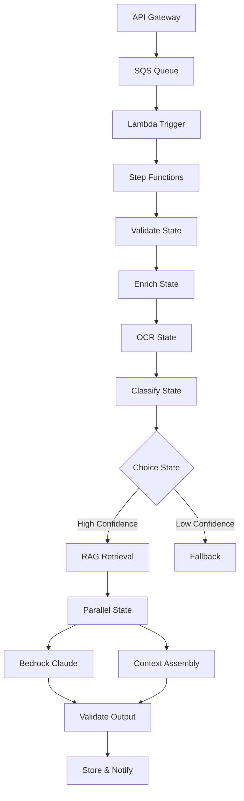

# Step Functions Orchestration Patterns

## Overview

AWS Step Functions è un servizio di orchestrazione serverless che permette di coordinare workflow complessi attraverso macchine a stati (state machines). Nel contesto del nostro AI Technical Support System, Step Functions è il cuore dell'orchestrazione, coordinando l'intero processo di ticket processing che coinvolge classificazione, retrieval, generazione e validazione.

### Cos'è e Perché è Importante

Step Functions permette di:
- **Coordinare servizi distribuiti**: Orchestrare Lambda, SageMaker, Bedrock, DynamoDB senza codice custom
- **Gestire complessità**: Trasformare workflow complessi in diagrammi visivi facilmente comprensibili
- **Error handling robusto**: Retry, catch e fallback integrati nativamente
- **Visibilità completa**: Tracciamento esecuzione real-time con CloudWatch integration
- **Scaling automatico**: Gestisce migliaia di esecuzioni concorrenti senza configurazione

### Quando Usarlo

✅ **Usare Step Functions quando:**
- Workflow con più di 3 passi sequenziali o paralleli
- Necessità di retry logic sofisticata
- Orchestrazione cross-service (Lambda + SageMaker + Bedrock)
- Long-running workflows (fino a 1 anno per Standard)
- Necessità di audit trail completo

❌ **Non usare Step Functions quando:**
- Singola invocazione Lambda sincrona (< 3s)
- Throughput estremo richiesto (> 100K req/sec)
- Budget limitato e workflow semplici (Lambda diretta è più economica)

### Architettura High-Level



## Concetti Fondamentali

### State Machine Anatomy

Una State Machine è composta da:

```json
{
  "Comment": "Descrizione del workflow",
  "StartAt": "PrimoStato",
  "States": {
    "PrimoStato": {
      "Type": "Task",
      "Resource": "arn:aws:lambda:...",
      "Next": "SecondoStato"
    },
    "SecondoStato": {
      "Type": "Succeed"
    }
  }
}
```

### Tipi di Stati

| Tipo | Descrizione | Caso d'Uso |
|------|-------------|------------|
| **Task** | Esegue un lavoro (Lambda, Service API) | Invoke Lambda, SageMaker endpoint |
| **Choice** | Branching condizionale | Route basato su confidence score |
| **Parallel** | Esecuzione parallela di branch | RAG da multiple sources |
| **Map** | Iterazione su array | Batch processing documenti |
| **Wait** | Pausa per tempo fisso o dinamico | Polling job asincrono |
| **Pass** | Passa input → output (no-op) | Data transformation, testing |
| **Succeed** | Termina con successo | Fine workflow |
| **Fail** | Termina con errore | Hard failure |

### Standard vs Express Workflows

| Feature | Standard | Express |
|---------|----------|---------|
| **Max duration** | 1 anno | 5 minuti |
| **Execution rate** | 2K/sec | 100K/sec |
| **Pricing** | Per state transition | Per execution |
| **Execution history** | Full (90 giorni) | CloudWatch Logs only |
| **Exactly-once** | ✅ | ❌ (at-least-once) |
| **Best for** | Long workflows, audit | High-throughput, short |

**Nel nostro sistema usiamo Standard** perché:
- Ticket processing richiede 10-60s (troppo lungo per Express)
- Necessità di audit trail completo
- Exactly-once semantics critiche per evitare duplicati

### Service Integration Patterns

Step Functions supporta 3 pattern di integrazione:

#### 1. Request-Response (Default)
```json
{
  "Type": "Task",
  "Resource": "arn:aws:states:::lambda:invoke",
  "Parameters": {
    "FunctionName": "myFunction",
    "Payload": {
      "input.$": "$.data"
    }
  }
}
```
- Invoca e attende risposta
- Timeout massimo: 60 secondi (Express), 1 anno (Standard)

#### 2. Run a Job (.sync)
```json
{
  "Type": "Task",
  "Resource": "arn:aws:states:::sagemaker:createTrainingJob.sync",
  "Parameters": {
    "TrainingJobName": "my-job",
    "...": "..."
  }
}
```
- Lancia job e attende completamento
- Step Functions polling automatico
- Per: SageMaker, Glue, Batch, ECS

#### 3. Wait for Callback (.waitForTaskToken)
```json
{
  "Type": "Task",
  "Resource": "arn:aws:states:::lambda:invoke.waitForTaskToken",
  "Parameters": {
    "FunctionName": "startAsyncJob",
    "Payload": {
      "taskToken.$": "$$.Task.Token"
    }
  }
}
```
- Passa task token al servizio
- Servizio chiama `SendTaskSuccess/Failure` quando pronto
- Per: Approvazioni umane, webhook esterni

## Implementazione Pratica

### Esempio 1: Ticket Processing Workflow Completo

Questo è il workflow reale del nostro sistema per processare un ticket di supporto.

```json
{
  "Comment": "AI Technical Support - Ticket Processing Workflow",
  "StartAt": "ValidateInput",
  "States": {
    "ValidateInput": {
      "Type": "Task",
      "Resource": "arn:aws:states:::lambda:invoke",
      "Parameters": {
        "FunctionName": "ticket-validator",
        "Payload": {
          "ticket.$": "$.ticket",
          "requestId.$": "$$.Execution.Name"
        }
      },
      "ResultSelector": {
        "validatedTicket.$": "$.Payload.ticket",
        "validationErrors.$": "$.Payload.errors"
      },
      "ResultPath": "$.validation",
      "Next": "CheckValidation",
      "Retry": [
        {
          "ErrorEquals": ["Lambda.ServiceException", "Lambda.TooManyRequestsException"],
          "IntervalSeconds": 2,
          "MaxAttempts": 3,
          "BackoffRate": 2
        }
      ],
      "Catch": [
        {
          "ErrorEquals": ["States.ALL"],
          "ResultPath": "$.error",
          "Next": "ValidationFailed"
        }
      ]
    },

    "CheckValidation": {
      "Type": "Choice",
      "Choices": [
        {
          "Variable": "$.validation.validationErrors",
          "IsPresent": true,
          "Next": "ValidationFailed"
        }
      ],
      "Default": "EnrichMetadata"
    },

    "EnrichMetadata": {
      "Type": "Task",
      "Resource": "arn:aws:states:::lambda:invoke",
      "Parameters": {
        "FunctionName": "metadata-enricher",
        "Payload": {
          "ticketId.$": "$.ticket.ticket_id",
          "customerId.$": "$.ticket.customer.id"
        }
      },
      "ResultPath": "$.enrichment",
      "TimeoutSeconds": 10,
      "Next": "ParallelProcessing"
    },

    "ParallelProcessing": {
      "Type": "Parallel",
      "Branches": [
        {
          "StartAt": "OCRAttachments",
          "States": {
            "OCRAttachments": {
              "Type": "Task",
              "Resource": "arn:aws:states:::lambda:invoke",
              "Parameters": {
                "FunctionName": "ocr-processor",
                "Payload": {
                  "attachments.$": "$.ticket.attachments"
                }
              },
              "ResultSelector": {
                "extractedText.$": "$.Payload.text"
              },
              "End": true
            }
          }
        },
        {
          "StartAt": "FetchSimilarTickets",
          "States": {
            "FetchSimilarTickets": {
              "Type": "Task",
              "Resource": "arn:aws:states:::dynamodb:getItem",
              "Parameters": {
                "TableName": "TicketsTable",
                "Key": {
                  "customerId": {
                    "S.$": "$.ticket.customer.id"
                  }
                }
              },
              "ResultPath": "$.similarTickets",
              "End": true
            }
          }
        }
      ],
      "ResultPath": "$.parallelResults",
      "Next": "ClassifyTicket"
    },

    "ClassifyTicket": {
      "Type": "Task",
      "Resource": "arn:aws:states:::sagemaker:invokeEndpoint",
      "Parameters": {
        "EndpointName": "ticket-classifier-v2",
        "ContentType": "application/json",
        "Body": {
          "text.$": "$.ticket.symptom_text",
          "error_code.$": "$.ticket.error_code",
          "product.$": "$.ticket.asset.product_type"
        }
      },
      "ResultSelector": {
        "category.$": "$.Body.predicted_class",
        "confidence.$": "$.Body.confidence",
        "top3.$": "$.Body.top_k_predictions"
      },
      "ResultPath": "$.classification",
      "Retry": [
        {
          "ErrorEquals": ["SageMaker.ModelError"],
          "IntervalSeconds": 5,
          "MaxAttempts": 2,
          "BackoffRate": 2
        }
      ],
      "Next": "CheckClassificationConfidence"
    },

    "CheckClassificationConfidence": {
      "Type": "Choice",
      "Choices": [
        {
          "Variable": "$.classification.confidence",
          "NumericGreaterThan": 0.85,
          "Next": "RAGRetrieval"
        },
        {
          "Variable": "$.classification.confidence",
          "NumericGreaterThan": 0.6,
          "Next": "RAGRetrievalExtended"
        }
      ],
      "Default": "FallbackToHuman"
    },

    "RAGRetrieval": {
      "Type": "Task",
      "Resource": "arn:aws:states:::lambda:invoke",
      "Parameters": {
        "FunctionName": "rag-retriever",
        "Payload": {
          "query.$": "$.ticket.symptom_text",
          "category.$": "$.classification.category",
          "filters": {
            "product.$": "$.ticket.asset.product_type",
            "error_code.$": "$.ticket.error_code"
          },
          "top_k": 5
        }
      },
      "ResultSelector": {
        "chunks.$": "$.Payload.chunks",
        "scores.$": "$.Payload.scores"
      },
      "ResultPath": "$.retrieval",
      "TimeoutSeconds": 15,
      "Retry": [
        {
          "ErrorEquals": ["States.Timeout"],
          "MaxAttempts": 2,
          "IntervalSeconds": 3
        }
      ],
      "Next": "GenerateSolution"
    },

    "RAGRetrievalExtended": {
      "Type": "Task",
      "Resource": "arn:aws:states:::lambda:invoke",
      "Parameters": {
        "FunctionName": "rag-retriever",
        "Payload": {
          "query.$": "$.ticket.symptom_text",
          "category.$": "$.classification.category",
          "filters": {
            "product.$": "$.ticket.asset.product_type"
          },
          "top_k": 10,
          "use_reranking": true
        }
      },
      "ResultPath": "$.retrieval",
      "Next": "GenerateSolution"
    },

    "GenerateSolution": {
      "Type": "Task",
      "Resource": "arn:aws:states:::bedrock:invokeModel",
      "Parameters": {
        "ModelId": "anthropic.claude-3-sonnet-20240229-v1:0",
        "Body": {
          "anthropic_version": "bedrock-2023-05-31",
          "max_tokens": 2000,
          "temperature": 0.3,
          "messages": [
            {
              "role": "user",
              "content.$": "States.Format('System: Genera soluzione tecnica basata SOLO sui documenti forniti.\n\nContesto KB:\n{}\n\nProblema:\nProdotto: {} {}\nErrore: {}\nDescrizione: {}\n\nIstruzioni:\n1. Identifica causa probabile\n2. Elenca passi di verifica\n3. Proponi soluzione\n4. CITA SEMPRE le fonti\n\nOutput JSON: {{\"steps\": [...], \"citations\": [...], \"confidence\": 0.0-1.0}}', $.retrieval.chunks, $.ticket.asset.product_type, $.ticket.asset.model, $.ticket.error_code, $.ticket.symptom_text)"
            }
          ]
        },
        "ContentType": "application/json"
      },
      "ResultSelector": {
        "solution.$": "$.Body.content[0].text",
        "model.$": "$.Body.model",
        "usage.$": "$.Body.usage"
      },
      "ResultPath": "$.generation",
      "TimeoutSeconds": 30,
      "Retry": [
        {
          "ErrorEquals": ["Bedrock.ThrottlingException"],
          "IntervalSeconds": 5,
          "MaxAttempts": 3,
          "BackoffRate": 2
        },
        {
          "ErrorEquals": ["Bedrock.ModelTimeoutException"],
          "IntervalSeconds": 10,
          "MaxAttempts": 2
        }
      ],
      "Catch": [
        {
          "ErrorEquals": ["States.ALL"],
          "ResultPath": "$.generationError",
          "Next": "FallbackModel"
        }
      ],
      "Next": "ValidateOutput"
    },

    "FallbackModel": {
      "Type": "Task",
      "Resource": "arn:aws:states:::bedrock:invokeModel",
      "Parameters": {
        "ModelId": "meta.llama2-70b-chat-v1",
        "Body": {
          "prompt.$": "$.generation.fallbackPrompt",
          "max_gen_len": 2000,
          "temperature": 0.3
        }
      },
      "ResultPath": "$.generation",
      "Next": "ValidateOutput"
    },

    "ValidateOutput": {
      "Type": "Task",
      "Resource": "arn:aws:states:::lambda:invoke",
      "Parameters": {
        "FunctionName": "solution-validator",
        "Payload": {
          "solution.$": "$.generation.solution",
          "contextChunks.$": "$.retrieval.chunks",
          "validationRules": {
            "min_groundedness_score": 0.75,
            "require_citations": true,
            "check_safety": true,
            "detect_pii": true
          }
        }
      },
      "ResultSelector": {
        "isValid.$": "$.Payload.is_valid",
        "validatedSolution.$": "$.Payload.solution",
        "qualityMetrics.$": "$.Payload.metrics"
      },
      "ResultPath": "$.validation",
      "Next": "CheckValidationResult"
    },

    "CheckValidationResult": {
      "Type": "Choice",
      "Choices": [
        {
          "Variable": "$.validation.isValid",
          "BooleanEquals": true,
          "Next": "StoreSolution"
        }
      ],
      "Default": "ValidationFailed"
    },

    "StoreSolution": {
      "Type": "Parallel",
      "Branches": [
        {
          "StartAt": "UpdateDynamoDB",
          "States": {
            "UpdateDynamoDB": {
              "Type": "Task",
              "Resource": "arn:aws:states:::dynamodb:updateItem",
              "Parameters": {
                "TableName": "TicketsTable",
                "Key": {
                  "ticket_id": {
                    "S.$": "$.ticket.ticket_id"
                  }
                },
                "UpdateExpression": "SET #status = :status, solution = :solution, completed_at = :now, quality_metrics = :metrics",
                "ExpressionAttributeNames": {
                  "#status": "status"
                },
                "ExpressionAttributeValues": {
                  ":status": {
                    "S": "READY"
                  },
                  ":solution": {
                    "S.$": "$.validation.validatedSolution"
                  },
                  ":now": {
                    "S.$": "$$.State.EnteredTime"
                  },
                  ":metrics": {
                    "M.$": "$.validation.qualityMetrics"
                  }
                }
              },
              "End": true
            }
          }
        },
        {
          "StartAt": "LogToS3",
          "States": {
            "LogToS3": {
              "Type": "Task",
              "Resource": "arn:aws:states:::aws-sdk:s3:putObject",
              "Parameters": {
                "Bucket": "audit-logs-bucket",
                "Key.$": "States.Format('tickets/{}/solution.json', $.ticket.ticket_id)",
                "Body.$": "States.JsonToString($.validation.validatedSolution)"
              },
              "End": true
            }
          }
        },
        {
          "StartAt": "PublishEvent",
          "States": {
            "PublishEvent": {
              "Type": "Task",
              "Resource": "arn:aws:states:::events:putEvents",
              "Parameters": {
                "Entries": [
                  {
                    "Source": "ai-support",
                    "DetailType": "ticket.completed",
                    "Detail": {
                      "ticketId.$": "$.ticket.ticket_id",
                      "category.$": "$.classification.category",
                      "confidence.$": "$.validation.qualityMetrics.confidence"
                    }
                  }
                ]
              },
              "End": true
            }
          }
        }
      ],
      "Next": "Success"
    },

    "FallbackToHuman": {
      "Type": "Task",
      "Resource": "arn:aws:states:::lambda:invoke.waitForTaskToken",
      "Parameters": {
        "FunctionName": "human-review-requester",
        "Payload": {
          "ticket.$": "$.ticket",
          "reason": "Low classification confidence",
          "taskToken.$": "$$.Task.Token"
        }
      },
      "TimeoutSeconds": 86400,
      "Next": "Success"
    },

    "ValidationFailed": {
      "Type": "Task",
      "Resource": "arn:aws:states:::dynamodb:updateItem",
      "Parameters": {
        "TableName": "TicketsTable",
        "Key": {
          "ticket_id": {
            "S.$": "$.ticket.ticket_id"
          }
        },
        "UpdateExpression": "SET #status = :status, error = :error",
        "ExpressionAttributeNames": {
          "#status": "status"
        },
        "ExpressionAttributeValues": {
          ":status": {
            "S": "FAILED"
          },
          ":error": {
            "S.$": "States.JsonToString($.error)"
          }
        }
      },
      "Next": "Fail"
    },

    "Success": {
      "Type": "Succeed"
    },

    "Fail": {
      "Type": "Fail",
      "Error": "TicketProcessingFailed",
      "Cause": "Validation or generation failed"
    }
  }
}
```

**Note chiave:**
- **11 stati** per workflow completo
- **2 Choice states** per branching condizionale
- **2 Parallel states** per esecuzione concorrente
- **Retry strategy** su ogni servizio esterno
- **Fallback model** in caso di failure Bedrock primario
- **Wait for callback** per approvazione umana

### Esempio 2: Error Handling Avanzato

Pattern completo con retry, catch e fallback:

```json
{
  "Comment": "Error Handling Patterns",
  "StartAt": "InvokePrimaryService",
  "States": {
    "InvokePrimaryService": {
      "Type": "Task",
      "Resource": "arn:aws:states:::lambda:invoke",
      "Parameters": {
        "FunctionName": "primary-service",
        "Payload": {
          "data.$": "$.input"
        }
      },
      "Retry": [
        {
          "ErrorEquals": ["Lambda.ServiceException", "Lambda.AWSLambdaException"],
          "Comment": "Transient AWS errors - aggressive retry",
          "IntervalSeconds": 2,
          "MaxAttempts": 6,
          "BackoffRate": 2.0
        },
        {
          "ErrorEquals": ["Lambda.TooManyRequestsException"],
          "Comment": "Throttling - longer backoff",
          "IntervalSeconds": 5,
          "MaxAttempts": 4,
          "BackoffRate": 3.0
        },
        {
          "ErrorEquals": ["CustomError.RetryableException"],
          "Comment": "Custom retryable errors",
          "IntervalSeconds": 1,
          "MaxAttempts": 3,
          "BackoffRate": 1.5
        }
      ],
      "Catch": [
        {
          "ErrorEquals": ["CustomError.InvalidInputException"],
          "Comment": "Bad request - no retry, immediate fail",
          "ResultPath": "$.error",
          "Next": "HandleInvalidInput"
        },
        {
          "ErrorEquals": ["Lambda.ServiceException"],
          "Comment": "Service unavailable after retries - try fallback",
          "ResultPath": "$.primaryError",
          "Next": "InvokeFallbackService"
        },
        {
          "ErrorEquals": ["States.Timeout"],
          "Comment": "Timeout - try faster alternative",
          "ResultPath": "$.timeoutError",
          "Next": "InvokeExpressFallback"
        },
        {
          "ErrorEquals": ["States.ALL"],
          "Comment": "Catch-all for unexpected errors",
          "ResultPath": "$.unexpectedError",
          "Next": "LogErrorAndNotify"
        }
      ],
      "TimeoutSeconds": 30,
      "Next": "Success"
    },

    "InvokeFallbackService": {
      "Type": "Task",
      "Resource": "arn:aws:states:::lambda:invoke",
      "Parameters": {
        "FunctionName": "fallback-service",
        "Payload": {
          "data.$": "$.input",
          "reason": "Primary service failed",
          "primaryError.$": "$.primaryError"
        }
      },
      "Retry": [
        {
          "ErrorEquals": ["States.ALL"],
          "IntervalSeconds": 3,
          "MaxAttempts": 2,
          "BackoffRate": 2
        }
      ],
      "Catch": [
        {
          "ErrorEquals": ["States.ALL"],
          "ResultPath": "$.fallbackError",
          "Next": "BothServicesFailed"
        }
      ],
      "Next": "Success"
    },

    "InvokeExpressFallback": {
      "Type": "Task",
      "Resource": "arn:aws:states:::lambda:invoke",
      "Parameters": {
        "FunctionName": "express-service",
        "Payload": {
          "data.$": "$.input",
          "mode": "fast"
        }
      },
      "TimeoutSeconds": 5,
      "Next": "Success"
    },

    "HandleInvalidInput": {
      "Type": "Pass",
      "Parameters": {
        "statusCode": 400,
        "errorMessage": "Invalid input provided",
        "details.$": "$.error"
      },
      "Next": "Fail"
    },

    "BothServicesFailed": {
      "Type": "Task",
      "Resource": "arn:aws:states:::sns:publish",
      "Parameters": {
        "TopicArn": "arn:aws:sns:us-east-1:123456789012:critical-errors",
        "Subject": "Critical: All services failed",
        "Message": {
          "primaryError.$": "$.primaryError",
          "fallbackError.$": "$.fallbackError",
          "input.$": "$.input"
        }
      },
      "Next": "Fail"
    },

    "LogErrorAndNotify": {
      "Type": "Parallel",
      "Branches": [
        {
          "StartAt": "LogToDynamoDB",
          "States": {
            "LogToDynamoDB": {
              "Type": "Task",
              "Resource": "arn:aws:states:::dynamodb:putItem",
              "Parameters": {
                "TableName": "ErrorLog",
                "Item": {
                  "errorId": {
                    "S.$": "$$.Execution.Name"
                  },
                  "timestamp": {
                    "S.$": "$$.State.EnteredTime"
                  },
                  "error": {
                    "S.$": "States.JsonToString($.unexpectedError)"
                  }
                }
              },
              "End": true
            }
          }
        },
        {
          "StartAt": "SendAlert",
          "States": {
            "SendAlert": {
              "Type": "Task",
              "Resource": "arn:aws:states:::sns:publish",
              "Parameters": {
                "TopicArn": "arn:aws:sns:us-east-1:123456789012:errors",
                "Message.$": "States.Format('Unexpected error in execution: {}', $$.Execution.Name)"
              },
              "End": true
            }
          }
        }
      ],
      "Next": "Fail"
    },

    "Success": {
      "Type": "Succeed"
    },

    "Fail": {
      "Type": "Fail"
    }
  }
}
```

**Retry Strategy Best Practices:**
- **IntervalSeconds**: Partire da 1-2s per errori transienti, 5-10s per throttling
- **MaxAttempts**: 3-6 attempts per errori transienti, 2-3 per business logic
- **BackoffRate**: 2.0 (esponenziale standard), 3.0 per throttling aggressivo
- **ErrorEquals**: Specifici prima (CustomError), generici dopo (States.ALL)

**Catch Strategy:**
- Ordinare dal più specifico al più generico
- `States.ALL` come ultimo catch-all
- Usare `ResultPath` per preservare input originale

### Esempio 3: Parallel Execution - RAG da Multiple Sources

RAG retrieval parallelo da 3 sorgenti diverse:

```json
{
  "Comment": "Parallel RAG Retrieval from Multiple Sources",
  "StartAt": "ParallelRetrieval",
  "States": {
    "ParallelRetrieval": {
      "Type": "Parallel",
      "Branches": [
        {
          "StartAt": "RetrieveFromOpenSearch",
          "States": {
            "RetrieveFromOpenSearch": {
              "Type": "Task",
              "Resource": "arn:aws:states:::lambda:invoke",
              "Parameters": {
                "FunctionName": "opensearch-retriever",
                "Payload": {
                  "query.$": "$.query",
                  "index": "kb-technical-docs",
                  "top_k": 10
                }
              },
              "ResultSelector": {
                "source": "opensearch",
                "chunks.$": "$.Payload.chunks",
                "scores.$": "$.Payload.scores"
              },
              "TimeoutSeconds": 10,
              "Retry": [
                {
                  "ErrorEquals": ["States.Timeout", "Lambda.ServiceException"],
                  "MaxAttempts": 2,
                  "IntervalSeconds": 2
                }
              ],
              "Catch": [
                {
                  "ErrorEquals": ["States.ALL"],
                  "ResultPath": "$.error",
                  "Next": "OpenSearchFailed"
                }
              ],
              "End": true
            },
            "OpenSearchFailed": {
              "Type": "Pass",
              "Result": {
                "source": "opensearch",
                "chunks": [],
                "error": "Retrieval failed"
              },
              "End": true
            }
          }
        },
        {
          "StartAt": "RetrieveFromBedrockKB",
          "States": {
            "RetrieveFromBedrockKB": {
              "Type": "Task",
              "Resource": "arn:aws:states:::bedrock:retrieve",
              "Parameters": {
                "KnowledgeBaseId": "KB123456",
                "RetrievalQuery": {
                  "Text.$": "$.query"
                },
                "RetrievalConfiguration": {
                  "VectorSearchConfiguration": {
                    "NumberOfResults": 10
                  }
                }
              },
              "ResultSelector": {
                "source": "bedrock-kb",
                "chunks.$": "$.RetrievalResults[*].Content.Text",
                "scores.$": "$.RetrievalResults[*].Score"
              },
              "Catch": [
                {
                  "ErrorEquals": ["States.ALL"],
                  "ResultPath": "$.error",
                  "Next": "BedrockKBFailed"
                }
              ],
              "End": true
            },
            "BedrockKBFailed": {
              "Type": "Pass",
              "Result": {
                "source": "bedrock-kb",
                "chunks": [],
                "error": "Retrieval failed"
              },
              "End": true
            }
          }
        },
        {
          "StartAt": "RetrieveFromS3Cache",
          "States": {
            "RetrieveFromS3Cache": {
              "Type": "Task",
              "Resource": "arn:aws:states:::lambda:invoke",
              "Parameters": {
                "FunctionName": "s3-cache-retriever",
                "Payload": {
                  "query.$": "$.query",
                  "bucket": "rag-cache-bucket"
                }
              },
              "ResultSelector": {
                "source": "s3-cache",
                "chunks.$": "$.Payload.chunks",
                "cached": true
              },
              "TimeoutSeconds": 5,
              "Catch": [
                {
                  "ErrorEquals": ["States.ALL"],
                  "ResultPath": "$.error",
                  "Next": "S3CacheMiss"
                }
              ],
              "End": true
            },
            "S3CacheMiss": {
              "Type": "Pass",
              "Result": {
                "source": "s3-cache",
                "chunks": [],
                "cached": false
              },
              "End": true
            }
          }
        }
      ],
      "ResultPath": "$.retrievalResults",
      "Next": "MergeAndRerank"
    },

    "MergeAndRerank": {
      "Type": "Task",
      "Resource": "arn:aws:states:::lambda:invoke",
      "Parameters": {
        "FunctionName": "merge-rerank",
        "Payload": {
          "results.$": "$.retrievalResults",
          "query.$": "$.query",
          "top_k": 5,
          "reranking_model": "cross-encoder"
        }
      },
      "ResultSelector": {
        "topChunks.$": "$.Payload.chunks",
        "sources.$": "$.Payload.sources",
        "rerankingScores.$": "$.Payload.scores"
      },
      "ResultPath": "$.finalResults",
      "Next": "Success"
    },

    "Success": {
      "Type": "Succeed"
    }
  }
}
```

**Vantaggi Parallel State:**
- ✅ **Riduzione latency**: 3 retrieval in parallelo vs sequenziale (800ms → 800ms invece di 2400ms)
- ✅ **Fault tolerance**: Se una sorgente fallisce, le altre continuano
- ✅ **Result aggregation**: Merge e re-ranking dei risultati combinati
- ✅ **Timeout indipendenti**: Ogni branch ha il proprio timeout

**Limitazioni:**
- ⚠️ Tutte le branches devono completare (o fallire) prima di procedere
- ⚠️ Non c'è "early exit" se una branch ha già risultati sufficienti
- ⚠️ Costo aumentato: paghi per tutte le esecuzioni parallele

### Esempio 4: Map State - Batch Processing Documenti

Processing parallelo di array di documenti:

```python
# Lambda function per processing singolo documento
import json
import boto3

def lambda_handler(event, context):
    """Process single document"""
    document = event['document']

    # Extract text
    textract = boto3.client('textract')
    response = textract.start_document_text_detection(
        DocumentLocation={
            'S3Object': {
                'Bucket': document['bucket'],
                'Name': document['key']
            }
        }
    )

    job_id = response['JobId']

    # Wait for completion (simplified)
    import time
    while True:
        result = textract.get_document_text_detection(JobId=job_id)
        status = result['JobStatus']
        if status in ['SUCCEEDED', 'FAILED']:
            break
        time.sleep(2)

    if status == 'FAILED':
        return {
            'document_id': document['id'],
            'status': 'failed',
            'error': 'Textract failed'
        }

    # Extract text
    text = ''
    for block in result['Blocks']:
        if block['BlockType'] == 'LINE':
            text += block['Text'] + '\n'

    # Generate embedding
    bedrock = boto3.client('bedrock-runtime')
    embed_response = bedrock.invoke_model(
        modelId='amazon.titan-embed-text-v1',
        body=json.dumps({'inputText': text[:8000]})  # Limit to 8K chars
    )
    embedding = json.loads(embed_response['body'])['embedding']

    # Store in OpenSearch
    opensearch = boto3.client('opensearchserverless')
    # ... index document ...

    return {
        'document_id': document['id'],
        'status': 'processed',
        'text_length': len(text),
        'chunks_created': len(text) // 500  # Approximate
    }
```

```json
{
  "Comment": "Batch Document Processing with Map State",
  "StartAt": "FetchDocuments",
  "States": {
    "FetchDocuments": {
      "Type": "Task",
      "Resource": "arn:aws:states:::lambda:invoke",
      "Parameters": {
        "FunctionName": "fetch-pending-documents",
        "Payload": {
          "status": "PENDING",
          "limit": 100
        }
      },
      "ResultSelector": {
        "documents.$": "$.Payload.documents"
      },
      "Next": "CheckDocumentCount"
    },

    "CheckDocumentCount": {
      "Type": "Choice",
      "Choices": [
        {
          "Variable": "$.documents[0]",
          "IsPresent": true,
          "Next": "ProcessDocuments"
        }
      ],
      "Default": "NoDocumentsToProcess"
    },

    "ProcessDocuments": {
      "Type": "Map",
      "ItemsPath": "$.documents",
      "MaxConcurrency": 10,
      "Iterator": {
        "StartAt": "ProcessSingleDocument",
        "States": {
          "ProcessSingleDocument": {
            "Type": "Task",
            "Resource": "arn:aws:states:::lambda:invoke",
            "Parameters": {
              "FunctionName": "document-processor",
              "Payload": {
                "document.$": "$"
              }
            },
            "ResultSelector": {
              "result.$": "$.Payload"
            },
            "Retry": [
              {
                "ErrorEquals": ["States.TaskFailed"],
                "IntervalSeconds": 3,
                "MaxAttempts": 2,
                "BackoffRate": 2
              }
            ],
            "Catch": [
              {
                "ErrorEquals": ["States.ALL"],
                "ResultPath": "$.error",
                "Next": "MarkDocumentFailed"
              }
            ],
            "Next": "MarkDocumentProcessed"
          },

          "MarkDocumentProcessed": {
            "Type": "Task",
            "Resource": "arn:aws:states:::dynamodb:updateItem",
            "Parameters": {
              "TableName": "Documents",
              "Key": {
                "document_id": {
                  "S.$": "$.result.document_id"
                }
              },
              "UpdateExpression": "SET #status = :status, processed_at = :now, result = :result",
              "ExpressionAttributeNames": {
                "#status": "status"
              },
              "ExpressionAttributeValues": {
                ":status": {
                  "S": "PROCESSED"
                },
                ":now": {
                  "S.$": "$$.State.EnteredTime"
                },
                ":result": {
                  "M.$": "$.result"
                }
              }
            },
            "End": true
          },

          "MarkDocumentFailed": {
            "Type": "Task",
            "Resource": "arn:aws:states:::dynamodb:updateItem",
            "Parameters": {
              "TableName": "Documents",
              "Key": {
                "document_id": {
                  "S.$": "$.document.id"
                }
              },
              "UpdateExpression": "SET #status = :status, error = :error",
              "ExpressionAttributeNames": {
                "#status": "status"
              },
              "ExpressionAttributeValues": {
                ":status": {
                  "S": "FAILED"
                },
                ":error": {
                  "S.$": "States.JsonToString($.error)"
                }
              }
            },
            "End": true
          }
        }
      },
      "ResultPath": "$.processingResults",
      "Next": "AggregateResults"
    },

    "AggregateResults": {
      "Type": "Task",
      "Resource": "arn:aws:states:::lambda:invoke",
      "Parameters": {
        "FunctionName": "aggregate-results",
        "Payload": {
          "results.$": "$.processingResults",
          "totalDocuments.$": "States.ArrayLength($.documents)"
        }
      },
      "ResultSelector": {
        "summary.$": "$.Payload"
      },
      "Next": "Success"
    },

    "NoDocumentsToProcess": {
      "Type": "Succeed",
      "Comment": "No pending documents"
    },

    "Success": {
      "Type": "Succeed"
    }
  }
}
```

**Map State Best Practices:**
- **MaxConcurrency**: Limita esecuzioni concorrenti per evitare throttling (10-50 tipico)
- **ItemsPath**: Specifica il campo JSON array da iterare
- **Error handling**: Ogni iterazione può fallire indipendentemente
- **Result aggregation**: Usa Lambda post-Map per aggregare risultati

**Dynamic Parallelism:**
```json
{
  "ProcessDocuments": {
    "Type": "Map",
    "ItemsPath": "$.documents",
    "MaxConcurrency": 0,
    "Comment": "MaxConcurrency=0 means unlimited (use with caution!)"
  }
}
```

⚠️ **Warning**: `MaxConcurrency: 0` significa parallelismo illimitato. Può causare:
- Throttling su Lambda/DynamoDB
- Circuit breaker su servizi esterni
- Costi imprevisti

### Esempio 5: Choice State - Routing basato su Confidence

Routing intelligente basato su classification confidence:

```json
{
  "Comment": "Intelligent Routing Based on Confidence Score",
  "StartAt": "ClassifyTicket",
  "States": {
    "ClassifyTicket": {
      "Type": "Task",
      "Resource": "arn:aws:states:::sagemaker:invokeEndpoint",
      "Parameters": {
        "EndpointName": "ticket-classifier",
        "Body": {
          "text.$": "$.ticket.text"
        }
      },
      "ResultSelector": {
        "category.$": "$.Body.category",
        "confidence.$": "$.Body.confidence",
        "secondBestCategory.$": "$.Body.top_k[1].category",
        "secondBestConfidence.$": "$.Body.top_k[1].confidence"
      },
      "ResultPath": "$.classification",
      "Next": "RouteByConfidence"
    },

    "RouteByConfidence": {
      "Type": "Choice",
      "Choices": [
        {
          "Comment": "Very high confidence - fast track with minimal retrieval",
          "And": [
            {
              "Variable": "$.classification.confidence",
              "NumericGreaterThanEquals": 0.95
            },
            {
              "Variable": "$.classification.category",
              "StringMatches": "KNOWN_ISSUE_*"
            }
          ],
          "Next": "FastTrackKnownIssue"
        },
        {
          "Comment": "High confidence - standard RAG with top category",
          "Variable": "$.classification.confidence",
          "NumericGreaterThanEquals": 0.85,
          "Next": "StandardRAGRetrieval"
        },
        {
          "Comment": "Medium confidence with clear second choice - multi-category RAG",
          "And": [
            {
              "Variable": "$.classification.confidence",
              "NumericGreaterThanEquals": 0.70
            },
            {
              "Variable": "$.classification.secondBestConfidence",
              "NumericGreaterThanEquals": 0.60
            }
          ],
          "Next": "MultiCategoryRAG"
        },
        {
          "Comment": "Medium confidence - extended RAG with reranking",
          "Variable": "$.classification.confidence",
          "NumericGreaterThanEquals": 0.60,
          "Next": "ExtendedRAGWithReranking"
        },
        {
          "Comment": "Low confidence but high urgency - human-in-the-loop with AI assist",
          "And": [
            {
              "Variable": "$.classification.confidence",
              "NumericLessThan": 0.60
            },
            {
              "Variable": "$.ticket.urgency",
              "StringEquals": "HIGH"
            }
          ],
          "Next": "HumanInLoopWithAssist"
        },
        {
          "Comment": "Category is data quality issue - special handling",
          "Variable": "$.classification.category",
          "StringEquals": "DATA_QUALITY_ISSUE",
          "Next": "DataQualityPipeline"
        }
      ],
      "Default": "StandardHumanReview"
    },

    "FastTrackKnownIssue": {
      "Type": "Task",
      "Resource": "arn:aws:states:::dynamodb:getItem",
      "Parameters": {
        "TableName": "KnownIssues",
        "Key": {
          "issue_id": {
            "S.$": "$.classification.category"
          }
        }
      },
      "ResultSelector": {
        "solution.$": "$.Item.standardSolution.S",
        "cached": true
      },
      "ResultPath": "$.solution",
      "Next": "ValidateAndStore"
    },

    "StandardRAGRetrieval": {
      "Type": "Task",
      "Resource": "arn:aws:states:::lambda:invoke",
      "Parameters": {
        "FunctionName": "rag-retriever",
        "Payload": {
          "query.$": "$.ticket.text",
          "category.$": "$.classification.category",
          "top_k": 5
        }
      },
      "ResultPath": "$.retrieval",
      "Next": "GenerateSolution"
    },

    "MultiCategoryRAG": {
      "Type": "Parallel",
      "Branches": [
        {
          "StartAt": "RetrieveCategory1",
          "States": {
            "RetrieveCategory1": {
              "Type": "Task",
              "Resource": "arn:aws:states:::lambda:invoke",
              "Parameters": {
                "FunctionName": "rag-retriever",
                "Payload": {
                  "query.$": "$.ticket.text",
                  "category.$": "$.classification.category",
                  "top_k": 5
                }
              },
              "End": true
            }
          }
        },
        {
          "StartAt": "RetrieveCategory2",
          "States": {
            "RetrieveCategory2": {
              "Type": "Task",
              "Resource": "arn:aws:states:::lambda:invoke",
              "Parameters": {
                "FunctionName": "rag-retriever",
                "Payload": {
                  "query.$": "$.ticket.text",
                  "category.$": "$.classification.secondBestCategory",
                  "top_k": 5
                }
              },
              "End": true
            }
          }
        }
      ],
      "ResultPath": "$.multiRetrieval",
      "Next": "MergeCategories"
    },

    "MergeCategories": {
      "Type": "Task",
      "Resource": "arn:aws:states:::lambda:invoke",
      "Parameters": {
        "FunctionName": "merge-rerank",
        "Payload": {
          "results.$": "$.multiRetrieval"
        }
      },
      "ResultPath": "$.retrieval",
      "Next": "GenerateSolution"
    },

    "ExtendedRAGWithReranking": {
      "Type": "Task",
      "Resource": "arn:aws:states:::lambda:invoke",
      "Parameters": {
        "FunctionName": "rag-retriever",
        "Payload": {
          "query.$": "$.ticket.text",
          "category.$": "$.classification.category",
          "top_k": 20,
          "use_reranking": true,
          "rerank_to": 5
        }
      },
      "ResultPath": "$.retrieval",
      "Next": "GenerateSolution"
    },

    "HumanInLoopWithAssist": {
      "Type": "Task",
      "Resource": "arn:aws:states:::lambda:invoke.waitForTaskToken",
      "Parameters": {
        "FunctionName": "request-human-review",
        "Payload": {
          "ticket.$": "$.ticket",
          "classification.$": "$.classification",
          "aiSuggestion": "Low confidence - human review required",
          "taskToken.$": "$$.Task.Token"
        }
      },
      "TimeoutSeconds": 86400,
      "ResultPath": "$.humanReview",
      "Next": "ValidateAndStore"
    },

    "DataQualityPipeline": {
      "Type": "Task",
      "Resource": "arn:aws:states:::states:startExecution.sync",
      "Parameters": {
        "StateMachineArn": "arn:aws:states:us-east-1:123456789012:stateMachine:DataQualityWorkflow",
        "Input": {
          "ticket.$": "$.ticket"
        }
      },
      "ResultPath": "$.dataQualityResult",
      "Next": "ValidateAndStore"
    },

    "StandardHumanReview": {
      "Type": "Task",
      "Resource": "arn:aws:states:::lambda:invoke.waitForTaskToken",
      "Parameters": {
        "FunctionName": "request-human-review",
        "Payload": {
          "ticket.$": "$.ticket",
          "classification.$": "$.classification",
          "taskToken.$": "$$.Task.Token"
        }
      },
      "TimeoutSeconds": 172800,
      "ResultPath": "$.humanReview",
      "Next": "ValidateAndStore"
    },

    "GenerateSolution": {
      "Type": "Task",
      "Resource": "arn:aws:states:::bedrock:invokeModel",
      "Parameters": {
        "ModelId": "anthropic.claude-3-sonnet-20240229-v1:0",
        "Body": {
          "messages": [
            {
              "role": "user",
              "content.$": "States.Format('Context: {}\nQuestion: {}', $.retrieval.Payload.chunks, $.ticket.text)"
            }
          ]
        }
      },
      "ResultPath": "$.solution",
      "Next": "ValidateAndStore"
    },

    "ValidateAndStore": {
      "Type": "Task",
      "Resource": "arn:aws:states:::dynamodb:updateItem",
      "Parameters": {
        "TableName": "Tickets",
        "Key": {
          "ticket_id": {
            "S.$": "$.ticket.id"
          }
        },
        "UpdateExpression": "SET solution = :sol, #status = :status",
        "ExpressionAttributeNames": {
          "#status": "status"
        },
        "ExpressionAttributeValues": {
          ":sol": {
            "S.$": "States.JsonToString($.solution)"
          },
          ":status": {
            "S": "COMPLETED"
          }
        }
      },
      "End": true
    }
  }
}
```

**Choice State Operators:**
- **String**: `StringEquals`, `StringLessThan`, `StringGreaterThan`, `StringMatches` (wildcard)
- **Numeric**: `NumericEquals`, `NumericLessThan`, `NumericGreaterThan`, `NumericLessThanEquals`, `NumericGreaterThanEquals`
- **Boolean**: `BooleanEquals`
- **Timestamp**: `TimestampEquals`, `TimestampLessThan`, `TimestampGreaterThan`
- **Existence**: `IsPresent`, `IsNull`, `IsString`, `IsNumeric`, `IsBoolean`, `IsTimestamp`
- **Logic**: `And`, `Or`, `Not`

## Best Practices

### Do's ✅

1. **Use ResultPath per preservare input**
```json
{
  "ResultPath": "$.enrichment",
  "Comment": "Aggiunge enrichment senza sovrascrivere input originale"
}
```

2. **Timeout su tutti i Task states**
```json
{
  "TimeoutSeconds": 30,
  "Comment": "Previene hanging infinito"
}
```

3. **Retry specifico prima di generico**
```json
{
  "Retry": [
    {
      "ErrorEquals": ["CustomError.Retryable"],
      "MaxAttempts": 3
    },
    {
      "ErrorEquals": ["States.ALL"],
      "MaxAttempts": 1
    }
  ]
}
```

4. **Use Intrinsic Functions per dynamic values**
```json
{
  "Parameters": {
    "message.$": "States.Format('Ticket {} processed at {}', $.ticketId, $$.State.EnteredTime)"
  }
}
```

5. **Parallel branches con error handling indipendente**
```json
{
  "Type": "Parallel",
  "Branches": [
    {
      "States": {
        "Task1": {
          "Catch": [{"ErrorEquals": ["States.ALL"], "Next": "Task1Fallback"}]
        }
      }
    }
  ]
}
```

### Don'ts ❌

1. **Non hard-codare ARN regionali**
```json
// ❌ BAD
"Resource": "arn:aws:lambda:us-east-1:123456789012:function:myFunc"

// ✅ GOOD - use CloudFormation substitution
"Resource": {"Fn::GetAtt": ["MyFunction", "Arn"]}
```

2. **Non ignorare States.ALL nei Catch**
```json
// ❌ BAD - errori non gestiti causano execution failure
"Catch": [
  {"ErrorEquals": ["CustomError"], "Next": "HandleCustom"}
]

// ✅ GOOD
"Catch": [
  {"ErrorEquals": ["CustomError"], "Next": "HandleCustom"},
  {"ErrorEquals": ["States.ALL"], "Next": "HandleUnexpected"}
]
```

3. **Non usare Map per pochi item**
```json
// ❌ BAD - overhead Map per 2-3 items
{"Type": "Map", "ItemsPath": "$.items"}  // se items.length < 5

// ✅ GOOD - parallel esplicito
{"Type": "Parallel", "Branches": [branch1, branch2, branch3]}
```

4. **Non mettere business logic in Step Functions**
```json
// ❌ BAD - troppa logica in States
"Choices": [
  {"Variable": "$.price", "NumericGreaterThan": 100, "Next": "CheckDiscount"},
  {"Variable": "$.customer.tier", "StringEquals": "GOLD", "Next": "ApplyGoldDiscount"},
  // ... 20+ conditions ...
]

// ✅ GOOD - delega a Lambda
{"Type": "Task", "Resource": "arn:aws:lambda:...:function:calculate-price"}
```

5. **Non ignorare MaxConcurrency su Map**
```json
// ❌ BAD - può causare throttling
{"Type": "Map", "MaxConcurrency": 0}

// ✅ GOOD - limita concurrency
{"Type": "Map", "MaxConcurrency": 10}
```

### Performance Optimization

1. **Service Integration Diretta vs Lambda Wrapper**

✅ **Direct Integration** (preferito):
```json
{
  "Type": "Task",
  "Resource": "arn:aws:states:::dynamodb:getItem",
  "Parameters": {
    "TableName": "MyTable",
    "Key": {"id": {"S.$": "$.itemId"}}
  }
}
```
- Latency: ~50ms
- Costo: $0.000025 per state transition
- Cold start: N/A

❌ **Lambda Wrapper**:
```json
{
  "Type": "Task",
  "Resource": "arn:aws:lambda:...:function:dynamodb-wrapper"
}
```
- Latency: ~200ms (cold start) o ~50ms (warm)
- Costo: $0.000025 (state) + $0.0000002 (Lambda)
- Cold start: Possibile

**Quando usare Lambda wrapper:**
- Logica complessa (validazione, trasformazione)
- Servizio non supportato da Step Functions
- Retry logic custom

2. **Parallel vs Sequential**

```python
# Sequential execution
total_time = task1_time + task2_time + task3_time
# 500ms + 500ms + 500ms = 1500ms

# Parallel execution
total_time = max(task1_time, task2_time, task3_time)
# max(500ms, 500ms, 500ms) = 500ms
```

Usa Parallel quando:
- Tasks sono indipendenti
- Non ci sono rate limits
- Latency è critica

3. **Batch API Calls**

❌ **Map over single items**:
```json
{
  "Type": "Map",
  "ItemsPath": "$.items",
  "Iterator": {
    "States": {
      "PutItem": {
        "Type": "Task",
        "Resource": "arn:aws:states:::dynamodb:putItem",
        "Parameters": {
          "TableName": "MyTable",
          "Item": {"id": {"S.$": "$.id"}}
        }
      }
    }
  }
}
```
- 100 items = 100 DynamoDB calls = 100 state transitions

✅ **Lambda with batch write**:
```json
{
  "Type": "Task",
  "Resource": "arn:aws:lambda:...:function:batch-writer",
  "Parameters": {
    "items.$": "$.items"
  }
}
```
- 100 items = 1 Lambda call + 4 BatchWriteItem calls (25 items/batch) = 1 state transition

### Security Considerations

1. **Least Privilege IAM**

```yaml
# Step Functions execution role
StateMachineExecutionRole:
  Type: AWS::IAM::Role
  Properties:
    AssumeRolePolicyDocument:
      Statement:
        - Effect: Allow
          Principal:
            Service: states.amazonaws.com
          Action: sts:AssumeRole
    Policies:
      - PolicyName: StateMachinePolicy
        PolicyDocument:
          Statement:
            # Specific Lambda functions only
            - Effect: Allow
              Action: lambda:InvokeFunction
              Resource:
                - !GetAtt ValidatorFunction.Arn
                - !GetAtt ProcessorFunction.Arn

            # Specific DynamoDB table only
            - Effect: Allow
              Action:
                - dynamodb:GetItem
                - dynamodb:PutItem
                - dynamodb:UpdateItem
              Resource: !GetAtt TicketsTable.Arn

            # Bedrock with condition
            - Effect: Allow
              Action: bedrock:InvokeModel
              Resource: arn:aws:bedrock:*::foundation-model/anthropic.claude-*
              Condition:
                StringEquals:
                  aws:RequestedRegion: us-east-1
```

2. **Encryption at Rest**

```yaml
StateMachine:
  Type: AWS::StepFunctions::StateMachine
  Properties:
    StateMachineType: STANDARD
    TracingConfiguration:
      Enabled: true
    LoggingConfiguration:
      Level: ALL
      IncludeExecutionData: true
      Destinations:
        - CloudWatchLogsLogGroup:
            LogGroupArn: !GetAtt LogGroup.Arn
    # Encryption with KMS
    EncryptionConfiguration:
      Type: CUSTOMER_MANAGED_KMS_KEY
      KmsKeyId: !Ref StepFunctionsKMSKey
```

3. **Input/Output Filtering**

```json
{
  "ValidateInput": {
    "Type": "Task",
    "Resource": "arn:aws:lambda:...:function:validator",
    "InputPath": "$.ticket",
    "ResultPath": "$.validation",
    "OutputPath": "$.validation.sanitizedData",
    "Comment": "InputPath limita cosa viene passato, OutputPath limita cosa viene restituito"
  }
}
```

4. **PII Redaction**

```json
{
  "LogData": {
    "Type": "Task",
    "Resource": "arn:aws:lambda:...:function:log-handler",
    "Parameters": {
      "data.$": "$.processedData",
      "redactPII": true,
      "logLevel": "INFO"
    },
    "Comment": "Lambda redacts PII before CloudWatch logging"
  }
}
```

### Cost Optimization

**Standard Workflow Pricing:**
- State transitions: $0.025 per 1,000 transitions
- First 4,000 transitions/month: FREE

**Cost calculation:**
```
Example workflow: 15 states per execution
Cost per execution = 15 * $0.000025 = $0.000375

1 million executions/month:
- Total transitions: 15M
- Free tier: 4K
- Billable: 14,996,000
- Cost: 14,996,000 * $0.000025 = $374.90/month
```

**Optimization strategies:**

1. **Reduce state count**
```json
// ❌ BAD - 5 states
"ValidateField1" → "ValidateField2" → "ValidateField3" → "ValidateField4" → "ValidateField5"

// ✅ GOOD - 1 state
"ValidateAllFields" (single Lambda with all validation logic)
```

2. **Use Express for high-throughput**
```
Standard: 1M executions × 15 states = $374.90
Express: 1M executions × 5 min × $0.000001/min = $5.00
Savings: $369.90 (98% reduction)
```

3. **Batch operations**
```
// ❌ Process 1000 items individually
1000 executions × 10 states = 10,000 transitions = $0.25

// ✅ Batch process with Map
1 execution × (10 states + Map overhead) = 11 transitions = $0.0003
Savings: $0.2497 (99% reduction)
```

4. **Avoid unnecessary state transitions**
```json
// ❌ BAD - 2 extra states
"Task1" → "PassState" → "AnotherPass" → "Task2"

// ✅ GOOD - direct
"Task1" → "Task2"
```

## Troubleshooting

### Problem 1: Execution Timeout

**Symptom:**
```
States.Timeout error after 30 seconds
```

**Cause:** Default timeout (60s Express, none Standard) troppo corto per task lungo

**Solution:**
```json
{
  "LongRunningTask": {
    "Type": "Task",
    "Resource": "arn:aws:lambda:...",
    "TimeoutSeconds": 300,
    "Comment": "5 minutes timeout"
  }
}
```

O usa pattern asincrono:
```json
{
  "StartAsyncJob": {
    "Type": "Task",
    "Resource": "arn:aws:states:::lambda:invoke",
    "Parameters": {
      "FunctionName": "start-job"
    },
    "Next": "WaitForCompletion"
  },
  "WaitForCompletion": {
    "Type": "Task",
    "Resource": "arn:aws:states:::lambda:invoke",
    "Parameters": {
      "FunctionName": "check-job-status"
    },
    "Next": "IsJobComplete"
  },
  "IsJobComplete": {
    "Type": "Choice",
    "Choices": [
      {
        "Variable": "$.status",
        "StringEquals": "COMPLETED",
        "Next": "ProcessResults"
      }
    ],
    "Default": "WaitState"
  },
  "WaitState": {
    "Type": "Wait",
    "Seconds": 30,
    "Next": "WaitForCompletion"
  }
}
```

### Problem 2: Lambda Throttling

**Symptom:**
```
Lambda.TooManyRequestsException
Rate exceeded
```

**Cause:** Troppe invocazioni concorrenti (reserved concurrency limit)

**Solution 1 - Aggressive retry:**
```json
{
  "Retry": [
    {
      "ErrorEquals": ["Lambda.TooManyRequestsException"],
      "IntervalSeconds": 10,
      "MaxAttempts": 5,
      "BackoffRate": 3.0
    }
  ]
}
```

**Solution 2 - Limit Map concurrency:**
```json
{
  "Type": "Map",
  "MaxConcurrency": 5,
  "Comment": "Limita a 5 Lambda concorrenti"
}
```

**Solution 3 - Use SQS queue:**
```json
{
  "EnqueueTasks": {
    "Type": "Task",
    "Resource": "arn:aws:states:::sqs:sendMessage",
    "Parameters": {
      "QueueUrl": "https://sqs.us-east-1.amazonaws.com/123456789012/task-queue",
      "MessageBody.$": "$.task"
    }
  }
}
```

### Problem 3: Output Size Limit (256KB)

**Symptom:**
```
States.DataLimitExceeded
The state/task returned a result with a size exceeding the maximum number of bytes service limit.
```

**Cause:** Step Functions ha limit 256KB per input/output

**Solution 1 - Store in S3:**
```python
# Lambda function
def lambda_handler(event, context):
    large_result = process_data()  # 10MB result

    # Store in S3
    s3_key = f"results/{context.request_id}.json"
    s3.put_object(
        Bucket='results-bucket',
        Key=s3_key,
        Body=json.dumps(large_result)
    )

    # Return reference only
    return {
        'result_location': f's3://results-bucket/{s3_key}',
        'size': len(json.dumps(large_result))
    }
```

**Solution 2 - Pagination:**
```json
{
  "ProcessLargeDataset": {
    "Type": "Task",
    "Resource": "arn:aws:lambda:...",
    "Parameters": {
      "datasetId.$": "$.datasetId",
      "pageSize": 1000,
      "pageToken.$": "$.nextPageToken"
    },
    "ResultPath": "$.currentPage",
    "Next": "HasMorePages"
  },
  "HasMorePages": {
    "Type": "Choice",
    "Choices": [
      {
        "Variable": "$.currentPage.nextPageToken",
        "IsPresent": true,
        "Next": "ProcessLargeDataset"
      }
    ],
    "Default": "Done"
  }
}
```

### Problem 4: Circular Dependency

**Symptom:**
```
CloudFormation CREATE_FAILED
Circular dependency between resources
```

**Cause:** State Machine referenzia Lambda, Lambda ha permesso per State Machine

**Solution - Use two-stack deployment:**
```yaml
# Stack 1: Lambda functions
LambdaFunction:
  Type: AWS::Lambda::Function
  Properties:
    FunctionName: processor

# Stack 2: State Machine (references Stack 1)
StateMachine:
  Type: AWS::StepFunctions::StateMachine
  Properties:
    RoleArn: !GetAtt StateMachineRole.Arn
    DefinitionString: !Sub |
      {
        "States": {
          "Process": {
            "Resource": "${LambdaFunction.Arn}"
          }
        }
      }

# Lambda permission (in Stack 2)
LambdaInvokePermission:
  Type: AWS::Lambda::Permission
  Properties:
    FunctionName: !ImportValue Stack1-LambdaFunctionName
    Action: lambda:InvokeFunction
    Principal: states.amazonaws.com
    SourceArn: !GetAtt StateMachine.Arn
```

### Problem 5: Express Workflow Not Logging

**Symptom:** Nessun log in CloudWatch da Express workflow

**Cause:** Express workflows richiedono configurazione esplicita

**Solution:**
```yaml
ExpressStateMachine:
  Type: AWS::StepFunctions::StateMachine
  Properties:
    StateMachineType: EXPRESS
    LoggingConfiguration:
      Level: ALL
      IncludeExecutionData: true
      Destinations:
        - CloudWatchLogsLogGroup:
            LogGroupArn: !GetAtt LogGroup.Arn
    RoleArn: !GetAtt StateMachineRole.Arn

LogGroup:
  Type: AWS::Logs::LogGroup
  Properties:
    LogGroupName: /aws/vendedlogs/states/express-workflow
    RetentionInDays: 7

# IAM role needs logging permissions
StateMachineRole:
  Type: AWS::IAM::Role
  Properties:
    Policies:
      - PolicyName: CloudWatchLogs
        PolicyDocument:
          Statement:
            - Effect: Allow
              Action:
                - logs:CreateLogDelivery
                - logs:GetLogDelivery
                - logs:UpdateLogDelivery
                - logs:DeleteLogDelivery
                - logs:ListLogDeliveries
                - logs:PutResourcePolicy
                - logs:DescribeResourcePolicies
                - logs:DescribeLogGroups
              Resource: "*"
```

## Testing e Debugging

### Local Testing con Step Functions Local

```bash
# Install Step Functions Local
docker pull amazon/aws-stepfunctions-local

# Run container
docker run -p 8083:8083 \
  --env-file aws-credentials.env \
  amazon/aws-stepfunctions-local

# Create state machine
aws stepfunctions create-state-machine \
  --endpoint-url http://localhost:8083 \
  --name test-machine \
  --definition file://state-machine.json \
  --role-arn arn:aws:iam::012345678901:role/DummyRole

# Start execution
aws stepfunctions start-execution \
  --endpoint-url http://localhost:8083 \
  --state-machine-arn arn:aws:states:us-east-1:012345678901:stateMachine:test-machine \
  --input '{"ticket": {"id": "test-123"}}'

# Check status
aws stepfunctions describe-execution \
  --endpoint-url http://localhost:8083 \
  --execution-arn <execution-arn>
```

### CloudWatch Logs Insights Queries

**Query 1 - Find failed executions:**
```sql
fields @timestamp, executionArn, error.Error, error.Cause
| filter type = "ExecutionFailed"
| sort @timestamp desc
| limit 20
```

**Query 2 - Execution duration statistics:**
```sql
fields executionArn, duration
| filter type = "ExecutionSucceeded"
| stats avg(duration), min(duration), max(duration), pct(duration, 95) by bin(5m)
```

**Query 3 - Lambda invocation errors:**
```sql
fields @timestamp, executionArn, stateEnteredEventDetails.name, stateExitedEventDetails.output
| filter type = "TaskFailed" and resource like /lambda/
| sort @timestamp desc
```

**Query 4 - State transition count:**
```sql
fields executionArn
| filter type like /StateEntered/
| stats count() as transitions by executionArn
| sort transitions desc
```

### X-Ray Tracing

Enable tracing:
```yaml
StateMachine:
  Type: AWS::StepFunctions::StateMachine
  Properties:
    TracingConfiguration:
      Enabled: true
```

Lambda with X-Ray:
```python
import boto3
from aws_xray_sdk.core import xray_recorder
from aws_xray_sdk.core import patch_all

patch_all()

@xray_recorder.capture('process_ticket')
def lambda_handler(event, context):
    ticket_id = event['ticket_id']

    # Subsegment for DynamoDB
    with xray_recorder.capture('dynamodb_query'):
        response = dynamodb.get_item(
            TableName='Tickets',
            Key={'ticket_id': ticket_id}
        )

    # Subsegment for Bedrock
    with xray_recorder.capture('bedrock_invocation'):
        bedrock_response = bedrock.invoke_model(
            modelId='claude-3',
            body=json.dumps({'prompt': '...'})
        )

    return {'statusCode': 200}
```

### Unit Testing State Machines

```python
import json
import boto3
import pytest
from moto import mock_stepfunctions, mock_lambda, mock_dynamodb

@mock_stepfunctions
@mock_lambda
def test_state_machine_execution():
    # Setup
    client = boto3.client('stepfunctions', region_name='us-east-1')
    lambda_client = boto3.client('lambda', region_name='us-east-1')

    # Create mock Lambda
    lambda_client.create_function(
        FunctionName='validator',
        Runtime='python3.11',
        Role='arn:aws:iam::123456789012:role/lambda-role',
        Handler='index.handler',
        Code={'ZipFile': b'fake code'}
    )

    # Load state machine definition
    with open('state-machine.json') as f:
        definition = json.load(f)

    # Create state machine
    response = client.create_state_machine(
        name='test-machine',
        definition=json.dumps(definition),
        roleArn='arn:aws:iam::123456789012:role/sfn-role'
    )

    state_machine_arn = response['stateMachineArn']

    # Start execution
    exec_response = client.start_execution(
        stateMachineArn=state_machine_arn,
        input=json.dumps({
            'ticket': {
                'id': 'test-123',
                'text': 'Test issue'
            }
        })
    )

    # Wait for completion (in real test, poll describe_execution)
    execution_arn = exec_response['executionArn']

    # Verify
    result = client.describe_execution(executionArn=execution_arn)
    assert result['status'] == 'SUCCEEDED'
```

## Esempi Reali dal Progetto

### Esempio Completo: Ticket Processing con Metrics

Workflow production-ready con metriche CloudWatch:

```json
{
  "Comment": "Production Ticket Processing with Metrics",
  "StartAt": "RecordStartMetric",
  "States": {
    "RecordStartMetric": {
      "Type": "Task",
      "Resource": "arn:aws:states:::aws-sdk:cloudwatch:putMetricData",
      "Parameters": {
        "Namespace": "AISupport/TicketProcessing",
        "MetricData": [
          {
            "MetricName": "TicketStarted",
            "Value": 1,
            "Unit": "Count",
            "Timestamp.$": "$$.State.EnteredTime",
            "Dimensions": [
              {
                "Name": "Category",
                "Value.$": "$.ticket.category"
              }
            ]
          }
        ]
      },
      "ResultPath": null,
      "Next": "ValidateInput"
    },

    "ValidateInput": {
      "Type": "Task",
      "Resource": "arn:aws:states:::lambda:invoke",
      "Parameters": {
        "FunctionName": "ticket-validator",
        "Payload.$": "$"
      },
      "Next": "ClassifyWithTiming",
      "Catch": [
        {
          "ErrorEquals": ["States.ALL"],
          "ResultPath": "$.error",
          "Next": "RecordFailureMetric"
        }
      ]
    },

    "ClassifyWithTiming": {
      "Type": "Pass",
      "Parameters": {
        "ticket.$": "$.ticket",
        "startTime.$": "$$.State.EnteredTime"
      },
      "Next": "InvokeSageMaker"
    },

    "InvokeSageMaker": {
      "Type": "Task",
      "Resource": "arn:aws:states:::sagemaker:invokeEndpoint",
      "Parameters": {
        "EndpointName": "ticket-classifier",
        "Body.$": "$.ticket"
      },
      "ResultSelector": {
        "classification.$": "$.Body",
        "endTime.$": "$$.State.EnteredTime"
      },
      "ResultPath": "$.classificationResult",
      "Next": "CalculateClassificationLatency"
    },

    "CalculateClassificationLatency": {
      "Type": "Pass",
      "Parameters": {
        "latency.$": "States.MathAdd(States.StringToJson(States.ArrayGetItem(States.StringSplit($.classificationResult.endTime, 'T'), 1)), -States.StringToJson(States.ArrayGetItem(States.StringSplit($.startTime, 'T'), 1)))",
        "classification.$": "$.classificationResult.classification",
        "ticket.$": "$.ticket"
      },
      "Next": "RecordClassificationMetric"
    },

    "RecordClassificationMetric": {
      "Type": "Task",
      "Resource": "arn:aws:states:::aws-sdk:cloudwatch:putMetricData",
      "Parameters": {
        "Namespace": "AISupport/TicketProcessing",
        "MetricData": [
          {
            "MetricName": "ClassificationLatency",
            "Value.$": "$.latency",
            "Unit": "Milliseconds",
            "Dimensions": [
              {
                "Name": "Category",
                "Value.$": "$.classification.category"
              }
            ]
          },
          {
            "MetricName": "ClassificationConfidence",
            "Value.$": "$.classification.confidence",
            "Unit": "None"
          }
        ]
      },
      "ResultPath": null,
      "Next": "RAGRetrieval"
    },

    "RAGRetrieval": {
      "Type": "Task",
      "Resource": "arn:aws:states:::lambda:invoke",
      "Parameters": {
        "FunctionName": "rag-retriever",
        "Payload": {
          "query.$": "$.ticket.text",
          "category.$": "$.classification.category"
        }
      },
      "ResultPath": "$.retrieval",
      "Next": "GenerateSolution"
    },

    "GenerateSolution": {
      "Type": "Task",
      "Resource": "arn:aws:states:::bedrock:invokeModel",
      "Parameters": {
        "ModelId": "anthropic.claude-3-sonnet-20240229-v1:0",
        "Body": {
          "messages": [
            {
              "role": "user",
              "content.$": "States.Format('Context: {}\nQuestion: {}', $.retrieval.Payload.chunks, $.ticket.text)"
            }
          ]
        }
      },
      "ResultPath": "$.solution",
      "Next": "StoreSolution"
    },

    "StoreSolution": {
      "Type": "Task",
      "Resource": "arn:aws:states:::dynamodb:updateItem",
      "Parameters": {
        "TableName": "Tickets",
        "Key": {
          "ticket_id": {"S.$": "$.ticket.id"}
        },
        "UpdateExpression": "SET solution = :sol, #status = :status",
        "ExpressionAttributeNames": {
          "#status": "status"
        },
        "ExpressionAttributeValues": {
          ":sol": {"S.$": "States.JsonToString($.solution)"},
          ":status": {"S": "COMPLETED"}
        }
      },
      "Next": "RecordSuccessMetric"
    },

    "RecordSuccessMetric": {
      "Type": "Task",
      "Resource": "arn:aws:states:::aws-sdk:cloudwatch:putMetricData",
      "Parameters": {
        "Namespace": "AISupport/TicketProcessing",
        "MetricData": [
          {
            "MetricName": "TicketCompleted",
            "Value": 1,
            "Unit": "Count",
            "Dimensions": [
              {
                "Name": "Category",
                "Value.$": "$.classification.category"
              }
            ]
          }
        ]
      },
      "End": true
    },

    "RecordFailureMetric": {
      "Type": "Task",
      "Resource": "arn:aws:states:::aws-sdk:cloudwatch:putMetricData",
      "Parameters": {
        "Namespace": "AISupport/TicketProcessing",
        "MetricData": [
          {
            "MetricName": "TicketFailed",
            "Value": 1,
            "Unit": "Count",
            "Dimensions": [
              {
                "Name": "ErrorType",
                "Value.$": "$.error.Error"
              }
            ]
          }
        ]
      },
      "Next": "Fail"
    },

    "Fail": {
      "Type": "Fail"
    }
  }
}
```

### CloudFormation Template Completo

```yaml
AWSTemplateFormatVersion: '2010-09-09'
Description: 'Step Functions State Machine for AI Ticket Processing'

Parameters:
  Environment:
    Type: String
    Default: dev
    AllowedValues:
      - dev
      - staging
      - prod

Resources:
  # State Machine Execution Role
  StateMachineExecutionRole:
    Type: AWS::IAM::Role
    Properties:
      RoleName: !Sub '${Environment}-ticket-processing-sfn-role'
      AssumeRolePolicyDocument:
        Version: '2012-10-17'
        Statement:
          - Effect: Allow
            Principal:
              Service: states.amazonaws.com
            Action: sts:AssumeRole
      ManagedPolicyArns:
        - arn:aws:iam::aws:policy/CloudWatchLogsFullAccess
        - arn:aws:iam::aws:policy/AWSXRayDaemonWriteAccess
      Policies:
        - PolicyName: StateMachinePolicy
          PolicyDocument:
            Version: '2012-10-17'
            Statement:
              # Lambda invocations
              - Effect: Allow
                Action: lambda:InvokeFunction
                Resource:
                  - !GetAtt ValidatorFunction.Arn
                  - !GetAtt EnricherFunction.Arn
                  - !GetAtt RAGRetrieverFunction.Arn
                  - !GetAtt ValidatorOutputFunction.Arn

              # SageMaker endpoint
              - Effect: Allow
                Action: sagemaker:InvokeEndpoint
                Resource: !Sub 'arn:aws:sagemaker:${AWS::Region}:${AWS::AccountId}:endpoint/ticket-classifier-*'

              # Bedrock
              - Effect: Allow
                Action:
                  - bedrock:InvokeModel
                  - bedrock:InvokeModelWithResponseStream
                Resource:
                  - arn:aws:bedrock:*::foundation-model/anthropic.claude-*
                  - arn:aws:bedrock:*::foundation-model/meta.llama2-*

              # DynamoDB
              - Effect: Allow
                Action:
                  - dynamodb:GetItem
                  - dynamodb:PutItem
                  - dynamodb:UpdateItem
                  - dynamodb:Query
                Resource:
                  - !GetAtt TicketsTable.Arn
                  - !Sub '${TicketsTable.Arn}/index/*'

              # S3
              - Effect: Allow
                Action:
                  - s3:GetObject
                  - s3:PutObject
                Resource:
                  - !Sub '${AuditLogsBucket.Arn}/*'
                  - !Sub '${AttachmentsBucket.Arn}/*'

              # EventBridge
              - Effect: Allow
                Action: events:PutEvents
                Resource: !Sub 'arn:aws:events:${AWS::Region}:${AWS::AccountId}:event-bus/default'

              # CloudWatch Metrics
              - Effect: Allow
                Action: cloudwatch:PutMetricData
                Resource: '*'
                Condition:
                  StringEquals:
                    cloudwatch:namespace: AISupport/TicketProcessing

  # CloudWatch Log Group
  StateMachineLogGroup:
    Type: AWS::Logs::LogGroup
    Properties:
      LogGroupName: !Sub '/aws/vendedlogs/states/${Environment}-ticket-processing'
      RetentionInDays: 30

  # State Machine
  TicketProcessingStateMachine:
    Type: AWS::StepFunctions::StateMachine
    Properties:
      StateMachineName: !Sub '${Environment}-ticket-processing'
      StateMachineType: STANDARD
      RoleArn: !GetAtt StateMachineExecutionRole.Arn
      TracingConfiguration:
        Enabled: true
      LoggingConfiguration:
        Level: ALL
        IncludeExecutionData: true
        Destinations:
          - CloudWatchLogsLogGroup:
              LogGroupArn: !GetAtt StateMachineLogGroup.Arn
      DefinitionString: !Sub |
        {
          "Comment": "AI Technical Support - Ticket Processing Workflow",
          "StartAt": "ValidateInput",
          "States": {
            "ValidateInput": {
              "Type": "Task",
              "Resource": "arn:aws:states:::lambda:invoke",
              "Parameters": {
                "FunctionName": "${ValidatorFunction.Arn}",
                "Payload.$": "$"
              },
              "Retry": [
                {
                  "ErrorEquals": ["Lambda.ServiceException"],
                  "IntervalSeconds": 2,
                  "MaxAttempts": 3,
                  "BackoffRate": 2
                }
              ],
              "Next": "EnrichMetadata"
            },
            "EnrichMetadata": {
              "Type": "Task",
              "Resource": "arn:aws:states:::lambda:invoke",
              "Parameters": {
                "FunctionName": "${EnricherFunction.Arn}",
                "Payload.$": "$"
              },
              "ResultPath": "$.enrichment",
              "Next": "ClassifyTicket"
            },
            "ClassifyTicket": {
              "Type": "Task",
              "Resource": "arn:aws:states:::sagemaker:invokeEndpoint",
              "Parameters": {
                "EndpointName": "ticket-classifier-${Environment}",
                "Body.$": "$"
              },
              "ResultPath": "$.classification",
              "Next": "RAGRetrieval"
            },
            "RAGRetrieval": {
              "Type": "Task",
              "Resource": "arn:aws:states:::lambda:invoke",
              "Parameters": {
                "FunctionName": "${RAGRetrieverFunction.Arn}",
                "Payload.$": "$"
              },
              "ResultPath": "$.retrieval",
              "Next": "GenerateSolution"
            },
            "GenerateSolution": {
              "Type": "Task",
              "Resource": "arn:aws:states:::bedrock:invokeModel",
              "Parameters": {
                "ModelId": "anthropic.claude-3-sonnet-20240229-v1:0",
                "Body": {
                  "anthropic_version": "bedrock-2023-05-31",
                  "max_tokens": 2000,
                  "messages": [
                    {
                      "role": "user",
                      "content.$": "States.Format('Context: {}\nQuestion: {}', $.retrieval.Payload.chunks, $.ticket.text)"
                    }
                  ]
                }
              },
              "ResultPath": "$.solution",
              "Next": "StoreSolution"
            },
            "StoreSolution": {
              "Type": "Task",
              "Resource": "arn:aws:states:::dynamodb:updateItem",
              "Parameters": {
                "TableName": "${TicketsTable}",
                "Key": {
                  "ticket_id": {
                    "S.$": "$.ticket.ticket_id"
                  }
                },
                "UpdateExpression": "SET solution = :sol, #status = :status",
                "ExpressionAttributeNames": {
                  "#status": "status"
                },
                "ExpressionAttributeValues": {
                  ":sol": {
                    "S.$": "States.JsonToString($.solution)"
                  },
                  ":status": {
                    "S": "COMPLETED"
                  }
                }
              },
              "End": true
            }
          }
        }
      Tags:
        - Key: Environment
          Value: !Ref Environment
        - Key: Application
          Value: AISupport

  # CloudWatch Alarms
  StateMachineExecutionFailedAlarm:
    Type: AWS::CloudWatch::Alarm
    Properties:
      AlarmName: !Sub '${Environment}-ticket-processing-failed'
      AlarmDescription: State machine execution failed
      MetricName: ExecutionsFailed
      Namespace: AWS/States
      Statistic: Sum
      Period: 300
      EvaluationPeriods: 1
      Threshold: 5
      ComparisonOperator: GreaterThanThreshold
      Dimensions:
        - Name: StateMachineArn
          Value: !Ref TicketProcessingStateMachine
      TreatMissingData: notBreaching

  StateMachineExecutionTimeoutAlarm:
    Type: AWS::CloudWatch::Alarm
    Properties:
      AlarmName: !Sub '${Environment}-ticket-processing-timeout'
      AlarmDescription: State machine execution timed out
      MetricName: ExecutionsTimedOut
      Namespace: AWS/States
      Statistic: Sum
      Period: 300
      EvaluationPeriods: 1
      Threshold: 1
      ComparisonOperator: GreaterThanThreshold
      Dimensions:
        - Name: StateMachineArn
          Value: !Ref TicketProcessingStateMachine

  # Supporting Resources (referenced but not fully defined here)
  TicketsTable:
    Type: AWS::DynamoDB::Table
    Properties:
      TableName: !Sub '${Environment}-tickets'
      BillingMode: PAY_PER_REQUEST
      AttributeDefinitions:
        - AttributeName: ticket_id
          AttributeType: S
        - AttributeName: status
          AttributeType: S
        - AttributeName: created_at
          AttributeType: S
      KeySchema:
        - AttributeName: ticket_id
          KeyType: HASH
      GlobalSecondaryIndexes:
        - IndexName: status-created-index
          KeySchema:
            - AttributeName: status
              KeyType: HASH
            - AttributeName: created_at
              KeyType: RANGE
          Projection:
            ProjectionType: ALL
      StreamSpecification:
        StreamViewType: NEW_AND_OLD_IMAGES

  AuditLogsBucket:
    Type: AWS::S3::Bucket
    Properties:
      BucketName: !Sub '${Environment}-ticket-audit-logs-${AWS::AccountId}'
      VersioningConfiguration:
        Status: Enabled
      LifecycleConfiguration:
        Rules:
          - Id: DeleteOldLogs
            Status: Enabled
            ExpirationInDays: 90
            NoncurrentVersionExpirationInDays: 30

  AttachmentsBucket:
    Type: AWS::S3::Bucket
    Properties:
      BucketName: !Sub '${Environment}-ticket-attachments-${AWS::AccountId}'

  # Lambda Functions (stub definitions)
  ValidatorFunction:
    Type: AWS::Lambda::Function
    Properties:
      FunctionName: !Sub '${Environment}-ticket-validator'
      Runtime: python3.11
      Handler: index.handler
      Role: !GetAtt LambdaExecutionRole.Arn
      Code:
        ZipFile: |
          def handler(event, context):
              return {'validated': True, 'ticket': event}

  EnricherFunction:
    Type: AWS::Lambda::Function
    Properties:
      FunctionName: !Sub '${Environment}-metadata-enricher'
      Runtime: python3.11
      Handler: index.handler
      Role: !GetAtt LambdaExecutionRole.Arn
      Code:
        ZipFile: |
          def handler(event, context):
              return {'enriched': True}

  RAGRetrieverFunction:
    Type: AWS::Lambda::Function
    Properties:
      FunctionName: !Sub '${Environment}-rag-retriever'
      Runtime: python3.11
      Handler: index.handler
      Role: !GetAtt LambdaExecutionRole.Arn
      Timeout: 30
      Code:
        ZipFile: |
          def handler(event, context):
              return {'chunks': []}

  ValidatorOutputFunction:
    Type: AWS::Lambda::Function
    Properties:
      FunctionName: !Sub '${Environment}-solution-validator'
      Runtime: python3.11
      Handler: index.handler
      Role: !GetAtt LambdaExecutionRole.Arn
      Code:
        ZipFile: |
          def handler(event, context):
              return {'is_valid': True, 'solution': event}

  LambdaExecutionRole:
    Type: AWS::IAM::Role
    Properties:
      AssumeRolePolicyDocument:
        Version: '2012-10-17'
        Statement:
          - Effect: Allow
            Principal:
              Service: lambda.amazonaws.com
            Action: sts:AssumeRole
      ManagedPolicyArns:
        - arn:aws:iam::aws:policy/service-role/AWSLambdaBasicExecutionRole

Outputs:
  StateMachineArn:
    Description: ARN of the Step Functions State Machine
    Value: !Ref TicketProcessingStateMachine
    Export:
      Name: !Sub '${Environment}-TicketProcessingStateMachineArn'

  StateMachineRoleArn:
    Description: ARN of the State Machine execution role
    Value: !GetAtt StateMachineExecutionRole.Arn

  LogGroupName:
    Description: CloudWatch Log Group name
    Value: !Ref StateMachineLogGroup
```

### CDK Implementation (TypeScript)

```typescript
import * as cdk from 'aws-cdk-lib';
import * as sfn from 'aws-cdk-lib/aws-stepfunctions';
import * as tasks from 'aws-cdk-lib/aws-stepfunctions-tasks';
import * as lambda from 'aws-cdk-lib/aws-lambda';
import * as dynamodb from 'aws-cdk-lib/aws-dynamodb';
import * as logs from 'aws-cdk-lib/aws-logs';
import { Construct } from 'constructs';

export class TicketProcessingStack extends cdk.Stack {
  constructor(scope: Construct, id: string, props?: cdk.StackProps) {
    super(scope, id, props);

    // DynamoDB Table
    const ticketsTable = new dynamodb.Table(this, 'TicketsTable', {
      tableName: 'tickets',
      partitionKey: { name: 'ticket_id', type: dynamodb.AttributeType.STRING },
      billingMode: dynamodb.BillingMode.PAY_PER_REQUEST,
      stream: dynamodb.StreamViewType.NEW_AND_OLD_IMAGES,
      removalPolicy: cdk.RemovalPolicy.RETAIN,
    });

    // Lambda Functions
    const validatorFunction = new lambda.Function(this, 'ValidatorFunction', {
      runtime: lambda.Runtime.PYTHON_3_11,
      handler: 'index.handler',
      code: lambda.Code.fromAsset('lambda/validator'),
      timeout: cdk.Duration.seconds(10),
    });

    const enricherFunction = new lambda.Function(this, 'EnricherFunction', {
      runtime: lambda.Runtime.PYTHON_3_11,
      handler: 'index.handler',
      code: lambda.Code.fromAsset('lambda/enricher'),
      timeout: cdk.Duration.seconds(10),
    });

    const ragRetrieverFunction = new lambda.Function(this, 'RAGRetrieverFunction', {
      runtime: lambda.Runtime.PYTHON_3_11,
      handler: 'index.handler',
      code: lambda.Code.fromAsset('lambda/rag-retriever'),
      timeout: cdk.Duration.seconds(30),
      memorySize: 512,
    });

    // State Machine Tasks
    const validateTask = new tasks.LambdaInvoke(this, 'ValidateInput', {
      lambdaFunction: validatorFunction,
      outputPath: '$.Payload',
    });

    const enrichTask = new tasks.LambdaInvoke(this, 'EnrichMetadata', {
      lambdaFunction: enricherFunction,
      resultPath: '$.enrichment',
    });

    const classifyTask = new tasks.SageMakerInvokeEndpoint(this, 'ClassifyTicket', {
      endpointName: 'ticket-classifier-v2',
      inputPath: '$.ticket',
      resultPath: '$.classification',
    });

    const ragTask = new tasks.LambdaInvoke(this, 'RAGRetrieval', {
      lambdaFunction: ragRetrieverFunction,
      resultPath: '$.retrieval',
    });

    const generateTask = new tasks.CallAwsService(this, 'GenerateSolution', {
      service: 'bedrockruntime',
      action: 'invokeModel',
      parameters: {
        ModelId: 'anthropic.claude-3-sonnet-20240229-v1:0',
        ContentType: 'application/json',
        Body: sfn.JsonPath.stringAt('States.JsonToString($)'),
      },
      resultPath: '$.solution',
      iamResources: ['arn:aws:bedrock:*::foundation-model/anthropic.claude-*'],
    });

    const storeTask = new tasks.DynamoUpdateItem(this, 'StoreSolution', {
      table: ticketsTable,
      key: {
        ticket_id: tasks.DynamoAttributeValue.fromString(
          sfn.JsonPath.stringAt('$.ticket.ticket_id')
        ),
      },
      updateExpression: 'SET solution = :sol, #status = :status',
      expressionAttributeNames: {
        '#status': 'status',
      },
      expressionAttributeValues: {
        ':sol': tasks.DynamoAttributeValue.fromString(
          sfn.JsonPath.stringAt('States.JsonToString($.solution)')
        ),
        ':status': tasks.DynamoAttributeValue.fromString('COMPLETED'),
      },
    });

    // Chain tasks
    const definition = validateTask
      .next(enrichTask)
      .next(classifyTask)
      .next(ragTask)
      .next(generateTask)
      .next(storeTask);

    // Log Group
    const logGroup = new logs.LogGroup(this, 'StateMachineLogGroup', {
      logGroupName: '/aws/vendedlogs/states/ticket-processing',
      retention: logs.RetentionDays.ONE_MONTH,
      removalPolicy: cdk.RemovalPolicy.DESTROY,
    });

    // State Machine
    const stateMachine = new sfn.StateMachine(this, 'TicketProcessingStateMachine', {
      stateMachineName: 'ticket-processing',
      definition,
      timeout: cdk.Duration.minutes(5),
      tracingEnabled: true,
      logs: {
        destination: logGroup,
        level: sfn.LogLevel.ALL,
        includeExecutionData: true,
      },
    });

    // Outputs
    new cdk.CfnOutput(this, 'StateMachineArn', {
      value: stateMachine.stateMachineArn,
      description: 'State Machine ARN',
      exportName: 'TicketProcessingStateMachineArn',
    });
  }
}
```

## Riferimenti

### AWS Documentation
- [Step Functions Developer Guide](https://docs.aws.amazon.com/step-functions/latest/dg/welcome.html)
- [Amazon States Language Specification](https://states-language.net/spec.html)
- [Service Integration Patterns](https://docs.aws.amazon.com/step-functions/latest/dg/connect-to-resource.html)
- [Best Practices](https://docs.aws.amazon.com/step-functions/latest/dg/sfn-best-practices.html)
- [Error Handling](https://docs.aws.amazon.com/step-functions/latest/dg/concepts-error-handling.html)

### Blog Posts
- [Building resilient serverless patterns with Step Functions](https://aws.amazon.com/blogs/compute/building-resilient-serverless-patterns-by-combining-messaging-services/)
- [Orchestrating machine learning workflows](https://aws.amazon.com/blogs/machine-learning/orchestrate-machine-learning-workflows-with-amazon-sagemaker-processing-jobs-and-aws-step-functions/)
- [Cost optimization strategies](https://aws.amazon.com/blogs/compute/optimizing-cost-with-aws-step-functions/)

### Internal Project Files
- [Ticket Processing Data Flow](docs/04-data-flows/ticket-processing.md:1)
- [Architecture Overview - Orchestration Layer](docs/02-architecture/overview.md:110)
- [API Specification](docs/05-api-specification.md)
- [Data Models](docs/06-data-models.md)

### Tools
- [Step Functions Local](https://docs.aws.amazon.com/step-functions/latest/dg/sfn-local.html)
- [CloudWatch Logs Insights](https://docs.aws.amazon.com/AmazonCloudWatch/latest/logs/AnalyzingLogData.html)
- [AWS X-Ray](https://aws.amazon.com/xray/)
- [Workflow Studio](https://docs.aws.amazon.com/step-functions/latest/dg/workflow-studio.html)

---

**Document Version**: 1.0
**Last Updated**: 2025-11-18
**Maintainer**: AI Support Team
