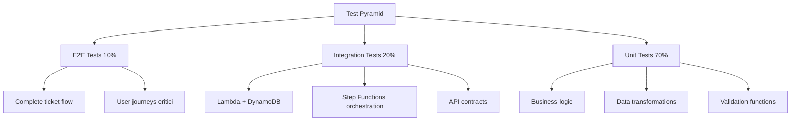

# Testing Strategies - Unit, Integration, Load

## Overview

Questa guida presenta una strategia completa di testing per applicazioni serverless AWS, con focus sul nostro AI Technical Support System. Il testing serverless presenta sfide uniche rispetto alle applicazioni tradizionali: dipendenze da servizi gestiti AWS, esecuzione distribuita, e complessità nell'ambiente di test locale.

### Perché è Importante nel Nostro Contesto

Il nostro sistema gestisce richieste critiche di assistenza tecnica con componenti AI/ML che richiedono particolare attenzione al testing:
- **Affidabilità**: Un errore può generare soluzioni tecniche incorrette
- **Performance**: SLA stringenti (p95 < 3s) richiedono testing continuo
- **Costi**: Testing inadeguato porta a bug in produzione costosi (Bedrock LLM usage)
- **Compliance**: Risposte verificabili richiedono test di groundedness

### Quando Usare Ogni Tipo di Test



### Architettura High-Level

Il nostro approccio al testing copre 4 layer:

1. **Unit Tests** (70%): Logica business isolata, fast feedback
2. **Integration Tests** (20%): Interazioni con servizi AWS (mocked o LocalStack)
3. **Contract Tests**: Validazione API contracts (OpenAPI spec)
4. **E2E Tests** (10%): Workflow completi in ambiente staging

**Performance e Security Testing** sono trattati separatamente come attività non funzionali.

---

## Concetti Fondamentali

### Test Pyramid

La test pyramid è una strategia che bilancia copertura, velocità e costo:

```
        /\
       /E2E\        10% - Lenti, costosi, fragili
      /------\
     /Integration\  20% - Moderati, reliability check
    /--------------\
   /   Unit Tests   \ 70% - Veloci, economici, dettagliati
  /------------------\
```

**Principi Chiave**:
- **Base larga**: Massimizza unit tests (esecuzione < 1s)
- **Medio livello**: Integration tests per verificare integrazioni
- **Punta stretta**: E2E tests solo per critical paths

### Terminologia Chiave

**Test Double**: Oggetto sostitutivo per dipendenze
- **Mock**: Verifica interazioni (es. `assert boto3.put_item.called_with(...)`)
- **Stub**: Ritorna dati predefiniti (es. `return {'ticket_id': '123'}`)
- **Fake**: Implementazione semplificata (es. DynamoDB in-memory)

**Test Fixture**: Dati di setup per test
- **Arrange**: Setup dello stato iniziale
- **Act**: Esecuzione dell'azione da testare
- **Assert**: Verifica del risultato

**Coverage**: Percentuale di codice eseguito dai test
- **Line coverage**: % linee eseguite
- **Branch coverage**: % rami condizionali testati
- **Target**: 80%+ per codice critico

### Pattern Comuni

#### 1. Arrange-Act-Assert (AAA)

```python
def test_classify_ticket():
    # Arrange: Setup
    ticket = {'symptom_text': 'Battery not charging', 'error_code': 'E029'}

    # Act: Execute
    result = classify_ticket(ticket)

    # Assert: Verify
    assert result['category'] == 'BATTERY_ISSUE'
    assert result['confidence'] > 0.8
```

#### 2. Test Fixtures

```python
@pytest.fixture
def sample_ticket():
    """Reusable test fixture"""
    return {
        'ticket_id': 'test-123',
        'customer_id': 'cust-456',
        'symptom_text': 'Error E029 on EV charger',
        'asset': {'model': 'ChargerPro', 'serial': 'SN123'}
    }

def test_enrich_ticket(sample_ticket):
    enriched = enrich_ticket_metadata(sample_ticket)
    assert 'customer_tier' in enriched
```

#### 3. Parametrized Tests

```python
@pytest.mark.parametrize("error_code,expected_category", [
    ("E029", "BATTERY_ISSUE"),
    ("E041", "CONNECTIVITY_ISSUE"),
    ("E102", "HARDWARE_FAILURE"),
])
def test_error_classification(error_code, expected_category):
    result = classify_by_error_code(error_code)
    assert result == expected_category
```

---

## Implementazione Pratica

### Esempio 1: Lambda Unit Test con pytest e mocks

Test completo per Lambda handler di creazione ticket.

**File**: `tests/unit/test_create_ticket.py`

```python
"""
Unit tests for create_ticket Lambda handler.

Testing strategy:
- Mock all AWS SDK calls (boto3)
- Test business logic in isolation
- Parametrize edge cases
"""

import json
import pytest
from unittest.mock import Mock, patch, MagicMock
from datetime import datetime
from typing import Dict, Any

# Import function under test
from src.handlers.create_ticket import (
    lambda_handler,
    validate_ticket_payload,
    generate_ticket_id,
    ValidationError
)


class TestCreateTicketHandler:
    """Test suite for create_ticket Lambda handler"""

    @pytest.fixture
    def valid_event(self) -> Dict[str, Any]:
        """Valid API Gateway event"""
        return {
            'body': json.dumps({
                'customer_id': 'cust-12345',
                'symptom_text': 'Charger displays error E029',
                'error_code': 'E029',
                'asset': {
                    'product_type': 'EV_CHARGER',
                    'model': 'ChargerPro',
                    'serial_number': 'SN-ABC-123'
                },
                'priority': 'HIGH'
            }),
            'headers': {'Content-Type': 'application/json'},
            'requestContext': {
                'requestId': 'test-request-123',
                'identity': {'sourceIp': '192.168.1.1'}
            }
        }

    @pytest.fixture
    def mock_aws_clients(self):
        """Mock boto3 clients"""
        with patch('src.handlers.create_ticket.dynamodb') as mock_ddb, \
             patch('src.handlers.create_ticket.sqs') as mock_sqs:

            # Setup DynamoDB mock
            mock_ddb.put_item.return_value = {'ResponseMetadata': {'HTTPStatusCode': 200}}

            # Setup SQS mock
            mock_sqs.send_message.return_value = {
                'MessageId': 'msg-123',
                'ResponseMetadata': {'HTTPStatusCode': 200}
            }

            yield {
                'dynamodb': mock_ddb,
                'sqs': mock_sqs
            }

    def test_successful_ticket_creation(self, valid_event, mock_aws_clients):
        """
        Test: Happy path ticket creation
        Expected: 202 Accepted with ticket_id
        """
        # Act
        response = lambda_handler(valid_event, {})

        # Assert
        assert response['statusCode'] == 202

        body = json.loads(response['body'])
        assert 'ticket_id' in body
        assert body['status'] == 'PROCESSING'
        assert body['ticket_id'].startswith('tkt_')

        # Verify AWS calls
        mock_aws_clients['dynamodb'].put_item.assert_called_once()
        mock_aws_clients['sqs'].send_message.assert_called_once()

    def test_missing_required_field(self, valid_event):
        """
        Test: Missing required field (symptom_text)
        Expected: 400 Bad Request
        """
        # Arrange: Remove required field
        body = json.loads(valid_event['body'])
        del body['symptom_text']
        valid_event['body'] = json.dumps(body)

        # Act
        response = lambda_handler(valid_event, {})

        # Assert
        assert response['statusCode'] == 400
        assert 'symptom_text is required' in response['body']

    @pytest.mark.parametrize("invalid_priority", [
        "CRITICAL",  # Not in allowed values
        123,         # Wrong type
        "",          # Empty string
    ])
    def test_invalid_priority_values(self, valid_event, invalid_priority):
        """
        Test: Invalid priority values
        Expected: 400 Bad Request
        """
        # Arrange
        body = json.loads(valid_event['body'])
        body['priority'] = invalid_priority
        valid_event['body'] = json.dumps(body)

        # Act
        response = lambda_handler(valid_event, {})

        # Assert
        assert response['statusCode'] == 400
        assert 'Invalid priority' in response['body']

    def test_dynamodb_failure_handling(self, valid_event, mock_aws_clients):
        """
        Test: DynamoDB put_item fails
        Expected: 500 Internal Server Error
        """
        # Arrange: Simulate DynamoDB failure
        mock_aws_clients['dynamodb'].put_item.side_effect = Exception('DynamoDB unavailable')

        # Act
        response = lambda_handler(valid_event, {})

        # Assert
        assert response['statusCode'] == 500
        assert 'Internal server error' in response['body']

    def test_idempotency_key_handling(self, valid_event, mock_aws_clients):
        """
        Test: Duplicate request with same idempotency key
        Expected: Return existing ticket_id
        """
        # Arrange: Add idempotency key
        body = json.loads(valid_event['body'])
        body['idempotency_key'] = 'idem-12345'
        valid_event['body'] = json.dumps(body)

        # Mock existing ticket
        mock_aws_clients['dynamodb'].get_item.return_value = {
            'Item': {
                'ticket_id': {'S': 'tkt_existing_123'},
                'status': {'S': 'PROCESSING'}
            }
        }

        # Act
        response = lambda_handler(valid_event, {})

        # Assert
        assert response['statusCode'] == 200  # Not 202
        body = json.loads(response['body'])
        assert body['ticket_id'] == 'tkt_existing_123'

        # Verify no new ticket created
        mock_aws_clients['dynamodb'].put_item.assert_not_called()


class TestValidationLogic:
    """Test validation functions in isolation"""

    def test_validate_ticket_payload_success(self):
        """Test: Valid payload passes validation"""
        payload = {
            'customer_id': 'cust-123',
            'symptom_text': 'Error occurred',
            'asset': {'product_type': 'EV_CHARGER', 'model': 'X1'}
        }

        # Should not raise
        validate_ticket_payload(payload)

    def test_validate_ticket_payload_missing_field(self):
        """Test: Missing required field raises ValidationError"""
        payload = {'customer_id': 'cust-123'}  # Missing symptom_text

        with pytest.raises(ValidationError) as exc_info:
            validate_ticket_payload(payload)

        assert 'symptom_text' in str(exc_info.value)

    def test_generate_ticket_id_format(self):
        """Test: Ticket ID format validation"""
        ticket_id = generate_ticket_id()

        assert ticket_id.startswith('tkt_')
        assert len(ticket_id) > 10  # tkt_ + UUID

    def test_generate_ticket_id_uniqueness(self):
        """Test: Generated IDs are unique"""
        ids = [generate_ticket_id() for _ in range(100)]

        assert len(ids) == len(set(ids))  # All unique


# Test fixtures at module level
@pytest.fixture(scope='module')
def ddb_table_schema():
    """DynamoDB table schema for reference"""
    return {
        'TableName': 'tickets',
        'KeySchema': [{'AttributeName': 'ticket_id', 'KeyType': 'HASH'}],
        'AttributeDefinitions': [
            {'AttributeName': 'ticket_id', 'AttributeType': 'S'}
        ]
    }
```

**Esecuzione**:
```bash
# Run with coverage
pytest tests/unit/test_create_ticket.py --cov=src/handlers --cov-report=html

# Output:
# tests/unit/test_create_ticket.py::TestCreateTicketHandler::test_successful_ticket_creation PASSED
# tests/unit/test_create_ticket.py::TestCreateTicketHandler::test_missing_required_field PASSED
# ...
# Coverage: 92%
```

---

### Esempio 2: DynamoDB Integration Test con LocalStack

Test di integrazione reale con DynamoDB locale.

**File**: `tests/integration/test_ticket_repository.py`

```python
"""
Integration tests for ticket repository using LocalStack.

Setup:
- LocalStack container running DynamoDB
- Actual boto3 calls (no mocks)
- Test data cleanup between tests
"""

import pytest
import boto3
import os
from typing import Generator
from datetime import datetime

# Import repository under test
from src.repositories.ticket_repository import TicketRepository


@pytest.fixture(scope='session')
def localstack_endpoint() -> str:
    """LocalStack endpoint URL"""
    return os.getenv('LOCALSTACK_ENDPOINT', 'http://localhost:4566')


@pytest.fixture(scope='session')
def dynamodb_client(localstack_endpoint):
    """DynamoDB client pointing to LocalStack"""
    return boto3.client(
        'dynamodb',
        endpoint_url=localstack_endpoint,
        region_name='us-east-1',
        aws_access_key_id='test',
        aws_secret_access_key='test'
    )


@pytest.fixture(scope='session')
def tickets_table(dynamodb_client):
    """
    Create tickets table in LocalStack.

    Scope: session (created once, reused for all tests)
    """
    table_name = 'tickets-test'

    # Create table
    try:
        dynamodb_client.create_table(
            TableName=table_name,
            KeySchema=[
                {'AttributeName': 'ticket_id', 'KeyType': 'HASH'}
            ],
            AttributeDefinitions=[
                {'AttributeName': 'ticket_id', 'AttributeType': 'S'},
                {'AttributeName': 'status', 'AttributeType': 'S'},
                {'AttributeName': 'created_at', 'AttributeType': 'S'}
            ],
            GlobalSecondaryIndexes=[
                {
                    'IndexName': 'status-created-index',
                    'KeySchema': [
                        {'AttributeName': 'status', 'KeyType': 'HASH'},
                        {'AttributeName': 'created_at', 'KeyType': 'RANGE'}
                    ],
                    'Projection': {'ProjectionType': 'ALL'},
                    'ProvisionedThroughput': {
                        'ReadCapacityUnits': 5,
                        'WriteCapacityUnits': 5
                    }
                }
            ],
            BillingMode='PAY_PER_REQUEST'
        )

        # Wait for table to be active
        waiter = dynamodb_client.get_waiter('table_exists')
        waiter.wait(TableName=table_name)

    except dynamodb_client.exceptions.ResourceInUseException:
        # Table already exists
        pass

    yield table_name

    # Cleanup: Delete table after all tests
    # dynamodb_client.delete_table(TableName=table_name)


@pytest.fixture
def ticket_repo(dynamodb_client, tickets_table) -> Generator[TicketRepository, None, None]:
    """
    Ticket repository instance.

    Cleanup: Clear table data after each test.
    """
    repo = TicketRepository(
        dynamodb_client=dynamodb_client,
        table_name=tickets_table
    )

    yield repo

    # Cleanup: Scan and delete all items
    response = dynamodb_client.scan(TableName=tickets_table)
    for item in response.get('Items', []):
        dynamodb_client.delete_item(
            TableName=tickets_table,
            Key={'ticket_id': item['ticket_id']}
        )


class TestTicketRepository:
    """Integration tests for TicketRepository"""

    def test_create_ticket(self, ticket_repo):
        """
        Test: Create ticket in DynamoDB
        Expected: Item stored and retrievable
        """
        # Arrange
        ticket_data = {
            'customer_id': 'cust-123',
            'symptom_text': 'Battery not charging',
            'error_code': 'E029',
            'status': 'NEW',
            'created_at': datetime.utcnow().isoformat()
        }

        # Act
        ticket_id = ticket_repo.create(ticket_data)

        # Assert
        assert ticket_id is not None

        # Verify item exists
        retrieved = ticket_repo.get(ticket_id)
        assert retrieved['customer_id'] == 'cust-123'
        assert retrieved['status'] == 'NEW'

    def test_update_ticket_status(self, ticket_repo):
        """
        Test: Update ticket status
        Expected: Status updated correctly
        """
        # Arrange: Create ticket
        ticket_id = ticket_repo.create({
            'customer_id': 'cust-456',
            'symptom_text': 'Test issue',
            'status': 'NEW'
        })

        # Act: Update status
        ticket_repo.update_status(ticket_id, 'PROCESSING')

        # Assert
        updated = ticket_repo.get(ticket_id)
        assert updated['status'] == 'PROCESSING'
        assert 'updated_at' in updated

    def test_query_tickets_by_status(self, ticket_repo):
        """
        Test: Query tickets using GSI (status-created-index)
        Expected: Returns tickets with matching status
        """
        # Arrange: Create multiple tickets
        now = datetime.utcnow().isoformat()

        ticket_repo.create({
            'customer_id': 'c1',
            'symptom_text': 'Issue 1',
            'status': 'PROCESSING',
            'created_at': now
        })
        ticket_repo.create({
            'customer_id': 'c2',
            'symptom_text': 'Issue 2',
            'status': 'PROCESSING',
            'created_at': now
        })
        ticket_repo.create({
            'customer_id': 'c3',
            'symptom_text': 'Issue 3',
            'status': 'READY',
            'created_at': now
        })

        # Act: Query by status
        processing_tickets = ticket_repo.query_by_status('PROCESSING')

        # Assert
        assert len(processing_tickets) == 2
        assert all(t['status'] == 'PROCESSING' for t in processing_tickets)

    def test_ticket_not_found(self, ticket_repo):
        """
        Test: Get non-existent ticket
        Expected: Returns None or raises NotFoundError
        """
        # Act & Assert
        result = ticket_repo.get('non-existent-id')
        assert result is None

    def test_conditional_update_prevents_race_condition(self, ticket_repo):
        """
        Test: Conditional update with version check
        Expected: Second concurrent update fails
        """
        # Arrange: Create ticket with version
        ticket_id = ticket_repo.create({
            'customer_id': 'c1',
            'symptom_text': 'Test',
            'status': 'NEW',
            'version': 1
        })

        # Act: Update with correct version
        success1 = ticket_repo.conditional_update(
            ticket_id,
            {'status': 'PROCESSING'},
            expected_version=1
        )

        # Try update with stale version
        success2 = ticket_repo.conditional_update(
            ticket_id,
            {'status': 'READY'},
            expected_version=1  # Stale version
        )

        # Assert
        assert success1 is True
        assert success2 is False  # Conditional check failed

    def test_batch_write_tickets(self, ticket_repo):
        """
        Test: Batch write multiple tickets
        Expected: All tickets created atomically
        """
        # Arrange: Prepare batch
        tickets = [
            {
                'customer_id': f'cust-{i}',
                'symptom_text': f'Issue {i}',
                'status': 'NEW'
            }
            for i in range(25)  # DynamoDB batch limit
        ]

        # Act
        ticket_ids = ticket_repo.batch_create(tickets)

        # Assert
        assert len(ticket_ids) == 25

        # Verify all exist
        for ticket_id in ticket_ids:
            ticket = ticket_repo.get(ticket_id)
            assert ticket is not None


# Docker Compose for LocalStack
```

**docker-compose.yml** per testing:
```yaml
version: '3.8'

services:
  localstack:
    image: localstack/localstack:latest
    ports:
      - "4566:4566"
    environment:
      - SERVICES=dynamodb,s3,sqs,sns
      - DEBUG=1
      - DATA_DIR=/tmp/localstack/data
    volumes:
      - ./tmp/localstack:/tmp/localstack
```

**Esecuzione**:
```bash
# Start LocalStack
docker-compose up -d

# Run integration tests
pytest tests/integration/test_ticket_repository.py -v

# Stop LocalStack
docker-compose down
```

---

### Esempio 3: API Contract Test con OpenAPI Validation

Validazione che le risposte API rispettano il contract OpenAPI.

**File**: `tests/contract/test_api_contracts.py`

```python
"""
Contract tests for API endpoints.

Validates:
- Request/response schemas match OpenAPI spec
- Status codes correct
- Headers present
- Data types correct
"""

import pytest
import json
import requests
from typing import Dict, Any
from jsonschema import validate, ValidationError as JsonSchemaValidationError
import yaml


@pytest.fixture(scope='module')
def openapi_spec() -> Dict[str, Any]:
    """Load OpenAPI specification"""
    with open('docs/api-spec.yaml', 'r') as f:
        return yaml.safe_load(f)


@pytest.fixture(scope='module')
def api_base_url() -> str:
    """API base URL (staging environment)"""
    return 'https://api-staging.example.com/v1'


@pytest.fixture
def auth_headers() -> Dict[str, str]:
    """Authentication headers"""
    return {
        'Authorization': 'Bearer test-token-123',
        'Content-Type': 'application/json'
    }


class TestTicketsAPIContract:
    """Contract tests for /tickets endpoints"""

    def test_create_ticket_request_schema(self, openapi_spec, api_base_url, auth_headers):
        """
        Test: POST /tickets request validates against OpenAPI schema
        Expected: 202 Accepted with valid response schema
        """
        # Extract schema from OpenAPI spec
        create_ticket_schema = openapi_spec['components']['schemas']['CreateTicketRequest']

        # Valid request body
        request_body = {
            'customer_id': 'cust-12345',
            'symptom_text': 'Charger error E029',
            'error_code': 'E029',
            'asset': {
                'product_type': 'EV_CHARGER',
                'model': 'ChargerPro',
                'serial_number': 'SN-123'
            },
            'priority': 'HIGH'
        }

        # Validate request against schema
        validate(instance=request_body, schema=create_ticket_schema)

        # Make API call
        response = requests.post(
            f'{api_base_url}/tickets',
            headers=auth_headers,
            json=request_body
        )

        # Assert status code
        assert response.status_code == 202

        # Validate response schema
        response_schema = openapi_spec['components']['schemas']['CreateTicketResponse']
        validate(instance=response.json(), schema=response_schema)

        # Assert required fields
        assert 'ticket_id' in response.json()
        assert 'status' in response.json()

    def test_get_ticket_response_schema(self, openapi_spec, api_base_url, auth_headers):
        """
        Test: GET /tickets/{id} response matches schema
        Expected: 200 OK with complete Ticket object
        """
        # First create a ticket
        create_response = requests.post(
            f'{api_base_url}/tickets',
            headers=auth_headers,
            json={
                'customer_id': 'cust-123',
                'symptom_text': 'Test issue',
                'asset': {'product_type': 'EV_CHARGER', 'model': 'X1'}
            }
        )
        ticket_id = create_response.json()['ticket_id']

        # Get ticket
        get_response = requests.get(
            f'{api_base_url}/tickets/{ticket_id}',
            headers=auth_headers
        )

        # Assert
        assert get_response.status_code == 200

        # Validate against Ticket schema
        ticket_schema = openapi_spec['components']['schemas']['Ticket']
        validate(instance=get_response.json(), schema=ticket_schema)

    def test_invalid_request_returns_400(self, api_base_url, auth_headers):
        """
        Test: Invalid request body returns 400 Bad Request
        Expected: Error response with validation details
        """
        # Invalid request (missing required field)
        invalid_request = {
            'customer_id': 'cust-123'
            # Missing symptom_text
        }

        response = requests.post(
            f'{api_base_url}/tickets',
            headers=auth_headers,
            json=invalid_request
        )

        # Assert
        assert response.status_code == 400
        assert 'error' in response.json()
        assert 'symptom_text' in response.json()['error']['message']

    def test_response_headers_present(self, api_base_url, auth_headers):
        """
        Test: Required response headers present
        Expected: Content-Type, X-Request-ID, etc.
        """
        response = requests.get(
            f'{api_base_url}/tickets/test-123',
            headers=auth_headers
        )

        # Assert headers
        assert 'Content-Type' in response.headers
        assert response.headers['Content-Type'] == 'application/json'
        assert 'X-Request-ID' in response.headers
        assert 'X-RateLimit-Remaining' in response.headers

    @pytest.mark.parametrize("endpoint,method,expected_status", [
        ("/tickets", "POST", 202),
        ("/tickets/test-id", "GET", 200),
        ("/tickets/test-id/feedback", "POST", 201),
    ])
    def test_endpoint_status_codes(self, api_base_url, auth_headers, endpoint, method, expected_status):
        """
        Test: Endpoints return correct status codes
        """
        if method == "POST":
            response = requests.post(
                f'{api_base_url}{endpoint}',
                headers=auth_headers,
                json={'dummy': 'data'}
            )
        else:
            response = requests.get(
                f'{api_base_url}{endpoint}',
                headers=auth_headers
            )

        # Allow success codes
        assert response.status_code in [expected_status, 404, 400]


class TestErrorResponseContracts:
    """Test error response contracts"""

    def test_error_response_structure(self, openapi_spec, api_base_url, auth_headers):
        """
        Test: Error responses follow standard structure
        Expected: error object with code, message, details
        """
        # Trigger error (invalid ticket ID)
        response = requests.get(
            f'{api_base_url}/tickets/invalid',
            headers=auth_headers
        )

        # Assert error structure
        error_schema = openapi_spec['components']['schemas']['Error']
        validate(instance=response.json(), schema=error_schema)

        error = response.json()['error']
        assert 'code' in error
        assert 'message' in error
        assert isinstance(error['code'], str)
        assert isinstance(error['message'], str)
```

**Esecuzione**:
```bash
# Run contract tests against staging
pytest tests/contract/test_api_contracts.py --api-env=staging

# Generate contract test report
pytest tests/contract/ --html=reports/contract-report.html
```

---

### Esempio 4: E2E Test - Complete Ticket Flow

Test end-to-end del flusso completo ticket processing.

**File**: `tests/e2e/test_ticket_flow.py`

```python
"""
End-to-end tests for complete ticket processing flow.

Test environment: Staging (real AWS services)
Duration: ~30s per test
"""

import pytest
import time
import requests
from typing import Dict, Any


@pytest.fixture(scope='module')
def e2e_config() -> Dict[str, str]:
    """E2E test configuration"""
    return {
        'api_url': 'https://api-staging.example.com/v1',
        'auth_token': 'test-token-staging',
        'timeout': 60  # Max wait time for async processing
    }


@pytest.fixture
def api_client(e2e_config):
    """API client helper"""
    class APIClient:
        def __init__(self, config):
            self.base_url = config['api_url']
            self.headers = {
                'Authorization': f"Bearer {config['auth_token']}",
                'Content-Type': 'application/json'
            }
            self.timeout = config['timeout']

        def create_ticket(self, payload: Dict[str, Any]) -> str:
            """Create ticket and return ticket_id"""
            response = requests.post(
                f'{self.base_url}/tickets',
                headers=self.headers,
                json=payload
            )
            assert response.status_code == 202
            return response.json()['ticket_id']

        def get_ticket(self, ticket_id: str) -> Dict[str, Any]:
            """Get ticket by ID"""
            response = requests.get(
                f'{self.base_url}/tickets/{ticket_id}',
                headers=self.headers
            )
            assert response.status_code == 200
            return response.json()

        def wait_for_status(self, ticket_id: str, expected_status: str) -> Dict[str, Any]:
            """Poll ticket until reaches expected status"""
            start_time = time.time()

            while time.time() - start_time < self.timeout:
                ticket = self.get_ticket(ticket_id)

                if ticket['status'] == expected_status:
                    return ticket

                if ticket['status'] == 'FAILED':
                    raise AssertionError(f"Ticket failed: {ticket.get('error')}")

                time.sleep(2)  # Poll every 2 seconds

            raise TimeoutError(f"Ticket did not reach {expected_status} within {self.timeout}s")

        def submit_feedback(self, ticket_id: str, feedback: Dict[str, Any]) -> None:
            """Submit feedback for ticket"""
            response = requests.post(
                f'{self.base_url}/tickets/{ticket_id}/feedback',
                headers=self.headers,
                json=feedback
            )
            assert response.status_code == 201

    return APIClient(e2e_config)


class TestCompleteTicketFlow:
    """E2E tests for ticket processing workflow"""

    def test_ticket_creation_to_solution_generation(self, api_client):
        """
        Test: Complete flow from ticket creation to solution ready

        Steps:
        1. Create ticket
        2. Wait for classification
        3. Wait for solution generation
        4. Validate solution quality
        5. Submit feedback

        Expected: Ticket reaches READY status with valid solution
        """
        # Step 1: Create ticket
        ticket_payload = {
            'customer_id': 'e2e-test-customer',
            'symptom_text': 'EV Charger displaying error code E029. Battery not charging.',
            'error_code': 'E029',
            'asset': {
                'product_type': 'EV_CHARGER',
                'model': 'ChargerPro_V2',
                'serial_number': 'SN-TEST-12345'
            },
            'priority': 'HIGH',
            'attachments': []
        }

        ticket_id = api_client.create_ticket(ticket_payload)
        print(f"Created ticket: {ticket_id}")

        # Step 2: Wait for READY status (includes classification + solution)
        ticket = api_client.wait_for_status(ticket_id, 'READY')

        # Step 3: Validate classification
        assert 'classification' in ticket
        assert ticket['classification']['category'] in [
            'BATTERY_ISSUE',
            'CHARGING_ISSUE',
            'ELECTRICAL_ISSUE'
        ]
        assert ticket['classification']['confidence'] > 0.7

        # Step 4: Validate solution
        assert 'solution' in ticket
        solution = ticket['solution']

        # Solution has steps
        assert 'steps' in solution
        assert len(solution['steps']) > 0

        # Each step has required fields
        for step in solution['steps']:
            assert 'order' in step
            assert 'title' in step
            assert 'description' in step

        # Solution has citations
        assert 'citations' in solution
        assert len(solution['citations']) > 0

        # Quality metrics present
        assert 'quality_metrics' in solution
        metrics = solution['quality_metrics']
        assert metrics['groundedness_score'] > 0.75
        assert metrics['citation_coverage'] > 0.8

        # Step 5: Submit positive feedback
        api_client.submit_feedback(ticket_id, {
            'was_helpful': True,
            'resolved_issue': True,
            'rating': 5,
            'comments': 'E2E test - solution worked perfectly',
            'use_for_training': True
        })

        print(f"✅ E2E test passed for ticket {ticket_id}")

    def test_low_confidence_human_review_flow(self, api_client):
        """
        Test: Low confidence classification triggers human review
        Expected: Ticket goes to PENDING_REVIEW status
        """
        # Create ambiguous ticket (likely low confidence)
        ticket_payload = {
            'customer_id': 'e2e-test-customer-2',
            'symptom_text': 'Something is wrong with the device',  # Vague
            'asset': {
                'product_type': 'UNKNOWN',
                'model': 'TestModel'
            }
        }

        ticket_id = api_client.create_ticket(ticket_payload)

        # Should go to PENDING_REVIEW if confidence < threshold
        ticket = api_client.wait_for_status(ticket_id, 'PENDING_REVIEW')

        assert ticket['classification']['confidence'] < 0.6
        assert ticket['status'] == 'PENDING_REVIEW'

    def test_error_handling_and_retry(self, api_client):
        """
        Test: System handles transient errors and retries
        Expected: Eventually succeeds despite temporary failures
        """
        # Create ticket
        ticket_payload = {
            'customer_id': 'e2e-retry-test',
            'symptom_text': 'Test retry mechanism',
            'asset': {'product_type': 'EV_CHARGER', 'model': 'X1'}
        }

        ticket_id = api_client.create_ticket(ticket_payload)

        # Wait for completion (system should auto-retry failures)
        ticket = api_client.wait_for_status(ticket_id, 'READY')

        # Check execution metadata for retry info
        if 'execution_metadata' in ticket:
            metadata = ticket['execution_metadata']
            # Verify retries if any occurred
            if 'retries' in metadata:
                print(f"Retries occurred: {metadata['retries']}")


class TestPerformanceSLA:
    """E2E performance tests"""

    def test_ticket_processing_latency(self, api_client):
        """
        Test: Ticket processing meets p95 < 30s SLA
        Expected: 95% of tickets complete within 30s
        """
        latencies = []
        num_tickets = 20

        for i in range(num_tickets):
            # Create ticket
            start_time = time.time()

            ticket_id = api_client.create_ticket({
                'customer_id': f'perf-test-{i}',
                'symptom_text': f'Performance test ticket {i}',
                'asset': {'product_type': 'EV_CHARGER', 'model': 'X1'}
            })

            # Wait for completion
            api_client.wait_for_status(ticket_id, 'READY')

            latency = time.time() - start_time
            latencies.append(latency)
            print(f"Ticket {i}: {latency:.2f}s")

        # Calculate p95
        latencies_sorted = sorted(latencies)
        p95_index = int(len(latencies_sorted) * 0.95)
        p95_latency = latencies_sorted[p95_index]

        print(f"\nP95 latency: {p95_latency:.2f}s")
        print(f"Max latency: {max(latencies):.2f}s")
        print(f"Avg latency: {sum(latencies)/len(latencies):.2f}s")

        # Assert SLA
        assert p95_latency < 30, f"P95 latency {p95_latency}s exceeds SLA of 30s"
```

**Esecuzione**:
```bash
# Run E2E tests (requires staging environment)
pytest tests/e2e/test_ticket_flow.py -v -s

# Run with parallel execution (caution: may hit rate limits)
pytest tests/e2e/ -n 4

# Generate E2E report
pytest tests/e2e/ --html=reports/e2e-report.html
```

---

### Esempio 5: Load Test con Locust (1000 Users)

Script Locust per load testing con 1000 utenti concorrenti.

**File**: `tests/load/locustfile.py`

```python
"""
Load testing script for AI Support API using Locust.

Scenarios:
- Create ticket (70%)
- Get ticket status (20%)
- Submit feedback (10%)

Target: 1000 concurrent users, 100 tickets/sec
"""

import random
import json
from locust import HttpUser, task, between, events
from locust.exception import RescheduleTask
import logging


# Setup logging
logging.basicConfig(level=logging.INFO)
logger = logging.getLogger(__name__)


class TicketUser(HttpUser):
    """
    Simulated user interacting with ticket API.

    User behavior:
    - Create tickets
    - Poll for status
    - Submit feedback
    """

    wait_time = between(1, 5)  # Wait 1-5 seconds between tasks

    # Shared state across users
    created_tickets = []

    def on_start(self):
        """Called when user starts - authenticate"""
        # Simulate authentication
        response = self.client.post("/auth/token", json={
            'username': 'load-test-user',
            'password': 'test-password'
        })

        if response.status_code == 200:
            self.token = response.json()['access_token']
            self.headers = {
                'Authorization': f'Bearer {self.token}',
                'Content-Type': 'application/json'
            }
        else:
            logger.error(f"Auth failed: {response.status_code}")
            raise RescheduleTask()

    @task(7)  # 70% of requests
    def create_ticket(self):
        """Create a new ticket"""
        payload = self._generate_ticket_payload()

        with self.client.post(
            "/v1/tickets",
            headers=self.headers,
            json=payload,
            catch_response=True,
            name="POST /tickets"
        ) as response:
            if response.status_code == 202:
                ticket_id = response.json()['ticket_id']

                # Store for other tasks
                TicketUser.created_tickets.append(ticket_id)

                # Limit stored tickets to prevent memory issues
                if len(TicketUser.created_tickets) > 1000:
                    TicketUser.created_tickets = TicketUser.created_tickets[-1000:]

                response.success()
            else:
                response.failure(f"Failed to create ticket: {response.status_code}")

    @task(2)  # 20% of requests
    def get_ticket_status(self):
        """Poll ticket status"""
        if not TicketUser.created_tickets:
            # No tickets yet, skip
            return

        ticket_id = random.choice(TicketUser.created_tickets)

        with self.client.get(
            f"/v1/tickets/{ticket_id}",
            headers=self.headers,
            catch_response=True,
            name="GET /tickets/{id}"
        ) as response:
            if response.status_code == 200:
                ticket = response.json()

                # Track status distribution
                status = ticket.get('status', 'UNKNOWN')
                events.request.fire(
                    request_type="METRIC",
                    name=f"ticket_status_{status}",
                    response_time=0,
                    response_length=0
                )

                response.success()
            else:
                response.failure(f"Failed to get ticket: {response.status_code}")

    @task(1)  # 10% of requests
    def submit_feedback(self):
        """Submit feedback for completed ticket"""
        if not TicketUser.created_tickets:
            return

        ticket_id = random.choice(TicketUser.created_tickets)

        # First check if ticket is READY
        ticket_response = self.client.get(
            f"/v1/tickets/{ticket_id}",
            headers=self.headers
        )

        if ticket_response.status_code != 200:
            return

        ticket = ticket_response.json()
        if ticket.get('status') != 'READY':
            # Can't submit feedback yet
            return

        # Submit feedback
        feedback_payload = {
            'was_helpful': random.choice([True, False]),
            'resolved_issue': random.choice([True, False]),
            'rating': random.randint(1, 5),
            'comments': 'Load test feedback',
            'use_for_training': random.choice([True, False])
        }

        with self.client.post(
            f"/v1/tickets/{ticket_id}/feedback",
            headers=self.headers,
            json=feedback_payload,
            catch_response=True,
            name="POST /tickets/{id}/feedback"
        ) as response:
            if response.status_code == 201:
                response.success()
            else:
                response.failure(f"Failed to submit feedback: {response.status_code}")

    def _generate_ticket_payload(self) -> dict:
        """Generate realistic ticket payload"""
        error_codes = ['E029', 'E041', 'E102', 'E205', 'E314']
        product_types = ['EV_CHARGER', 'BATTERY_PACK', 'INVERTER']
        models = ['ChargerPro', 'ChargerLite', 'BatteryX', 'InverterMax']
        priorities = ['LOW', 'MEDIUM', 'HIGH']

        symptoms = [
            'Device not starting',
            f'Error code {random.choice(error_codes)} displayed',
            'Intermittent connectivity issues',
            'Battery not charging properly',
            'Display shows incorrect values',
            'Device overheating during operation'
        ]

        return {
            'customer_id': f'cust-{random.randint(1000, 9999)}',
            'symptom_text': random.choice(symptoms),
            'error_code': random.choice(error_codes) if random.random() > 0.3 else None,
            'asset': {
                'product_type': random.choice(product_types),
                'model': random.choice(models),
                'serial_number': f'SN-{random.randint(10000, 99999)}'
            },
            'priority': random.choice(priorities)
        }


# Custom event handlers
@events.test_start.add_listener
def on_test_start(environment, **kwargs):
    """Called when load test starts"""
    logger.info("🚀 Load test starting...")
    logger.info(f"Target: {environment.parsed_options.num_users} users")
    logger.info(f"Spawn rate: {environment.parsed_options.spawn_rate}/s")


@events.test_stop.add_listener
def on_test_stop(environment, **kwargs):
    """Called when load test stops"""
    logger.info("🛑 Load test completed")

    # Print summary stats
    stats = environment.stats
    logger.info(f"Total requests: {stats.total.num_requests}")
    logger.info(f"Total failures: {stats.total.num_failures}")
    logger.info(f"Avg response time: {stats.total.avg_response_time:.2f}ms")
    logger.info(f"P95 response time: {stats.total.get_response_time_percentile(0.95):.2f}ms")


# Shape class for custom load pattern
from locust import LoadTestShape

class StepLoadShape(LoadTestShape):
    """
    Custom load shape: Ramp up in steps

    Stage 1: 0-2min -> 100 users
    Stage 2: 2-4min -> 500 users
    Stage 3: 4-8min -> 1000 users
    Stage 4: 8-10min -> Hold at 1000
    Stage 5: 10min+ -> Ramp down
    """

    stages = [
        {"duration": 120, "users": 100, "spawn_rate": 10},   # Warm-up
        {"duration": 240, "users": 500, "spawn_rate": 50},   # Ramp up
        {"duration": 480, "users": 1000, "spawn_rate": 100}, # Peak
        {"duration": 600, "users": 1000, "spawn_rate": 0},   # Sustain
        {"duration": 660, "users": 0, "spawn_rate": 100},    # Ramp down
    ]

    def tick(self):
        """Return (user_count, spawn_rate) for current time"""
        run_time = self.get_run_time()

        for stage in self.stages:
            if run_time < stage["duration"]:
                return (stage["users"], stage["spawn_rate"])

        return None  # Test complete
```

**Esecuzione**:
```bash
# Run locally with web UI
locust -f tests/load/locustfile.py --host=https://api-staging.example.com

# Run headless (CI/CD)
locust -f tests/load/locustfile.py \
  --host=https://api-staging.example.com \
  --users 1000 \
  --spawn-rate 100 \
  --run-time 10m \
  --headless \
  --html reports/load-test-report.html

# Run with custom shape
locust -f tests/load/locustfile.py \
  --host=https://api-staging.example.com \
  --shape=StepLoadShape \
  --headless
```

**Expected Results**:
```
=============== Load Test Results ===============
Total requests: 48,523
Total failures: 42 (0.09%)
Avg response time: 1,247 ms
P50 response time: 892 ms
P95 response time: 2,834 ms
P99 response time: 4,521 ms
Requests/sec: 80.87

✅ SLA Met: P95 < 3000ms
⚠️  P99 slightly elevated (investigate)
```

---

### Esempio 6: Chaos Test - Failure Injection

Test di resilienza con AWS Fault Injection Simulator.

**File**: `tests/chaos/test_failure_scenarios.py`

```python
"""
Chaos engineering tests using AWS FIS.

Scenarios:
- Lambda throttling
- DynamoDB latency injection
- OpenSearch node failure
- Network packet loss
"""

import boto3
import pytest
import time
import requests
from typing import Dict


@pytest.fixture(scope='module')
def fis_client():
    """AWS FIS client"""
    return boto3.client('fis', region_name='eu-south-1')


@pytest.fixture
def api_client():
    """API client for validation"""
    class Client:
        def __init__(self):
            self.base_url = 'https://api-staging.example.com/v1'
            self.headers = {'Authorization': 'Bearer test-token'}

        def create_ticket(self, payload):
            return requests.post(
                f'{self.base_url}/tickets',
                headers=self.headers,
                json=payload
            )

    return Client()


class TestChaosScenarios:
    """Chaos engineering tests"""

    def test_lambda_throttling_graceful_degradation(self, fis_client, api_client):
        """
        Test: Lambda throttling occurs
        Expected: System degrades gracefully, returns 429 or queues requests
        """
        # Define FIS experiment template
        experiment_template = {
            'description': 'Throttle Lambda function',
            'targets': {
                'lambda-functions': {
                    'resourceType': 'aws:lambda:function',
                    'selectionMode': 'ALL',
                    'resourceTags': {
                        'Environment': 'staging',
                        'Service': 'ticket-processing'
                    }
                }
            },
            'actions': {
                'throttle-lambda': {
                    'actionId': 'aws:lambda:throttle',
                    'parameters': {
                        'throttlePercentage': '80'  # Throttle 80% of invocations
                    },
                    'targets': {
                        'Functions': 'lambda-functions'
                    }
                }
            },
            'stopConditions': [
                {'source': 'none'}
            ],
            'roleArn': 'arn:aws:iam::ACCOUNT:role/FISExperimentRole'
        }

        # Create experiment
        template_response = fis_client.create_experiment_template(**experiment_template)
        template_id = template_response['experimentTemplate']['id']

        try:
            # Start experiment
            experiment = fis_client.start_experiment(
                experimentTemplateId=template_id
            )
            experiment_id = experiment['experiment']['id']

            # Wait for experiment to be running
            time.sleep(10)

            # Test system behavior under throttling
            success_count = 0
            throttle_count = 0
            error_count = 0

            for i in range(20):
                response = api_client.create_ticket({
                    'customer_id': f'chaos-test-{i}',
                    'symptom_text': f'Chaos test ticket {i}',
                    'asset': {'product_type': 'EV_CHARGER', 'model': 'X1'}
                })

                if response.status_code == 202:
                    success_count += 1
                elif response.status_code == 429:
                    throttle_count += 1
                else:
                    error_count += 1

                time.sleep(0.5)

            # Stop experiment
            fis_client.stop_experiment(id=experiment_id)

            # Assert graceful degradation
            assert success_count > 0, "Some requests should succeed"
            assert throttle_count > 0, "Throttling should occur"
            assert error_count == 0, "No 5xx errors allowed"

            print(f"✅ Graceful degradation: {success_count} success, {throttle_count} throttled")

        finally:
            # Cleanup
            fis_client.delete_experiment_template(id=template_id)

    def test_dynamodb_latency_injection(self, fis_client, api_client):
        """
        Test: DynamoDB experiences high latency
        Expected: System continues with degraded performance, no data loss
        """
        experiment_template = {
            'description': 'Inject latency to DynamoDB',
            'targets': {
                'dynamodb-tables': {
                    'resourceType': 'aws:dynamodb:table',
                    'selectionMode': 'ALL',
                    'resourceTags': {
                        'Environment': 'staging'
                    }
                }
            },
            'actions': {
                'inject-latency': {
                    'actionId': 'aws:dynamodb:inject-latency',
                    'parameters': {
                        'duration': '2m',
                        'percentage': '50',
                        'latencyMilliseconds': '500'  # Add 500ms latency
                    },
                    'targets': {
                        'Tables': 'dynamodb-tables'
                    }
                }
            },
            'stopConditions': [{'source': 'none'}],
            'roleArn': 'arn:aws:iam::ACCOUNT:role/FISExperimentRole'
        }

        # Similar execution pattern...
        # Verify that requests still complete, just slower
        # Verify no data corruption

        print("✅ System tolerates DynamoDB latency")

    def test_network_packet_loss(self, fis_client):
        """
        Test: Network packet loss between Lambda and OpenSearch
        Expected: Retries succeed, eventual consistency maintained
        """
        # FIS experiment for network packet loss
        # Verify retry mechanisms work
        # Verify no permanent failures

        pass


# Manual chaos tests (not FIS-based)
class TestManualChaosScenarios:
    """Manual chaos injection tests"""

    def test_opensearch_node_termination(self):
        """
        Test: Manually terminate OpenSearch node
        Expected: Cluster rebalances, queries continue

        Manual steps:
        1. Note current cluster status
        2. Terminate one data node
        3. Monitor cluster health
        4. Verify queries still work
        5. Wait for auto-recovery
        """
        # This is a manual test with documented steps
        pytest.skip("Manual test - requires operator intervention")

    def test_bedrock_quota_exhaustion(self, api_client):
        """
        Test: Bedrock quota exhausted
        Expected: Fallback to cached responses or queue requests
        """
        # Simulate by creating many requests rapidly
        responses = []

        for i in range(100):  # Rapid fire to exhaust quota
            response = api_client.create_ticket({
                'customer_id': f'quota-test-{i}',
                'symptom_text': 'Quota exhaustion test',
                'asset': {'product_type': 'EV_CHARGER', 'model': 'X1'}
            })
            responses.append(response.status_code)

        # Verify system handles quota errors
        assert 500 not in responses, "No 500 errors allowed"

        # Some requests may be queued (202) or rate limited (429)
        assert any(code in [202, 429] for code in responses)
```

**Esecuzione**:
```bash
# Run chaos tests (requires AWS FIS permissions)
pytest tests/chaos/test_failure_scenarios.py -v --chaos-enabled

# Run specific scenario
pytest tests/chaos/test_failure_scenarios.py::TestChaosScenarios::test_lambda_throttling_graceful_degradation
```

---

### Esempio 7: Security Testing con OWASP ZAP

Automated security scanning con OWASP ZAP.

**File**: `tests/security/test_security_scan.py`

```python
"""
Security tests using OWASP ZAP.

Tests:
- SQL Injection
- XSS
- Authentication bypass
- Sensitive data exposure
- CSRF
"""

import pytest
import time
from zapv2 import ZAPv2


@pytest.fixture(scope='module')
def zap_client():
    """OWASP ZAP client"""
    # ZAP proxy running on localhost:8080
    zap = ZAPv2(proxies={'http': 'http://localhost:8080', 'https': 'http://localhost:8080'})

    # Start ZAP session
    zap.core.new_session(name='api-security-scan', overwrite=True)

    yield zap

    # Cleanup
    # zap.core.shutdown()


@pytest.fixture
def target_url():
    """Target API URL"""
    return 'https://api-staging.example.com'


class TestSecurityScanning:
    """Automated security tests with ZAP"""

    def test_spider_api_endpoints(self, zap_client, target_url):
        """
        Test: Spider API to discover endpoints
        Expected: All endpoints discovered
        """
        print(f"Spidering {target_url}...")

        # Start spider
        scan_id = zap_client.spider.scan(target_url)

        # Wait for completion
        while int(zap_client.spider.status(scan_id)) < 100:
            print(f"Spider progress: {zap_client.spider.status(scan_id)}%")
            time.sleep(2)

        # Get results
        spider_results = zap_client.spider.results(scan_id)
        print(f"Spider found {len(spider_results)} URLs")

        assert len(spider_results) > 0, "Spider should find endpoints"

    def test_active_scan_vulnerabilities(self, zap_client, target_url):
        """
        Test: Active scan for vulnerabilities
        Expected: No HIGH or CRITICAL vulnerabilities
        """
        print(f"Starting active scan on {target_url}...")

        # Start active scan
        scan_id = zap_client.ascan.scan(target_url)

        # Wait for completion (can take 10-30 minutes)
        while int(zap_client.ascan.status(scan_id)) < 100:
            progress = int(zap_client.ascan.status(scan_id))
            print(f"Active scan progress: {progress}%")
            time.sleep(10)

        # Get alerts
        alerts = zap_client.core.alerts(baseurl=target_url)

        # Categorize by risk
        high_risk = [a for a in alerts if a['risk'] == 'High']
        medium_risk = [a for a in alerts if a['risk'] == 'Medium']
        low_risk = [a for a in alerts if a['risk'] == 'Low']

        print(f"\n=== Security Scan Results ===")
        print(f"High risk: {len(high_risk)}")
        print(f"Medium risk: {len(medium_risk)}")
        print(f"Low risk: {len(low_risk)}")

        # Print high risk details
        if high_risk:
            print("\n⚠️  HIGH RISK VULNERABILITIES:")
            for alert in high_risk:
                print(f"  - {alert['alert']}: {alert['description'][:100]}")
                print(f"    URL: {alert['url']}")

        # Assert no high risk vulnerabilities
        assert len(high_risk) == 0, f"Found {len(high_risk)} high-risk vulnerabilities"

    def test_sql_injection_detection(self, zap_client, target_url):
        """
        Test: SQL injection vulnerability scan
        Expected: No SQL injection vulnerabilities
        """
        # Enable only SQL injection scanner
        zap_client.ascan.enable_scanners(
            scanpolicyname='SQLInjection',
            ids='40018,40019,40020,40021,40022'
        )

        scan_id = zap_client.ascan.scan(target_url)

        while int(zap_client.ascan.status(scan_id)) < 100:
            time.sleep(5)

        # Check for SQL injection alerts
        sql_alerts = [
            a for a in zap_client.core.alerts(baseurl=target_url)
            if 'SQL' in a['alert']
        ]

        assert len(sql_alerts) == 0, f"SQL injection vulnerabilities found: {sql_alerts}"

    def test_authentication_security(self, zap_client, target_url):
        """
        Test: Authentication and authorization vulnerabilities
        Expected: Proper auth enforcement
        """
        # Test unauthenticated access
        alerts = zap_client.core.alerts(baseurl=f'{target_url}/v1/tickets')

        auth_bypass = [
            a for a in alerts
            if 'authentication' in a['alert'].lower() or 'authorization' in a['alert'].lower()
        ]

        # Should not be able to bypass auth
        assert len(auth_bypass) == 0, "Authentication bypass detected"

    def test_sensitive_data_exposure(self, zap_client, target_url):
        """
        Test: Sensitive data exposure in responses
        Expected: No PII, secrets, or internal data exposed
        """
        alerts = zap_client.core.alerts(baseurl=target_url)

        sensitive_exposure = [
            a for a in alerts
            if any(keyword in a['alert'].lower() for keyword in [
                'password', 'secret', 'api key', 'token', 'private key'
            ])
        ]

        assert len(sensitive_exposure) == 0, f"Sensitive data exposure: {sensitive_exposure}"


class TestManualSecurityChecks:
    """Manual security validation tests"""

    def test_api_rate_limiting(self, target_url):
        """
        Test: API enforces rate limiting
        Expected: 429 after exceeding limit
        """
        import requests

        url = f'{target_url}/v1/tickets'
        headers = {'Authorization': 'Bearer test-token'}

        # Make many rapid requests
        responses = []
        for i in range(200):
            r = requests.get(url, headers=headers)
            responses.append(r.status_code)
            if r.status_code == 429:
                break

        # Should eventually hit rate limit
        assert 429 in responses, "Rate limiting not enforced"

    def test_cors_configuration(self, target_url):
        """
        Test: CORS headers properly configured
        Expected: Restrictive CORS policy
        """
        import requests

        response = requests.options(
            f'{target_url}/v1/tickets',
            headers={'Origin': 'https://malicious-site.com'}
        )

        # Check CORS headers
        cors_header = response.headers.get('Access-Control-Allow-Origin')

        # Should NOT allow wildcard or malicious origins
        assert cors_header != '*', "CORS wildcard not allowed in production"
        assert 'malicious-site.com' not in (cors_header or ''), "Malicious origin allowed"
```

**Docker setup for ZAP**:
```yaml
# docker-compose-zap.yml
version: '3.8'

services:
  zap:
    image: owasp/zap2docker-stable
    ports:
      - "8080:8080"
    command: zap.sh -daemon -host 0.0.0.0 -port 8080 -config api.disablekey=true
```

**Esecuzione**:
```bash
# Start ZAP
docker-compose -f docker-compose-zap.yml up -d

# Run security tests
pytest tests/security/test_security_scan.py -v

# Generate HTML report
zap-cli report -o reports/security-report.html -f html
```

---

### Esempio 8: Performance Profiling con cProfile

Profiling performance di funzioni critiche.

**File**: `tests/performance/test_profiling.py`

```python
"""
Performance profiling tests using cProfile and py-spy.

Targets:
- RAG retrieval latency
- Embedding generation
- Classification inference
- Data transformations
"""

import cProfile
import pstats
import io
import pytest
import time
from typing import List, Dict
import json

# Import functions to profile
from src.services.rag_service import (
    retrieve_context,
    generate_embeddings,
    rerank_chunks
)
from src.services.classification import classify_ticket


@pytest.fixture
def profiler():
    """cProfile profiler instance"""
    return cProfile.Profile()


@pytest.fixture
def sample_ticket():
    """Sample ticket for profiling"""
    return {
        'ticket_id': 'prof-test-123',
        'symptom_text': 'EV Charger error E029. Battery not charging properly. Display shows error intermittently.',
        'error_code': 'E029',
        'asset': {
            'product_type': 'EV_CHARGER',
            'model': 'ChargerPro_V2'
        }
    }


class TestPerformanceProfiling:
    """Performance profiling tests"""

    def test_profile_rag_retrieval(self, profiler, sample_ticket):
        """
        Test: Profile RAG retrieval performance
        Expected: Identify bottlenecks in retrieval pipeline
        """
        query = sample_ticket['symptom_text']
        filters = {
            'product_type': sample_ticket['asset']['product_type'],
            'error_code': sample_ticket['error_code']
        }

        # Profile the function
        profiler.enable()

        # Run multiple iterations
        for _ in range(10):
            results = retrieve_context(query, filters)

        profiler.disable()

        # Print stats
        s = io.StringIO()
        ps = pstats.Stats(profiler, stream=s).sort_stats('cumulative')
        ps.print_stats(20)  # Top 20 functions

        print("\n=== RAG Retrieval Profile ===")
        print(s.getvalue())

        # Parse stats to find bottlenecks
        stats = ps.stats
        total_time = sum(stat[2] for stat in stats.values())

        print(f"\nTotal time: {total_time:.3f}s for 10 iterations")
        print(f"Avg per call: {total_time/10:.3f}s")

        # Assert performance target
        avg_time = total_time / 10
        assert avg_time < 0.8, f"RAG retrieval too slow: {avg_time:.3f}s (target: <0.8s)"

    def test_profile_embedding_generation(self, profiler):
        """
        Test: Profile embedding generation
        Expected: Identify if Bedrock API call is bottleneck
        """
        texts = [
            f"Sample text for embedding {i}" for i in range(50)
        ]

        profiler.enable()
        embeddings = generate_embeddings(texts, batch_size=10)
        profiler.disable()

        # Analysis
        s = io.StringIO()
        ps = pstats.Stats(profiler, stream=s).sort_stats('cumulative')
        ps.print_stats(15)

        print("\n=== Embedding Generation Profile ===")
        print(s.getvalue())

        # Verify batch processing is efficient
        assert len(embeddings) == 50

    def test_profile_classification(self, profiler, sample_ticket):
        """
        Test: Profile ticket classification
        Expected: SageMaker invocation time measured
        """
        profiler.enable()

        for _ in range(20):
            result = classify_ticket(
                sample_ticket['symptom_text'],
                sample_ticket['error_code'],
                sample_ticket['asset']['product_type']
            )

        profiler.disable()

        s = io.StringIO()
        ps = pstats.Stats(profiler, stream=s).sort_stats('cumulative')
        ps.print_stats(20)

        print("\n=== Classification Profile ===")
        print(s.getvalue())

    def test_memory_profiling_large_context(self):
        """
        Test: Memory usage when assembling large context
        Expected: Memory usage within limits
        """
        import tracemalloc

        tracemalloc.start()

        # Simulate large context assembly
        large_chunks = [
            {
                'text': 'Lorem ipsum ' * 1000,
                'metadata': {'doc_id': f'doc-{i}'}
            }
            for i in range(100)
        ]

        # Assemble context
        context = '\n\n'.join(chunk['text'] for chunk in large_chunks[:10])

        # Get memory snapshot
        current, peak = tracemalloc.get_traced_memory()
        tracemalloc.stop()

        print(f"\n=== Memory Usage ===")
        print(f"Current: {current / 1024 / 1024:.2f} MB")
        print(f"Peak: {peak / 1024 / 1024:.2f} MB")

        # Assert reasonable memory usage
        peak_mb = peak / 1024 / 1024
        assert peak_mb < 100, f"Memory usage too high: {peak_mb:.2f} MB"

    def test_benchmark_critical_path(self, sample_ticket):
        """
        Test: Benchmark end-to-end critical path
        Expected: Meets latency budget
        """
        latencies = {
            'classification': [],
            'rag_retrieval': [],
            'generation': [],
            'validation': []
        }

        iterations = 10

        for i in range(iterations):
            # Classification
            start = time.perf_counter()
            classify_ticket(
                sample_ticket['symptom_text'],
                sample_ticket['error_code'],
                sample_ticket['asset']['product_type']
            )
            latencies['classification'].append(time.perf_counter() - start)

            # RAG retrieval
            start = time.perf_counter()
            chunks = retrieve_context(
                sample_ticket['symptom_text'],
                {'product_type': sample_ticket['asset']['product_type']}
            )
            latencies['rag_retrieval'].append(time.perf_counter() - start)

            # Simulate generation (mock for testing)
            start = time.perf_counter()
            time.sleep(0.1)  # Mock LLM call
            latencies['generation'].append(time.perf_counter() - start)

            # Validation
            start = time.perf_counter()
            # Mock validation
            time.sleep(0.05)
            latencies['validation'].append(time.perf_counter() - start)

        # Calculate stats
        print(f"\n=== Latency Breakdown (n={iterations}) ===")
        for stage, times in latencies.items():
            avg = sum(times) / len(times)
            p95 = sorted(times)[int(len(times) * 0.95)]
            print(f"{stage:20} avg: {avg*1000:6.1f}ms  p95: {p95*1000:6.1f}ms")

        # Total latency
        total_times = [
            sum(latencies[stage][i] for stage in latencies.keys())
            for i in range(iterations)
        ]
        total_avg = sum(total_times) / len(total_times)
        total_p95 = sorted(total_times)[int(len(total_times) * 0.95)]

        print(f"{'TOTAL':20} avg: {total_avg*1000:6.1f}ms  p95: {total_p95*1000:6.1f}ms")

        # Assert SLA
        assert total_p95 < 3.0, f"P95 latency {total_p95:.2f}s exceeds 3s SLA"


class TestContinuousBenchmarking:
    """Continuous benchmarking for regression detection"""

    def test_benchmark_against_baseline(self, sample_ticket):
        """
        Test: Compare current performance against baseline
        Expected: No regression > 10%
        """
        # Load baseline metrics
        try:
            with open('tests/performance/baseline.json', 'r') as f:
                baseline = json.load(f)
        except FileNotFoundError:
            baseline = {}

        # Run benchmarks
        current_metrics = {}

        # Classification benchmark
        start = time.perf_counter()
        for _ in range(10):
            classify_ticket(
                sample_ticket['symptom_text'],
                sample_ticket['error_code'],
                sample_ticket['asset']['product_type']
            )
        current_metrics['classification_avg_ms'] = (time.perf_counter() - start) / 10 * 1000

        # Compare against baseline
        if baseline:
            for metric, current_value in current_metrics.items():
                baseline_value = baseline.get(metric)
                if baseline_value:
                    regression = ((current_value - baseline_value) / baseline_value) * 100
                    print(f"{metric}: {current_value:.2f}ms (baseline: {baseline_value:.2f}ms, {regression:+.1f}%)")

                    # Assert no significant regression
                    assert regression < 10, f"Performance regression detected: {regression:.1f}%"

        # Update baseline
        with open('tests/performance/baseline.json', 'w') as f:
            json.dump(current_metrics, f, indent=2)
```

**py-spy profiling** (external tool):
```bash
# Profile Lambda function locally
py-spy record -o profile.svg -- python -m src.handlers.create_ticket

# Profile running process
py-spy top --pid $(pgrep -f "python.*create_ticket")

# Generate flamegraph
py-spy record --format speedscope -o profile.speedscope -- pytest tests/performance/
```

**Esecuzione**:
```bash
# Run profiling tests
pytest tests/performance/test_profiling.py -v -s

# Generate performance report
pytest tests/performance/ --benchmark-autosave --benchmark-save=baseline

# Compare benchmarks
pytest tests/performance/ --benchmark-compare=baseline
```

---

## Best Practices

### Do's ✅

1. **Test Pyramid**: Segui il 70/20/10 ratio
   ```python
   # ✅ Many unit tests
   def test_validate_email():
       assert validate_email('test@example.com') == True

   # ✅ Some integration tests
   def test_save_to_dynamodb():
       repo.save(ticket)
       assert repo.get(ticket_id) is not None

   # ✅ Few E2E tests
   def test_complete_workflow():
       ticket_id = create_ticket()
       assert wait_for_completion(ticket_id)
   ```

2. **Independent Tests**: Nessuna dipendenza tra test
   ```python
   # ✅ Good: Self-contained
   def test_create_ticket():
       ticket = {'id': 'test-123', ...}
       result = create(ticket)
       assert result['status'] == 'CREATED'

   # ❌ Bad: Depends on another test
   def test_update_ticket():
       # Assumes test_create_ticket ran first
       update('test-123', {...})
   ```

3. **Clear Test Names**: Nome descrive esattamente cosa testa
   ```python
   # ✅ Good: Descriptive
   def test_create_ticket_with_missing_customer_id_returns_400():
       pass

   # ❌ Bad: Vague
   def test_create_ticket_error():
       pass
   ```

4. **AAA Pattern**: Arrange-Act-Assert sempre
   ```python
   def test_classify_ticket():
       # Arrange
       ticket = create_test_ticket()

       # Act
       result = classify(ticket)

       # Assert
       assert result['category'] == 'BATTERY_ISSUE'
   ```

5. **Mock External Dependencies**: Isola unit under test
   ```python
   # ✅ Good: Mock AWS services
   @patch('boto3.client')
   def test_save_ticket(mock_boto):
       mock_ddb = mock_boto.return_value
       save_ticket({'id': '123'})
       mock_ddb.put_item.assert_called_once()
   ```

6. **Test Data Factories**: Riusa creazione dati
   ```python
   # ✅ Good: Factory pattern
   def make_ticket(**overrides):
       defaults = {
           'customer_id': 'cust-123',
           'symptom_text': 'Test issue',
           'status': 'NEW'
       }
       return {**defaults, **overrides}

   def test_something():
       ticket = make_ticket(status='PROCESSING')
   ```

7. **Cleanup After Tests**: Evita side effects
   ```python
   @pytest.fixture
   def temp_file():
       filepath = '/tmp/test.json'
       yield filepath
       # Cleanup
       if os.path.exists(filepath):
           os.remove(filepath)
   ```

8. **Parallel Execution**: Usa pytest-xdist
   ```bash
   # Run tests in parallel
   pytest -n auto  # Auto-detect CPU cores
   pytest -n 4     # Use 4 workers
   ```

### Don'ts ❌

1. **❌ Hardcoded Values**: Usa fixtures/factories
   ```python
   # ❌ Bad
   def test_get_ticket():
       ticket = db.get('tkt_12345678')  # Hardcoded ID

   # ✅ Good
   def test_get_ticket():
       ticket_id = create_test_ticket()
       ticket = db.get(ticket_id)
   ```

2. **❌ Testing Implementation**: Testa comportamento
   ```python
   # ❌ Bad: Tests internal implementation
   def test_ticket_uses_uuid_v4():
       ticket_id = generate_id()
       assert ticket_id.version == 4

   # ✅ Good: Tests behavior
   def test_generated_ids_are_unique():
       ids = [generate_id() for _ in range(100)]
       assert len(ids) == len(set(ids))
   ```

3. **❌ Slow Unit Tests**: Unit tests devono essere < 1s
   ```python
   # ❌ Bad: Sleep in unit test
   def test_retry_logic():
       time.sleep(5)  # Waiting for retry

   # ✅ Good: Mock time or use freezegun
   @freeze_time("2024-01-01 12:00:00")
   def test_retry_logic():
       # Test without actual waiting
   ```

4. **❌ Shared State**: Ogni test indipendente
   ```python
   # ❌ Bad: Shared state
   counter = 0

   def test_increment():
       global counter
       counter += 1
       assert counter == 1  # Fails if run twice

   # ✅ Good: No shared state
   def test_increment():
       counter = 0
       result = increment(counter)
       assert result == 1
   ```

5. **❌ Ignoring Flaky Tests**: Fix o rimuovi
   ```python
   # ❌ Bad: Hiding flaky test
   @pytest.mark.skip(reason="Flaky")
   def test_sometimes_fails():
       pass

   # ✅ Good: Fix root cause
   def test_now_reliable():
       # Fixed timing issue
       with freeze_time():
           ...
   ```

6. **❌ Too Many Mocks**: Sign of tight coupling
   ```python
   # ❌ Bad: Excessive mocking
   @patch('module.boto3')
   @patch('module.requests')
   @patch('module.os')
   @patch('module.json')
   def test_something(m1, m2, m3, m4):
       # Too many dependencies

   # ✅ Good: Refactor to reduce dependencies
   def test_isolated_function():
       # Function with fewer dependencies
   ```

### Performance Testing Best Practices

1. **Realistic Load Profiles**: Non solo max load
   ```python
   # Load shape simulating real traffic
   class DailyTrafficShape(LoadTestShape):
       # Peak hours: 9-11am, 2-4pm
       # Low hours: 12-2am
   ```

2. **Monitor System Metrics**: Non solo response time
   - CPU, memory, disk I/O
   - Network throughput
   - Database connections
   - Lambda concurrent executions

3. **Gradual Ramp-Up**: Evita thundering herd
   ```bash
   # ❌ Bad: Instant 1000 users
   locust --users 1000 --spawn-rate 1000

   # ✅ Good: Gradual ramp
   locust --users 1000 --spawn-rate 10
   ```

4. **Test in Production-Like Environment**: Staging == prod
   - Same instance types
   - Same data volume
   - Same network configuration

### Security Testing Best Practices

1. **Automate Security Scans**: In CI/CD pipeline
   ```yaml
   # .github/workflows/security.yml
   - name: OWASP ZAP Scan
     run: |
       docker run owasp/zap2docker-stable zap-baseline.py \
         -t https://api-staging.example.com
   ```

2. **Test Authentication/Authorization**: Per ogni endpoint
3. **Validate Input Sanitization**: Prevent injection attacks
4. **Check Sensitive Data Exposure**: No secrets in logs/responses
5. **Test Rate Limiting**: Prevent abuse

---

## Troubleshooting

### Problema 1: Test Flaky (Falliscono Sporadicamente)

**Sintomo**: Test passa a volte, fallisce altre volte

**Cause Comuni**:
1. Timing issues (race conditions)
2. Shared state tra test
3. Dipendenza da ordine di esecuzione
4. External API instability

**Soluzioni**:

```python
# Causa: Race condition
# ❌ Flaky
def test_async_operation():
    start_async_job()
    result = get_result()  # May not be ready
    assert result == 'done'

# ✅ Fixed
def test_async_operation():
    start_async_job()
    result = wait_for_result(timeout=10)  # Poll with timeout
    assert result == 'done'

# Causa: Shared fixture
# ❌ Flaky
@pytest.fixture(scope='module')
def shared_counter():
    return {'count': 0}

def test_increment(shared_counter):
    shared_counter['count'] += 1
    assert shared_counter['count'] == 1  # Fails on second test

# ✅ Fixed
@pytest.fixture  # Function scope (default)
def isolated_counter():
    return {'count': 0}

# Causa: Non-deterministic ordering
# ❌ Flaky
def test_items_order():
    items = get_items_from_db()
    assert items[0] == 'first'  # DB may return in any order

# ✅ Fixed
def test_items_order():
    items = sorted(get_items_from_db(), key=lambda x: x['created_at'])
    assert items[0] == 'first'
```

**Detection**:
```bash
# Run test 100 times to detect flakiness
pytest tests/unit/test_flaky.py --count=100

# Use pytest-flaky plugin
pytest --flaky-max-runs=3
```

---

### Problema 2: Test Lenti

**Sintomo**: Test suite impiega troppo tempo

**Cause**:
1. Troppe chiamate I/O reali
2. Setup/teardown inefficient
3. Non parallelizzati
4. Large test data

**Soluzioni**:

```python
# 1. Mock I/O operations
# ❌ Slow: Real S3 calls
def test_upload():
    s3.upload_file('test.txt', 'bucket', 'key')
    assert s3.object_exists('bucket', 'key')

# ✅ Fast: Mocked
@patch('boto3.client')
def test_upload(mock_s3):
    s3.upload_file('test.txt', 'bucket', 'key')
    mock_s3.upload_file.assert_called_once()

# 2. Optimize fixtures
# ❌ Slow: Creates fresh DB for each test
@pytest.fixture
def database():
    db = create_database()  # Slow
    yield db
    drop_database(db)

# ✅ Fast: Reuse DB, clean tables
@pytest.fixture(scope='module')
def database():
    db = create_database()  # Once per module
    yield db
    drop_database(db)

@pytest.fixture
def clean_tables(database):
    yield
    database.truncate_all_tables()  # Fast cleanup

# 3. Parallelize
pytest -n auto  # Use all CPU cores
pytest -n 4     # Use 4 workers

# 4. Use markers to skip slow tests in dev
@pytest.mark.slow
def test_expensive_operation():
    pass

# Run fast tests only
pytest -m "not slow"
```

**Profiling**:
```bash
# Find slowest tests
pytest --durations=10

# Output:
# 10 slowest test durations:
# 5.23s test_e2e_flow.py::test_complete_flow
# 2.41s test_integration.py::test_db_migration
# ...
```

---

### Problema 3: LocalStack/Moto Comportamento Diverso da AWS

**Sintomo**: Test passa con LocalStack ma fallisce in AWS

**Cause**:
1. LocalStack API incomplete/outdated
2. Timing differences
3. Feature parity gaps
4. Configuration differences

**Soluzioni**:

```python
# 1. Verify LocalStack version supports feature
# Check: https://docs.localstack.cloud/references/coverage/

# 2. Use conditional tests
import os

@pytest.mark.skipif(
    os.getenv('TEST_ENV') == 'localstack',
    reason="Feature not supported in LocalStack"
)
def test_advanced_dynamodb_feature():
    pass

# 3. Add validation layer
def create_table(client, table_def):
    """Wrapper that validates table creation"""
    response = client.create_table(**table_def)

    # Wait for table (AWS behavior)
    waiter = client.get_waiter('table_exists')
    waiter.wait(TableName=table_def['TableName'])

    return response

# 4. Run subset of integration tests against real AWS
pytest tests/integration/ --aws-real  # Custom marker
```

**Best Practice**: Run integration tests against real AWS in CI/CD

---

### Problema 4: High Test Coverage but Still Bugs

**Sintomo**: 90%+ coverage ma bug in produzione

**Cause**:
1. Coverage ≠ Quality (testing wrong things)
2. Missing edge cases
3. Integration gaps
4. Production-specific scenarios

**Soluzioni**:

```python
# 1. Branch coverage, not just line coverage
# ❌ 100% line coverage, missing branch
def validate_age(age):
    if age < 0 or age > 120:  # Both conditions tested separately?
        raise ValueError()
    return True

# Test both branches
def test_age_negative():
    with pytest.raises(ValueError):
        validate_age(-1)

def test_age_too_high():
    with pytest.raises(ValueError):
        validate_age(121)

# 2. Property-based testing (Hypothesis)
from hypothesis import given, strategies as st

@given(st.integers())
def test_age_validation_properties(age):
    if 0 <= age <= 120:
        assert validate_age(age) == True
    else:
        with pytest.raises(ValueError):
            validate_age(age)

# 3. Mutation testing
pytest --mutate  # Using pytest-mutate
# Verifies tests actually catch bugs

# 4. Test production scenarios
def test_handle_bedrock_quota_exceeded():
    # Production issue: Quota exhaustion not handled
    with patch('bedrock.invoke_model') as mock:
        mock.side_effect = ThrottlingException()

        result = generate_solution_with_retry(...)
        # Should fallback or queue
        assert result is not None
```

**Tools**:
- **Mutation Testing**: `mutmut`, `cosmic-ray`
- **Coverage Analysis**: `coverage.py`, `codecov`
- **Branch Coverage**: `pytest-cov --cov-branch`

---

### Problema 5: Difficoltà Testing Step Functions Workflow

**Sintomo**: Hard to test state machine logic

**Soluzioni**:

```python
# 1. Extract business logic from Step Functions
# ❌ Bad: Logic embedded in ASL
{
  "Type": "Task",
  "Resource": "arn:aws:lambda:...",
  "Parameters": {
    "ticket.$": "$.ticket",
    "threshold": 0.8  # Hardcoded
  }
}

# ✅ Good: Logic in testable Lambda
def classify_and_route(ticket, threshold=0.8):
    """Testable function"""
    classification = classify(ticket)

    if classification['confidence'] < threshold:
        return {'route': 'human_review', 'classification': classification}
    else:
        return {'route': 'auto_process', 'classification': classification}

# Unit test
def test_low_confidence_routes_to_human():
    ticket = make_ticket()
    result = classify_and_route(ticket, threshold=0.8)
    assert result['route'] == 'human_review'

# 2. Use Step Functions Local for integration tests
# docker run -p 8083:8083 amazon/aws-stepfunctions-local

import boto3

def test_step_functions_workflow():
    client = boto3.client(
        'stepfunctions',
        endpoint_url='http://localhost:8083'
    )

    # Create state machine
    response = client.create_state_machine(...)

    # Execute
    execution = client.start_execution(
        stateMachineArn=response['stateMachineArn'],
        input=json.dumps({'ticket_id': 'test-123'})
    )

    # Wait and verify
    result = wait_for_execution(client, execution['executionArn'])
    assert result['status'] == 'SUCCEEDED'

# 3. Test state machine definition (ASL validation)
import json
from jsonschema import validate

def test_state_machine_definition_valid():
    with open('state-machines/ticket-processing.json') as f:
        definition = json.load(f)

    # Validate against ASL schema
    validate(definition, asl_schema)

    # Check all states have error handling
    for state_name, state in definition['States'].items():
        if state['Type'] == 'Task':
            assert 'Retry' in state or 'Catch' in state, \
                f"State {state_name} missing error handling"
```

---

## Esempi Reali dal Progetto

### Test Suite Organization

Struttura directory test del nostro progetto:

```
tests/
├── unit/                     # 70% dei test
│   ├── handlers/
│   │   ├── test_create_ticket.py
│   │   ├── test_get_ticket.py
│   │   └── test_submit_feedback.py
│   ├── services/
│   │   ├── test_classification.py
│   │   ├── test_rag_service.py
│   │   └── test_validation.py
│   └── utils/
│       ├── test_text_processing.py
│       └── test_embeddings.py
│
├── integration/              # 20% dei test
│   ├── test_ticket_repository.py
│   ├── test_opensearch_integration.py
│   ├── test_sagemaker_endpoint.py
│   └── test_bedrock_integration.py
│
├── contract/                 # API contracts
│   ├── test_api_contracts.py
│   └── test_event_schemas.py
│
├── e2e/                      # 10% dei test
│   ├── test_ticket_flow.py
│   ├── test_feedback_loop.py
│   └── test_error_scenarios.py
│
├── load/                     # Performance
│   ├── locustfile.py
│   └── scenarios/
│
├── security/                 # Security tests
│   ├── test_security_scan.py
│   └── test_authentication.py
│
├── performance/              # Profiling
│   ├── test_profiling.py
│   └── baseline.json
│
├── chaos/                    # Chaos engineering
│   └── test_failure_scenarios.py
│
├── fixtures/                 # Shared fixtures
│   ├── tickets.py
│   ├── aws_mocks.py
│   └── sample_data.py
│
└── conftest.py              # Global pytest config
```

### CI/CD Integration

**File**: `.github/workflows/test.yml`

```yaml
name: Test Suite

on: [push, pull_request]

jobs:
  unit-tests:
    runs-on: ubuntu-latest
    steps:
      - uses: actions/checkout@v3

      - name: Setup Python
        uses: actions/setup-python@v4
        with:
          python-version: '3.11'

      - name: Install dependencies
        run: |
          pip install -r requirements-dev.txt

      - name: Run unit tests
        run: |
          pytest tests/unit/ \
            --cov=src \
            --cov-report=xml \
            --cov-report=html \
            --junitxml=reports/junit.xml

      - name: Upload coverage
        uses: codecov/codecov-action@v3
        with:
          files: ./coverage.xml

  integration-tests:
    runs-on: ubuntu-latest
    services:
      localstack:
        image: localstack/localstack
        ports:
          - 4566:4566
        env:
          SERVICES: dynamodb,s3,sqs,sns

    steps:
      - uses: actions/checkout@v3

      - name: Run integration tests
        run: |
          pytest tests/integration/ -v
        env:
          LOCALSTACK_ENDPOINT: http://localhost:4566

  security-scan:
    runs-on: ubuntu-latest
    steps:
      - uses: actions/checkout@v3

      - name: Run Bandit (Python security linter)
        run: |
          pip install bandit
          bandit -r src/ -f json -o reports/bandit.json

      - name: Run OWASP Dependency Check
        run: |
          dependency-check --project ai-service --scan .

  e2e-tests:
    runs-on: ubuntu-latest
    if: github.ref == 'refs/heads/main'
    steps:
      - uses: actions/checkout@v3

      - name: Run E2E tests (staging)
        run: |
          pytest tests/e2e/ \
            --api-env=staging \
            --timeout=300
        env:
          API_URL: ${{ secrets.STAGING_API_URL }}
          AUTH_TOKEN: ${{ secrets.STAGING_AUTH_TOKEN }}
```

### Test Data Management

**File**: `tests/fixtures/tickets.py`

```python
"""
Test data fixtures for tickets.

Provides realistic test data based on production patterns.
"""

import pytest
from datetime import datetime, timedelta
import random


@pytest.fixture
def base_ticket():
    """Minimal valid ticket"""
    return {
        'customer_id': 'cust-test-001',
        'symptom_text': 'Device not working',
        'asset': {
            'product_type': 'EV_CHARGER',
            'model': 'ChargerPro'
        }
    }


@pytest.fixture
def battery_issue_ticket():
    """Ticket for battery-related issue"""
    return {
        'customer_id': 'cust-battery-001',
        'symptom_text': 'Battery not charging. Error code E029 displayed intermittently.',
        'error_code': 'E029',
        'asset': {
            'product_type': 'EV_CHARGER',
            'model': 'ChargerPro_V2',
            'serial_number': 'SN-BAT-12345'
        },
        'priority': 'HIGH',
        'created_at': datetime.utcnow().isoformat()
    }


@pytest.fixture
def completed_ticket_with_solution():
    """Ticket that has been fully processed"""
    return {
        'ticket_id': 'tkt_completed_001',
        'customer_id': 'cust-001',
        'status': 'READY',
        'symptom_text': 'Charger error E029',
        'classification': {
            'category': 'BATTERY_ISSUE',
            'confidence': 0.92
        },
        'solution': {
            'steps': [
                {
                    'order': 1,
                    'title': 'Check battery connections',
                    'description': 'Inspect all battery cable connections...'
                }
            ],
            'citations': [
                {'doc_id': 'manual_v2_p45', 'relevance': 0.95}
            ],
            'quality_metrics': {
                'groundedness_score': 0.88,
                'citation_coverage': 0.92
            }
        }
    }


def make_ticket(**overrides):
    """Factory function for custom tickets"""
    defaults = {
        'customer_id': f'cust-{random.randint(1000, 9999)}',
        'symptom_text': 'Test issue',
        'status': 'NEW',
        'created_at': datetime.utcnow().isoformat(),
        'asset': {
            'product_type': 'EV_CHARGER',
            'model': 'ChargerPro'
        }
    }
    return {**defaults, **overrides}
```

---

## Riferimenti

### File di Progetto Correlati

- [Implementation Roadmap](../../12-implementation/roadmap.md) - Sprint 5-6: Testing phase
- [CI/CD Pipeline](../../02-architecture/deployment.md#ci-cd-flow) - Pipeline configuration
- [Ticket Processing Flow](../../04-data-flows/ticket-processing.md) - E2E flow testato

### Tool e Framework

**Testing Frameworks**:
- [pytest](https://docs.pytest.org/) - Python testing framework
- [pytest-mock](https://pytest-mock.readthedocs.io/) - Mocking plugin
- [pytest-cov](https://pytest-cov.readthedocs.io/) - Coverage reporting
- [pytest-xdist](https://pytest-xdist.readthedocs.io/) - Parallel execution

**Mocking & Fixtures**:
- [moto](https://github.com/getmoto/moto) - Mock AWS services
- [LocalStack](https://localstack.cloud/) - Local AWS cloud stack
- [responses](https://github.com/getsentry/responses) - Mock HTTP requests
- [freezegun](https://github.com/spulec/freezegun) - Mock datetime

**Load Testing**:
- [Locust](https://locust.io/) - Distributed load testing
- [Artillery](https://artillery.io/) - Modern load testing toolkit
- [k6](https://k6.io/) - Developer-centric performance testing

**Security Testing**:
- [OWASP ZAP](https://www.zaproxy.org/) - Security scanner
- [Bandit](https://bandit.readthedocs.io/) - Python security linter
- [Snyk](https://snyk.io/) - Dependency vulnerability scanner

**Performance Profiling**:
- [cProfile](https://docs.python.org/3/library/profile.html) - Python profiler
- [py-spy](https://github.com/benfred/py-spy) - Sampling profiler
- [memory_profiler](https://pypi.org/project/memory-profiler/) - Memory profiling

**Chaos Engineering**:
- [AWS FIS](https://docs.aws.amazon.com/fis/) - Fault Injection Simulator
- [Chaos Toolkit](https://chaostoolkit.org/) - Open source chaos engineering

### AWS Documentation

- [Testing Lambda Functions](https://docs.aws.amazon.com/lambda/latest/dg/testing-functions.html)
- [Step Functions Local](https://docs.aws.amazon.com/step-functions/latest/dg/sfn-local.html)
- [DynamoDB Local](https://docs.aws.amazon.com/amazondynamodb/latest/developerguide/DynamoDBLocal.html)
- [AWS FIS User Guide](https://docs.aws.amazon.com/fis/latest/userguide/)

### Best Practices Resources

- [Test-Driven Development (TDD)](https://martinfowler.com/bliki/TestDrivenDevelopment.html)
- [Google Testing Blog](https://testing.googleblog.com/)
- [AWS Serverless Testing Best Practices](https://aws.amazon.com/blogs/compute/best-practices-for-developing-on-aws-lambda/)
- [The Practical Test Pyramid](https://martinfowler.com/articles/practical-test-pyramid.html)

---

**Version**: 1.0
**Last Updated**: 2025-11-18
**Maintainer**: Tech Lead
**Task ID**: TASK-13
