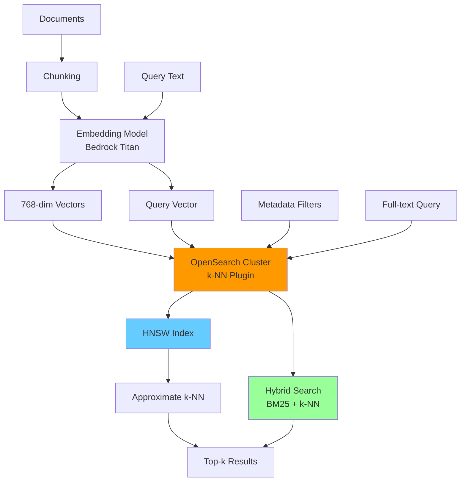

# Vector Search con OpenSearch

## Overview

### Cos'è e perché è importante nel nostro contesto

OpenSearch è un fork open-source di Elasticsearch che include il plugin **k-NN (k-Nearest Neighbors)**, permettendo ricerche semantiche su vettori ad alta dimensionalità. Nel nostro sistema AI Technical Support, OpenSearch è il cuore del **Retrieval-Augmented Generation (RAG)**: permette di trovare i chunk di documentazione più rilevanti per generare risposte tecniche accurate e citate.

**Vantaggi rispetto a vector DB specializzati** (Pinecone, Weaviate):
- **Hybrid search**: Combina full-text (BM25) e semantic search (k-NN)
- **Controllo fine-grained**: Deploy self-hosted su AWS, nessun vendor lock-in
- **Filtering avanzato**: Metadata filters integrati con query DSL
- **Costo-efficienza**: Managed service AWS con Reserved Instances

### Quando usarlo

- **Ricerca semantica**: Query in linguaggio naturale su documenti tecnici
- **RAG pipelines**: Retrieval di contesto per LLM
- **Similarity search**: "Trova problemi simili a questo ticket"
- **Recommendation systems**: "Documenti correlati"
- **Anomaly detection**: Identificare pattern outlier

### Architettura high-level



**Flusso nel nostro sistema**:
1. **Indexing**: Documenti → Chunking → Embedding → OpenSearch index
2. **Query**: Ticket description → Embedding → k-NN search → Top-5 chunks
3. **Generation**: Chunks → Claude → Soluzione con citations

## Concetti Fondamentali

### Vector Embeddings

Un **embedding** è una rappresentazione numerica densa di testo in uno spazio vettoriale continuo. Parole o frasi semanticamente simili sono vicine nello spazio.

```
"inverter error E204" → [0.23, -0.15, 0.67, ..., 0.42]  (768 numeri)
"inverter fault E204" → [0.21, -0.14, 0.65, ..., 0.40]  (distanza coseno: 0.02)
```

**Modello embedding**: Bedrock Titan Embeddings v1 (768 dimensioni)

### k-Nearest Neighbors (k-NN)

Algoritmo per trovare i **k punti più vicini** a un query vector in uno spazio ad alta dimensionalità.

**Approcci**:
- **Exact k-NN**: Calcola distanza da tutti i vettori (O(n), lento)
- **Approximate k-NN (ANN)**: Algoritmi euristici (HNSW, IVF) per speed/accuracy trade-off

### HNSW (Hierarchical Navigable Small Worlds)

Algoritmo grafo-based per ANN search. Costruisce una struttura multi-layer di nodi connessi.

**Parametri chiave**:
- **M**: Numero di connessioni per nodo (default: 16)
  - ↑ M → ↑ accuracy, ↑ memory, ↑ indexing time
- **ef_construction**: Dimensione candidate list durante indexing (default: 512)
  - ↑ ef_construction → ↑ accuracy, ↑ indexing time
- **ef_search**: Dimensione candidate list durante query (default: 512)
  - ↑ ef_search → ↑ accuracy, ↑ query latency

**Trade-off**:
```
M=8,  ef_construction=128  → Fast indexing, 90% recall, low memory
M=16, ef_construction=512  → Balanced (recommended)
M=32, ef_construction=1024 → Max accuracy, slow indexing, high memory
```

### Similarity Metrics

- **Cosine similarity**: Angolo tra vettori (range: -1 a 1)
  - Usato per embeddings normalizzati
  - Formula: `cos(θ) = (A · B) / (||A|| ||B||)`
- **Euclidean distance** (L2): Distanza geometrica
- **Dot product**: Prodotto scalare (per vettori normalizzati ≈ cosine)

Nel nostro sistema usiamo **cosine similarity** (standard per embeddings Bedrock).

### Hybrid Search

Combina **lexical search** (BM25 - keyword matching) e **semantic search** (k-NN - meaning matching).

**Esempio**:
- Query: "inverter errore codice E204"
- BM25: Match esatti su "E204", "inverter"
- k-NN: Match semantici su "fault", "malfunzionamento"
- **Fusion**: Weighted average degli score

## Implementazione Pratica

### Esempio 1: Index Creation con 768-dim Vectors

Creazione index con mapping completo per knowledge base chunks.

```json
PUT /kb-chunks
{
  "settings": {
    "index": {
      "number_of_shards": 5,
      "number_of_replicas": 1,
      "refresh_interval": "30s",
      "max_result_window": 10000,

      "knn": true,
      "knn.algo_param.ef_search": 512,

      "analysis": {
        "analyzer": {
          "italian_technical": {
            "type": "custom",
            "tokenizer": "standard",
            "filter": [
              "lowercase",
              "asciifolding",
              "italian_stop",
              "italian_stemmer",
              "remove_duplicates"
            ]
          }
        },
        "filter": {
          "italian_stop": {
            "type": "stop",
            "stopwords": "_italian_"
          },
          "italian_stemmer": {
            "type": "stemmer",
            "language": "italian"
          }
        }
      }
    }
  },
  "mappings": {
    "properties": {
      "chunk_id": {
        "type": "keyword"
      },
      "source_uri": {
        "type": "keyword"
      },
      "source_title": {
        "type": "text",
        "analyzer": "italian_technical",
        "fields": {
          "keyword": {
            "type": "keyword",
            "ignore_above": 256
          }
        }
      },
      "doc_type": {
        "type": "keyword"
      },
      "text": {
        "type": "text",
        "analyzer": "italian_technical",
        "term_vector": "with_positions_offsets"
      },
      "text_hash": {
        "type": "keyword"
      },
      "vector": {
        "type": "knn_vector",
        "dimension": 768,
        "method": {
          "name": "hnsw",
          "engine": "nmslib",
          "space_type": "cosinesimil",
          "parameters": {
            "ef_construction": 512,
            "m": 16
          }
        }
      },
      "embedding_model": {
        "type": "keyword"
      },
      "product_model": {
        "type": "keyword"
      },
      "error_codes": {
        "type": "keyword"
      },
      "categories": {
        "type": "keyword"
      },
      "tags": {
        "type": "keyword"
      },
      "metadata": {
        "properties": {
          "version": {
            "type": "keyword"
          },
          "language": {
            "type": "keyword"
          },
          "section": {
            "type": "text",
            "analyzer": "italian_technical"
          },
          "page": {
            "type": "integer"
          },
          "updated_at": {
            "type": "date"
          },
          "author": {
            "type": "keyword"
          },
          "review_status": {
            "type": "keyword"
          }
        }
      },
      "indexed_at": {
        "type": "date"
      },
      "last_accessed": {
        "type": "date"
      }
    }
  }
}
```

**Decisioni di design**:
- **5 shards**: Bilanciamento per 100K-500K documenti
- **refresh_interval: 30s**: Trade-off tra latency e indexing throughput
- **cosinesimil**: Metrica standard per embeddings Bedrock
- **m=16, ef_construction=512**: Bilancia accuracy (95%+ recall) e performance

### Esempio 2: Bulk Indexing con Backpressure

Ingest di 10K documenti con gestione errori e rate limiting.

```python
import boto3
import json
import time
from opensearchpy import OpenSearch, helpers
from opensearchpy.exceptions import TransportError
from typing import List, Dict, Generator
import logging

logging.basicConfig(level=logging.INFO)
logger = logging.getLogger(__name__)

class OpenSearchBulkIndexer:
    def __init__(
        self,
        host: str,
        region: str = 'eu-south-1',
        chunk_size: int = 500,
        max_retries: int = 3
    ):
        """
        Bulk indexer con backpressure handling.

        Args:
            host: OpenSearch endpoint (senza https://)
            region: AWS region
            chunk_size: Numero di documenti per batch (default: 500)
            max_retries: Tentativi massimi per batch falliti
        """
        self.client = OpenSearch(
            hosts=[{'host': host, 'port': 443}],
            http_auth=self._get_aws_auth(region),
            use_ssl=True,
            verify_certs=True,
            connection_class=RequestsHttpConnection,
            timeout=30,
            max_retries=max_retries,
            retry_on_timeout=True
        )
        self.chunk_size = chunk_size
        self.max_retries = max_retries

    def _get_aws_auth(self, region: str):
        """Ottiene AWS SigV4 auth per OpenSearch."""
        from requests_aws4auth import AWS4Auth
        credentials = boto3.Session().get_credentials()
        return AWS4Auth(
            credentials.access_key,
            credentials.secret_key,
            region,
            'es',
            session_token=credentials.token
        )

    def generate_actions(
        self,
        documents: List[Dict],
        index_name: str
    ) -> Generator[Dict, None, None]:
        """
        Genera azioni per bulk API.

        Args:
            documents: Lista di documenti da indicizzare
            index_name: Nome index target

        Yields:
            Dict in formato bulk API
        """
        for doc in documents:
            # Validazione base
            if 'chunk_id' not in doc or 'vector' not in doc:
                logger.warning(f"Skipping invalid document: {doc.get('chunk_id', 'unknown')}")
                continue

            # Verifica dimensione vettore
            if len(doc['vector']) != 768:
                logger.error(f"Invalid vector dimension for {doc['chunk_id']}: {len(doc['vector'])}")
                continue

            yield {
                '_index': index_name,
                '_id': doc['chunk_id'],
                '_source': doc
            }

    def bulk_index_with_backpressure(
        self,
        documents: List[Dict],
        index_name: str
    ) -> Dict[str, int]:
        """
        Indicizza documenti con gestione backpressure e retry.

        Args:
            documents: Lista di documenti
            index_name: Nome index

        Returns:
            Dict con statistiche: {success: int, failed: int, retried: int}
        """
        stats = {'success': 0, 'failed': 0, 'retried': 0}

        total_docs = len(documents)
        logger.info(f"Starting bulk indexing of {total_docs} documents to {index_name}")

        # Bulk insert con chunking
        actions = self.generate_actions(documents, index_name)

        for attempt in range(self.max_retries):
            try:
                # helpers.bulk gestisce automaticamente chunking e retry
                success, errors = helpers.bulk(
                    self.client,
                    actions,
                    chunk_size=self.chunk_size,
                    max_retries=self.max_retries,
                    initial_backoff=2,  # Exponential backoff starting at 2s
                    max_backoff=60,
                    raise_on_error=False,  # Non solleva eccezione, ritorna errors
                    raise_on_exception=False
                )

                stats['success'] += success

                # Gestione errori
                if errors:
                    logger.warning(f"Bulk indexing had {len(errors)} errors")
                    for error in errors:
                        logger.error(f"Error indexing document: {error}")
                        stats['failed'] += 1

                # Backpressure: attendi se cluster è sotto pressione
                cluster_health = self.client.cluster.health()
                if cluster_health['status'] == 'yellow':
                    logger.warning("Cluster status YELLOW, slowing down...")
                    time.sleep(5)
                elif cluster_health['status'] == 'red':
                    logger.error("Cluster status RED, pausing indexing...")
                    time.sleep(30)
                    stats['retried'] += 1
                    continue

                break  # Success, esci dal retry loop

            except TransportError as e:
                logger.error(f"Transport error on attempt {attempt + 1}: {e}")
                stats['retried'] += 1
                if attempt < self.max_retries - 1:
                    wait_time = 2 ** attempt  # Exponential backoff
                    logger.info(f"Retrying in {wait_time}s...")
                    time.sleep(wait_time)
                else:
                    logger.error("Max retries reached, some documents may not be indexed")
                    stats['failed'] += total_docs - stats['success']

            except Exception as e:
                logger.error(f"Unexpected error: {e}")
                stats['failed'] += total_docs - stats['success']
                break

        logger.info(f"Bulk indexing completed: {stats}")
        return stats


# Esempio di utilizzo
def main():
    """Esempio: indicizza 10K documenti."""

    # Inizializza indexer
    indexer = OpenSearchBulkIndexer(
        host='vpc-prod-opensearch-kb-xxxxx.eu-south-1.es.amazonaws.com',
        region='eu-south-1',
        chunk_size=500
    )

    # Genera 10K documenti di esempio
    # In produzione, questi vengono da S3 o pipeline di processing
    documents = []
    for i in range(10000):
        doc = {
            'chunk_id': f'chunk_{i:06d}',
            'source_uri': f's3://kb-sources/manual-{i//100}.pdf',
            'source_title': f'Technical Manual Section {i//100}',
            'doc_type': 'MANUAL',
            'text': f'This is technical content for chunk {i}...',
            'text_hash': f'hash_{i}',
            'vector': [0.1] * 768,  # In produzione: vettore da Bedrock
            'embedding_model': 'amazon.titan-embed-text-v1',
            'product_model': ['XC-200', 'XC-300'],
            'error_codes': [f'E{i%300:03d}'],
            'categories': ['troubleshooting'],
            'tags': ['technical', 'manual'],
            'metadata': {
                'version': '1.2',
                'language': 'it',
                'section': f'Section {i//1000}',
                'page': i % 500,
                'updated_at': '2025-01-15T10:00:00Z'
            },
            'indexed_at': '2025-01-18T14:30:00Z'
        }
        documents.append(doc)

    # Bulk index
    stats = indexer.bulk_index_with_backpressure(documents, 'kb-chunks')

    print(f"\n=== Indexing Results ===")
    print(f"Total documents: {len(documents)}")
    print(f"Successfully indexed: {stats['success']}")
    print(f"Failed: {stats['failed']}")
    print(f"Retried: {stats['retried']}")
    print(f"Success rate: {stats['success']/len(documents)*100:.2f}%")


if __name__ == '__main__':
    main()
```

**Gestione backpressure**:
- **Chunk size 500**: Ottimale per documenti di ~2KB
- **Cluster health check**: Rallenta se status è YELLOW/RED
- **Exponential backoff**: 2s → 4s → 8s → ...
- **Error handling**: Log errori, continua indexing

### Esempio 3: Pure k-NN Query

Ricerca semantica pura basata su similarity vettoriale.

```python
import boto3
import json
from opensearchpy import OpenSearch
from typing import List, Dict

class KNNSearcher:
    def __init__(self, opensearch_host: str, region: str = 'eu-south-1'):
        """Inizializza client OpenSearch e Bedrock."""
        self.os_client = OpenSearch(
            hosts=[{'host': opensearch_host, 'port': 443}],
            http_auth=self._get_aws_auth(region),
            use_ssl=True,
            verify_certs=True
        )
        self.bedrock_client = boto3.client('bedrock-runtime', region_name=region)

    def _get_aws_auth(self, region: str):
        """AWS SigV4 auth."""
        from requests_aws4auth import AWS4Auth
        credentials = boto3.Session().get_credentials()
        return AWS4Auth(
            credentials.access_key,
            credentials.secret_key,
            region,
            'es',
            session_token=credentials.token
        )

    def generate_embedding(self, text: str) -> List[float]:
        """
        Genera embedding vettoriale da testo usando Bedrock Titan.

        Args:
            text: Testo da convertire in vettore

        Returns:
            Lista di 768 float (embedding vector)
        """
        response = self.bedrock_client.invoke_model(
            modelId='amazon.titan-embed-text-v1',
            contentType='application/json',
            accept='application/json',
            body=json.dumps({
                'inputText': text
            })
        )

        result = json.loads(response['body'].read())
        return result['embedding']

    def knn_search(
        self,
        query_text: str,
        k: int = 10,
        min_score: float = 0.7
    ) -> List[Dict]:
        """
        Esegue pure k-NN search.

        Args:
            query_text: Query in linguaggio naturale
            k: Numero di risultati da ritornare
            min_score: Score minimo (cosine similarity)

        Returns:
            Lista di documenti con score e metadata
        """
        # 1. Genera query embedding
        query_vector = self.generate_embedding(query_text)

        # 2. Costruisci query k-NN
        search_body = {
            'size': k,
            'query': {
                'knn': {
                    'vector': {
                        'vector': query_vector,
                        'k': k
                    }
                }
            },
            '_source': [
                'chunk_id',
                'source_title',
                'text',
                'source_uri',
                'metadata',
                'product_model',
                'error_codes'
            ],
            'min_score': min_score  # Filtra risultati con bassa similarity
        }

        # 3. Esegui ricerca
        response = self.os_client.search(
            index='kb-chunks',
            body=search_body
        )

        # 4. Formatta risultati
        results = []
        for hit in response['hits']['hits']:
            results.append({
                'chunk_id': hit['_source']['chunk_id'],
                'score': hit['_score'],  # Cosine similarity
                'title': hit['_source']['source_title'],
                'text': hit['_source']['text'],
                'uri': hit['_source']['source_uri'],
                'page': hit['_source']['metadata'].get('page'),
                'section': hit['_source']['metadata'].get('section'),
                'products': hit['_source'].get('product_model', []),
                'error_codes': hit['_source'].get('error_codes', [])
            })

        return results


# Esempio di utilizzo
def main():
    searcher = KNNSearcher(
        opensearch_host='vpc-prod-opensearch-kb-xxxxx.eu-south-1.es.amazonaws.com'
    )

    # Query esempio: problema inverter
    query = "L'inverter XC-200 mostra errore E204 e non si avvia"

    print(f"Query: {query}\n")
    print("=" * 80)

    results = searcher.knn_search(query, k=5, min_score=0.75)

    for i, result in enumerate(results, 1):
        print(f"\n[{i}] Score: {result['score']:.4f}")
        print(f"Title: {result['title']}")
        print(f"Section: {result['section']} (Page {result['page']})")
        print(f"Products: {', '.join(result['products'])}")
        print(f"Error Codes: {', '.join(result['error_codes'])}")
        print(f"Text: {result['text'][:200]}...")
        print(f"URI: {result['uri']}")

    print("\n" + "=" * 80)
    print(f"Total results: {len(results)}")


if __name__ == '__main__':
    main()
```

**Output esempio**:
```
Query: L'inverter XC-200 mostra errore E204 e non si avvia

================================================================================

[1] Score: 0.8923
Title: XC-200 Troubleshooting Manual
Section: Error Codes (Page 42)
Products: XC-200, XC-300
Error Codes: E204, E205
Text: Errore E204: Mancata inizializzazione inverter. Verificare alimentazione
e connessioni DC. Se il problema persiste, controllare scheda di controllo...
URI: s3://kb-sources/manuals/XC-200-manual-v1.2.pdf#page=42

[2] Score: 0.8456
Title: Common Inverter Faults - FAQ
Section: Startup Issues (Page 12)
Products: XC-200
Error Codes: E204, E101
Text: Problema: Inverter non si avvia. Possibili cause: 1) Alimentazione DC
insufficiente, 2) Errore configurazione parametri, 3) Scheda danneggiata...
URI: s3://kb-sources/faqs/inverter-common-issues.pdf#page=12

================================================================================
Total results: 5
```

### Esempio 4: Hybrid Query (BM25 + k-NN)

Combina ricerca full-text e semantica per massimizzare recall e precision.

```python
def hybrid_search(
    self,
    query_text: str,
    k: int = 10,
    knn_weight: float = 0.7,
    bm25_weight: float = 0.3
) -> List[Dict]:
    """
    Hybrid search: combina k-NN (semantico) e BM25 (keyword).

    Args:
        query_text: Query in linguaggio naturale
        k: Numero di risultati
        knn_weight: Peso per k-NN score (0.0-1.0)
        bm25_weight: Peso per BM25 score (0.0-1.0)

    Returns:
        Lista di documenti ranked con score combinato

    Note:
        knn_weight + bm25_weight dovrebbe essere = 1.0 per normalizzazione
    """
    # 1. Genera query embedding
    query_vector = self.generate_embedding(query_text)

    # 2. Costruisci hybrid query
    search_body = {
        'size': k,
        'query': {
            'bool': {
                'should': [
                    # Semantic search (k-NN)
                    {
                        'script_score': {
                            'query': {
                                'knn': {
                                    'vector': {
                                        'vector': query_vector,
                                        'k': k * 2  # Fetch più candidati per re-ranking
                                    }
                                }
                            },
                            'script': {
                                'source': f'_score * {knn_weight}'
                            }
                        }
                    },
                    # Keyword search (BM25)
                    {
                        'script_score': {
                            'query': {
                                'multi_match': {
                                    'query': query_text,
                                    'fields': [
                                        'text^2',  # Boost text field
                                        'source_title',
                                        'metadata.section'
                                    ],
                                    'type': 'best_fields',
                                    'operator': 'or',
                                    'fuzziness': 'AUTO'
                                }
                            },
                            'script': {
                                'source': f'_score * {bm25_weight}'
                            }
                        }
                    }
                ],
                'minimum_should_match': 1
            }
        },
        '_source': [
            'chunk_id', 'source_title', 'text', 'source_uri',
            'metadata', 'product_model', 'error_codes'
        ]
    }

    # 3. Esegui ricerca
    response = self.os_client.search(
        index='kb-chunks',
        body=search_body
    )

    # 4. Formatta risultati con breakdown score
    results = []
    for hit in response['hits']['hits']:
        results.append({
            'chunk_id': hit['_source']['chunk_id'],
            'score': hit['_score'],
            'title': hit['_source']['source_title'],
            'text': hit['_source']['text'],
            'uri': hit['_source']['source_uri'],
            'metadata': hit['_source']['metadata']
        })

    return results
```

**Quando usare hybrid vs pure k-NN**:
- **Pure k-NN**: Query generiche, concetti astratti ("come ottimizzare performance")
- **Hybrid**: Query con termini specifici (codici errore, model numbers)
- **BM25 only**: Ricerca esatta (serial number, document ID)

### Esempio 5: Filtered k-NN Search

Combina similarity search con metadata filters per risultati più precisi.

```python
def filtered_knn_search(
    self,
    query_text: str,
    product_models: List[str] = None,
    error_codes: List[str] = None,
    doc_types: List[str] = None,
    date_range: Dict[str, str] = None,
    k: int = 10
) -> List[Dict]:
    """
    k-NN search con metadata filtering.

    Args:
        query_text: Query in linguaggio naturale
        product_models: Lista di modelli prodotto (es. ['XC-200', 'XC-300'])
        error_codes: Lista di codici errore (es. ['E204', 'E205'])
        doc_types: Tipi documento (es. ['MANUAL', 'FAQ'])
        date_range: Range date metadata.updated_at (es. {'gte': '2024-01-01'})
        k: Numero di risultati

    Returns:
        Lista di documenti che matchano sia similarity sia filters
    """
    # 1. Genera query embedding
    query_vector = self.generate_embedding(query_text)

    # 2. Costruisci filters
    filters = []

    if product_models:
        filters.append({
            'terms': {'product_model': product_models}
        })

    if error_codes:
        filters.append({
            'terms': {'error_codes': error_codes}
        })

    if doc_types:
        filters.append({
            'terms': {'doc_type': doc_types}
        })

    if date_range:
        filters.append({
            'range': {'metadata.updated_at': date_range}
        })

    # 3. Costruisci query con filters
    search_body = {
        'size': k,
        'query': {
            'bool': {
                'must': [
                    {
                        'knn': {
                            'vector': {
                                'vector': query_vector,
                                'k': k * 3  # Oversample per compensare filtering
                            }
                        }
                    }
                ],
                'filter': filters  # Filters non influenzano score
            }
        },
        '_source': {
            'includes': [
                'chunk_id', 'source_title', 'text', 'source_uri',
                'metadata', 'product_model', 'error_codes', 'doc_type'
            ]
        }
    }

    # 4. Esegui ricerca
    response = self.os_client.search(
        index='kb-chunks',
        body=search_body
    )

    # 5. Formatta risultati
    results = []
    for hit in response['hits']['hits']:
        results.append({
            'chunk_id': hit['_source']['chunk_id'],
            'score': hit['_score'],
            'title': hit['_source']['source_title'],
            'text': hit['_source']['text'],
            'uri': hit['_source']['source_uri'],
            'doc_type': hit['_source']['doc_type'],
            'products': hit['_source'].get('product_model', []),
            'error_codes': hit['_source'].get('error_codes', []),
            'updated_at': hit['_source']['metadata'].get('updated_at')
        })

    return results


# Esempio: ricerca filtrata per prodotto e errore specifici
results = searcher.filtered_knn_search(
    query_text="Inverter non si avvia dopo aggiornamento firmware",
    product_models=['XC-200'],
    error_codes=['E204', 'E205', 'E210'],
    doc_types=['MANUAL', 'BULLETIN'],
    date_range={'gte': '2024-01-01'},  # Solo documenti recenti
    k=5
)
```

**Performance tip**:
- Usa `k * 3` per oversample quando usi filters pesanti
- `filter` clause (non `must`) → non calcola score, più veloce
- Evita troppi filters simultanei → degrada performance k-NN

### Esempio 6: Query Performance Profiling

Analizza performance e ottimizza query lente.

```python
def profile_query(
    self,
    query_text: str,
    k: int = 10
) -> Dict:
    """
    Profila query performance e identifica bottleneck.

    Args:
        query_text: Query da profilare
        k: Numero di risultati

    Returns:
        Dict con timing breakdown e suggerimenti optimization
    """
    import time

    # 1. Timing embedding generation
    start_embed = time.time()
    query_vector = self.generate_embedding(query_text)
    embed_time = (time.time() - start_embed) * 1000  # ms

    # 2. Query con profiling abilitato
    search_body = {
        'size': k,
        'profile': True,  # Abilita profiling
        'query': {
            'knn': {
                'vector': {
                    'vector': query_vector,
                    'k': k
                }
            }
        }
    }

    start_search = time.time()
    response = self.os_client.search(
        index='kb-chunks',
        body=search_body
    )
    search_time = (time.time() - start_search) * 1000  # ms

    # 3. Analizza profiling results
    profile_data = response.get('profile', {})

    # Estrai timing per shard
    shard_timings = []
    for shard in profile_data.get('shards', []):
        for search_phase in shard.get('searches', []):
            for query_entry in search_phase.get('query', []):
                shard_timings.append({
                    'shard_id': shard.get('id'),
                    'type': query_entry.get('type'),
                    'description': query_entry.get('description'),
                    'time_ms': query_entry.get('time_in_nanos', 0) / 1_000_000
                })

    # 4. Calcola statistiche
    total_shards = len(shard_timings)
    avg_shard_time = sum(t['time_ms'] for t in shard_timings) / total_shards if total_shards > 0 else 0
    max_shard_time = max((t['time_ms'] for t in shard_timings), default=0)

    # 5. Identifica bottleneck
    bottleneck = None
    suggestions = []

    if embed_time > 200:
        bottleneck = 'embedding_generation'
        suggestions.append("Embedding time alto: considera caching o batch processing")

    if max_shard_time > 500:
        bottleneck = 'shard_processing'
        suggestions.append("Shard time alto: aumenta ef_search o riduci M parameter")

    if max_shard_time > avg_shard_time * 2:
        suggestions.append("Hot shard detected: considera re-sharding")

    # 6. Genera report
    report = {
        'query_text': query_text,
        'total_time_ms': embed_time + search_time,
        'breakdown': {
            'embedding_generation_ms': embed_time,
            'opensearch_search_ms': search_time
        },
        'shard_statistics': {
            'total_shards': total_shards,
            'avg_time_ms': avg_shard_time,
            'max_time_ms': max_shard_time,
            'min_time_ms': min((t['time_ms'] for t in shard_timings), default=0)
        },
        'bottleneck': bottleneck,
        'suggestions': suggestions,
        'results_count': len(response['hits']['hits'])
    }

    return report


# Esempio di utilizzo
report = searcher.profile_query(
    "Inverter XC-200 errore E204",
    k=10
)

print("=== Query Performance Report ===")
print(f"Query: {report['query_text']}")
print(f"Total time: {report['total_time_ms']:.2f} ms")
print(f"\nBreakdown:")
print(f"  Embedding: {report['breakdown']['embedding_generation_ms']:.2f} ms")
print(f"  Search: {report['breakdown']['opensearch_search_ms']:.2f} ms")
print(f"\nShard Statistics:")
print(f"  Total shards: {report['shard_statistics']['total_shards']}")
print(f"  Avg time: {report['shard_statistics']['avg_time_ms']:.2f} ms")
print(f"  Max time: {report['shard_statistics']['max_time_ms']:.2f} ms")
print(f"\nBottleneck: {report['bottleneck']}")
print(f"Suggestions:")
for suggestion in report['suggestions']:
    print(f"  - {suggestion}")
```

**Performance targets**:
- **Embedding generation**: < 200ms
- **OpenSearch search**: < 300ms (p95)
- **Total latency**: < 500ms (p95)
- **Max shard time**: < 500ms

## Best Practices

### Do's

1. **Normalize vectors**: Usa embeddings normalizzati per cosine similarity
   ```python
   import numpy as np
   vector = np.array(vector)
   normalized = vector / np.linalg.norm(vector)
   ```

2. **Batch embedding generation**: Riduci latency con batch requests
   ```python
   # Bedrock Titan supporta fino a 128 testi per batch
   batch_size = 128
   embeddings = []
   for i in range(0, len(texts), batch_size):
       batch = texts[i:i+batch_size]
       embeddings.extend(generate_embeddings_batch(batch))
   ```

3. **Use refresh_interval wisely**:
   - Indexing pesante: `"refresh_interval": "60s"` o `-1` (disabled)
   - Query-heavy: `"refresh_interval": "1s"`

4. **Monitor memory usage**:
   ```python
   # Calcolo memory requirement per HNSW
   num_docs = 100_000
   vector_dim = 768
   M = 16
   memory_mb = (num_docs * vector_dim * 4 + num_docs * M * 2 * 4) / 1024 / 1024
   print(f"Estimated memory: {memory_mb:.2f} MB")
   ```

5. **Implement caching**: Cache embeddings per query comuni
   ```python
   from functools import lru_cache

   @lru_cache(maxsize=1000)
   def get_cached_embedding(text: str) -> List[float]:
       return generate_embedding(text)
   ```

### Don'ts

1. **Non usare exact k-NN** per dataset > 10K documenti
   - Usa HNSW (approximate) invece di brute-force

2. **Non ignorare shard count**
   - Troppi shards (> 10) → overhead
   - Troppo pochi (< 3) → hot shard

3. **Non fare over-filtering**
   - Filters riducono candidate set per k-NN
   - Aumenta `k` quando usi molti filters

4. **Non commitare subito** durante bulk indexing
   - Usa `refresh_interval: -1` durante ingest
   - Forza refresh solo a fine batch

5. **Non ignorare circuit breakers**
   - Monitor `fielddata.breaker` e `request.breaker`
   - Aumenta heap se breaker triggered frequentemente

### Performance Optimization

**Memory**:
```json
{
  "indices.breaker.fielddata.limit": "40%",
  "indices.breaker.request.limit": "60%",
  "indices.breaker.total.limit": "95%"
}
```

**Tuning HNSW**:
```python
# Accuracy priority (recall > 98%)
params = {
    "m": 32,
    "ef_construction": 1024,
    "ef_search": 1024
}

# Speed priority (latency < 50ms)
params = {
    "m": 8,
    "ef_construction": 128,
    "ef_search": 128
}

# Balanced (default)
params = {
    "m": 16,
    "ef_construction": 512,
    "ef_search": 512
}
```

**Shard allocation**:
```python
# Rule of thumb: shard size 10-50GB
num_docs = 500_000
avg_doc_size_kb = 5  # 5KB per chunk
total_size_gb = (num_docs * avg_doc_size_kb) / 1024 / 1024
optimal_shards = max(3, int(total_size_gb / 30))  # Target 30GB per shard
```

### Security Considerations

1. **Encryption**:
   - At-rest: KMS encryption enabled
   - In-transit: TLS 1.3 required

2. **IAM policies**: Least privilege
   ```json
   {
     "Effect": "Allow",
     "Action": [
       "es:ESHttpGet",
       "es:ESHttpPost"
     ],
     "Resource": "arn:aws:es:eu-south-1:*:domain/prod-opensearch-kb/*"
   }
   ```

3. **VPC deployment**:
   - Deploy in private subnets
   - Use VPC endpoints (no internet gateway)

4. **Fine-grained access control**:
   - Separate roles per index (kb-chunks vs logs)

### Cost Optimization

1. **Reserved Instances**: -40% per 1-year commitment
   ```
   3x r6g.large on-demand: $360/month
   3x r6g.large reserved:  $216/month (save $144)
   ```

2. **Right-sizing**:
   - Monitor CPU/memory utilization
   - Scale down se < 50% utilizzo

3. **Storage optimization**:
   - Usa `_source` compression
   - Exclude fields non necessari da `_source`

4. **Snapshot to S3**:
   - Automated daily snapshots
   - S3 Glacier per backup > 90 giorni

## Troubleshooting

### Memory Pressure Issues

**Sintomo**:
```
CircuitBreakingException: [parent] Data too large, data for [<http_request>]
would be [31283212/29.8mb], which is larger than the limit of [30228070/28.8mb]
```

**Causa**: Heap memory insufficiente per query o indexing operations.

**Soluzione**:
1. **Aumenta heap size**:
   ```bash
   # In domain configuration
   JVMOptions: -Xms16g -Xmx16g  # 50% of RAM
   ```

2. **Riduci shard count**:
   ```bash
   # Shrink index
   POST /kb-chunks/_shrink/kb-chunks-smaller
   {
     "settings": {
       "index.number_of_shards": 3
     }
   }
   ```

3. **Abilita query result window limit**:
   ```json
   {
     "index.max_result_window": 10000
   }
   ```

### Slow Query Performance

**Sintomo**: Query latency > 1 secondo.

**Diagnosi**:
```bash
# Check slow logs
GET /_cluster/settings

PUT /_cluster/settings
{
  "transient": {
    "logger.index.search.slowlog": "DEBUG",
    "logger.index.indexing.slowlog": "DEBUG"
  }
}
```

**Soluzioni**:

1. **Aumenta ef_search**:
   ```json
   PUT /kb-chunks/_settings
   {
     "index.knn.algo_param.ef_search": 1024
   }
   ```

2. **Warm up index** (pre-load in memory):
   ```python
   # Forza query per caricare HNSW graph in memory
   for _ in range(100):
       searcher.knn_search("warm up query", k=10)
   ```

3. **Check hot shards**:
   ```bash
   GET /_cat/thread_pool/search?v&h=node_name,name,active,queue,rejected
   ```

4. **Scale out**: Aggiungi nodi al cluster

### Circuit Breaker Triggered

**Sintomo**:
```
CircuitBreakingException: [parent] Data too large
```

**Prevenzione**:
```python
def safe_bulk_index(documents, chunk_size=500):
    """Bulk index con circuit breaker check."""
    cluster_stats = client.cluster.stats()

    # Check memory usage
    heap_percent = cluster_stats['nodes']['jvm']['mem']['heap_used_percent']
    if heap_percent > 85:
        logger.warning(f"High heap usage: {heap_percent}%, pausing indexing")
        time.sleep(60)
        return safe_bulk_index(documents, chunk_size)  # Retry

    # Proceed with indexing
    return bulk_index(documents, chunk_size)
```

**Mitigazione**:
```bash
# Aumenta circuit breaker limits
PUT /_cluster/settings
{
  "persistent": {
    "indices.breaker.total.limit": "95%",
    "indices.breaker.fielddata.limit": "60%",
    "indices.breaker.request.limit": "40%"
  }
}
```

### Shard Allocation Failures

**Sintomo**:
```
ClusterBlockException: blocked by: [FORBIDDEN/12/index read-only /
allow delete (api)];
```

**Causa**: Disk watermark superato (default: 90% disk usage).

**Soluzione**:
1. **Elimina vecchi indici**:
   ```bash
   DELETE /old-index-*
   ```

2. **Aumenta disk space** (scale up instance type)

3. **Temporaneo override** (NOT recommended for production):
   ```bash
   PUT /_cluster/settings
   {
     "transient": {
       "cluster.routing.allocation.disk.watermark.low": "95%",
       "cluster.routing.allocation.disk.watermark.high": "97%"
     }
   }
   ```

4. **Monitor disk usage**:
   ```python
   def check_disk_usage():
       stats = client.cluster.stats()
       for node in stats['nodes']['fs']:
           total_gb = node['total_in_bytes'] / 1024**3
           available_gb = node['available_in_bytes'] / 1024**3
           usage_percent = (1 - available_gb/total_gb) * 100

           if usage_percent > 85:
               alert(f"Disk usage high: {usage_percent:.1f}%")
   ```

### Index Refresh Too Slow

**Sintomo**: Documenti indicizzati non visibili in search per > 30 secondi.

**Causa**: `refresh_interval` troppo alto o refresh backlog.

**Soluzione**:
```bash
# Check refresh stats
GET /kb-chunks/_stats/refresh

# Force refresh (use sparingly)
POST /kb-chunks/_refresh

# Adjust refresh interval
PUT /kb-chunks/_settings
{
  "index.refresh_interval": "5s"
}
```

## Esempi Reali dal Progetto

### Caso 1: RAG Retrieval Pipeline

Implementazione completa del retrieval step nel nostro ticket processing workflow.

```python
# File: lambda/rag_retrieval/handler.py

import os
import json
from typing import List, Dict
from knn_searcher import KNNSearcher

def lambda_handler(event, context):
    """
    Lambda function per RAG retrieval nel ticket processing workflow.

    Input (da Step Functions):
        - ticket_id: str
        - symptom_text: str
        - error_code: str
        - product_model: str
        - classification: dict

    Output:
        - context_chunks: List[Dict] (top-5 chunks)
        - retrieval_metadata: dict
    """

    # 1. Estrai parametri
    ticket_id = event['ticket_id']
    symptom_text = event['symptom_text']
    error_code = event.get('error_code')
    product_model = event['asset']['model']
    category = event.get('classification', {}).get('category')

    # 2. Inizializza searcher
    searcher = KNNSearcher(
        opensearch_host=os.environ['OPENSEARCH_ENDPOINT'],
        region=os.environ['AWS_REGION']
    )

    # 3. Costruisci query ottimizzata
    # Combina symptom + error code + context per migliore retrieval
    query_parts = [symptom_text]
    if error_code:
        query_parts.append(f"Codice errore {error_code}")
    if category:
        query_parts.append(f"Categoria: {category}")

    query_text = " ".join(query_parts)

    # 4. Esegui filtered k-NN search
    results = searcher.filtered_knn_search(
        query_text=query_text,
        product_models=[product_model],
        error_codes=[error_code] if error_code else None,
        doc_types=['MANUAL', 'BULLETIN', 'FAQ'],  # Prioritize authoritative sources
        k=10  # Fetch 10, we'll re-rank to top-5
    )

    # 5. Re-ranking (simple: già ordinati per score)
    # In produzione: considera cross-encoder per re-ranking più sofisticato
    top_5 = results[:5]

    # 6. Formatta chunks per LLM
    context_chunks = []
    for i, result in enumerate(top_5, 1):
        context_chunks.append({
            'chunk_id': result['chunk_id'],
            'text': result['text'],
            'source': {
                'title': result['title'],
                'uri': result['uri'],
                'page': result.get('metadata', {}).get('page'),
                'section': result.get('metadata', {}).get('section')
            },
            'score': result['score'],
            'rank': i
        })

    # 7. Calcola metriche
    avg_score = sum(c['score'] for c in context_chunks) / len(context_chunks) if context_chunks else 0

    # 8. Log per monitoring
    print(json.dumps({
        'ticket_id': ticket_id,
        'retrieval_count': len(context_chunks),
        'avg_score': avg_score,
        'query_length': len(query_text)
    }))

    # 9. Return per Step Functions
    return {
        'ticket_id': ticket_id,
        'context_chunks': context_chunks,
        'retrieval_metadata': {
            'query_text': query_text,
            'total_candidates': len(results),
            'selected_count': len(context_chunks),
            'avg_relevance_score': avg_score,
            'min_score': min((c['score'] for c in context_chunks), default=0),
            'filters_applied': {
                'product_model': product_model,
                'error_code': error_code,
                'doc_types': ['MANUAL', 'BULLETIN', 'FAQ']
            }
        }
    }
```

**Step Functions integration**:
```json
{
  "RAGRetrieval": {
    "Type": "Task",
    "Resource": "arn:aws:lambda:eu-south-1:xxx:function:rag-retrieval",
    "TimeoutSeconds": 30,
    "Retry": [
      {
        "ErrorEquals": ["States.TaskFailed"],
        "IntervalSeconds": 2,
        "MaxAttempts": 3,
        "BackoffRate": 2.0
      }
    ],
    "Next": "GenerateSolution"
  }
}
```

### Caso 2: Knowledge Base Indexing Pipeline

Pipeline completa per ingest documenti nella KB.

```python
# File: scripts/index_knowledge_base.py

import boto3
import json
from pathlib import Path
from typing import List, Dict
from opensearch_bulk_indexer import OpenSearchBulkIndexer

class KnowledgeBaseIndexer:
    """Indicizza documenti da S3 a OpenSearch."""

    def __init__(self, opensearch_host: str, region: str = 'eu-south-1'):
        self.s3 = boto3.client('s3', region_name=region)
        self.bedrock = boto3.client('bedrock-runtime', region_name=region)
        self.indexer = OpenSearchBulkIndexer(opensearch_host, region)

    def process_document(self, s3_uri: str) -> List[Dict]:
        """
        Processa documento da S3: chunking + embedding.

        Args:
            s3_uri: s3://bucket/key

        Returns:
            Lista di chunks con embeddings
        """
        # 1. Download da S3
        bucket, key = self._parse_s3_uri(s3_uri)
        obj = self.s3.get_object(Bucket=bucket, Key=key)
        text = obj['Body'].read().decode('utf-8')

        # 2. Chunking (512-1500 tokens)
        chunks = self._chunk_document(text, chunk_size=1000, overlap=200)

        # 3. Generate embeddings (batch)
        embeddings = self._generate_embeddings_batch([c['text'] for c in chunks])

        # 4. Combine chunks + embeddings
        for chunk, embedding in zip(chunks, embeddings):
            chunk['vector'] = embedding
            chunk['embedding_model'] = 'amazon.titan-embed-text-v1'
            chunk['source_uri'] = s3_uri

        return chunks

    def _chunk_document(self, text: str, chunk_size: int, overlap: int) -> List[Dict]:
        """
        Sliding window chunking con overlap.

        Args:
            text: Testo documento
            chunk_size: Dimensione chunk in caratteri
            overlap: Overlap tra chunk consecutivi

        Returns:
            Lista di chunks con metadata
        """
        chunks = []
        start = 0
        chunk_num = 0

        while start < len(text):
            end = start + chunk_size
            chunk_text = text[start:end]

            # Trova sentence boundary per evitare split mid-sentence
            if end < len(text):
                last_period = chunk_text.rfind('.')
                last_newline = chunk_text.rfind('\n')
                boundary = max(last_period, last_newline)
                if boundary > chunk_size * 0.8:  # Almeno 80% del chunk
                    end = start + boundary + 1
                    chunk_text = text[start:end]

            chunks.append({
                'chunk_id': f'chunk_{chunk_num:06d}',
                'text': chunk_text.strip(),
                'text_hash': self._hash_text(chunk_text),
                'chunk_num': chunk_num,
                'start_char': start,
                'end_char': end
            })

            start = end - overlap
            chunk_num += 1

        return chunks

    def _generate_embeddings_batch(self, texts: List[str], batch_size: int = 128) -> List[List[float]]:
        """
        Genera embeddings in batch per efficiency.

        Note: Bedrock Titan supporta fino a 128 testi per batch
        """
        all_embeddings = []

        for i in range(0, len(texts), batch_size):
            batch = texts[i:i+batch_size]

            # Bedrock batch invoke
            response = self.bedrock.invoke_model(
                modelId='amazon.titan-embed-text-v1',
                contentType='application/json',
                body=json.dumps({
                    'inputText': batch  # Array di testi
                })
            )

            result = json.loads(response['body'].read())
            all_embeddings.extend(result['embeddings'])

        return all_embeddings

    def index_knowledge_base(self, s3_bucket: str, prefix: str = 'kb-sources/'):
        """
        Indicizza tutti i documenti da S3 bucket.

        Args:
            s3_bucket: Nome bucket S3
            prefix: Prefix per filtrare oggetti
        """
        # 1. Lista documenti da S3
        paginator = self.s3.get_paginator('list_objects_v2')
        pages = paginator.paginate(Bucket=s3_bucket, Prefix=prefix)

        all_chunks = []
        doc_count = 0

        for page in pages:
            for obj in page.get('Contents', []):
                s3_uri = f"s3://{s3_bucket}/{obj['Key']}"

                # Skip non-text files (in produzione: usa Textract per PDF)
                if not obj['Key'].endswith(('.txt', '.md', '.json')):
                    continue

                print(f"Processing: {s3_uri}")

                try:
                    chunks = self.process_document(s3_uri)
                    all_chunks.extend(chunks)
                    doc_count += 1

                    # Bulk index ogni 1000 chunks
                    if len(all_chunks) >= 1000:
                        stats = self.indexer.bulk_index_with_backpressure(
                            all_chunks,
                            'kb-chunks'
                        )
                        print(f"Indexed batch: {stats}")
                        all_chunks = []

                except Exception as e:
                    print(f"Error processing {s3_uri}: {e}")
                    continue

        # Index remaining chunks
        if all_chunks:
            stats = self.indexer.bulk_index_with_backpressure(
                all_chunks,
                'kb-chunks'
            )
            print(f"Indexed final batch: {stats}")

        print(f"\nIndexing complete: {doc_count} documents processed")


# Script execution
if __name__ == '__main__':
    indexer = KnowledgeBaseIndexer(
        opensearch_host='vpc-prod-opensearch-kb-xxxxx.eu-south-1.es.amazonaws.com'
    )

    indexer.index_knowledge_base(
        s3_bucket='prod-raw-data-eus1',
        prefix='kb-sources/'
    )
```

### Caso 3: Monitoring Dashboard

Dashboard CloudWatch per monitorare performance OpenSearch.

```python
# File: monitoring/opensearch_metrics.py

import boto3
from datetime import datetime, timedelta

class OpenSearchMonitor:
    """Monitor OpenSearch cluster health e query performance."""

    def __init__(self, domain_name: str, region: str = 'eu-south-1'):
        self.cloudwatch = boto3.client('cloudwatch', region_name=region)
        self.domain_name = domain_name
        self.namespace = 'AWS/ES'

    def get_query_latency_p95(self, hours: int = 1) -> float:
        """Ottiene p95 latency per search queries."""
        response = self.cloudwatch.get_metric_statistics(
            Namespace=self.namespace,
            MetricName='SearchLatency',
            Dimensions=[
                {'Name': 'DomainName', 'Value': self.domain_name},
                {'Name': 'ClientId', 'Value': 'xxx'}  # Account ID
            ],
            StartTime=datetime.utcnow() - timedelta(hours=hours),
            EndTime=datetime.utcnow(),
            Period=300,  # 5 min
            Statistics=['Average', 'Maximum'],
            ExtendedStatistics=['p95']
        )

        if response['Datapoints']:
            return response['Datapoints'][-1].get('ExtendedStatistics', {}).get('p95', 0)
        return 0

    def get_cluster_health(self) -> Dict:
        """Health check completo del cluster."""
        metrics = {
            'cpu_utilization': self._get_metric('CPUUtilization', 'Average'),
            'memory_pressure': self._get_metric('JVMMemoryPressure', 'Maximum'),
            'disk_usage': self._get_metric('FreeStorageSpace', 'Minimum'),
            'indexing_rate': self._get_metric('IndexingRate', 'Sum'),
            'search_rate': self._get_metric('SearchRate', 'Sum'),
            'knn_query_requests': self._get_metric('KNNQueryRequests', 'Sum'),
            'knn_query_time': self._get_metric('KNNSearchTime', 'Average')
        }

        # Valuta health status
        status = 'HEALTHY'
        warnings = []

        if metrics['cpu_utilization'] > 80:
            status = 'WARNING'
            warnings.append('High CPU utilization')

        if metrics['memory_pressure'] > 90:
            status = 'CRITICAL'
            warnings.append('High memory pressure - risk of circuit breaker')

        if metrics['disk_usage'] < 20 * 1024:  # < 20GB free
            status = 'WARNING'
            warnings.append('Low disk space')

        return {
            'status': status,
            'warnings': warnings,
            'metrics': metrics,
            'timestamp': datetime.utcnow().isoformat()
        }

    def _get_metric(self, metric_name: str, stat: str) -> float:
        """Helper per fetch singola metrica."""
        response = self.cloudwatch.get_metric_statistics(
            Namespace=self.namespace,
            MetricName=metric_name,
            Dimensions=[
                {'Name': 'DomainName', 'Value': self.domain_name}
            ],
            StartTime=datetime.utcnow() - timedelta(minutes=5),
            EndTime=datetime.utcnow(),
            Period=300,
            Statistics=[stat]
        )

        if response['Datapoints']:
            return response['Datapoints'][-1].get(stat, 0)
        return 0


# Lambda per alerting
def lambda_handler(event, context):
    """Lambda che monitora health e invia alert."""
    monitor = OpenSearchMonitor(domain_name='prod-opensearch-kb')
    health = monitor.get_cluster_health()

    if health['status'] in ['WARNING', 'CRITICAL']:
        # Invia alert via SNS
        sns = boto3.client('sns')
        sns.publish(
            TopicArn='arn:aws:sns:eu-south-1:xxx:opensearch-alerts',
            Subject=f"OpenSearch Alert: {health['status']}",
            Message=json.dumps(health, indent=2)
        )

    return health
```

## Riferimenti

### Documentazione AWS
- [OpenSearch Service Developer Guide](https://docs.aws.amazon.com/opensearch-service/)
- [k-NN Plugin Documentation](https://opensearch.org/docs/latest/search-plugins/knn/index/)
- [HNSW Algorithm](https://opensearch.org/docs/latest/search-plugins/knn/knn-index/#method-definitions)
- [OpenSearch Best Practices](https://docs.aws.amazon.com/opensearch-service/latest/developerguide/bp.html)

### Riferimenti Interni Progetto
- [Data Models - OpenSearch Index Schema](../06-data-models.md#opensearch-index-schema) - Dettagli mappings e configurazione index `kb-chunks`
- [Ticket Processing Flow - RAG Retrieval](../04-data-flows/ticket-processing.md#5-rag-retrieval) - Come k-NN search si integra nel workflow
- [AWS Services - OpenSearch](../03-aws-services/README.md#data--storage) - Overview servizio e costi

### Papers & Research
- [Efficient and Robust Approximate Nearest Neighbor Search Using Hierarchical Navigable Small World Graphs](https://arxiv.org/abs/1603.09320) - HNSW algorithm
- [Dense Passage Retrieval for Open-Domain Question Answering](https://arxiv.org/abs/2004.04906) - DPR, base per RAG

### Tools & Libraries
- [opensearch-py](https://github.com/opensearch-project/opensearch-py) - Python client ufficiale
- [Bedrock Titan Embeddings](https://docs.aws.amazon.com/bedrock/latest/userguide/titan-embedding-models.html) - Embedding model documentation
- [LocalStack](https://localstack.cloud/) - OpenSearch locale per testing

---

**Versione**: 1.0
**Ultimo aggiornamento**: 2025-01-18
**Autore**: AI Technical Support Team
**Maintainer**: Tech Lead
**Target Audience**: Middle-Senior Developers/Engineers
