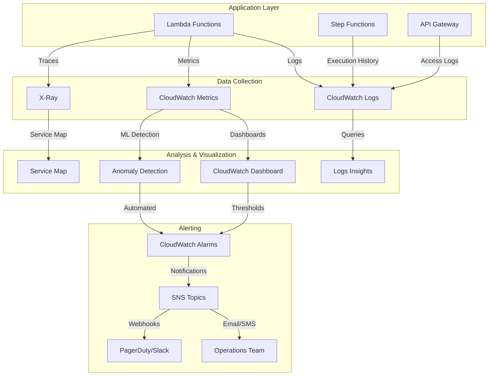

# Observability Guide - CloudWatch, X-Ray, Metrics

## Overview

L'observability è la capacità di comprendere lo stato interno di un sistema attraverso i suoi output esterni. In un'architettura serverless distribuita come il nostro AI Technical Support System, l'observability è fondamentale per:

- **Debugging**: Identificare la causa root di errori e performance degradation
- **Monitoring**: Tracciare metriche di business e operazionali in real-time
- **Alerting**: Ricevere notifiche proattive su anomalie e threshold breach
- **Optimization**: Identificare bottleneck e opportunità di miglioramento
- **Compliance**: Mantenere audit trail per security e regulatory requirements

### I Tre Pilastri dell'Observability

1. **Logs**: Eventi discreti con timestamp (cosa è successo)
2. **Metrics**: Misurazioni numeriche aggregate nel tempo (quanto spesso/veloce)
3. **Traces**: Percorso di una richiesta attraverso servizi distribuiti (come fluisce)

### Stack AWS per Observability

| Pilastro | Servizio AWS | Funzionalità Chiave |
|----------|--------------|---------------------|
| **Logs** | CloudWatch Logs | Structured logging, Logs Insights, retention |
| **Metrics** | CloudWatch Metrics | Custom metrics, dashboards, alarms |
| **Traces** | X-Ray | Distributed tracing, service map, annotations |
| **Anomalies** | CloudWatch Anomaly Detection | ML-based threshold detection |
| **Insights** | CloudWatch Contributor Insights | Top-N analysis, pattern detection |
| **Synthetics** | CloudWatch Synthetics | Canary monitoring, endpoint testing |

### Architettura Observability nel Nostro Sistema



### Quando Usare Cosa

| Scenario | Strumento | Rationale |
|----------|-----------|-----------|
| "Perché questa Lambda è lenta?" | X-Ray Traces + CloudWatch Logs | Trace mostra timing, logs mostrano dettagli |
| "Quanti ticket al minuto?" | CloudWatch Metrics | Aggregazione real-time |
| "Trova tutti gli errori con 'timeout'" | CloudWatch Logs Insights | Full-text search su logs |
| "Performance degradation trend?" | CloudWatch Dashboard | Visualizzazione time-series |
| "Alert su latency spike?" | CloudWatch Alarms | Threshold-based alerting |
| "Quali endpoint chiamano OpenSearch?" | X-Ray Service Map | Dependency visualization |
| "Quali utenti fanno più richieste?" | Contributor Insights | Top-N analysis |

---

## Concetti Fondamentali

### 1. Structured Logging

**Definizione**: Logging in formato strutturato (JSON) anziché plain text, per facilitare parsing e query.

**Vantaggi**:
- Query efficienti con CloudWatch Logs Insights
- Filtri dinamici su campi specifici
- Integrazione con sistemi esterni (ELK, Datadog)
- Type safety

**Esempio Plain Text vs Structured**:

```python
# ❌ Plain text (difficile da parsare)
logger.info(f"Ticket {ticket_id} processed in {duration}ms with confidence {confidence}")

# ✅ Structured JSON
logger.info("Ticket processed", extra={
    "ticket_id": ticket_id,
    "duration_ms": duration,
    "confidence": confidence,
    "classification": category
})
```

### 2. Log Levels

| Level | Uso | Retention Consigliata | Production Volume |
|-------|-----|----------------------|-------------------|
| **DEBUG** | Detailed debugging info | 3 giorni | 0% (disabled) |
| **INFO** | Normal operations | 7 giorni | 70% |
| **WARN** | Potential issues | 30 giorni | 20% |
| **ERROR** | Errors requiring attention | 90 giorni | 9% |
| **CRITICAL** | System failures | 365 giorni | 1% |

### 3. Metriche Standard vs Custom

**Standard Metrics** (automatiche, zero configurazione):
- Lambda: Invocations, Duration, Errors, Throttles
- API Gateway: Count, Latency, 4xx, 5xx
- DynamoDB: ConsumedReadCapacity, WriteThrottle

**Custom Metrics** (business-specific):
- Ticket processing time end-to-end
- RAG retrieval relevance score
- Classification confidence distribution
- Cost per ticket

### 4. Metric Resolution

| Type | Granularity | Retention | Use Case | Cost |
|------|-------------|-----------|----------|------|
| **Standard** | 1 minute | 15 months | Normal monitoring | Included |
| **High-Resolution** | 1 second | 3 hours (then downsampled) | Spike detection | +$0.30/metric/month |

### 5. X-Ray Concepts

**Segments**: Unità base di lavoro (es. una Lambda invocation)

**Subsegments**: Operazioni dentro un segment (es. DynamoDB query, HTTP call)

**Trace**: Insieme di segments e subsegments per una singola request end-to-end

**Annotations**: Key-value metadata indicizzati e searchable (max 50 per trace)

**Metadata**: Key-value data non indicizzati (illimitati, solo per visualizzazione)

**Sampling**: Percentuale di richieste da tracciare (per controllo costi)

```
Trace ID: 1-5f84c123-abc123def456
├── Segment: API Gateway (20ms)
├── Segment: Lambda ticket-processor (500ms)
│   ├── Subsegment: DynamoDB GetItem (10ms)
│   ├── Subsegment: Bedrock InvokeModel (450ms)
│   └── Subsegment: DynamoDB PutItem (15ms)
└── Segment: SNS Publish (5ms)
```

### 6. Alarm States

| State | Meaning | Actions |
|-------|---------|---------|
| **OK** | Metric within threshold | None |
| **ALARM** | Threshold breached | SNS notification, Auto Scaling, Lambda |
| **INSUFFICIENT_DATA** | Not enough data points | None (wait) |

### 7. Composite Alarms

Combina multiple alarms con logica booleana (AND, OR) per ridurre false positives.

**Esempio**:
```
HighLatency AND HighErrorRate = REAL_PROBLEM
HighLatency OR HighErrorRate = TOO_NOISY
```

---

## Implementazione Pratica

### 1. Structured Logging - Logger Configuration

Implementazione completa di structured logger per Lambda.

```python
# logger_config.py
import json
import logging
import sys
from datetime import datetime
from typing import Any, Dict
import uuid
import os

class StructuredLogger:
    """
    Structured logger per CloudWatch Logs con formato JSON.

    Features:
    - Output JSON per ogni log line
    - Correlation ID automatico
    - Context injection (request_id, user_id, etc.)
    - PII redaction
    - Performance tracking
    """

    def __init__(
        self,
        name: str,
        level: str = "INFO",
        redact_pii: bool = True
    ):
        self.logger = logging.getLogger(name)
        self.logger.setLevel(getattr(logging, level))
        self.redact_pii = redact_pii
        self.context = {}

        # Setup JSON formatter
        handler = logging.StreamHandler(sys.stdout)
        handler.setFormatter(self._json_formatter())
        self.logger.addHandler(handler)

    def _json_formatter(self):
        """Custom formatter che output JSON"""
        class JSONFormatter(logging.Formatter):
            def format(self, record):
                log_obj = {
                    "timestamp": datetime.utcnow().isoformat() + "Z",
                    "level": record.levelname,
                    "logger": record.name,
                    "message": record.getMessage(),
                    "function": record.funcName,
                    "line": record.lineno,
                }

                # Add extra fields
                if hasattr(record, "extra"):
                    log_obj.update(record.extra)

                # Add exception info
                if record.exc_info:
                    log_obj["exception"] = self.formatException(record.exc_info)

                return json.dumps(log_obj, default=str)

        return JSONFormatter()

    def set_context(self, **kwargs):
        """
        Set context fields che saranno inclusi in tutti i log.

        Usage:
            logger.set_context(request_id="abc123", user_id="user456")
        """
        self.context.update(kwargs)

    def clear_context(self):
        """Clear context fields"""
        self.context = {}

    def _redact_sensitive(self, data: Dict[str, Any]) -> Dict[str, Any]:
        """Redact PII fields"""
        if not self.redact_pii:
            return data

        sensitive_keys = {"email", "phone", "ssn", "credit_card", "password"}
        redacted = data.copy()

        for key, value in redacted.items():
            if key.lower() in sensitive_keys:
                redacted[key] = "***REDACTED***"
            elif isinstance(value, dict):
                redacted[key] = self._redact_sensitive(value)

        return redacted

    def _build_extra(self, extra: Dict[str, Any]) -> Dict[str, Any]:
        """Build extra fields combining context and provided data"""
        combined = {**self.context}
        if extra:
            combined.update(self._redact_sensitive(extra))
        return combined

    def debug(self, message: str, **extra):
        """Log DEBUG level"""
        self.logger.debug(message, extra={"extra": self._build_extra(extra)})

    def info(self, message: str, **extra):
        """Log INFO level"""
        self.logger.info(message, extra={"extra": self._build_extra(extra)})

    def warning(self, message: str, **extra):
        """Log WARNING level"""
        self.logger.warning(message, extra={"extra": self._build_extra(extra)})

    def error(self, message: str, **extra):
        """Log ERROR level"""
        self.logger.error(message, extra={"extra": self._build_extra(extra)})

    def critical(self, message: str, **extra):
        """Log CRITICAL level"""
        self.logger.critical(message, extra={"extra": self._build_extra(extra)})


# Lambda handler example
logger = StructuredLogger("ticket-processor", level="INFO")

def lambda_handler(event, context):
    """Example Lambda handler con structured logging"""

    # Generate request ID
    request_id = str(uuid.uuid4())

    # Set context for all logs in this invocation
    logger.set_context(
        request_id=request_id,
        function_name=context.function_name,
        aws_request_id=context.aws_request_id
    )

    try:
        logger.info("Processing ticket",
            ticket_id=event.get("ticket_id"),
            source=event.get("source")
        )

        # Business logic
        result = process_ticket(event)

        logger.info("Ticket processed successfully",
            ticket_id=event.get("ticket_id"),
            duration_ms=result["duration"],
            classification=result["category"]
        )

        return {
            "statusCode": 200,
            "body": json.dumps(result)
        }

    except Exception as e:
        logger.error("Ticket processing failed",
            ticket_id=event.get("ticket_id"),
            error_type=type(e).__name__,
            error_message=str(e)
        )
        raise

    finally:
        # Clear context for next invocation
        logger.clear_context()


def process_ticket(event):
    """Example business logic"""
    import time
    start = time.time()

    ticket_id = event.get("ticket_id")

    # Simulate processing
    logger.debug("Fetching ticket from DynamoDB", ticket_id=ticket_id)
    time.sleep(0.1)

    logger.debug("Classifying ticket", ticket_id=ticket_id)
    time.sleep(0.2)

    duration = int((time.time() - start) * 1000)

    return {
        "ticket_id": ticket_id,
        "category": "HARDWARE_ERROR",
        "duration": duration
    }
```

**Output CloudWatch Logs**:
```json
{
  "timestamp": "2025-11-18T10:30:45.123Z",
  "level": "INFO",
  "logger": "ticket-processor",
  "message": "Processing ticket",
  "function": "lambda_handler",
  "line": 95,
  "extra": {
    "request_id": "abc-123-def",
    "function_name": "prod-ticket-processor",
    "aws_request_id": "xyz-789",
    "ticket_id": "tkt_123456",
    "source": "api"
  }
}
```

---

### 2. CloudWatch Logs Insights - Performance Analysis

Query avanzate per analizzare performance e troubleshooting.

```python
# logs_insights_queries.py
"""
CloudWatch Logs Insights query examples per analisi operazionali.

Query language: SQL-like syntax
Docs: https://docs.aws.amazon.com/AmazonCloudWatch/latest/logs/CWL_QuerySyntax.html
"""

# Query 1: P50, P95, P99 latency per endpoint
LATENCY_PERCENTILES = """
fields @timestamp, extra.duration_ms as duration
| filter extra.ticket_id is not blank
| stats
    count() as invocations,
    pct(duration, 50) as p50,
    pct(duration, 95) as p95,
    pct(duration, 99) as p99,
    avg(duration) as avg_duration,
    max(duration) as max_duration
by bin(5m)
"""

# Query 2: Error rate by error type
ERROR_RATE_BY_TYPE = """
fields @timestamp, extra.error_type as error_type
| filter level = "ERROR"
| stats count() as error_count by error_type
| sort error_count desc
"""

# Query 3: Slow queries (> 1 second)
SLOW_QUERIES = """
fields @timestamp, extra.ticket_id, extra.duration_ms, extra.classification
| filter extra.duration_ms > 1000
| sort extra.duration_ms desc
| limit 50
"""

# Query 4: Correlation ID trace (full request path)
REQUEST_TRACE = """
fields @timestamp, message, extra.ticket_id, extra.function_name
| filter extra.request_id = "abc-123-def"
| sort @timestamp asc
"""

# Query 5: Requests per minute trend
REQUESTS_PER_MINUTE = """
fields @timestamp
| filter message = "Processing ticket"
| stats count() as requests by bin(1m)
"""

# Query 6: Most common classification categories
TOP_CATEGORIES = """
fields extra.classification as category
| filter category is not blank
| stats count() as ticket_count by category
| sort ticket_count desc
| limit 10
"""

# Query 7: Errors with full context
ERROR_DETAILS = """
fields @timestamp, message, extra.error_type, extra.error_message, extra.ticket_id
| filter level = "ERROR"
| sort @timestamp desc
| limit 100
"""

# Query 8: Find all logs for a specific ticket
TICKET_AUDIT_TRAIL = """
fields @timestamp, level, message, extra
| filter extra.ticket_id = "tkt_123456"
| sort @timestamp asc
"""

# Query 9: Cold start detection (Lambda init time)
COLD_STARTS = """
fields @timestamp, @initDuration
| filter @type = "REPORT"
| filter @initDuration > 0
| stats count() as cold_starts, avg(@initDuration) as avg_init_ms by bin(1h)
"""

# Query 10: Memory usage analysis
MEMORY_ANALYSIS = """
fields @timestamp, @maxMemoryUsed / 1024 / 1024 as memory_mb, @memorySize / 1024 / 1024 as allocated_mb
| filter @type = "REPORT"
| stats
    avg(memory_mb) as avg_memory,
    max(memory_mb) as max_memory,
    avg(allocated_mb) as allocated
by bin(1h)
"""


# Python helper per eseguire queries programmatically
import boto3
import time
from typing import List, Dict, Any

class LogsInsightsClient:
    """Helper per eseguire CloudWatch Logs Insights queries"""

    def __init__(self, log_group_name: str):
        self.client = boto3.client('logs')
        self.log_group_name = log_group_name

    def run_query(
        self,
        query: str,
        start_time: int,
        end_time: int,
        limit: int = 1000
    ) -> List[Dict[str, Any]]:
        """
        Esegue una query e attende il risultato.

        Args:
            query: CloudWatch Logs Insights query string
            start_time: Unix timestamp (seconds)
            end_time: Unix timestamp (seconds)
            limit: Max risultati

        Returns:
            Lista di risultati
        """
        # Start query
        response = self.client.start_query(
            logGroupName=self.log_group_name,
            startTime=start_time,
            endTime=end_time,
            queryString=query,
            limit=limit
        )

        query_id = response['queryId']

        # Poll for results
        while True:
            result = self.client.get_query_results(queryId=query_id)
            status = result['status']

            if status == 'Complete':
                return result['results']
            elif status == 'Failed':
                raise Exception(f"Query failed: {result.get('statistics')}")
            elif status in ['Cancelled', 'Timeout']:
                raise Exception(f"Query {status}")

            time.sleep(1)

    def get_p95_latency_last_hour(self) -> float:
        """Get P95 latency for last hour"""
        now = int(time.time())
        one_hour_ago = now - 3600

        results = self.run_query(
            query=LATENCY_PERCENTILES,
            start_time=one_hour_ago,
            end_time=now
        )

        if results:
            # Extract p95 from first result
            for field in results[0]:
                if field['field'] == 'p95':
                    return float(field['value'])

        return 0.0


# Usage example
if __name__ == "__main__":
    client = LogsInsightsClient("/aws/lambda/prod-ticket-processor")

    # Get P95 latency
    p95 = client.get_p95_latency_last_hour()
    print(f"P95 latency last hour: {p95}ms")
```

---

### 3. Custom Metrics - Business KPIs

Pubblicazione di metriche custom per business e operational KPIs.

```python
# custom_metrics.py
import boto3
from datetime import datetime
from typing import Dict, List, Optional
import time

class MetricsPublisher:
    """
    Publisher per CloudWatch Custom Metrics.

    Features:
    - Batch publishing (up to 20 metrics per call)
    - High-resolution metrics (1-second granularity)
    - Multiple dimensions support
    - Embedded Metric Format (EMF) support
    """

    def __init__(self, namespace: str):
        self.client = boto3.client('cloudwatch')
        self.namespace = namespace
        self.buffer = []
        self.buffer_size = 20

    def put_metric(
        self,
        metric_name: str,
        value: float,
        unit: str = "None",
        dimensions: Optional[Dict[str, str]] = None,
        high_resolution: bool = False,
        timestamp: Optional[datetime] = None
    ):
        """
        Pubblica una singola metrica.

        Args:
            metric_name: Nome metrica
            value: Valore numerico
            unit: Unità (Seconds, Milliseconds, Count, Percent, etc.)
            dimensions: Dimensioni per filtering (max 10)
            high_resolution: True per 1-second resolution
            timestamp: Timestamp custom (default: now)
        """
        metric_data = {
            'MetricName': metric_name,
            'Value': value,
            'Unit': unit,
            'Timestamp': timestamp or datetime.utcnow(),
        }

        if dimensions:
            metric_data['Dimensions'] = [
                {'Name': k, 'Value': v} for k, v in dimensions.items()
            ]

        if high_resolution:
            metric_data['StorageResolution'] = 1  # 1-second

        self.buffer.append(metric_data)

        # Flush if buffer full
        if len(self.buffer) >= self.buffer_size:
            self.flush()

    def flush(self):
        """Flush buffered metrics to CloudWatch"""
        if not self.buffer:
            return

        try:
            self.client.put_metric_data(
                Namespace=self.namespace,
                MetricData=self.buffer
            )
            self.buffer = []
        except Exception as e:
            print(f"Failed to publish metrics: {e}")
            # In production: log to CloudWatch Logs

    def __enter__(self):
        return self

    def __exit__(self, exc_type, exc_val, exc_tb):
        self.flush()


# Business metrics examples
def publish_ticket_metrics(
    ticket_id: str,
    duration_ms: int,
    classification: str,
    confidence: float,
    rag_chunks_retrieved: int,
    groundedness_score: float
):
    """Publish comprehensive metrics for ticket processing"""

    with MetricsPublisher("AISupport/Production") as metrics:

        # Operational metrics
        metrics.put_metric(
            metric_name="TicketProcessingDuration",
            value=duration_ms,
            unit="Milliseconds",
            dimensions={
                "Environment": "Production",
                "Classification": classification
            }
        )

        # Business metrics
        metrics.put_metric(
            metric_name="TicketsProcessed",
            value=1,
            unit="Count",
            dimensions={
                "Environment": "Production",
                "Classification": classification
            }
        )

        # ML metrics
        metrics.put_metric(
            metric_name="ClassificationConfidence",
            value=confidence,
            unit="None",
            dimensions={
                "Environment": "Production",
                "Classification": classification
            }
        )

        metrics.put_metric(
            metric_name="GroundednessScore",
            value=groundedness_score,
            unit="None",
            dimensions={"Environment": "Production"}
        )

        metrics.put_metric(
            metric_name="RAGChunksRetrieved",
            value=rag_chunks_retrieved,
            unit="Count",
            dimensions={"Environment": "Production"}
        )


# Cost tracking metrics
def publish_cost_metrics(
    bedrock_input_tokens: int,
    bedrock_output_tokens: int,
    sagemaker_invocations: int,
    opensearch_queries: int
):
    """Track cost-related metrics"""

    # Token costs (Claude Sonnet: $0.015/1K input, $0.075/1K output)
    input_cost = (bedrock_input_tokens / 1000) * 0.015
    output_cost = (bedrock_output_tokens / 1000) * 0.075
    total_bedrock_cost = input_cost + output_cost

    with MetricsPublisher("AISupport/Costs") as metrics:

        metrics.put_metric(
            metric_name="BedrockInputTokens",
            value=bedrock_input_tokens,
            unit="Count"
        )

        metrics.put_metric(
            metric_name="BedrockOutputTokens",
            value=bedrock_output_tokens,
            unit="Count"
        )

        metrics.put_metric(
            metric_name="BedrockCost",
            value=total_bedrock_cost,
            unit="None"
        )

        metrics.put_metric(
            metric_name="SageMakerInvocations",
            value=sagemaker_invocations,
            unit="Count"
        )


# Embedded Metric Format (EMF) - Alternative approach
# Advantage: Zero latency, metrics extracted from logs
def publish_emf_metrics(
    ticket_id: str,
    duration_ms: int,
    classification: str
):
    """
    Publish metrics using Embedded Metric Format.

    EMF allows CloudWatch to extract metrics from JSON logs automatically.
    Benefits:
    - No API calls (zero latency)
    - Logs and metrics in single write
    - Cost-effective for high-volume
    """
    import json

    emf_object = {
        "_aws": {
            "Timestamp": int(time.time() * 1000),
            "CloudWatchMetrics": [
                {
                    "Namespace": "AISupport/EMF",
                    "Dimensions": [["Environment", "Classification"]],
                    "Metrics": [
                        {
                            "Name": "ProcessingDuration",
                            "Unit": "Milliseconds"
                        },
                        {
                            "Name": "TicketCount",
                            "Unit": "Count"
                        }
                    ]
                }
            ]
        },
        "Environment": "Production",
        "Classification": classification,
        "TicketId": ticket_id,
        "ProcessingDuration": duration_ms,
        "TicketCount": 1
    }

    # Print to stdout (CloudWatch Logs will extract metrics)
    print(json.dumps(emf_object))


# Performance decorator
def track_performance(metric_name: str, namespace: str = "AISupport/Performance"):
    """Decorator to automatically track function execution time"""
    def decorator(func):
        def wrapper(*args, **kwargs):
            start = time.time()
            try:
                result = func(*args, **kwargs)
                success = True
                return result
            except Exception as e:
                success = False
                raise
            finally:
                duration_ms = (time.time() - start) * 1000

                with MetricsPublisher(namespace) as metrics:
                    metrics.put_metric(
                        metric_name=metric_name,
                        value=duration_ms,
                        unit="Milliseconds",
                        dimensions={
                            "FunctionName": func.__name__,
                            "Success": str(success)
                        }
                    )

        return wrapper
    return decorator


# Usage example
@track_performance("RAGRetrieval")
def retrieve_context(query: str):
    """Example function with automatic performance tracking"""
    time.sleep(0.5)  # Simulate work
    return {"chunks": []}
```

---

### 4. CloudWatch Dashboard - Operational Dashboard JSON

Dashboard completo per monitoring operazionale.

```json
{
  "widgets": [
    {
      "type": "metric",
      "x": 0,
      "y": 0,
      "width": 12,
      "height": 6,
      "properties": {
        "title": "Ticket Processing Rate",
        "metrics": [
          [ "AISupport/Production", "TicketsProcessed", { "stat": "Sum", "label": "Total Tickets" } ],
          [ ".", ".", { "stat": "Sum", "period": 60, "label": "Tickets/min" } ]
        ],
        "view": "timeSeries",
        "stacked": false,
        "region": "eu-south-1",
        "period": 300,
        "yAxis": {
          "left": {
            "label": "Count"
          }
        }
      }
    },
    {
      "type": "metric",
      "x": 12,
      "y": 0,
      "width": 12,
      "height": 6,
      "properties": {
        "title": "Processing Latency (P50, P95, P99)",
        "metrics": [
          [ "AISupport/Production", "TicketProcessingDuration", { "stat": "p50", "label": "P50" } ],
          [ "...", { "stat": "p95", "label": "P95", "color": "#ff7f0e" } ],
          [ "...", { "stat": "p99", "label": "P99", "color": "#d62728" } ]
        ],
        "view": "timeSeries",
        "stacked": false,
        "region": "eu-south-1",
        "period": 300,
        "yAxis": {
          "left": {
            "label": "Milliseconds",
            "min": 0
          }
        },
        "annotations": {
          "horizontal": [
            {
              "label": "SLA Target (15s)",
              "value": 15000,
              "fill": "above",
              "color": "#d62728"
            }
          ]
        }
      }
    },
    {
      "type": "metric",
      "x": 0,
      "y": 6,
      "width": 8,
      "height": 6,
      "properties": {
        "title": "Error Rate",
        "metrics": [
          [ "AWS/Lambda", "Errors", { "stat": "Sum", "label": "Lambda Errors" } ],
          [ ".", "Throttles", { "stat": "Sum", "label": "Throttles" } ],
          [ "AISupport/Production", "ValidationErrors", { "stat": "Sum", "label": "Validation Errors" } ]
        ],
        "view": "timeSeries",
        "stacked": true,
        "region": "eu-south-1",
        "period": 300
      }
    },
    {
      "type": "metric",
      "x": 8,
      "y": 6,
      "width": 8,
      "height": 6,
      "properties": {
        "title": "ML Model Confidence",
        "metrics": [
          [ "AISupport/Production", "ClassificationConfidence", { "stat": "Average" } ],
          [ ".", "GroundednessScore", { "stat": "Average" } ]
        ],
        "view": "timeSeries",
        "stacked": false,
        "region": "eu-south-1",
        "period": 300,
        "yAxis": {
          "left": {
            "min": 0,
            "max": 1
          }
        }
      }
    },
    {
      "type": "metric",
      "x": 16,
      "y": 6,
      "width": 8,
      "height": 6,
      "properties": {
        "title": "Cost Tracking (Bedrock)",
        "metrics": [
          [ "AISupport/Costs", "BedrockCost", { "stat": "Sum", "label": "Total Cost ($)" } ],
          [ ".", "BedrockInputTokens", { "stat": "Sum", "yAxis": "right" } ],
          [ ".", "BedrockOutputTokens", { "stat": "Sum", "yAxis": "right" } ]
        ],
        "view": "timeSeries",
        "stacked": false,
        "region": "eu-south-1",
        "period": 3600
      }
    },
    {
      "type": "log",
      "x": 0,
      "y": 12,
      "width": 24,
      "height": 6,
      "properties": {
        "title": "Recent Errors",
        "query": "SOURCE '/aws/lambda/prod-ticket-processor'\n| fields @timestamp, extra.ticket_id, extra.error_type, extra.error_message\n| filter level = \"ERROR\"\n| sort @timestamp desc\n| limit 20",
        "region": "eu-south-1"
      }
    },
    {
      "type": "metric",
      "x": 0,
      "y": 18,
      "width": 12,
      "height": 6,
      "properties": {
        "title": "Lambda Performance",
        "metrics": [
          [ "AWS/Lambda", "Duration", { "stat": "Average", "label": "Avg Duration" } ],
          [ "...", { "stat": "Maximum", "label": "Max Duration" } ],
          [ ".", "ConcurrentExecutions", { "stat": "Maximum", "yAxis": "right" } ]
        ],
        "view": "timeSeries",
        "stacked": false,
        "region": "eu-south-1",
        "period": 300
      }
    },
    {
      "type": "metric",
      "x": 12,
      "y": 18,
      "width": 12,
      "height": 6,
      "properties": {
        "title": "DynamoDB Throttling",
        "metrics": [
          [ "AWS/DynamoDB", "UserErrors", { "stat": "Sum" } ],
          [ ".", "SystemErrors", { "stat": "Sum" } ],
          [ ".", "ConsumedReadCapacityUnits", { "stat": "Sum", "yAxis": "right" } ],
          [ ".", "ConsumedWriteCapacityUnits", { "stat": "Sum", "yAxis": "right" } ]
        ],
        "view": "timeSeries",
        "stacked": false,
        "region": "eu-south-1",
        "period": 300
      }
    }
  ]
}
```

**Python code per creare dashboard programmatically**:

```python
# dashboard_manager.py
import boto3
import json

class DashboardManager:
    """Manager per CloudWatch Dashboards"""

    def __init__(self):
        self.client = boto3.client('cloudwatch')

    def create_operational_dashboard(self, dashboard_name: str):
        """Create comprehensive operational dashboard"""

        dashboard_body = {
            "widgets": [
                # ... (use JSON above)
            ]
        }

        response = self.client.put_dashboard(
            DashboardName=dashboard_name,
            DashboardBody=json.dumps(dashboard_body)
        )

        return response

    def get_dashboard_url(self, dashboard_name: str, region: str = "eu-south-1"):
        """Get console URL for dashboard"""
        return f"https://console.aws.amazon.com/cloudwatch/home?region={region}#dashboards:name={dashboard_name}"
```

---

### 5. Composite Alarms - Multi-Signal Alerting

Alarms compositi per ridurre false positives.

```python
# composite_alarms.py
import boto3
from typing import List

class AlarmManager:
    """Manager per CloudWatch Alarms e Composite Alarms"""

    def __init__(self):
        self.client = boto3.client('cloudwatch')

    def create_latency_alarm(
        self,
        alarm_name: str,
        metric_name: str,
        threshold: float,
        evaluation_periods: int = 2
    ) -> str:
        """
        Create alarm per high latency.

        Returns: Alarm ARN
        """
        response = self.client.put_metric_alarm(
            AlarmName=alarm_name,
            ComparisonOperator='GreaterThanThreshold',
            EvaluationPeriods=evaluation_periods,
            MetricName=metric_name,
            Namespace='AISupport/Production',
            Period=300,  # 5 minutes
            Statistic='Average',
            Threshold=threshold,
            ActionsEnabled=True,
            AlarmDescription=f'Alert when {metric_name} exceeds {threshold}',
            Unit='Milliseconds',
            TreatMissingData='notBreaching'
        )

        return f"arn:aws:cloudwatch:eu-south-1:123456789012:alarm:{alarm_name}"

    def create_error_rate_alarm(
        self,
        alarm_name: str,
        threshold_percent: float
    ) -> str:
        """Create alarm for error rate percentage"""

        # Metric math: (errors / invocations) * 100
        response = self.client.put_metric_alarm(
            AlarmName=alarm_name,
            ComparisonOperator='GreaterThanThreshold',
            EvaluationPeriods=2,
            Threshold=threshold_percent,
            ActionsEnabled=True,
            AlarmDescription=f'Alert when error rate > {threshold_percent}%',
            TreatMissingData='notBreaching',
            Metrics=[
                {
                    'Id': 'errors',
                    'MetricStat': {
                        'Metric': {
                            'Namespace': 'AWS/Lambda',
                            'MetricName': 'Errors',
                            'Dimensions': [
                                {
                                    'Name': 'FunctionName',
                                    'Value': 'prod-ticket-processor'
                                }
                            ]
                        },
                        'Period': 300,
                        'Stat': 'Sum'
                    },
                    'ReturnData': False
                },
                {
                    'Id': 'invocations',
                    'MetricStat': {
                        'Metric': {
                            'Namespace': 'AWS/Lambda',
                            'MetricName': 'Invocations',
                            'Dimensions': [
                                {
                                    'Name': 'FunctionName',
                                    'Value': 'prod-ticket-processor'
                                }
                            ]
                        },
                        'Period': 300,
                        'Stat': 'Sum'
                    },
                    'ReturnData': False
                },
                {
                    'Id': 'error_rate',
                    'Expression': '(errors / invocations) * 100',
                    'Label': 'Error Rate %',
                    'ReturnData': True
                }
            ]
        )

        return f"arn:aws:cloudwatch:eu-south-1:123456789012:alarm:{alarm_name}"

    def create_composite_alarm(
        self,
        alarm_name: str,
        alarm_rule: str,
        alarm_arns: List[str],
        sns_topic_arn: str
    ):
        """
        Create composite alarm combining multiple alarms.

        Args:
            alarm_name: Name for composite alarm
            alarm_rule: Boolean expression (e.g., "ALARM(alarm1) AND ALARM(alarm2)")
            alarm_arns: List of component alarm ARNs
            sns_topic_arn: SNS topic for notifications
        """
        response = self.client.put_composite_alarm(
            AlarmName=alarm_name,
            AlarmRule=alarm_rule,
            ActionsEnabled=True,
            AlarmActions=[sns_topic_arn],
            AlarmDescription='Composite alarm for critical system issues'
        )

        return response


# Usage example: Setup comprehensive alarming
def setup_production_alarms():
    """Setup all production alarms"""

    manager = AlarmManager()
    sns_topic_arn = "arn:aws:sns:eu-south-1:123456789012:ops-alerts"

    # Create individual alarms
    latency_alarm_arn = manager.create_latency_alarm(
        alarm_name="HighLatency-P95",
        metric_name="TicketProcessingDuration",
        threshold=15000  # 15 seconds
    )

    error_rate_alarm_arn = manager.create_error_rate_alarm(
        alarm_name="HighErrorRate",
        threshold_percent=5.0  # 5%
    )

    # Create composite alarm (both must be true)
    manager.create_composite_alarm(
        alarm_name="CRITICAL-SystemDegraded",
        alarm_rule=f"ALARM({latency_alarm_arn.split(':')[-1]}) AND ALARM({error_rate_alarm_arn.split(':')[-1]})",
        alarm_arns=[latency_alarm_arn, error_rate_alarm_arn],
        sns_topic_arn=sns_topic_arn
    )

    print("Production alarms configured successfully")


# CloudFormation template for alarms
ALARM_TEMPLATE = """
AWSTemplateFormatVersion: '2010-09-09'
Description: CloudWatch Alarms for AI Support System

Parameters:
  SNSTopicArn:
    Type: String
    Description: ARN of SNS topic for alarm notifications

Resources:
  HighLatencyAlarm:
    Type: AWS::CloudWatch::Alarm
    Properties:
      AlarmName: HighLatency-P95
      AlarmDescription: Alert when P95 latency exceeds 15 seconds
      MetricName: TicketProcessingDuration
      Namespace: AISupport/Production
      Statistic: Average
      Period: 300
      EvaluationPeriods: 2
      Threshold: 15000
      ComparisonOperator: GreaterThanThreshold
      TreatMissingData: notBreaching
      ActionsEnabled: true
      AlarmActions:
        - !Ref SNSTopicArn

  HighErrorRateAlarm:
    Type: AWS::CloudWatch::Alarm
    Properties:
      AlarmName: HighErrorRate
      AlarmDescription: Alert when error rate exceeds 5%
      Metrics:
        - Id: errors
          MetricStat:
            Metric:
              Namespace: AWS/Lambda
              MetricName: Errors
              Dimensions:
                - Name: FunctionName
                  Value: prod-ticket-processor
            Period: 300
            Stat: Sum
          ReturnData: false
        - Id: invocations
          MetricStat:
            Metric:
              Namespace: AWS/Lambda
              MetricName: Invocations
              Dimensions:
                - Name: FunctionName
                  Value: prod-ticket-processor
            Period: 300
            Stat: Sum
          ReturnData: false
        - Id: error_rate
          Expression: "(errors / invocations) * 100"
          Label: Error Rate %
          ReturnData: true
      Threshold: 5.0
      ComparisonOperator: GreaterThanThreshold
      EvaluationPeriods: 2
      TreatMissingData: notBreaching
      ActionsEnabled: true
      AlarmActions:
        - !Ref SNSTopicArn

  CriticalSystemDegradedAlarm:
    Type: AWS::CloudWatch::CompositeAlarm
    Properties:
      AlarmName: CRITICAL-SystemDegraded
      AlarmDescription: Critical alert when both latency AND error rate are high
      ActionsEnabled: true
      AlarmActions:
        - !Ref SNSTopicArn
      AlarmRule: !Sub
        - "ALARM(${LatencyAlarm}) AND ALARM(${ErrorAlarm})"
        - LatencyAlarm: !GetAtt HighLatencyAlarm.Arn
          ErrorAlarm: !GetAtt HighErrorRateAlarm.Arn

Outputs:
  CompositeAlarmArn:
    Value: !GetAtt CriticalSystemDegradedAlarm.Arn
"""
```

---

### 6. X-Ray Instrumentation - Lambda + SDK Clients

Distributed tracing con X-Ray per Lambda e SDK clients.

```python
# xray_instrumentation.py
import json
from aws_xray_sdk.core import xray_recorder
from aws_xray_sdk.core import patch_all
import boto3
import time

# Patch all AWS SDK clients automatically
patch_all()

# Initialize clients (will be automatically instrumented)
dynamodb = boto3.client('dynamodb')
bedrock = boto3.client('bedrock-runtime')
opensearch_client = boto3.client('opensearchserverless')


@xray_recorder.capture('lambda_handler')
def lambda_handler(event, context):
    """
    Lambda handler with X-Ray tracing.

    X-Ray automatically traces:
    - Lambda execution
    - AWS SDK calls (DynamoDB, Bedrock, etc.)
    - HTTP requests
    """

    ticket_id = event.get('ticket_id')

    # Add annotations (searchable in X-Ray console)
    xray_recorder.put_annotation('ticket_id', ticket_id)
    xray_recorder.put_annotation('environment', 'production')

    # Add metadata (not searchable, but visible in trace details)
    xray_recorder.put_metadata('event', event)
    xray_recorder.put_metadata('function_version', context.function_version)

    try:
        # Fetch ticket (automatically traced)
        ticket = get_ticket(ticket_id)

        # Classify (traced subsegment)
        classification = classify_ticket(ticket)

        # RAG retrieval (traced subsegment)
        context_chunks = retrieve_context(ticket, classification)

        # Generate solution (traced subsegment)
        solution = generate_solution(ticket, context_chunks)

        # Add result metadata
        xray_recorder.put_metadata('classification', classification)
        xray_recorder.put_metadata('solution', solution)

        return {
            'statusCode': 200,
            'body': json.dumps(solution)
        }

    except Exception as e:
        # Exceptions are automatically recorded in X-Ray
        xray_recorder.put_annotation('error', True)
        xray_recorder.put_metadata('error_details', {
            'type': type(e).__name__,
            'message': str(e)
        })
        raise


@xray_recorder.capture('get_ticket')
def get_ticket(ticket_id: str):
    """Get ticket from DynamoDB (traced subsegment)"""

    # DynamoDB call is automatically traced
    response = dynamodb.get_item(
        TableName='tickets',
        Key={'ticket_id': {'S': ticket_id}}
    )

    if 'Item' not in response:
        raise ValueError(f"Ticket {ticket_id} not found")

    return response['Item']


@xray_recorder.capture('classify_ticket')
def classify_ticket(ticket):
    """Classify ticket with SageMaker (traced subsegment)"""

    # Add subsegment annotation
    xray_recorder.put_annotation('operation', 'classification')

    # Simulate SageMaker call
    sagemaker = boto3.client('sagemaker-runtime')

    response = sagemaker.invoke_endpoint(
        EndpointName='ticket-classifier-v2',
        ContentType='application/json',
        Body=json.dumps({'text': ticket.get('symptom_text', {}).get('S', '')})
    )

    result = json.loads(response['Body'].read())

    # Add result to metadata
    xray_recorder.put_metadata('classification_result', result)

    return result['predicted_class']


@xray_recorder.capture('retrieve_context')
def retrieve_context(ticket, classification):
    """RAG retrieval from OpenSearch (traced subsegment)"""

    # Add timing for embedding generation
    subsegment = xray_recorder.begin_subsegment('generate_embedding')
    try:
        start = time.time()

        # Generate embedding
        embedding_response = bedrock.invoke_model(
            modelId='amazon.titan-embed-text-v1',
            body=json.dumps({
                'inputText': ticket.get('symptom_text', {}).get('S', '')
            })
        )

        duration_ms = (time.time() - start) * 1000

        # Add timing metadata
        subsegment.put_metadata('duration_ms', duration_ms)
        subsegment.put_annotation('token_count', 100)  # Example

    finally:
        xray_recorder.end_subsegment()

    # OpenSearch search (traced automatically)
    # ... search logic ...

    return [{"chunk_id": "1", "text": "Example context"}]


@xray_recorder.capture('generate_solution')
def generate_solution(ticket, context_chunks):
    """Generate solution with Bedrock (traced subsegment)"""

    # Build prompt
    prompt = build_prompt(ticket, context_chunks)

    # Add prompt size metadata
    xray_recorder.put_metadata('prompt_size', len(prompt))

    # Invoke Bedrock (traced automatically)
    subsegment = xray_recorder.begin_subsegment('bedrock_invocation')
    try:
        start = time.time()

        response = bedrock.invoke_model(
            modelId='anthropic.claude-3-sonnet-20240229-v1:0',
            body=json.dumps({
                'anthropic_version': 'bedrock-2023-05-31',
                'max_tokens': 2000,
                'messages': [{'role': 'user', 'content': prompt}]
            })
        )

        duration_ms = (time.time() - start) * 1000

        result = json.loads(response['body'].read())

        # Add timing and token metadata
        subsegment.put_metadata('duration_ms', duration_ms)
        subsegment.put_metadata('input_tokens', result.get('usage', {}).get('input_tokens'))
        subsegment.put_metadata('output_tokens', result.get('usage', {}).get('output_tokens'))
        subsegment.put_annotation('model', 'claude-3-sonnet')

        return result['content'][0]['text']

    finally:
        xray_recorder.end_subsegment()


def build_prompt(ticket, context_chunks):
    """Build prompt for LLM"""
    return f"Solve this ticket: {ticket}"


# Custom subsegment for external HTTP calls
def call_external_api(url: str):
    """Example: Call external API with manual subsegment"""

    subsegment = xray_recorder.begin_subsegment('external_api_call')

    try:
        subsegment.put_annotation('url', url)
        subsegment.put_metadata('http_method', 'GET')

        import requests
        response = requests.get(url)

        subsegment.put_metadata('status_code', response.status_code)
        subsegment.put_metadata('response_size', len(response.content))

        return response.json()

    except Exception as e:
        subsegment.put_annotation('error', True)
        subsegment.put_metadata('error_message', str(e))
        raise

    finally:
        xray_recorder.end_subsegment()


# Sampling rules (to control cost)
# Add to environment variable or config file:
XRAY_SAMPLING_RULES = {
    "version": 2,
    "default": {
        "fixed_target": 1,  # Always trace 1 req/sec
        "rate": 0.05  # Then 5% of remaining
    },
    "rules": [
        {
            "description": "Trace all errors",
            "service_name": "*",
            "http_method": "*",
            "url_path": "*",
            "fixed_target": 0,
            "rate": 1.0,
            "attributes": {
                "error": "true"
            }
        },
        {
            "description": "Trace high-latency requests",
            "service_name": "*",
            "http_method": "*",
            "url_path": "*",
            "fixed_target": 0,
            "rate": 1.0,
            "attributes": {
                "duration_ms": ">5000"
            }
        }
    ]
}
```

**X-Ray Configuration in CloudFormation**:

```yaml
Resources:
  TicketProcessorFunction:
    Type: AWS::Lambda::Function
    Properties:
      FunctionName: prod-ticket-processor
      Runtime: python3.11
      Handler: index.lambda_handler
      Tracing: Active  # Enable X-Ray
      Environment:
        Variables:
          AWS_XRAY_CONTEXT_MISSING: LOG_ERROR
          AWS_XRAY_TRACING_NAME: TicketProcessor
```

---

### 7. Trace Annotations - Custom Metadata

Best practices per annotations e metadata in X-Ray.

```python
# xray_annotations_guide.py
from aws_xray_sdk.core import xray_recorder
from typing import Dict, Any
import json

class TracingHelper:
    """
    Helper class per gestire X-Ray annotations e metadata in modo consistente.

    Rules:
    - Annotations: Max 50 per trace, indexed and searchable
    - Metadata: Unlimited, not indexed, for context only
    - Use annotations for filtering (user_id, error, environment)
    - Use metadata for debugging details (full request/response)
    """

    @staticmethod
    def annotate_request(
        request_id: str,
        user_id: str,
        environment: str,
        api_version: str
    ):
        """Annotate with standard request metadata"""
        xray_recorder.put_annotation('request_id', request_id)
        xray_recorder.put_annotation('user_id', user_id)
        xray_recorder.put_annotation('environment', environment)
        xray_recorder.put_annotation('api_version', api_version)

    @staticmethod
    def annotate_business_context(
        ticket_id: str,
        customer_tier: str,
        priority: str
    ):
        """Annotate with business context"""
        xray_recorder.put_annotation('ticket_id', ticket_id)
        xray_recorder.put_annotation('customer_tier', customer_tier)
        xray_recorder.put_annotation('priority', priority)

    @staticmethod
    def annotate_ml_inference(
        model_name: str,
        model_version: str,
        confidence: float
    ):
        """Annotate ML inference details"""
        xray_recorder.put_annotation('model_name', model_name)
        xray_recorder.put_annotation('model_version', model_version)
        xray_recorder.put_annotation('confidence_high', confidence > 0.8)

    @staticmethod
    def add_metadata_full_context(
        request: Dict[str, Any],
        response: Dict[str, Any],
        processing_steps: list
    ):
        """Add complete context as metadata (not searchable)"""
        xray_recorder.put_metadata('request', request, 'request_response')
        xray_recorder.put_metadata('response', response, 'request_response')
        xray_recorder.put_metadata('processing_steps', processing_steps, 'workflow')

    @staticmethod
    def track_cost_metrics(
        bedrock_tokens: int,
        sagemaker_invocations: int,
        estimated_cost: float
    ):
        """Track cost-related data"""
        xray_recorder.put_metadata('bedrock_tokens', bedrock_tokens, 'costs')
        xray_recorder.put_metadata('sagemaker_invocations', sagemaker_invocations, 'costs')
        xray_recorder.put_metadata('estimated_cost_usd', estimated_cost, 'costs')


# Example: Complete instrumented function
@xray_recorder.capture('process_ticket_complete')
def process_ticket_complete(event):
    """Fully instrumented ticket processing"""

    ticket_id = event['ticket_id']
    user_id = event.get('user_id', 'anonymous')

    # 1. Annotate request context (searchable)
    TracingHelper.annotate_request(
        request_id=event['request_id'],
        user_id=user_id,
        environment='production',
        api_version='v1'
    )

    # 2. Annotate business context
    TracingHelper.annotate_business_context(
        ticket_id=ticket_id,
        customer_tier=event.get('customer_tier', 'standard'),
        priority=event.get('priority', 'medium')
    )

    # 3. Add full request as metadata
    xray_recorder.put_metadata('full_request', event, 'input')

    processing_steps = []

    # Step 1: Validation
    subseg = xray_recorder.begin_subsegment('validation')
    try:
        validate_input(event)
        processing_steps.append({'step': 'validation', 'status': 'success'})
        subseg.put_annotation('validation_passed', True)
    finally:
        xray_recorder.end_subsegment()

    # Step 2: Classification
    subseg = xray_recorder.begin_subsegment('classification')
    try:
        classification = classify(event)
        processing_steps.append({
            'step': 'classification',
            'status': 'success',
            'result': classification
        })

        # Annotate ML results
        TracingHelper.annotate_ml_inference(
            model_name='ticket-classifier',
            model_version='v2',
            confidence=classification['confidence']
        )

        subseg.put_metadata('classification_details', classification)

    finally:
        xray_recorder.end_subsegment()

    # Step 3: RAG + Generation
    subseg = xray_recorder.begin_subsegment('rag_generation')
    try:
        solution = generate_solution_rag(event)
        processing_steps.append({
            'step': 'generation',
            'status': 'success'
        })

        # Track costs
        TracingHelper.track_cost_metrics(
            bedrock_tokens=solution['total_tokens'],
            sagemaker_invocations=1,
            estimated_cost=solution['estimated_cost']
        )

        subseg.put_metadata('solution', solution)

    finally:
        xray_recorder.end_subsegment()

    # 4. Add complete workflow metadata
    TracingHelper.add_metadata_full_context(
        request=event,
        response=solution,
        processing_steps=processing_steps
    )

    # 5. Final annotations for filtering
    xray_recorder.put_annotation('success', True)
    xray_recorder.put_annotation('total_steps', len(processing_steps))

    return solution


def validate_input(event):
    """Validation logic"""
    pass

def classify(event):
    """Classification logic"""
    return {'category': 'HARDWARE', 'confidence': 0.92}

def generate_solution_rag(event):
    """RAG + generation logic"""
    return {
        'solution': 'Fix steps...',
        'total_tokens': 1500,
        'estimated_cost': 0.03
    }


# Searching traces in X-Ray Console or API
# Example filter expressions:

# Find all high-confidence classifications:
# annotation.confidence_high = true

# Find specific ticket:
# annotation.ticket_id = "tkt_123456"

# Find VIP customer requests:
# annotation.customer_tier = "premium"

# Find errors:
# annotation.error = true

# Find slow requests:
# responsetime > 5
```

---

### 8. Log Correlation - Request ID Tracking

Implementazione di request ID tracking per correlazione logs-traces.

```python
# request_correlation.py
import uuid
import json
from typing import Optional
from functools import wraps
from aws_xray_sdk.core import xray_recorder

class RequestContext:
    """
    Thread-safe request context per tracking request ID across services.

    Patterns:
    - Generate request_id at API Gateway
    - Propagate via Lambda event
    - Include in all logs and traces
    - Pass downstream via HTTP headers
    """

    _context = {}

    @classmethod
    def set_request_id(cls, request_id: str):
        """Set request ID for current execution"""
        cls._context['request_id'] = request_id

        # Also add to X-Ray
        xray_recorder.put_annotation('request_id', request_id)

    @classmethod
    def get_request_id(cls) -> Optional[str]:
        """Get current request ID"""
        return cls._context.get('request_id')

    @classmethod
    def clear(cls):
        """Clear context (call at end of Lambda invocation)"""
        cls._context = {}


def with_request_correlation(func):
    """
    Decorator to automatically setup request correlation.

    Usage:
        @with_request_correlation
        def lambda_handler(event, context):
            # request_id is automatically set
            pass
    """
    @wraps(func)
    def wrapper(event, context):
        # Extract or generate request ID
        request_id = (
            event.get('requestContext', {}).get('requestId') or
            event.get('request_id') or
            str(uuid.uuid4())
        )

        # Set in context
        RequestContext.set_request_id(request_id)

        # Add to logger context (if using StructuredLogger from earlier)
        if hasattr(func, '__globals__') and 'logger' in func.__globals__:
            logger = func.__globals__['logger']
            if hasattr(logger, 'set_context'):
                logger.set_context(request_id=request_id)

        try:
            return func(event, context)
        finally:
            RequestContext.clear()

    return wrapper


# Example: Lambda handler with full correlation
from logger_config import StructuredLogger

logger = StructuredLogger("correlation-example")

@with_request_correlation
@xray_recorder.capture('lambda_handler')
def lambda_handler(event, context):
    """Handler with automatic request correlation"""

    request_id = RequestContext.get_request_id()

    logger.info("Request started",
        ticket_id=event.get('ticket_id'),
        source=event.get('source')
    )

    # Call downstream services
    result = call_downstream_service(event)

    logger.info("Request completed",
        ticket_id=event.get('ticket_id'),
        duration_ms=result['duration']
    )

    return result


def call_downstream_service(data):
    """Call downstream Lambda/API with request ID propagation"""
    import boto3

    lambda_client = boto3.client('lambda')
    request_id = RequestContext.get_request_id()

    # Propagate request_id in payload
    payload = {
        'request_id': request_id,  # Propagate!
        **data
    }

    logger.info("Calling downstream service",
        downstream_function="classifier",
        request_id=request_id
    )

    response = lambda_client.invoke(
        FunctionName='classifier-function',
        InvocationType='RequestResponse',
        Payload=json.dumps(payload)
    )

    return json.loads(response['Payload'].read())


# HTTP API call with correlation headers
import requests

def call_external_api(url: str, data: dict):
    """Call external API with correlation headers"""

    request_id = RequestContext.get_request_id()

    headers = {
        'X-Request-ID': request_id,
        'X-Correlation-ID': request_id,
        'Content-Type': 'application/json'
    }

    logger.info("Calling external API",
        url=url,
        request_id=request_id
    )

    response = requests.post(url, json=data, headers=headers)

    logger.info("External API response",
        url=url,
        status_code=response.status_code,
        request_id=request_id
    )

    return response.json()


# CloudWatch Logs Insights query using request_id
QUERY_BY_REQUEST_ID = """
fields @timestamp, message, level, extra.ticket_id, extra.function_name
| filter extra.request_id = "abc-123-def"
| sort @timestamp asc
"""

# This will show complete trace of request across all Lambda functions!
```

**API Gateway configuration per request ID**:

```yaml
# CloudFormation
Resources:
  ApiGateway:
    Type: AWS::ApiGatewayV2::Api
    Properties:
      Name: ai-support-api
      ProtocolType: HTTP

  ApiIntegration:
    Type: AWS::ApiGatewayV2::Integration
    Properties:
      ApiId: !Ref ApiGateway
      IntegrationType: AWS_PROXY
      IntegrationUri: !GetAtt LambdaFunction.Arn
      PayloadFormatVersion: '2.0'
      RequestParameters:
        # Pass API Gateway request ID to Lambda
        overwrite:header.x-request-id: $context.requestId
```

---

### 9. Anomaly Detection - Automated Threshold

ML-based anomaly detection per automated alerting.

```python
# anomaly_detection.py
import boto3
from typing import List, Dict

class AnomalyDetectionManager:
    """
    Manager per CloudWatch Anomaly Detection.

    Features:
    - ML-based threshold calculation
    - Automatic adaptation to traffic patterns
    - Reduced false positives vs static thresholds
    """

    def __init__(self):
        self.client = boto3.client('cloudwatch')

    def create_anomaly_detector(
        self,
        namespace: str,
        metric_name: str,
        dimensions: List[Dict[str, str]],
        stat: str = "Average"
    ):
        """
        Create anomaly detector for a metric.

        Args:
            namespace: CloudWatch namespace
            metric_name: Metric to monitor
            dimensions: Metric dimensions
            stat: Statistic (Average, Sum, etc.)
        """
        response = self.client.put_anomaly_detector(
            Namespace=namespace,
            MetricName=metric_name,
            Dimensions=[
                {'Name': k, 'Value': v} for k, v in dimensions[0].items()
            ] if dimensions else [],
            Stat=stat
        )

        return response

    def create_anomaly_alarm(
        self,
        alarm_name: str,
        namespace: str,
        metric_name: str,
        threshold_band: float = 2.0,
        evaluation_periods: int = 2
    ):
        """
        Create alarm based on anomaly detection.

        Args:
            alarm_name: Name for alarm
            namespace: Metric namespace
            metric_name: Metric to monitor
            threshold_band: Std deviations from model (1-10, default 2)
            evaluation_periods: Periods to evaluate
        """
        response = self.client.put_metric_alarm(
            AlarmName=alarm_name,
            ComparisonOperator='LessThanLowerOrGreaterThanUpperThreshold',
            EvaluationPeriods=evaluation_periods,
            Threshold=threshold_band,
            TreatMissingData='notBreaching',
            ActionsEnabled=True,
            Metrics=[
                {
                    'Id': 'm1',
                    'ReturnData': True,
                    'MetricStat': {
                        'Metric': {
                            'Namespace': namespace,
                            'MetricName': metric_name
                        },
                        'Period': 300,
                        'Stat': 'Average'
                    }
                },
                {
                    'Id': 'ad1',
                    'Expression': f'ANOMALY_DETECTION_BAND(m1, {threshold_band})',
                    'Label': 'Anomaly Detection Band'
                }
            ],
            ThresholdMetricId='ad1'
        )

        return response


# Setup anomaly detection for key metrics
def setup_anomaly_detection():
    """Configure anomaly detection for production metrics"""

    manager = AnomalyDetectionManager()

    # 1. Detect anomalies in processing latency
    manager.create_anomaly_detector(
        namespace='AISupport/Production',
        metric_name='TicketProcessingDuration',
        dimensions=[{'Environment': 'Production'}],
        stat='Average'
    )

    manager.create_anomaly_alarm(
        alarm_name='AnomalyDetection-Latency',
        namespace='AISupport/Production',
        metric_name='TicketProcessingDuration',
        threshold_band=2.0  # 2 std deviations
    )

    # 2. Detect anomalies in request rate
    manager.create_anomaly_detector(
        namespace='AISupport/Production',
        metric_name='TicketsProcessed',
        dimensions=[{'Environment': 'Production'}],
        stat='Sum'
    )

    manager.create_anomaly_alarm(
        alarm_name='AnomalyDetection-RequestRate',
        namespace='AISupport/Production',
        metric_name='TicketsProcessed',
        threshold_band=3.0  # More tolerance for traffic spikes
    )

    # 3. Detect anomalies in error rate
    manager.create_anomaly_detector(
        namespace='AWS/Lambda',
        metric_name='Errors',
        dimensions=[{'FunctionName': 'prod-ticket-processor'}],
        stat='Sum'
    )

    manager.create_anomaly_alarm(
        alarm_name='AnomalyDetection-Errors',
        namespace='AWS/Lambda',
        metric_name='Errors',
        threshold_band=2.0
    )

    print("Anomaly detection configured for all key metrics")


# CloudFormation template for anomaly detection
ANOMALY_DETECTION_TEMPLATE = """
Resources:
  LatencyAnomalyDetector:
    Type: AWS::CloudWatch::AnomalyDetector
    Properties:
      Namespace: AISupport/Production
      MetricName: TicketProcessingDuration
      Stat: Average
      Dimensions:
        - Name: Environment
          Value: Production

  LatencyAnomalyAlarm:
    Type: AWS::CloudWatch::Alarm
    Properties:
      AlarmName: AnomalyDetection-Latency
      AlarmDescription: ML-based anomaly detection for processing latency
      ComparisonOperator: LessThanLowerOrGreaterThanUpperThreshold
      EvaluationPeriods: 2
      ThresholdMetricId: ad1
      TreatMissingData: notBreaching
      Metrics:
        - Id: m1
          ReturnData: true
          MetricStat:
            Metric:
              Namespace: AISupport/Production
              MetricName: TicketProcessingDuration
            Period: 300
            Stat: Average
        - Id: ad1
          Expression: ANOMALY_DETECTION_BAND(m1, 2)
          Label: Expected Range
"""
```

---

## Best Practices

### 1. Logging Best Practices

#### ✅ Do's

**Use structured logging always**:
```python
# ✅ Good
logger.info("Ticket processed", ticket_id="tkt_123", duration_ms=1200)

# ❌ Bad
logger.info(f"Ticket tkt_123 processed in 1200ms")
```

**Log at appropriate levels**:
```python
logger.debug("Cache hit for embedding")  # Development only
logger.info("Ticket processing started")  # Normal operations
logger.warning("Retrying failed API call")  # Potential issues
logger.error("Failed to process ticket", exc_info=True)  # Requires attention
```

**Include context in every log**:
```python
logger.set_context(
    request_id=request_id,
    user_id=user_id,
    environment="production"
)
```

**Redact PII automatically**:
```python
logger = StructuredLogger("app", redact_pii=True)
logger.info("User registered", email="user@example.com")  # → email: "***REDACTED***"
```

#### ❌ Don'ts

**Don't log sensitive data**:
```python
# ❌ Never log passwords, tokens, credit cards
logger.info("User login", password=password)  # WRONG!
```

**Don't log in tight loops**:
```python
# ❌ Bad - generates massive log volume
for item in large_list:
    logger.debug(f"Processing item {item}")

# ✅ Good - log summary
logger.info("Processing batch", item_count=len(large_list))
```

**Don't use string concatenation**:
```python
# ❌ Bad - evaluated even if log level disabled
logger.debug("Data: " + expensive_function())

# ✅ Good - lazy evaluation
logger.debug("Data: %s", expensive_function())
```

### 2. Metrics Best Practices

#### ✅ Do's

**Use meaningful dimensions**:
```python
# ✅ Good - allows filtering by multiple axes
metrics.put_metric(
    "ProcessingDuration",
    value=duration_ms,
    dimensions={
        "Environment": "Production",
        "Classification": category,
        "Region": "eu-south-1"
    }
)
```

**Publish metrics in batches**:
```python
# ✅ Good - batch up to 20 metrics
with MetricsPublisher("MyNamespace") as metrics:
    for i in range(100):
        metrics.put_metric("Counter", i)
# Auto-flushes in batches of 20
```

**Use percentiles for latency**:
```python
# ✅ Good - track p50, p95, p99
# CloudWatch will calculate from raw values
for duration in durations:
    metrics.put_metric("Latency", duration)

# Query with: stat=p95
```

**Track business metrics**:
```python
# ✅ Track what matters to business
metrics.put_metric("RevenuePerTicket", revenue)
metrics.put_metric("CustomerSatisfaction", rating)
metrics.put_metric("SLACompliance", 1 if met_sla else 0)
```

#### ❌ Don'ts

**Don't use too many dimensions**:
```python
# ❌ Bad - creates metric explosion (high costs)
dimensions = {
    "User": user_id,  # High cardinality!
    "TicketID": ticket_id,  # High cardinality!
    "Timestamp": str(datetime.now())  # Infinite cardinality!
}
```

**Don't publish metrics synchronously in hot path**:
```python
# ❌ Bad - adds latency
def process_request():
    metrics.put_metric("Request", 1)  # Synchronous API call!
    # ... process ...

# ✅ Good - use EMF (embedded metric format)
print(json.dumps({"_aws": {...}, "Request": 1}))  # Zero latency
```

### 3. X-Ray Best Practices

#### ✅ Do's

**Use annotations for searchable fields**:
```python
# ✅ Good - can search in X-Ray console
xray_recorder.put_annotation('user_id', user_id)
xray_recorder.put_annotation('error', True)
xray_recorder.put_annotation('high_confidence', confidence > 0.8)
```

**Use metadata for debugging context**:
```python
# ✅ Good - full context for debugging
xray_recorder.put_metadata('full_request', event)
xray_recorder.put_metadata('model_output', result)
```

**Sample intelligently**:
```python
# ✅ Good - trace all errors, sample success
{
    "fixed_target": 1,  # Always trace 1 req/sec
    "rate": 0.05,  # 5% of remaining
    "rules": [
        {
            "description": "Trace all errors",
            "rate": 1.0,
            "attributes": {"error": "true"}
        }
    ]
}
```

**Use subsegments for granular timing**:
```python
# ✅ Good - see exactly where time is spent
subseg = xray_recorder.begin_subsegment('database_query')
try:
    result = query_db()
    subseg.put_metadata('row_count', len(result))
finally:
    xray_recorder.end_subsegment()
```

#### ❌ Don'ts

**Don't exceed annotation limits**:
```python
# ❌ Bad - max 50 annotations per trace
for i in range(100):
    xray_recorder.put_annotation(f'field_{i}', value)  # WRONG!
```

**Don't trace everything in production**:
```python
# ❌ Bad - expensive at scale
sampling_rate = 1.0  # 100% = high cost

# ✅ Good - sample intelligently
sampling_rate = 0.05  # 5% = reasonable
```

### 4. Alarming Best Practices

#### ✅ Do's

**Use composite alarms to reduce noise**:
```python
# ✅ Good - only alert if BOTH are true
alarm_rule = "ALARM(HighLatency) AND ALARM(HighErrorRate)"
```

**Include runbook links**:
```python
alarm_description = """
High error rate detected.
Runbook: https://wiki.company.com/runbooks/high-error-rate
Oncall: https://pagerduty.com/schedules/ops
"""
```

**Set appropriate evaluation periods**:
```python
# ✅ Good - require 2 consecutive breaches
EvaluationPeriods=2,
DatapointsToAlarm=2
```

**Use anomaly detection for dynamic baselines**:
```python
# ✅ Good - adapts to traffic patterns
Expression: "ANOMALY_DETECTION_BAND(m1, 2)"
```

#### ❌ Don'ts

**Don't alert on every small spike**:
```python
# ❌ Bad - too sensitive
Threshold=1,  # Single error triggers alarm
EvaluationPeriods=1

# ✅ Good - meaningful threshold
Threshold=10,  # 10 errors
EvaluationPeriods=2  # Over 10 minutes
```

**Don't ignore "INSUFFICIENT_DATA"**:
```python
# ✅ Good - handle missing data appropriately
TreatMissingData='notBreaching'  # Or 'breaching' if absence indicates problem
```

### 5. Cost Optimization

**Log retention policies**:
```python
# Set appropriate retention per log group
retention_days = {
    'DEBUG_logs': 3,
    'INFO_logs': 7,
    'ERROR_logs': 90,
    'AUDIT_logs': 365
}
```

**Metric publishing optimization**:
```python
# Use high-resolution only when needed
high_resolution = environment == "production" and is_critical_metric
```

**X-Ray sampling**:
```python
# Sample less in development, more for errors
if environment == "dev":
    sampling_rate = 0.01  # 1%
else:
    sampling_rate = 0.05  # 5%, but 100% for errors
```

**Use EMF instead of PutMetricData API**:
```python
# EMF = zero API calls = lower cost
print(json.dumps(emf_metric))  # Extracted from logs
```

---

## Troubleshooting

### Problem 1: Logs Not Appearing in CloudWatch

**Symptoms**: Lambda executes but no logs visible

**Causes & Solutions**:

```python
# 1. Check IAM permissions
{
    "Effect": "Allow",
    "Action": [
        "logs:CreateLogGroup",
        "logs:CreateLogStream",
        "logs:PutLogEvents"
    ],
    "Resource": "arn:aws:logs:*:*:*"
}

# 2. Check log group exists
import boto3
logs = boto3.client('logs')
try:
    logs.describe_log_groups(logGroupNamePrefix='/aws/lambda/my-function')
except logs.exceptions.ResourceNotFoundException:
    print("Log group doesn't exist!")

# 3. Verify Lambda execution role
# AWS Console → Lambda → Configuration → Permissions

# 4. Check CloudWatch Logs quotas
# Service Quotas → CloudWatch Logs → Log groups per region (default: 1,000,000)
```

### Problem 2: High CloudWatch Costs

**Symptoms**: Unexpected charges for CloudWatch

**Investigation**:

```bash
# Check log group sizes
aws logs describe-log-groups --query 'logGroups[*].[logGroupName,storedBytes]' --output table | sort -k2 -n

# Find high-volume log streams
aws logs describe-log-streams --log-group-name /aws/lambda/my-function \
  --order-by LastEventTime --descending --max-items 10
```

**Solutions**:

```python
# 1. Reduce log retention
aws logs put-retention-policy --log-group-name /aws/lambda/my-function --retention-in-days 7

# 2. Filter logs before publishing
import logging
logging.getLogger('boto3').setLevel(logging.WARNING)  # Reduce SDK logs
logging.getLogger('botocore').setLevel(logging.WARNING)

# 3. Sample debug logs
import random
if log_level == 'DEBUG' and random.random() > 0.1:
    return  # Sample 10% of debug logs

# 4. Use log sampling in production
if environment == "production":
    logger.setLevel(logging.INFO)  # Disable DEBUG
```

### Problem 3: X-Ray Traces Incomplete

**Symptoms**: Traces missing segments or subsegments

**Causes & Solutions**:

```python
# 1. Check X-Ray daemon is running
# For Lambda: Ensure Tracing: Active in config

# 2. Patch AWS SDK early
from aws_xray_sdk.core import patch_all
patch_all()  # Must be BEFORE importing boto3
import boto3

# 3. Handle subsegments properly
try:
    subseg = xray_recorder.begin_subsegment('my_operation')
    # ... work ...
finally:
    xray_recorder.end_subsegment()  # MUST end subsegment

# 4. Check sampling rate
# If sampling_rate = 0.01, only 1% of traces are recorded

# 5. Verify IAM permissions
{
    "Effect": "Allow",
    "Action": [
        "xray:PutTraceSegments",
        "xray:PutTelemetryRecords"
    ],
    "Resource": "*"
}
```

### Problem 4: Metrics Not Showing in Dashboard

**Symptoms**: Metrics published but not visible

**Debugging**:

```python
# 1. Check metric was actually published
import boto3
cw = boto3.client('cloudwatch')

response = cw.list_metrics(
    Namespace='AISupport/Production',
    MetricName='TicketsProcessed'
)
print(response['Metrics'])  # Should show your metric

# 2. Verify dimensions match exactly
# Dashboard query:
{ "Namespace": "AISupport/Production", "MetricName": "TicketsProcessed", "Dimensions": [{"Name": "Environment", "Value": "Production"}] }

# Published metric must have EXACT same dimensions

# 3. Check time range
# Metrics can take up to 15 minutes to appear

# 4. Verify statistic is appropriate
# For Count metrics, use Sum not Average

# 5. Check metric timestamps
# Metrics with timestamp > 2 hours in past or future are rejected
```

### Problem 5: Alarms Stuck in INSUFFICIENT_DATA

**Symptoms**: Alarm never transitions to OK or ALARM

**Causes**:

```python
# 1. Metric not being published
# Solution: Check metric publishing code

# 2. Wrong dimensions
# Solution: Ensure alarm dimensions match published metric exactly

# 3. Not enough data points
# If EvaluationPeriods=5 and Period=300 (5 min)
# Need 25 minutes of data before alarm evaluates

# 4. Metric published with wrong timestamp
# Solution: Don't set custom timestamps unless necessary
metrics.put_metric("MyMetric", value=10)  # Uses current time (good)

# 5. TreatMissingData set incorrectly
# Solution:
TreatMissingData='notBreaching'  # Alarm will wait for data
```

### Problem 6: Logs Insights Query Returns No Results

**Symptoms**: Query completes but shows empty results

**Solutions**:

```bash
# 1. Check time range
# Ensure query time range covers when logs were generated

# 2. Verify log group name
# Must match exactly, including '/aws/lambda/' prefix

# 3. Test with simple query first
fields @timestamp, @message
| limit 10

# 4. Check field names
# Use 'extra.field_name' for structured logging fields
fields extra.ticket_id  # ✅ Correct
fields ticket_id  # ❌ Won't work

# 5. Verify JSON structure
# Print a log to see actual structure:
{
  "timestamp": "...",
  "level": "INFO",
  "extra": {
    "ticket_id": "tkt_123"  # Access as extra.ticket_id
  }
}
```

### Problem 7: Request ID Not Correlating Across Services

**Symptoms**: Request ID changes between Lambda functions

**Solution**:

```python
# Ensure request_id is explicitly passed in payload
def invoke_downstream_lambda(ticket_id: str):
    request_id = RequestContext.get_request_id()

    payload = {
        'request_id': request_id,  # ✅ Explicitly pass
        'ticket_id': ticket_id
    }

    lambda_client.invoke(
        FunctionName='downstream',
        Payload=json.dumps(payload)
    )

# Downstream Lambda MUST extract it
def lambda_handler(event, context):
    request_id = event.get('request_id')  # ✅ Extract
    RequestContext.set_request_id(request_id)
```

---

## Esempi Reali dal Progetto

### Esempio 1: End-to-End Ticket Processing Observability

Monitoring completo del ticket processing workflow.

```python
# ticket_processor_observable.py
from logger_config import StructuredLogger
from custom_metrics import MetricsPublisher
from aws_xray_sdk.core import xray_recorder, patch_all
import time
import boto3

patch_all()

logger = StructuredLogger("ticket-processor", level="INFO")
dynamodb = boto3.client('dynamodb')
bedrock = boto3.client('bedrock-runtime')

@xray_recorder.capture('ticket_processor_lambda')
def lambda_handler(event, context):
    """
    Fully instrumented ticket processor.

    Observability:
    - Structured logs with correlation ID
    - Custom metrics for business KPIs
    - X-Ray tracing with subsegments
    - Error tracking and alerting
    """

    start_time = time.time()
    ticket_id = event['ticket_id']
    request_id = event.get('request_id', context.aws_request_id)

    # Setup observability context
    logger.set_context(
        request_id=request_id,
        ticket_id=ticket_id,
        function_name=context.function_name
    )

    xray_recorder.put_annotation('ticket_id', ticket_id)
    xray_recorder.put_annotation('request_id', request_id)

    logger.info("Ticket processing started",
        source=event.get('source', 'api')
    )

    try:
        # Step 1: Fetch ticket
        ticket = fetch_ticket(ticket_id)

        # Step 2: Classify
        classification = classify_ticket(ticket)
        xray_recorder.put_annotation('classification', classification['category'])

        logger.info("Ticket classified",
            category=classification['category'],
            confidence=classification['confidence']
        )

        # Step 3: RAG retrieval
        context_chunks = retrieve_context(ticket, classification)

        # Step 4: Generate solution
        solution = generate_solution(ticket, context_chunks)

        # Step 5: Validate
        validated = validate_solution(solution, context_chunks)

        # Calculate duration
        duration_ms = int((time.time() - start_time) * 1000)

        # Publish metrics
        with MetricsPublisher("AISupport/Production") as metrics:
            metrics.put_metric(
                "TicketProcessingDuration",
                value=duration_ms,
                unit="Milliseconds",
                dimensions={
                    "Environment": "Production",
                    "Classification": classification['category']
                }
            )

            metrics.put_metric(
                "TicketsProcessed",
                value=1,
                unit="Count",
                dimensions={"Environment": "Production"}
            )

            metrics.put_metric(
                "ClassificationConfidence",
                value=classification['confidence'],
                dimensions={"Environment": "Production"}
            )

        logger.info("Ticket processing completed",
            duration_ms=duration_ms,
            classification=classification['category'],
            confidence=classification['confidence'],
            groundedness=validated['groundedness_score']
        )

        xray_recorder.put_annotation('success', True)
        xray_recorder.put_metadata('solution', validated)

        return {
            'statusCode': 200,
            'body': validated
        }

    except Exception as e:
        duration_ms = int((time.time() - start_time) * 1000)

        logger.error("Ticket processing failed",
            error_type=type(e).__name__,
            error_message=str(e),
            duration_ms=duration_ms,
            exc_info=True
        )

        xray_recorder.put_annotation('error', True)
        xray_recorder.put_annotation('error_type', type(e).__name__)

        # Publish error metric
        with MetricsPublisher("AISupport/Production") as metrics:
            metrics.put_metric(
                "ProcessingErrors",
                value=1,
                unit="Count",
                dimensions={
                    "Environment": "Production",
                    "ErrorType": type(e).__name__
                }
            )

        raise

    finally:
        logger.clear_context()


@xray_recorder.capture('fetch_ticket')
def fetch_ticket(ticket_id: str):
    """Fetch ticket with observability"""
    logger.debug("Fetching ticket from DynamoDB", ticket_id=ticket_id)

    response = dynamodb.get_item(
        TableName='tickets',
        Key={'ticket_id': {'S': ticket_id}}
    )

    if 'Item' not in response:
        logger.error("Ticket not found", ticket_id=ticket_id)
        raise ValueError(f"Ticket {ticket_id} not found")

    return response['Item']


@xray_recorder.capture('classify_ticket')
def classify_ticket(ticket):
    """Classify with SageMaker"""
    subseg = xray_recorder.current_subsegment()

    logger.info("Classifying ticket")

    # Simulate classification
    time.sleep(0.2)

    result = {
        'category': 'HARDWARE_ERROR',
        'confidence': 0.92
    }

    subseg.put_metadata('classification_result', result)

    return result


@xray_recorder.capture('retrieve_context')
def retrieve_context(ticket, classification):
    """RAG retrieval"""
    logger.info("Retrieving context from knowledge base")

    # Subsegment for embedding generation
    subseg = xray_recorder.begin_subsegment('generate_embedding')
    try:
        # ... embedding generation ...
        time.sleep(0.1)
        subseg.put_metadata('embedding_dim', 768)
    finally:
        xray_recorder.end_subsegment()

    # Subsegment for search
    subseg = xray_recorder.begin_subsegment('opensearch_search')
    try:
        # ... search logic ...
        time.sleep(0.3)
        subseg.put_metadata('chunks_found', 5)
    finally:
        xray_recorder.end_subsegment()

    return [{"chunk_id": "1", "text": "Example"}]


@xray_recorder.capture('generate_solution')
def generate_solution(ticket, context_chunks):
    """Generate solution with Bedrock"""
    logger.info("Generating solution with Bedrock")

    subseg = xray_recorder.current_subsegment()

    # Simulate Bedrock call
    time.sleep(2)

    solution = {
        'steps': ['Step 1', 'Step 2'],
        'citations': ['Doc A', 'Doc B']
    }

    subseg.put_metadata('input_tokens', 1200)
    subseg.put_metadata('output_tokens', 300)

    return solution


@xray_recorder.capture('validate_solution')
def validate_solution(solution, context_chunks):
    """Validate solution"""
    logger.info("Validating solution")

    # ... validation logic ...

    validated = {
        **solution,
        'groundedness_score': 0.87,
        'validation_passed': True
    }

    return validated
```

### Exemplo 2: Operational Dashboard Query

CloudWatch Logs Insights query per dashboard operazionale.

```python
# operational_queries.py

# Query 1: Real-time performance dashboard
PERFORMANCE_DASHBOARD_QUERY = """
fields @timestamp, extra.duration_ms as duration, extra.classification as category
| filter message = "Ticket processing completed"
| stats
    count() as total_tickets,
    avg(duration) as avg_duration,
    pct(duration, 50) as p50,
    pct(duration, 95) as p95,
    pct(duration, 99) as p99
by bin(5m), category
| sort @timestamp desc
"""

# Query 2: Error analysis
ERROR_ANALYSIS_QUERY = """
fields @timestamp, extra.error_type, extra.error_message, extra.ticket_id
| filter level = "ERROR"
| stats count() as error_count by extra.error_type
| sort error_count desc
"""

# Query 3: SLA compliance
SLA_COMPLIANCE_QUERY = """
fields @timestamp, extra.duration_ms as duration
| filter message = "Ticket processing completed"
| stats
    count() as total,
    sum(duration < 15000) as within_sla,
    (sum(duration < 15000) / count()) * 100 as sla_percentage
by bin(1h)
"""

# Query 4: Cost tracking
COST_TRACKING_QUERY = """
fields @timestamp, extra.bedrock_tokens, extra.sagemaker_invocations
| filter message = "Ticket processing completed"
| stats
    sum(extra.bedrock_tokens) as total_tokens,
    sum(extra.sagemaker_invocations) as total_invocations,
    (sum(extra.bedrock_tokens) / 1000) * 0.015 as estimated_cost_usd
by bin(1h)
"""
```

---

## Riferimenti

### AWS Documentation
- [CloudWatch Logs User Guide](https://docs.aws.amazon.com/AmazonCloudWatch/latest/logs/)
- [CloudWatch Logs Insights Query Syntax](https://docs.aws.amazon.com/AmazonCloudWatch/latest/logs/CWL_QuerySyntax.html)
- [CloudWatch Metrics User Guide](https://docs.aws.amazon.com/AmazonCloudWatch/latest/monitoring/)
- [X-Ray Developer Guide](https://docs.aws.amazon.com/xray/latest/devguide/)
- [X-Ray SDK for Python](https://docs.aws.amazon.com/xray-sdk-for-python/)
- [Embedded Metric Format](https://docs.aws.amazon.com/AmazonCloudWatch/latest/monitoring/CloudWatch_Embedded_Metric_Format.html)

### Riferimenti Interni
- [Architecture Overview](../02-architecture/overview.md) - Sistema architecture
- [Ticket Processing Flow](../04-data-flows/ticket-processing.md) - Workflow completo
- [AWS Services Overview](../03-aws-services/README.md) - Servizi utilizzati
- [Cost Estimation](../11-cost-estimation.md) - Budget monitoring

### Blog Posts & Articles
- [AWS Observability Best Practices](https://aws.amazon.com/blogs/mt/aws-observability-best-practices/)
- [Structured Logging in Python](https://www.structlog.org/en/stable/)
- [CloudWatch Alarms Best Practices](https://aws.amazon.com/blogs/mt/cloudwatch-alarms-best-practices/)
- [X-Ray Sampling Strategies](https://aws.amazon.com/blogs/mt/x-ray-sampling-strategies/)

### Tools & Libraries
- **aws-xray-sdk**: X-Ray SDK per Python
- **boto3**: AWS SDK per Python
- **structlog**: Advanced structured logging
- **python-json-logger**: JSON formatter per logging standard

---

**Versione**: 1.0
**Ultimo aggiornamento**: 2025-11-18
**Autore**: AI Documentation Team
**Status**: ✅ Complete
